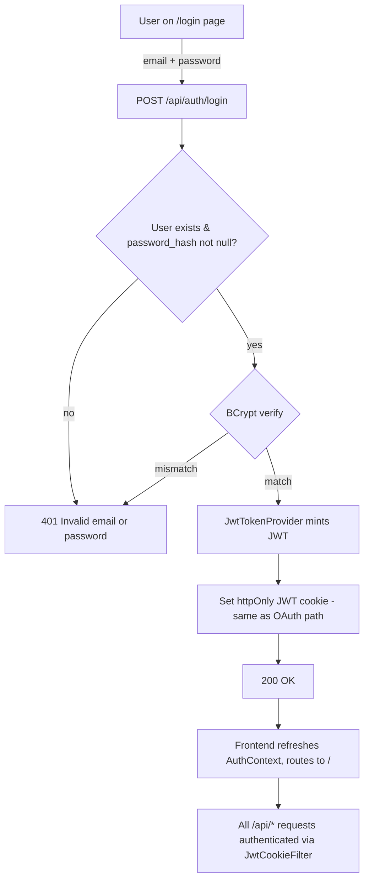

# Spec: Email + password login (second auth path alongside Google OAuth)

## Goal
Add a self-contained email/password login path to FoodBytes so users who do not have (or do not want to use) a Google account can sign in. The change is additive — the existing Google OAuth flow is untouched and the new path issues the same JWT httpOnly cookie that OAuth already produces, so every downstream concern (`JwtCookieFilter`, frontend `withCredentials`, `AuthContext`, all `/api/*` endpoints) behaves identically once the cookie is set. Immediate driver: seed one trusted friend who has no Google account; the chosen shape is also the production shape for future signup/reset features so nothing has to be ripped out later.

## In scope
- New nullable column `password_hash VARCHAR(255) NULL` on the `users` table, applied via a hand-written SQL migration under `foodbytes-app/database/migrations/`.
- Confirm/add a `UNIQUE` index on `users.email` in the same migration (so the email login key is safe for future signup).
- New backend endpoint `POST /api/auth/login` accepting `{ email, password }` JSON; returns 200 + JWT cookie on success, 401 on bad credentials, 400 on missing/blank fields. Generic error message ("Invalid email or password") regardless of whether the email was unknown or the password wrong.
- BCrypt password verification using Spring Security's `BCryptPasswordEncoder`.
- JWT issuance and cookie-setting reuse the existing `JwtTokenProvider` and the same cookie attributes (name, httpOnly, Secure, SameSite, expiry) used by the OAuth2 success handler — extracted to a shared helper if currently inlined.
- `SecurityConfig` updated to permit `/api/auth/login` unauthenticated.
- New `/login` route on the frontend with a minimal form (email, password, submit). Plain CSS, matches existing landing-page styling.
- "Sign in with email" link added to the existing landing/auth page beneath the Google button.
- New frontend service method (in `services/api.js` or a new `services/passwordAuth.js`) calling `POST /api/auth/login` with `withCredentials: true`; success triggers `AuthContext` refresh and routes to `/`; failure shows the generic error inline.
- Seeding mechanism for the first user: a one-off Java `main()` that prints a BCrypt hash for a chosen password, plus a documented `INSERT INTO users ...` / `UPDATE users SET password_hash = ...` snippet to run against Railway MySQL.

## Explicitly out of scope
- Self-signup / registration endpoint and UI.
- Password reset (forgotten-password) flow and email sending.
- Email verification.
- Rate limiting, account lockout, captcha, brute-force protection.
- 2FA / TOTP.
- Admin UI for managing users.
- Migrating existing Google-OAuth users to also have a password.
- Any change to the Google OAuth flow itself.

## Pattern reference
- `foodbytes-app/foodbytes-api/src/main/java/com/foodbytes/security/` — existing OAuth2 success/failure handlers, `JwtTokenProvider`, `JwtCookieFilter`, `UserPrincipal`. Reuse the JWT issuance + cookie-write code path; extract to a shared method if it currently lives inside the OAuth2 success handler.
- `foodbytes-app/foodbytes-api/src/main/java/com/foodbytes/config/SecurityConfig.java` — add the permit rule for `/api/auth/login` and ensure `BCryptPasswordEncoder` is exposed as a `@Bean`.
- `foodbytes-app/foodbytes-api/src/main/java/com/foodbytes/controller/` — follow existing controller style (thin controller, business logic delegated to a service).
- `foodbytes-app/foodbytes-api/src/main/java/com/foodbytes/service/` — new `PasswordAuthService` (or extend existing auth service if one exists) holds the lookup + hash-verify + token-issue logic.
- `foodbytes-app/database/schema.sql` and `foodbytes-app/database/migrations/` — migration convention.
- `foodbytes-app/client/src/components/auth/` — landing/auth components; mirror their CSS and structure for the new login page.
- `foodbytes-app/client/src/contexts/AuthContext.jsx` — refresh mechanism after a successful login.
- `foodbytes-app/client/src/services/api.js` — Axios instance with `baseURL: '/api'` and `withCredentials: true`.

## Constraints
- **Hibernate `ddl-auto: validate`** — the column-add migration MUST be applied manually to the Railway MySQL **before** the backend redeploys; otherwise startup fails.
- The new endpoint MUST set the same JWT cookie the OAuth2 success handler sets (name, attributes, expiry). Diverging here will break `JwtCookieFilter` for password-auth users.
- Google-OAuth users have `password_hash = NULL` and the login endpoint MUST reject any attempt to log them in via password (treat as 401 — do not leak the existence of a Google-only account).
- Email lookup is case-insensitive (store lower-cased or compare with `LOWER(email)`); pick one and document it.
- `password_hash` is BCrypt with cost factor matching Spring Security's default (currently 10) unless the existing codebase already uses a different cost.
- The seed flow (one-off `main()` to print a hash) is a developer-side script — it must NOT be reachable as an HTTP endpoint.
- Security posture acknowledgement: the site is currently single-user (the owner) plus this one trusted friend. No public signup, no advertised URL. Rate-limiting deferred consciously; must be revisited before public launch.

## Approach (chosen)
**Approach B — Email + password column.** Add a nullable `password_hash` to `users`, expose a single `POST /api/auth/login` endpoint that issues the existing JWT cookie on success, add a small `/login` page on the frontend. The first user (the friend) is seeded by running a local `main()` to print a BCrypt hash and applying an `UPDATE` against Railway MySQL.

Chosen over the "magic login URL" alternative because the user explicitly wanted a path that grows into a real email/password system later. Approach B is the production shape — every future addition (signup, reset, verification, rate limiting) is purely additive to what this spec builds. Nothing here would be ripped out at scale.

## Approaches considered (rejected)
- **Magic login URL (long-lived JWT in a URL):** smallest possible code change, but it's a credential-in-a-link; doesn't generalise to multi-user without rework, and the friend has to keep a bookmark safe.
- **One-time-use magic URL:** safer than the above but requires the user to regenerate and resend on every login — annoying for both parties.
- **Shared "guest" account with a known passphrase:** insufficient — would mix the friend's data with anyone else who used it; conflicts with `MealPlanContext` and per-user shopping list ownership.

## Diagram

## Success criteria
- Migration applied to Railway MySQL: `DESCRIBE users` shows `password_hash` column and a unique index on `email`.
- Friend's row in `users` has a non-null `password_hash` (BCrypt format `$2a$...` or `$2b$...`).
- `POST /api/auth/login` with correct credentials returns 200 and sets a JWT cookie identical in attributes to the OAuth2 cookie.
- `POST /api/auth/login` with wrong password returns 401 and does NOT set a cookie.
- `POST /api/auth/login` with an email that exists but has `password_hash = NULL` returns 401 (no leak).
- `POST /api/auth/login` with a non-existent email returns 401 (same response shape as wrong-password — no enumeration).
- After a successful login, all existing `/api/*` endpoints behave for the friend exactly as they do for a Google-OAuth user (he can see his own meal plan, recipes, etc.).
- Google OAuth flow still works unchanged for the existing owner account — regression-tested by logging in via Google after the change is deployed.
- Frontend `/login` page renders, submits, surfaces the generic error on failure, and routes to `/` on success.
- "Sign in with email" link is visible on the landing/auth page.

## Open questions
- Should the friend's `users` row carry a real email or a placeholder? Real email is preferred (it's the login key and supports future password reset), but confirm the friend is OK with it being stored.
- Is there already an `AuthController` in `controller/` to extend, or does this introduce a new controller class? (Decide at implementation time by reading the directory.)
- Cookie expiry for password-auth sessions — match OAuth's current expiry, or set a different one? Defaulting to "match OAuth" unless told otherwise.
- Does the existing `users.email` column already have a `UNIQUE` index? Migration should be idempotent either way.
