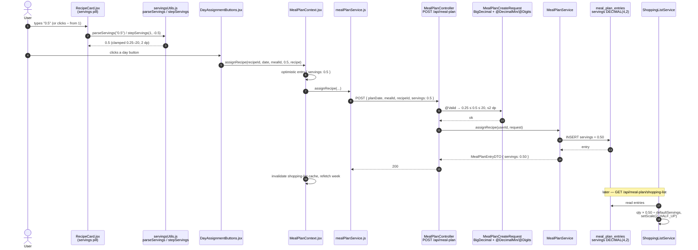

# Plan: Decimal serving size (half portions)

Plan folder: `.claude/contract/2026-07-29-decimal-serving-size/`
Execution status: see `tasks.md` in this folder.

---

## Part 1 — Alignment

### Subtask reference

No Jira key supplied. Verbatim prose primed by the developer:

> I want to be able to set the serving size using decimal. So .5 If I evey want to make a half portion

Two follow-up decisions confirmed interactively on 2026-07-29:

- **Scope** — "Full stack — persist the decimal": DB column widened, Java types changed, frontend inputs accept decimals, and the value flows into shopping-list scaling and survives reload.
- **Granularity** — "it's already free text shoul it shold hanlde any 1 or 2 decimal value so .5 or .25": any value with 1 or 2 decimal places, not a fixed 0.5 grid.

### Restated goal

Today the servings a user picks when assigning a recipe to a day is a whole number: the `+`/`−` pill on `RecipeCard` steps by 1, the `RecipeViewModal` input `parseInt`s its value, `MealPlanCreateRequest` enforces `@Min(1)`, and `meal_plan_entries.servings` is a MySQL `INT`. This change makes servings a decimal quantity end to end, so the user can plan a **half portion** (`0.5`) — or a quarter (`0.25`), or `1.5` — of any recipe. The decimal is typed freely into the servings input (1 or 2 decimal places), persists on the meal-plan entry, survives a page reload, is preserved when a week is copied or snapshotted into a meal-plan template, and correctly scales the aggregated shopping-list quantities (a 0.5-serving entry of a 4-serving recipe contributes one eighth of its ingredient amounts). The `+`/`−` buttons keep working as a coarse control, stepping by 0.5.

### In scope

- Widen `meal_plan_entries.servings` from `INT NOT NULL DEFAULT 1` to `DECIMAL(4,2) NOT NULL DEFAULT 1.00`, via a date-prefixed migration under `foodbytes-app/database/migrations/`.
- Widen `meal_plan_template_entries.servings` identically, so a decimal survives save-as-template → apply-template.
- Change `MealPlanEntry.servings` and `MealPlanTemplateEntry.servings` from `Integer` to `BigDecimal` with explicit `precision = 4, scale = 2`.
- Change `MealPlanEntryDTO.servings`, `MealPlanTemplateEntryDTO.servings`, and `MealIngredientUsageDTO.servings` from `Integer` to `BigDecimal`.
- Replace `MealPlanCreateRequest`'s `@Min(1)` with `@DecimalMin("0.25")` + `@DecimalMax("20.00")` + `@Digits(integer = 2, fraction = 2)` on a `BigDecimal servings` field.
- Update the three `servings != null ? … : 1` defaults in `MealPlanService.assignRecipe` and `MealPlanTemplateService` (apply + snapshot paths) to `BigDecimal.ONE`.
- Update `ShoppingListService` so `entryServings` is a `BigDecimal` throughout (`processRecipeIngredients`, `processExtras`, `getIngredientBreakdown`) and is multiplied directly instead of via `BigDecimal.valueOf(int)`.
- Update `ShoppingListServiceTest` helper + assertions for the new type, and add a test proving a `0.5`-serving entry scales ingredient quantities to one eighth on a 4-serving recipe.
- New `client/src/constants/servings.js` (`MIN_SERVINGS`, `MAX_SERVINGS`, `SERVINGS_STEP`) and `client/src/utils/servingsUtils.js` (`parseServings`, `formatServings`, `stepServings`) so the bounds and parse rules are declared once instead of duplicated as literals across two components.
- `RecipeCard.jsx`: the `.servings-value` read-only span becomes a free-text decimal input; `+`/`−` step by 0.5 and clamp to `[0.25, 20]`.
- `RecipeViewModal.jsx`: `handleServingsChange` / `handleServingsBlur` switch from `parseInt` to `parseServings`; the input gains `step="0.5"`, `min="0.25"`, `inputMode="decimal"`.
- `MealPlanEntry.jsx`: render a `× 0.5` chip on a planned entry whenever `entry.servings !== 1`, so the persisted decimal is visible in the calendar.
- CSS for the widened numeric input in `RecipeCard.css` and `RecipeViewModal.css`, including the ≥44 px touch-target and `@media (hover: hover)` corrections the `react-frontend` skill requires on buttons being edited.
- Updated JSDoc on `mealPlanService.assignRecipe` and `MealPlanContext.assignRecipe` stating that `servings` may be a decimal.

### Explicitly out of scope

- **`recipes.default_servings` and `users.default_servings` stay `INT`.** A recipe that *yields* 2.5 portions is a different feature; the ask is about how much of a recipe you cook, not how many portions it makes.
- **No `PATCH /api/meal-plan/{id}` to edit servings on an already-planned entry.** Today servings is only settable at assign time (`POST /api/meal-plan`); re-clicking the same recipe toggles it off. Changing servings after the fact still means remove + re-add. Adding an edit endpoint is a separate subtask.
- **Day / week calorie and macro totals still ignore the servings multiplier.** `MealPlanService.buildDayDTO` sums `calculateCaloriesPerServing(recipe)` and `MacroCalculationService.calculateTotalMacros` takes recipes, not entries — both per-serving by design (FR-017 / FR-036). Planning `0.5` will not halve the day's calories. Pre-existing for `servings = 2` today; see Risks.
- **No admin UI for servings**, and no change to `RecipeInfoForm`'s Default Servings field.
- **No `IngredientBreakdownPopup` change.** `MealIngredientUsageDTO.servings` changes type, but no frontend component renders that field today.
- **No new/changed endpoint paths, no security or auth changes.**
- **No PWA bootstrap.** `vite-plugin-pwa` is still not installed; this change neither depends on nor regresses it.

### Pattern Reference (from subtask)

None supplied. Chosen references, authoritative for this subtask:

- **Decimal quantity handling** — `RecipeIngredient.quantity` and `ShoppingItemDTO.totalQuantity` already model fractional amounts as `BigDecimal` with `setScale(2, RoundingMode.HALF_UP)`. The servings field follows that established type, not `Double`.
- **Frontend free-text numeric input with a typing buffer** — `RecipeViewModal.jsx:230-246` (`servingsDisplay` string state alongside `currentServings` numeric state, restored on blur). `RecipeCard`'s new input copies this pattern.
- **Migration file shape** — `foodbytes-app/database/migrations/2026-05-09_meal_plan_templates.sql` (date-prefixed, header comment, idempotent-minded DDL).
- **Skills** — `.claude/skills/java-backend/SKILL.md` and `.claude/skills/react-frontend/SKILL.md`.

### Constraints flagged on the subtask

- **Free text, 1 or 2 decimal places** — the developer explicitly said the input is already free text and should handle `.5` or `.25`. So: no fixed 0.5-only grid on typed entry; `@Digits(integer = 2, fraction = 2)` is the server-side ceiling and `parseServings` rounds to 2 dp client-side.
- **The decimal must persist** — the developer chose the full-stack option over frontend-only display scaling, which makes the DB migration and the `Integer` → `BigDecimal` sweep mandatory rather than optional.

Project constraints that bind this change (from `CLAUDE.md`):

- Hibernate runs `ddl-auto: validate`. **The migration must be applied to the Railway MySQL before the backend redeploys**, or startup fails on schema validation.
- `foodbytes-app/database/schema.sql` and `seed.sql` were lost in an earlier wipe (memory `railway-db-access`), so the live Railway DB is the only schema of record — the migration file is the durable artefact of this change.
- There is no frontend test runner in `client/package.json`; frontend verification is manual and must be reported as such.

### Assumptions made

- **`BigDecimal`, not `Double` or scaled-`Integer`, for servings.** Rationale: the scaling arithmetic it feeds (`ShoppingListService`) is already all-`BigDecimal`; binary float would inject drift into quantities that are then rounded HALF_UP at 2 dp and summed across up to 21 entries per week. Confirmed by the developer's selected preview, which names `Integer → BigDecimal`.
- **`DECIMAL(4,2)`** — allows 0.01–99.99 at the column level, comfortably wider than the 0.25–20 the app enforces, and lossless for the 565 existing rows (all integers 1–4). Rationale: keep the DB permissive and the validation in one place (the DTO), matching how `@Min(1)` — not a DB `CHECK` — guards servings today.
- **Floor of `0.25`, ceiling of `20`.** Rationale: `0.25` is the smallest fraction the developer named; `20` is the existing `RecipeCard`/`RecipeViewModal` max, kept unchanged. A `0` or negative serving is meaningless and would make a shopping-list row vanish, so the floor is enforced, not just defaulted.
- **`+`/`−` buttons step by `0.5`, typed entry is free.** Rationale: the developer called the input "already free text", so precision belongs to typing; the buttons are the coarse control and a 0.25 step would double the clicks to reach 1 → 2. `0.25` remains reachable by typing.
- **`RecipeCard`'s read-only `.servings-value` span becomes an editable input.** Rationale: the card's pill value is what `DayAssignmentButtons` passes to `assignRecipe` — it is the *only* control whose value is persisted. Leaving it button-only would make `0.25` unreachable on the surface that actually saves, and `0.5` reachable only via `−` from 1. Reflected in Part 2 → Approach.
- **A `× 0.5` chip is added to `MealPlanEntry.jsx`.** Rationale: without it there is no surface in the app that displays a persisted non-1 servings value, so the developer could not visually confirm the feature worked. Shown only when `servings !== 1` to avoid noise on the common case.
- **`meal_plan_template_entries.servings` is in scope.** Rationale: `MealPlanTemplateService.snapshotIntoTemplate` copies `MealPlanEntry.servings` straight into the template entry and `applyTemplate` copies it back. Leaving that column `INT` means MySQL silently rounds `0.5` → `1` on save-as-template (or, with the entity typed `BigDecimal`, Hibernate `validate` fails at startup on a type mismatch). The developer did not mention templates; this is a correctness consequence of their scope choice, not scope creep.
- **`recipes.default_servings` / `users.default_servings` stay `INT`.** Rationale: "make a half portion" is about consumption, not recipe yield. Listed under Explicitly out of scope so the developer can red-line it.
- **Servings-aware calorie totals are excluded.** Rationale: the subtask asks to *set* a decimal serving size, not to re-specify FR-017 calorie aggregation, and that aggregation is already servings-blind for `servings = 2`. Surfaced in Risks so it is a decision, not a surprise.
- **No `@ControllerAdvice` is added for the new validation messages.** Rationale: the project has no `exception/` package and no `@ControllerAdvice` anywhere (`Grep "ControllerAdvice" foodbytes-api/src` → 0 hits), so a constraint violation returns Spring Boot's default 400 body, exactly as `@Min(1)` does today. Introducing a global handler is a separate concern. Reflected in Part 2 → Runtime quality notes → Error paths.
- **No requirements/spec doc.** The developer confirmed only `react-frontend` and `java-backend`, declining the `requirements` skill, so `plan.md` Part 1 is the alignment artefact.

### Cross-code alignment audit (FE ↔ BE ↔ DB)

Performed against the live Railway MySQL via the `mysql` MCP on 2026-07-29 (schema introspection and aggregate counts only — no personal or per-user rows were read).

- **Tables exist.** `meal_plan_entries` and `meal_plan_template_entries` both present in the live DB. No DDL is staged-but-unapplied for either — the new migration is genuinely new.
- **Column types confirmed.** `meal_plan_entries.servings` = `int NOT NULL DEFAULT '1'`; `meal_plan_template_entries.servings` = `int NOT NULL DEFAULT '1'`. Both are the widening targets. `recipes.default_servings` = `int NOT NULL DEFAULT '2'` and `users.default_servings` = `int NULL DEFAULT '1'` — both confirmed out of scope and left alone.
- **Existing data is lossless to widen.** `meal_plan_entries`: 565 rows, `MIN(servings) = 1`, `MAX(servings) = 4`. `meal_plan_template_entries`: 58 rows, `MIN = 1`, `MAX = 2`. Every value is a whole number inside `DECIMAL(4,2)`, so `ALTER TABLE … MODIFY` converts without truncation or rounding, and no data backfill is needed.
- **Representative rows exist for a smoke test.** 565 planned entries across the live plan means the shopping-list scaling path is exercised immediately after deploy; no dev-only seed file is needed.
- **Name alignment across the chain holds and stays unchanged.** DB `servings` ↔ JPA `@Column` (implicit, field name `servings`) ↔ `MealPlanEntryDTO.servings` / `MealPlanCreateRequest.servings` / `MealPlanTemplateEntryDTO.servings` ↔ JSON key `servings` ↔ FE `entry.servings` and the `servings` prop threaded `RecipeCard → DayAssignmentButtons → MealPlanContext.assignRecipe → mealPlanService.assignRecipe`. Only the *type* changes; no key is renamed, so no filter/sort registry or column-id mapping is affected.
- **One mismatch found, and it is in scope.** `MealIngredientUsageDTO.servings` is `Integer` and is populated directly from `entry.getServings()` in `ShoppingListService.getIngredientBreakdown:266-273`. Left as `Integer` it would not compile after the entity change, so it is included in the sweep (no frontend component reads the field, so there is no UI consequence).
- **No FR-103 / linked-recipe rule is engaged.** This change touches no `recipe_ingredients` rows, no `linked_recipe_id`, no recipe families, and inserts no ingredients — `.claude/rules/linked-recipe-extras.md`, `recipe-variants.md`, and `homemade-first-and-ingredient-dedup.md` were scanned and none of their reject conditions apply. `quantity_grams` semantics are untouched; only the multiplier applied to `RecipeIngredient.quantity` changes type.

---

## Part 2 — Technical design

### Approach

The change is a **type widening threaded along one existing data path**, not a new feature surface. `servings` already flows `RecipeCard` (pill state) → `DayAssignmentButtons` (prop) → `MealPlanContext.assignRecipe` → `mealPlanService.assignRecipe` → `POST /api/meal-plan` → `MealPlanCreateRequest` → `MealPlanService.assignRecipe` → `meal_plan_entries.servings`, and back out via `MealPlanEntryDTO` plus into `ShoppingListService`'s scaling arithmetic. Nothing about that topology changes. What changes is the type at each hop: `INT` → `DECIMAL(4,2)` in MySQL, `Integer` → `BigDecimal` in Java, `parseInt` → a 2-decimal-aware parse on the frontend. Because the JSON key stays `servings` and JSON numbers are untyped, the wire contract is unchanged and Jackson maps `0.5` → `BigDecimal("0.5")` with no configuration.

`BigDecimal` is the right Java type rather than `Double` because the value's only arithmetic consumer is already all-`BigDecimal`: `ShoppingListService.processRecipeIngredients` computes `quantity × entryServings ÷ defaultServings` with `setScale(2, RoundingMode.HALF_UP)`, and the result is aggregated across every meal in the week. A binary float would introduce representation drift into a value that is rounded to 2 dp and then summed ~200 times per shopping-list request. The change is also a small *simplification* there: `BigDecimal.valueOf(entryServings)` disappears from two call sites because `entryServings` is already a `BigDecimal`. The alternative considered and rejected was **basis-point encoding** — keep the column `INT` and store servings × 100 — which needs no schema change but leaks a `/100` into every reader, the DTO, and the JSON contract, and would make the API body `50` mean "half a portion". A second alternative, **`Double` + `float`/`double` column**, was rejected for the drift reason above.

On the frontend the two servings controls have drifted apart: `RecipeViewModal` has a free-text `type="number"` input with a `servingsDisplay` string buffer so a partially-typed value doesn't clobber the numeric state, while `RecipeCard` has a read-only span between `+`/`−` buttons. `RecipeCard`'s pill is the one that matters — its value is what gets persisted when a day button is clicked — so it gains the same editable input, copying the modal's buffer pattern. The bounds and parse rules that are currently duplicated literals (`min="1"`, `max="20"`, `Math.max(1, …)`, `Math.min(20, …)`, `parseInt`) are hoisted into `src/constants/servings.js` + `src/utils/servingsUtils.js`, which is what the `react-frontend` hard floor demands of any repeated meaningful value and creates the `src/constants/` folder the skill says is still missing. `parseServings` returns `null` for anything unparseable and otherwise clamps to `[0.25, 20]` and rounds to 2 dp — so an out-of-range or over-precise value is corrected on the client and the API never sees a body that would fail `@Digits`.

The one asymmetry worth stating: this change makes servings affect **shopping-list quantities** but deliberately not **calorie or macro totals**, because those aggregate per-serving figures from the recipe and never consult `entry.servings` (true today for `servings = 2` as much as for `0.5`). To keep the persisted decimal observable, `MealPlanEntry.jsx` gains a `× 0.5`-style chip whenever `entry.servings !== 1` — that chip plus the shopping list are the two places the developer can verify the feature end to end.

### Skills to invoke during execution

- `java-backend` — governs the entity, DTO, validation, and service edits under `foodbytes-api/src/main/java/com/foodbytes/`, the layered placement rule (no logic in `MealPlanController`), the "entity change ⇒ migration file ⇒ **tell the user to apply it to Railway manually**" contract, and `mvn test` as the verification runner.
- `react-frontend` — governs the `client/src/` edits: the constants-and-utils extraction for repeated literals, the four-async-states and no-swallowed-error rules, the ≥44 px touch target / `@media (hover: hover)` / `:focus-visible` / `touch-action` requirements on the servings buttons being edited, the 400-line file budget check on `RecipeCard.jsx` and `RecipeViewModal.jsx`, no-new-`console.log`, and the standing prohibition on claiming a frontend test passed (there is no runner).

Developer override: the `requirements` skill was offered and declined — `plan.md` Part 1 serves as the alignment artefact, so no separate SPEC.md is produced.

### Diagram



### Data shapes

#### DDL — `foodbytes-app/database/migrations/2026-07-29_decimal_servings.sql`

```sql
ALTER TABLE meal_plan_entries
  MODIFY COLUMN servings DECIMAL(4,2) NOT NULL DEFAULT 1.00;

ALTER TABLE meal_plan_template_entries
  MODIFY COLUMN servings DECIMAL(4,2) NOT NULL DEFAULT 1.00;
```

| Table | Column | Before | After | Nullable | Default | Index |
|---|---|---|---|---|---|---|
| `meal_plan_entries` | `servings` | `int` | `decimal(4,2)` | NO | `1.00` | none (unchanged) |
| `meal_plan_template_entries` | `servings` | `int` | `decimal(4,2)` | NO | `1.00` | none (unchanged) |

Lossless: 565 + 58 existing rows hold whole numbers 1–4. No backfill, no index change, no FK change.

#### JPA entities

```java
// model/MealPlanEntry.java
@Column(nullable = false, precision = 4, scale = 2)
private BigDecimal servings = BigDecimal.ONE;

// model/MealPlanTemplateEntry.java
@Column(nullable = false, precision = 4, scale = 2)
private BigDecimal servings = BigDecimal.ONE;
```

#### DTOs

```java
// dto/MealPlanCreateRequest.java
@NotNull(message = "Servings is required")
@DecimalMin(value = "0.25", message = "Servings must be at least 0.25")
@DecimalMax(value = "20.00", message = "Servings must be at most 20")
@Digits(integer = 2, fraction = 2, message = "Servings allows at most 2 decimal places")
private BigDecimal servings = BigDecimal.ONE;

// dto/MealPlanEntryDTO.java          — servings: Integer → BigDecimal
// dto/MealPlanTemplateEntryDTO.java  — servings: Integer → BigDecimal
// dto/MealIngredientUsageDTO.java    — servings: Integer → BigDecimal
```

`planDate`, `mealId`, `recipeId` and every other field on these DTOs are unchanged.

#### HTTP contract — unchanged keys, widened value domain

`POST /api/meal-plan`

```json
{ "planDate": "2026-08-03", "mealId": 3, "recipeId": 187, "servings": 0.5 }
```

Response `200` (`MealPlanEntryDTO`, abbreviated):

```json
{ "id": 1234, "planDate": "2026-08-03", "mealType": "dinner", "mealId": 3,
  "recipe": { "id": 187, "name": "…", "defaultServings": 2 },
  "servings": 0.50, "caloriesPerServing": 612,
  "proteinPerServing": 41, "carbsPerServing": 62, "fatPerServing": 21 }
```

`204 No Content` on toggle-off and `403` when unauthenticated are unchanged. A servings value outside `[0.25, 20]` or with >2 decimals returns Spring Boot's default `400` body (no `@ControllerAdvice` exists in this project).

#### Changed Java method signatures

```java
// service/ShoppingListService.java
private void processRecipeIngredients(Recipe recipe, BigDecimal entryServings, Integer defaultServings,
                                      Map<IngredientUnitKey, IngredientAggregate> aggregatedIngredients,
                                      List<Long> sourceChain)

private void processExtras(List<RecipeExtraNodeDTO> extras, Map<Long, Boolean> selections,
                           BigDecimal entryServings, Integer defaultServings,
                           Map<IngredientUnitKey, IngredientAggregate> aggregatedIngredients,
                           List<StoreBoughtItem> storeBoughtItems, List<Long> parentSourceChain)
```

`defaultServings` stays `Integer` — it is `recipes.default_servings`, which remains an `INT`.

#### New frontend modules

```js
// client/src/constants/servings.js
export const MIN_SERVINGS = 0.25
export const MAX_SERVINGS = 20
export const SERVINGS_STEP = 0.5

// client/src/utils/servingsUtils.js
parseServings(input)        // string|number → number in [0.25, 20] rounded to 2 dp, or null if unparseable
formatServings(value)       // 0.5 → "0.5" | 1 → "1" | 1.25 → "1.25" | 2.00 → "2"  (no trailing zeros)
stepServings(value, delta)  // (1, -0.5) → 0.5 ; clamps to [0.25, 20], rounds to 2 dp
```

### Runtime quality notes

`${CLAUDE_PLUGIN_ROOT}/rules/code-quality.md` is **not present in this environment** (`Glob **/code-quality.md` → no files; no `code-quality.md` under `C:\Users\jossd\.claude\plugins`). The four Runtime Quality dimensions from the `/fb-plan` template are addressed directly below.

- **Resource cleanup:** No new files, sockets, streams, timers, or event listeners are introduced on either side. The migration is two `ALTER TABLE … MODIFY` statements run once by the developer against Railway; MySQL DDL is auto-committed per statement, so a failure on the second leaves the first applied — the task therefore verifies both columns after running, and each statement is independently re-runnable (`MODIFY` to the same type is a no-op). Backend DB connections stay under the existing `@Transactional` / `@Transactional(readOnly = true)` boundaries on `MealPlanService` and `ShoppingListService`, unchanged. Frontend: no new request is added, so no new `AbortController` is required; `RecipeCard`'s new input is controlled state with no subscription to clean up.
- **Concurrency / thread-safety:** `ShoppingListService` and `MealPlanService` are stateless Spring singletons; all mutable state (`HashMap` accumulator, `ArrayList` of store-bought items) is created per request inside the method and never escapes the request thread — unchanged by this edit. `BigDecimal` is immutable, so passing `entryServings` down into `processExtras`' recursion is inherently safe, and it is a strictly safer parameter than the `Integer` box it replaces. The `MealPlanEntry.servings` field default `BigDecimal.ONE` is a shared immutable constant, so the field initialiser cannot be mutated across instances (a mutable default would have been a real hazard here). No locks, no `static` mutable state, no async ordering added. GC suspension risk: nil — the change *reduces* allocation on the only hot path (see below), so it cannot lengthen a young-gen pause.
- **Allocation behaviour:** The hot path is `ShoppingListService.processRecipeIngredients`, which runs once per ingredient row per meal-plan entry — roughly 21 entries × ~10 rows ≈ 210 iterations per shopping-list request, plus extras recursion. Each iteration currently allocates a `BigDecimal` via `BigDecimal.valueOf(entryServings)`; after the change `entryServings` is already a `BigDecimal`, so that allocation is **removed** — one fewer object per row, with the `multiply`/`divide` intermediates unchanged. Nothing is buffered that wasn't before; the aggregation map is bounded by the number of distinct (ingredient, unit) pairs in the week, as today. No new caching, no pooling needed, no leak surface (nothing is retained past the request). Frontend: `parseServings` / `stepServings` are pure and allocate a single `Number` per keystroke; `formatServings` allocates one short string per render of a non-1 chip.
- **Error paths:** Three layers, innermost last. (1) **Client guard** — `parseServings` returns `null` for an unparseable value, and `handleServingsChange` keeps the last valid numeric state while letting the display string stay mid-typing; `handleServingsBlur` restores the display from the numeric state. Out-of-range and over-precise values are clamped/rounded rather than rejected, so an invalid body is never constructed. (2) **Bean validation** — `@DecimalMin` / `@DecimalMax` / `@Digits` / `@NotNull` on `MealPlanCreateRequest` are enforced by the existing `@Valid` on `MealPlanController.assignRecipe`; a violation returns Spring Boot's default `400` (no `@ControllerAdvice` in this project — stated, not assumed). This is defence in depth against a direct API call, not the primary path. (3) **Optimistic-update rollback** — `MealPlanContext.assignRecipe`'s existing `.catch` restores `previousWeekPlan` and surfaces "Failed to save. Please try again." for 3 s; no new `catch` is added and no error is converted into a success-shaped value. Nothing new is logged, and the opportunistic fix in `MealPlanEntry.jsx` **removes** an existing `console.log` (line 115) rather than adding one. A malformed value that somehow reached MySQL would be rejected by `DECIMAL(4,2)` / `NOT NULL` rather than silently truncated.

### Risks and judgement calls

- **Calorie and macro totals will not reflect a half portion — sanity-check this is acceptable.** `buildDayDTO` sums `calculateCaloriesPerServing(recipe)` per entry and `MacroCalculationService.calculateTotalMacros(dayRecipes)` takes recipes, so a `0.5` entry still contributes a full serving's kcal and macros to the day and week. This is pre-existing FR-017/FR-036 behaviour (a `servings = 2` entry likewise contributes one serving's kcal today), but a user who plans a half portion may reasonably expect the day total to drop. Excluded here because it changes an agreed calorie contract; if it should be included, it becomes a second subtask spanning `MealPlanService`, `MacroCalculationService`, `MealPlanEntryDTO`, and the frontend weekly-summary components.
- **The migration must be applied to Railway MySQL before the backend redeploys.** Hibernate `ddl-auto: validate` will refuse to start if `MealPlanEntry.servings` is a `BigDecimal` while the column is still `INT`. Order matters: apply DDL first, then push/redeploy. There is no automatic migration runner in this project, and `schema.sql` no longer exists as a fallback.
- **`meal_plan_template_entries` is included on my judgement, not the developer's instruction.** It is required for correctness (Hibernate `validate` would fail on the template entity otherwise, and a template save would round `0.5` → `1`), but it does widen the blast radius of the migration to a second table. Red-line it if templates should be handled separately — but then `MealPlanTemplateEntry.servings` must stay `Integer` and `snapshotIntoTemplate` needs an explicit rounding decision.
- **`RecipeCard`'s pill becomes an editable input — a UX change, not just a type change.** The pill is currently `− [2] +` with a 24 px read-only span; it becomes `− [0.5] +` with a focusable numeric input. Judgement: without it, the surface that actually persists servings can only reach `0.5` by clicking `−` from 1, and can never reach `0.25`. If the developer prefers the card stay button-only, the fallback is buttons stepping 0.5 and typed precision available only inside `RecipeViewModal` — but note the modal's servings value is **display-only** and is never persisted, so `0.25` would then be unreachable for planning.
- **`RecipeViewModal.jsx` is at 393 lines, against a 400-line blocking budget.** The `react-frontend` skill treats >400 as blocking and must be split in the same change. The edits here are small and net-neutral-to-negative (`parseInt` → `parseServings` swaps, literals → imported constants), so the file should stay under budget — but the line count must be **measured** after editing, and if it crosses 400 the servings input+handlers get extracted into a `useServingsInput` hook in the same change. `RecipeCard.jsx` (235 lines) has headroom.
- **A `DECIMAL(4,2)` column plus a `0.25` app-level floor means the DB permits values the app forbids** (e.g. `0.01` inserted by hand or by an old migration). Judgement: consistent with how `servings` is guarded today (`@Min(1)` in the DTO, no DB `CHECK`), and adding a `CHECK` constraint would need MySQL 8.0.16+ verified on Railway and would break the existing "validation lives in the DTO" pattern. Flagging rather than silently diverging.
- **`ShoppingListServiceTest`'s `createMealPlanEntry` helper signature changes**, so every call site in that file is touched even though only one test is about decimals. Mechanical, but it means the diff on that file looks larger than the behaviour change; the new `0.5`-serving test is the one that carries the invariant.
- **Frontend verification is manual and will be reported as such.** `client/package.json` has no test script, so the `0.5` round-trip (type → assign → reload → shopping-list quantity halves) is a manual browser check against a running dev server. Backend behaviour *is* covered by `mvn test`. Do not let the summary imply the frontend was automatically tested.
