# Plan: Meal Plan screen — make the macro popups and the Options menu mobile-friendly

Plan folder: `.claude/contract/2026-07-29-mealplan-mobile-popups/`
Execution status: see `tasks.md` in this folder.

---

## Part 1 — Alignment

### Subtask reference

No Jira subtask. Primed inline by the developer with three screenshots (evicted from the image cache before planning; scope was re-confirmed interactively) plus this prose:

> "[Image #1] [Image #2] both thses popups are not mobile friendly [Image #4] and the meal plan wekk Options "Copy Week", "Save as tempalte" and so on also dont' show up on a mobile"

Developer clarification when asked which popups the screenshots showed:

> "macros for the week and day and the options to "apply tempaltes" copy week in the "Meal plan" screen"

No `/brainstorming` spec was consumed — no `spec.md` in this folder.

### Restated goal

Three surfaces on the `/mealplan` screen are unusable or badly degraded on a phone, and this subtask fixes all three. First, the **day and week macro popups** (`DailyMacroPopup`, `WeeklyMacroPopup`) register a capture-phase `scroll` listener on `document` that closes the popup on *any* scroll — including a scroll inside the popup itself. On mobile their content is taller than the 80vh panel, so reading them requires scrolling, which instantly dismisses them; and because the panel scrolls as a whole, the purple header carrying the close button scrolls out of reach. Second, the **week Options kebab menu** (`MealPlanMenu`) anchors its dropdown `right: 0` against a 44px trigger, but at ≤600px `.calendar-header` flips to a left-aligned column, so the 220px panel renders roughly 165px off the left edge of the viewport — the Copy week / Save as template / Apply template / Manage templates items are literally off-screen. Third, the **four modals that menu opens** (`CopyWeekModal`, `SaveTemplateModal`, `ApplyTemplateModal`, `ManageTemplatesModal`) have no `max-height` and no scroll region, so on a short viewport — in particular once the on-screen keyboard opens over the date/name input — the panel overflows and the confirm button becomes unreachable.

Alongside those three functional defects the same files carry a consistent set of touch-ergonomics violations against the `react-frontend` hard floor: 32px and 36px tap targets where 44px is the minimum, `:hover` rules not wrapped in `@media (hover: hover)` so touch devices inherit sticky hover, missing `touch-action: manipulation`, `vh` units that ignore mobile browser chrome, and a `min-width: 320px` floor that overflows narrow devices. Those are fixed in the same files, not deferred.

### In scope

- Remove the scroll-closes-the-popup behaviour from `DailyMacroPopup` and `WeeklyMacroPopup`, replacing it with a background scroll lock so the page behind cannot move while a popup is open.
- Restructure both macro popups from whole-panel scroll to a flex column with a non-scrolling header and a single scrolling content region, so the close button stays reachable.
- Introduce a `useBodyScrollLock` hook in `client/src/hooks/` and consume it from both macro popups.
- Reposition the `MealPlanMenu` dropdown as a bottom sheet at ≤600px so it no longer depends on the trigger's horizontal position, and raise it above the fixed footer (`z-index: 100`).
- Add a tap-to-close scrim behind the mobile bottom sheet in `MealPlanMenu.jsx`.
- Give `CopyWeekModal`, and the three template modals via the shared `TemplateModals.css`, a `max-height` cap plus a scrolling content region so the actions row is always reachable with the keyboard open.
- Collapse `TemplateModals.css`'s nested scroller (`.tpl-list { max-height: 50vh; overflow-y: auto }`) into the single panel-level scroller.
- Raise every tap target in the five touched stylesheets to ≥44×44px: `.macro-popup-close`, `.copy-modal-close`, `.tpl-modal-close` (32px → 44px hit area), `.tpl-action-button`, `.tpl-small` (36px → 44px), `.copy-cancel-button`, `.copy-confirm-button` (no floor → 44px).
- Wrap every bare `:hover` in the five touched stylesheets in `@media (hover: hover)` and pair each with an `:active` state; add `touch-action: manipulation` and `-webkit-tap-highlight-color: transparent` to their interactive elements.
- Switch panel height caps from `vh` to `dvh` with a `vh` fallback declaration, and add `env(safe-area-inset-bottom)` padding to the mobile bottom-sheet variants.
- Drop the `min-width: 320px` floor on `.macro-popup`, `.copy-modal`, `.tpl-modal` and add overlay padding so panels never touch the viewport edge.
- Correct the misleading `.macro-popup-hint` copy — "tap anywhere to close" is false, tapping inside does not close.
- Make `usePullToDismiss` attach its `touchmove` handler as a genuinely non-passive listener so its existing `e.preventDefault()` takes effect, and repoint `setScrollableRef` at the new inner scroller in both macro popups.

### Explicitly out of scope

- **`SwapDaysModal.jsx:60` carries the identical capture-phase scroll-close bug.** It is on the same screen and the fix is one line, but the developer's scope named the macro popups and the Options menu, so it is not touched here. Flagged in Risks — say the word and it becomes a fourth task in Phase 1.
- **Every other modal in the app** — `LoginModal` (zero media queries, panel overflows the viewport, and a real `.modal-header` cascade collision with `RecipeEditModal.css`), the admin `RecipeEditModal` inline `.dialog` overlays (no media queries at all), `IngredientBreakdownPopup`, `ExtrasSelectionPopup`, `GenerateShoppingListModal`, `RecipeViewModal`. All were audited and several are worse than what is in scope; none were named.
- **`ManageTemplatesModal`'s two native `confirm()` calls** (`ManageTemplatesModal.jsx:70` and `:83`). Native confirm is genuinely poor in an installed PWA, but replacing it with the app's `ConfirmDialog` is a behavioural change to a modal-inside-a-modal, not a mobile-CSS fix.
- **Extracting a shared modal base stylesheet.** Five files here duplicate the same overlay/panel/close/hover rules, and a shared base is the correct long-term fix — but the app deliberately uses a prefixed-per-modal convention in 11 of its 14 modals, and refactoring that surface is a much larger change than this subtask.
- **Bootstrapping `vite-plugin-pwa`.** Not installed today; nothing here depends on it.
- **Backend, SQL, macro arithmetic.** The macro *numbers* are not in question — only how the popups render and behave.
- **Any new automated test.** There is no test runner wired into `client/package.json`; verification is manual and stated as such.

### Pattern Reference (from subtask)

None supplied. References chosen from the existing codebase and recorded here:

- **Mobile bottom sheet** — `RecipeEditModal.css:194-212`, `RecipeViewModal.css:427-455`, `ExtrasSelectionPopup.css:243-269`. All three use the same idiom at ≤480px: overlay `align-items: flex-end`, panel `border-radius: var(--radius-lg) var(--radius-lg) 0 0`, raised `max-height`. `MealPlanMenu`'s mobile sheet and the macro popups follow this.
- **Capped panel + inner scroller** — `RecipeEditModal.css:18-28` (`max-height: 90vh; display: flex; flex-direction: column`) with `.modal-content { flex: 1; overflow-y: auto }` at `:84-88`, and `RecipeViewModal.css:28-40` + `:278-282`. This is the shape both macro popups and the four Options modals are restructured into.
- **Body scroll lock** — `RecipeViewModal.jsx` was the reference implementation cited when this plan was written. Implementation found a **second** ad-hoc lock in `ExtrasSelectionPopup.jsx` doing the same thing independently, which is exactly why a shared reference count was needed: two independent locks racing one another leave the page unscrollable. `useBodyScrollLock` generalises both, with the save/restore correction noted in Risks, and both files were migrated onto it.
- **44px touch target with a smaller visual** — `MealPlanMenu.css:6-24` (`min-width/min-height: 44px` plus `touch-action: manipulation`, `-webkit-tap-highlight-color: transparent`) and `MealPlanMenu.css:30-35` for the `@media (hover: hover)` wrapper. The `react-frontend` skill names both as the reference pattern.
- **Prefixed-per-modal CSS convention** — `swap-modal-overlay`/`swap-modal`, `tpl-modal-overlay`/`tpl-modal`, `macro-popup-overlay`/`macro-popup`. New selectors keep their file's existing prefix.

### Constraints flagged on the subtask

The developer flagged no constraints beyond the three surfaces. The binding constraints therefore come from `CLAUDE.md` and the `react-frontend` skill:

- Plain per-component CSS in the existing pattern — **no CSS Modules**, no `*.module.css`, no CSS framework.
- **No new runtime dependency.** The client has exactly four (`react`, `react-dom`, `react-router-dom`, `axios`) and nothing here needs a fifth.
- **No TypeScript** — `.jsx`/`.js` only.
- Every interactive element **≥44×44px**; `:hover` always behind `@media (hover: hover)`; `:focus-visible` not bare `:focus` for keyboard outlines.
- **No file over 400 lines**, measured not estimated.
- **No new `console.log` / `console.debug`** — the baseline is 6.
- Cross-cutting state stays in the existing Contexts; no new global store.
- **No test-passed claims** — no test runner exists in `client/package.json`.

### Assumptions made

- **The two screenshotted popups are `DailyMacroPopup` and `WeeklyMacroPopup`** — *developer-confirmed*, not an assumption. Recorded so it is not re-litigated.
- **"Options … don't show up on a mobile" means the dropdown renders off-screen, not that the trigger is missing.** The trigger is a 44px button inside the flex header and is unconditionally rendered (`MealPlanCalendar.jsx:105-110`); the panel's `right: 0` anchor against a left-aligned 44px trigger at ≤600px puts it ~165px past the left viewport edge. Nothing on the ancestor chain clips or scrolls, so it paints off-screen rather than being clipped — which presents exactly as "doesn't show up".
- **A bottom sheet is preferred over a minimal `left: 0; right: auto` flip** for the mobile menu. The sheet is immune to the anchor position entirely rather than patching one symptom, matches the idiom already used by three other modals at mobile widths, puts the items in thumb reach, and needs its own overlay — which also resolves the footer z-index collision. The 4-line CSS alternative is named in Risks so it can be chosen instead during this review.
- **Scroll-to-close is removed rather than narrowed to outside-only scrolls.** Detecting "scrolled outside the popup" from a capture-phase listener is fragile; locking background scroll makes the behaviour unnecessary, and a modal that survives scrolling is the correct behaviour. Escape, tap-outside, the close button, and pull-to-dismiss all remain.
- **`MealPlanMenu` moves to a single `max-width: 600px` breakpoint**, replacing its current `480px` block, because 600px is where `.calendar-header` goes column (`MealPlanCalendar.css:197`) and therefore where the bug starts. A 480px sheet would leave 481–600px broken. The macro popups and the four Options modals keep the house `480px` modal breakpoint. This deliberate inconsistency is called out in Risks.
- **`.tpl-list`'s own scroller is removed rather than kept alongside the new panel scroller.** Nested scroll containers cause scroll-chaining confusion on touch; one scroller per panel is the pattern every other capped modal in the app uses.
- **`useBodyScrollLock` saves and restores the previous `overflow` value** rather than hardcoding `''` on cleanup, as the ad-hoc `useEffect` locks in `RecipeViewModal.jsx` and `ExtrasSelectionPopup.jsx` both did before being migrated onto the hook. (Those line numbers no longer point at the old code — post-migration, `RecipeViewModal.jsx:164-166` is the guarded `useBodyScrollLock(!!recipeId)` call and its comment.) Hardcoding is latently wrong if a lock is ever nested; the hook is the right place to get it right.
- **The `usePullToDismiss` non-passive fix is accepted as intentionally reaching two out-of-scope consumers** (`SwapDaysModal`, `IngredientBreakdownPopup`). The hook's `e.preventDefault()` at `usePullToDismiss.js:108` is dead today because React 18 attaches `touchmove` passively; making it live is what the hook already intends. It is isolated in the final implementation phase so it can be dropped without disturbing anything else.
- **No visual redesign.** Brand purple `#4a3f80`, radii, spacing and copy stay as they are, apart from the one factually-wrong hint string.

### Cross-code alignment audit (FE ↔ BE ↔ DB)

Skipped — this subtask touches no persistence. Every change is CSS, one new client-side hook, and JSX/ref wiring inside `client/src/components/mealplan/`, `client/src/components/common/`, and `client/src/hooks/`. No entity, repository, native SQL, migration, or API contract is read or written, so there is nothing for the `mysql` MCP to verify. The macro *values* rendered by both popups arrive on the existing `weekPlan` shape from `MealPlanContext` and are not recomputed here.

---

## Part 2 — Technical design

### Approach

The work splits into three independent defect chains that happen to share a stylesheet vocabulary, and the plan keeps them independent so a phase can be dropped without unpicking the others.

**Chain 1 — the macro popups.** The functional bug is a single line in each component: `document.addEventListener('scroll', handleScroll, true)`. Scroll events do not bubble, which is why the original author passed `capture: true` — but capture means a scroll *inside* the popup also reaches the document handler, so the popup dismisses itself the instant the user scrolls it. On desktop the content fits inside `max-height: 80vh` and nobody scrolls, which is why this survived. On mobile the ≤480px block collapses `.macro-grid` and `.macro-summary-grid` to one column, so `WeeklyMacroPopup` becomes two sections of six stacked cards and scrolling is mandatory. The fix deletes the listener and adds a background scroll lock, so the page behind cannot move and the behaviour the listener was reaching for is no longer needed. In the same pass each panel is restructured from whole-panel `overflow: auto` into the capped-flex-column shape `RecipeEditModal` and `RecipeViewModal` already use: `.macro-popup` becomes a `flex-direction: column` box with `max-height` in `dvh`, `.macro-popup-header` and `.macro-popup-hint` get `flex-shrink: 0`, and `.macro-popup-content` becomes the single `flex: 1; overflow-y: auto` scroller. That keeps the close button pinned. One coupling has to be handled deliberately: `usePullToDismiss` derives its at-top / at-bottom boundary checks from whatever element `setScrollableRef` was given, and today that is the panel. Once scrolling moves to the content div, leaving the ref on the panel would make `scrollTop` permanently 0, `isAtTop()` permanently true, and every downward drag would enter dismiss mode — strictly worse than the bug being fixed. So both components split the callback ref: touch handlers stay on the panel, `setScrollableRef` moves to the content div.

**Chain 2 — the Options menu.** `.meal-plan-menu-list` is `position: absolute; right: 0` inside a `position: relative` 44px wrapper. That is correct while the header is a row and the kebab sits on the right, and broken the moment `MealPlanCalendar.css:197-216` turns `.calendar-header` into a left-aligned column at ≤600px. Rather than flip the anchor to `left: 0` — which fixes this instance and leaves the next header reflow to break it again — the panel becomes a `position: fixed` bottom sheet at ≤600px. Because `.meal-plan-menu` has no `transform`, `filter`, or `contain`, a fixed child escapes to the viewport with no portal required, so `MealPlanMenu`'s existing click-outside logic keeps working unchanged: the `<ul>` is still a DOM descendant of `wrapperRef`, so `wrapperRef.current.contains(e.target)` still returns the right answer. A scrim is added as a sibling of the `<ul>` inside the wrapper with an explicit `onClick={() => setOpen(false)}` — explicit because it *is* inside the wrapper, so the document listener would treat a tap on it as an inside-tap and not close. The sheet sits at `z-index: 1000` matching every other overlay in the app, which incidentally fixes the second half of this defect: at `z-index: 50` the panel was painting behind the `position: fixed; z-index: 100` footer on short viewports. The sheet gets `env(safe-area-inset-bottom)` padding so its last item clears the iPhone home indicator.

**Chain 3 — the four Options modals.** `.copy-modal` (`CopyWeekModal.css:22-30`) and `.tpl-modal` (`TemplateModals.css:19-29`) both set a width and no height cap at all — `.copy-modal` in spite of a file comment claiming it "follows SwapDaysModal pattern", which is exactly where it dropped `max-height: 80vh; overflow: auto`. On a phone in portrait with the keyboard open over `SaveTemplateModal`'s name input or `CopyWeekModal`'s date input, the visible viewport drops to roughly 300px and the actions row is pushed below it with no way to scroll to it. Both get the same capped-flex-column treatment as Chain 1, with `.copy-modal-content` / `.tpl-modal-content` as the single scroller. `.tpl-list`'s own `max-height: 50vh; overflow-y: auto` is removed at the same time — with the panel now capped, keeping it would nest two scrollers and produce scroll-chaining on touch. The rest of the chain is the ergonomics sweep across all five stylesheets: 32px and 36px targets raised to a 44px hit area while keeping their visual size via `font-size` and padding, every bare `:hover` moved behind `@media (hover: hover)` with an `:active` partner so touch devices get feedback without sticky hover, `touch-action: manipulation` and `-webkit-tap-highlight-color: transparent` on interactive elements, `min-width: 320px` floors dropped in favour of overlay padding so nothing overflows a 320px device, and `vh` replaced by a `vh`-then-`dvh` declaration pair so the caps respect mobile browser chrome.

Two structural roads were considered and rejected. **Extracting a shared modal base stylesheet** is the correct answer to five files duplicating the same overlay, close-button, and hover rules — but the app deliberately uses a prefixed-per-modal convention in 11 of its 14 modals, and unifying that surface would touch modals nobody asked about; the duplication is recorded as debt instead. **Portaling the menu and positioning it in JS** would also fix Chain 2, but it adds a measurement-and-reflow code path and breaks the existing `contains()` click-outside in exchange for flexibility this menu does not need.

### Skills to invoke during execution

- `react-frontend` — the only applicable skill in this repo. Owns the mobile-first CSS rules, the ≥44px touch-target and `@media (hover: hover)` hard floor, `touch-action` / `-webkit-tap-highlight-color`, `:focus-visible`, the "extract logic into a `use*` hook" rule that `useBodyScrollLock` follows, the 400-line file budget, the plain-CSS-not-CSS-Modules convention, and the standing prohibition on claiming a test passed when no runner exists.

Developer override: the `/fb-plan` classifier's catalogue lists `eida-*` skills (`eida-frontend-development:fe-react-18-develop` and similar) that do not exist in this repository; the developer confirmed `react-frontend` only. No `.claude/rules/*.md` file applies — all four (`README`, `linked-recipe-extras`, `recipe-variants`, `homemade-first-and-ingredient-dedup`) govern recipe and ingredient data, and this subtask changes no recipe data or macro arithmetic.

### Diagram

```mermaid
flowchart TD
    subgraph C1["Chain 1 — macro popups"]
        A1["User opens Weekly Summary on a phone"] --> A2["Content taller than 80vh<br/>grids collapse to 1 column at 480px"]
        A2 --> A3["User scrolls to read it"]
        A3 --> A4["capture-phase scroll listener on document<br/>DailyMacroPopup.jsx:53 / WeeklyMacroPopup.jsx:53"]
        A4 --> A5["onClose fires — popup vanishes"]
        A5 -.->|FIX| A6["Delete listener<br/>+ useBodyScrollLock<br/>+ header flex-shrink 0, content is the scroller"]
    end

    subgraph C2["Chain 2 — Options menu"]
        B1["User taps the kebab at 390px wide"] --> B2["calendar-header is column + flex-start<br/>MealPlanCalendar.css:197"]
        B2 --> B3["Trigger collapses to the left edge"]
        B3 --> B4["Panel anchored right 0, min-width 220px<br/>MealPlanMenu.css:54-66"]
        B4 --> B5["Panel paints ~165px off-screen left<br/>no clipping ancestor, so unreachable"]
        B4 --> B6["z-index 50 loses to fixed footer z-index 100"]
        B5 -.->|FIX| B7["Bottom sheet at 600px<br/>position fixed, z-index 1000<br/>+ tap-to-close scrim"]
        B6 -.->|FIX| B7
    end

    subgraph C3["Chain 3 — Options modals"]
        D1["User taps Save as template"] --> D2["Keyboard opens over the name input"]
        D2 --> D3["copy-modal / tpl-modal have no max-height<br/>and no scroll region"]
        D3 --> D4["Actions row pushed off-screen — unreachable"]
        D4 -.->|FIX| D5["max-height in dvh + flex column<br/>content is the single scroller<br/>drop tpl-list nested scroller"]
    end
```



### Data shapes

No schema, no API contract, and no DTO changes — this subtask adds no network call. The concrete artefacts are one new hook, one changed hook contract, and a shared DOM/CSS shape applied to four panels.

#### New hook — `client/src/hooks/useBodyScrollLock.js`

```js
useBodyScrollLock(locked: boolean) => void
```

Locks `document.body.style.overflow` to `'hidden'` while `locked` is true. On cleanup it restores the value captured at lock time rather than assigning `''`, so a nested lock cannot leave the page permanently unscrollable. No return value, no state, no ref exposed.

#### Changed hook contract — `client/src/hooks/usePullToDismiss.js`

Return shape is unchanged:

```js
{ isDragging, circlePosition, isOverTarget, dragDirection, handlers, setScrollableRef, targetPosition }
```

Two behavioural changes: `handlers` no longer carries `onTouchMove` (the move handler is attached by the hook as a non-passive native listener on the element passed to a new `setGestureRef` callback, so its existing `e.preventDefault()` at line 108 stops being a no-op under React 18's passive `touchmove`), and the returned object gains:

```js
setGestureRef: (element: HTMLElement | null) => void
```

`setScrollableRef` keeps its meaning — the element whose `scrollTop` / `clientHeight` / `scrollHeight` define the at-top and at-bottom boundaries — but callers must now point it at the inner scroller rather than the panel.

#### Panel DOM/CSS shape applied to `.macro-popup`, `.copy-modal`, `.tpl-modal`

```
<overlay>                     position: fixed; inset: 0; display: flex;
                              align-items: center; padding: 16px;
                              z-index: 1000
  <panel>                     display: flex; flex-direction: column;
                              width: 100%; max-width: <existing>;
                              max-height: 90vh; max-height: 90dvh;
                              min-width: 0            /* 320px floor removed */
    <header>                  flex-shrink: 0
      <close button>          min-width: 44px; min-height: 44px;
                              touch-action: manipulation;
                              -webkit-tap-highlight-color: transparent
    <content>                 flex: 1; overflow-y: auto;
                              -webkit-overflow-scrolling: touch
    <hint / actions>          flex-shrink: 0
```

At `max-width: 480px` the overlay switches to `align-items: flex-end; padding: 0`, the panel to `max-height: 95dvh; border-radius: var(--radius-lg) var(--radius-lg) 0 0`, and the bottom-most child gains `padding-bottom: env(safe-area-inset-bottom, 0)`.

#### `MealPlanMenu` mobile sheet shape

New selector `.meal-plan-menu-scrim` — `position: fixed; inset: 0; z-index: 999; background: rgba(0,0,0,0.4)`, `display: none` above 600px. Existing `.meal-plan-menu-list` keeps its absolute desktop positioning and gains, inside `@media (max-width: 600px)`:

```
position: fixed; inset: auto 0 0 0; z-index: 1000;
min-width: 0; border-radius: 12px 12px 0 0;
padding-bottom: env(safe-area-inset-bottom, 0)
```

The existing `@media (max-width: 480px) { min-width: 220px }` block is removed — a full-width sheet has no use for a min-width.

#### Touch-target changes (exact, current → target)

| Selector | File | Current | Target |
|---|---|---|---|
| `.macro-popup-close` | `DailyMacroPopup.css:80-95` | `width/height: 32px` | `min-width/min-height: 44px`, 32px visual kept via `font-size: 2rem` |
| `.copy-modal-close` | `CopyWeekModal.css:64-79` | `width/height: 32px` | same |
| `.tpl-modal-close` | `TemplateModals.css:67-82` | `width/height: 32px` | same |
| `.tpl-action-button` | `TemplateModals.css:262-273` | `min-height: 36px` | `min-height: 44px` |
| `.tpl-small` | `TemplateModals.css:295-300` | `min-height: 36px` | `min-height: 44px` |
| `.copy-cancel-button` | `CopyWeekModal.css:153-164` | none (~40px) | `min-height: 44px` |
| `.copy-confirm-button` | `CopyWeekModal.css:176-187` | none (~40px) | `min-height: 44px` |

### Runtime quality notes

`${CLAUDE_PLUGIN_ROOT}/rules/code-quality.md` does not exist — `Glob **/code-quality.md` across both the repo and `C:\Users\jossd\.claude` returns nothing. The four dimensions below are addressed against the `react-frontend` skill's standards and general browser-runtime reasoning instead; the Java-oriented dimensions (thread-safety, GC suspension) are mapped onto the browser's single-threaded event loop.

- **Resource cleanup:** Net listener count goes *down*. Three `document` listeners are removed across the two macro popups (`scroll` capture-phase in each). `useBodyScrollLock` mutates `document.body.style.overflow` and must restore the captured prior value in its effect cleanup — not `''` — so an early unmount or a future nested lock cannot leave the page unscrollable; the effect depends only on `locked`. The one new listener, `usePullToDismiss`'s non-passive `touchmove`, is added in a `useEffect` keyed on the gesture element and removed in that effect's cleanup with the identical handler reference and options object, so it cannot leak across re-renders. The existing `mousedown` / `touchstart` / `keydown` listeners keep their current cleanup. No timers, sockets, files, or DB handles are involved. `MealPlanMenu`'s new scrim is conditionally rendered alongside the `<ul>`, so it unmounts with the menu.
- **Concurrency / thread-safety:** Single-threaded browser event loop; no workers, no shared mutable module state, no async added. The one ordering hazard is the body-scroll-lock save/restore, addressed above. `usePullToDismiss`'s `handleTouchMove` reads `isDragging` from the closure, so the effect that attaches the native listener must list it in its dependency array or the handler will read a stale value — this is the concrete correctness risk in that change and is why it is isolated in its own phase. No GC-suspension analogue applies; the CSS changes add no animation on a compositor-hostile property (no `width`/`height`/`top` transitions are introduced; the existing `transform` and `opacity` keyframes are untouched).
- **Allocation behaviour:** Effectively unchanged. The bulk of the diff is static CSS parsed once at load. `useBodyScrollLock` allocates one string per lock/unlock. `usePullToDismiss` allocates one closure per gesture-element change instead of one per render for the React prop — a small reduction. No hot path, no large allocation, no buffering, no new list rendering. The macro popups' render output is unchanged in node count apart from `MealPlanMenu`'s single scrim div. Per the skill, no `memo` / `useMemo` / `useCallback` is added without profiling evidence; the existing `useCallback` wrappers on the ref setters are kept because they already gate the `setScrollableRef` effect identity.
- **Error paths:** No new async surface, so no new loading / success / error / empty states are required. Both macro popups keep their existing empty guards (`if (!day) return null`, `if (!weekData) return null`), and `ManageTemplatesModal` keeps its `tpl-empty` branch and its `tpl-error` surface with the existing 409 → "Name already taken." mapping. Nothing new is caught, nothing new is swallowed, and no `catch` returns a success-shaped fallback. Nothing new is logged — the `console.log` baseline of 6 must not grow. The one user-visible copy change is corrective: `.macro-popup-hint` currently reads "Press ESC or tap anywhere to close", which is false — tapping inside the popup does nothing — and becomes "Press ESC or tap outside to close".

### Risks and judgement calls

- **Bottom sheet vs. a 4-line anchor flip for the Options menu.** The minimal fix is `@media (max-width: 600px) { .meal-plan-menu-list { left: 0; right: auto; } }` plus `z-index: 1000` — four lines, no JSX change, and it does fix the reported symptom. The sheet is recommended instead because it removes the dependency on the trigger's position entirely and matches three other modals, but it costs a scrim element and a new interaction surface. **This is the single biggest call in the plan; red-line it here if you want the four-line version.**
- **The scrim is inside `wrapperRef`, so it needs its own `onClick`.** Tapping it would otherwise register as an inside-tap to the existing `contains()` check and not close the menu. The scrim also covers the trigger while open, so tapping the kebab a second time hits the scrim rather than the button — the menu still closes, which is the same net effect, but it is a deliberate behaviour change worth knowing about.
- **`MealPlanMenu` uses a 600px breakpoint while everything else here uses 480px.** Intentional: 600px is where `.calendar-header` reflows and therefore where the bug begins, so a 480px sheet would leave 481–600px broken. It does mean the meal-plan folder now has both breakpoints, consistent with `MealPlanCalendar.css` / `MealPlanDay.css` / `MealPlanEntry.css` already using 600px.
- **Repointing `setScrollableRef` is load-bearing, not cosmetic.** If the scroller moves to `.macro-popup-content` and the ref stays on the panel, `usePullToDismiss` sees `scrollTop === 0` forever, treats every downward drag as a dismiss gesture, and the popups end up worse than they are now. The verification step for that task specifically exercises drag-to-dismiss at both scroll extremes.
- **The `usePullToDismiss` non-passive change reaches two components nobody asked about** — `SwapDaysModal` and `IngredientBreakdownPopup`. It makes the hook's existing `preventDefault()` actually fire, which is what the hook always intended, so the expected effect is that their gesture stops fighting the scroll. It is still a behaviour change outside the named scope, which is why it is the last phase and can be dropped wholesale. The stale-closure hazard on `isDragging` is the specific thing to get right there.
- **`SwapDaysModal.jsx:60` has the identical scroll-close bug and is being left broken.** Same screen, same one-line fix, excluded only because it was not named. Leaving it means the Meal Plan screen still has one popup that dismisses itself when scrolled.
- **`dvh` support.** `dvh` is unsupported in Safari below 15.4 and Chrome below 108. Every use is written as a `vh` declaration followed by a `dvh` one, so old browsers keep today's behaviour and there is no regression — but the mobile-chrome improvement simply will not appear on those versions.
- **Five stylesheets grow more duplication.** Fixing in place rather than extracting a shared base means the same close-button, hover-wrapper, and overlay rules now exist in five files. This is a deliberate trade for scope safety and consistency with the app's prefixed-per-modal convention, and it should be recorded as debt.
- **`.tpl-list` losing its own scroller changes how a long template list reads.** With 20+ templates the whole `.tpl-modal-content` scrolls instead of just the list, so the "Done" button scrolls with it rather than staying pinned below the list. That is the standard behaviour for every other capped modal in the app and avoids nested touch scrollers, but it is a visible change on the Manage screen.
- **Verification is manual and cannot be automated here.** No test runner is wired into `client/package.json`, so every check in `tasks.md` is a build command or a described device-emulation step. Nothing in this plan will claim a test passed.
