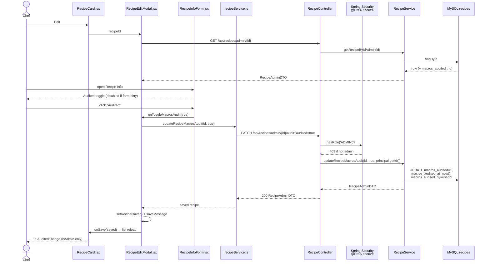

# Plan: Recipe macro audit sign-off (chef marks a recipe's macros/calories as verified)

Plan folder: `.claude/contract/2026-07-29-recipe-macros-audit/`
Execution status: see `tasks.md` in this folder.

---

## Part 1 — Alignment

*(This part replaces the former `proposal.md`.)*

### Subtask reference
Local subtask — no Jira ticket. Source: `/fb-plan` invocation, 2026-07-29:

> "I want to add an audit column to all the recipes. So when the chef validates the recipes macros and cals are good they can be marked as audited."

### Restated goal
Add a per-recipe audit sign-off to FoodBytes so the chef can record that a recipe's macros and calories have been checked against the `CLAUDE.md` targets. The recipe row gains three new columns — a `macros_audited` boolean, a `macros_audited_at` timestamp, and a `macros_audited_by` FK to `users` — surfaced through a dedicated admin-only endpoint (`PATCH /api/recipes/admin/{id}/audit?audited=…`) and a small admin UI: an instant-apply toggle in the Recipe Info form and an "Audited" badge on the recipe card. The flag is **sticky** — nothing in the app clears it automatically; only an explicit chef action flips it back. This mirrors the existing `ingredients.macros_verified` flag (FR-083) one level up: `macros_verified` says "this ingredient's per-100g data is trustworthy", `macros_audited` says "this recipe's totals have been signed off".

### In scope
- SQL migration `foodbytes-app/database/migrations/2026-07-29_recipe_macros_audit.sql` adding `macros_audited`, `macros_audited_at`, `macros_audited_by` to `recipes`, plus the index and FK, applied manually to Railway MySQL.
- `Recipe` entity fields for the three new columns.
- `PATCH /api/recipes/admin/{id}/audit?audited={true|false}` on `RecipeController`, `@PreAuthorize("hasRole('ADMIN')")`, user identity from `@AuthenticationPrincipal UserPrincipal`.
- `RecipeService.updateRecipeMacrosAudit(id, audited, auditedByUserId)` — sets/clears the flag, stamps/clears `macrosAuditedAt` and `macrosAuditedBy`.
- New recipes explicitly start unaudited (`createRecipe` sets `macrosAudited = false`, mirroring `setIsLive(false)`).
- `updateRecipe` / `updateRecipeIngredients` / `updateRecipeSteps` leave the audit fields untouched — the audit trio is response-only on `RecipeAdminDTO` and never read from an inbound payload.
- DTO exposure: `RecipeAdminDTO` gains `macrosAudited` / `macrosAuditedAt` / `macrosAuditedBy`; `RecipeDTO` gains `macrosAudited` so the admin recipe list can render the badge.
- Unit tests for the new service method (set, clear, and "a full recipe update does not disturb the flag").
- Frontend: `recipeService.updateRecipeMacrosAudit(id, audited)`, an instant-apply Audited/Not audited toggle in `RecipeInfoForm` (existing recipes only, admin-only surface), the wiring handler in `RecipeEditModal`, and an "Audited" badge on `RecipeCard` shown only when `isAdmin`.
- Touch-target/hover hygiene fix on the `.toggle-button` rule in `RecipeInfoForm.css` (the new audit toggle reuses it, and the current rule violates the ≥44px and `@media (hover: hover)` rules in the `react-frontend` skill).

### Explicitly out of scope
- **Automatic invalidation.** Editing ingredients, calories, or servings will *not* clear the flag (developer chose sticky semantics). No staleness detection, no "audit expired" warning.
- **Cascade invalidation through linked recipes.** Editing a sub-recipe (Pita Bread) does not touch the audit flag of parents that link it.
- **Blocking publish on audit.** Going Live keeps its existing FR-083 gate (all ingredients `macros_verified`); it does not additionally require `macros_audited`. No new validation coupling.
- **Automated macro validation.** This subtask records a *human* sign-off. It does not compute macros, compare them to the `CLAUDE.md` target table, or reject a recipe that fails them.
- **Filtering/sorting recipes by audit state**, an audit dashboard, or a bulk "mark all audited" action.
- **Rendering the auditor's name.** `macrosAuditedBy` is stored and returned as a user id; no join to `users` for a display name, and no name shown in the UI.
- **Backfill.** Every existing recipe starts at `macros_audited = 0`; no attempt to infer which recipes were already checked.
- `RecipeSummaryDTO` (the non-admin list path) — the badge is admin-only and the admin list uses `GET /api/recipes/admin`, which returns `RecipeDTO`.

### Pattern Reference (from subtask)
None supplied. Chosen references, all existing code in this repo:
- **Flag semantics + naming:** `ingredients.macros_verified` / `Ingredient.macrosVerified` (`model/Ingredient.java:40-41`), the FR-083 verification flag.
- **Endpoint + service shape:** the visibility toggle — `RecipeController.updateVisibility` (`controller/RecipeController.java:141-147`) and `RecipeService.updateRecipeVisibility` (`service/RecipeService.java:484-509`). Same `PATCH /admin/{id}/<verb>?<flag>=…` → `RecipeAdminDTO` shape.
- **Current-user injection:** `@AuthenticationPrincipal UserPrincipal userPrincipal` as used throughout `ShoppingListController` / `MealPlanController`.
- **Admin toggle UI:** the Visibility toggle group in `components/admin/RecipeInfoForm.jsx:200-226`.
- **Card badge:** `.cheat-badge` in `components/recipes/RecipeCard.jsx:86` + `RecipeCard.css:47-56`.
- **Migration file style:** `database/migrations/2026-05-18_password_auth.sql`.
- **Test style:** `src/test/java/com/foodbytes/service/ShoppingListServiceTest.java` (JUnit 5 + `MockitoExtension` + AssertJ).

### Constraints flagged on the subtask
- "All the recipes" — the column lands on every row via `NOT NULL DEFAULT 0`, so all 200-odd existing recipes become explicitly *unaudited* rather than NULL/unknown.
- The audit is about **macros and calories** specifically, not general recipe quality — hence `macros_audited` rather than a generic `is_audited`.
- Marking is a **chef/admin** action, not a user action.

### Assumptions made
- **Column names `macros_audited` / `macros_audited_at` / `macros_audited_by`.** Chosen over generic `is_audited` to match the existing `ingredients.macros_verified` vocabulary and to leave room for other audit dimensions later. Entity fields are `macrosAudited` / `macrosAuditedAt` / `macrosAuditedBy`.
- **`macros_audited_by` is a plain `Long` column on the entity, not a `@ManyToOne User` association.** `Recipe` is loaded in list views (`getAllRecipesAdmin` maps every recipe); adding another lazy association risks an N+1 on a hot path for a field the UI never renders.
- **Endpoint is `PATCH /api/recipes/admin/{id}/audit` with a `boolean audited` query param**, mirroring `/visibility?isLive=`. A request body would be more RESTful but would break symmetry with its sibling endpoint.
- **`@PreAuthorize("hasRole('ADMIN')")` on the new endpoint**, which is *stricter* than its siblings — `/visibility`, `PUT /admin/{id}`, and `DELETE /admin/{id}` currently fall through to `.anyRequest().authenticated()` in `SecurityConfig`, so any logged-in user can call them. `@EnableMethodSecurity` is active (`config/SecurityConfig.java:30`), so the annotation takes effect. The chef account is `is_admin = 1`, so this is not a functional restriction for the intended user. Existing endpoints are left as they are — tightening them is not this subtask's job.
- **Audit fields are response-only on `RecipeAdminDTO`.** `RecipeInfoForm` saves via `updateRecipe` with a spread of the whole loaded DTO (`RecipeEditModal.jsx:115`), so if the service read `dto.getMacrosAudited()` a stale client payload could silently flip the flag. The service writes them out and never reads them in.
- **`RecipeDTO` (not `RecipeSummaryDTO`) carries `macrosAudited`**, because the admin list path is `getAllRecipesAdmin` → `convertToAdminDTO` → `convertToDTO`. Side effect: the flag is also visible on the public `GET /api/recipes` response. Accepted — it's a non-sensitive boolean, and the UI gates rendering on `isAdmin`.
- **Clearing the flag nulls the timestamp and the auditor.** `audited=false` resets all three fields rather than keeping a "last audited" trace, so the columns never describe a sign-off that is no longer in force.
- **The audit toggle is instant-apply, not part of the Recipe Info save payload**, and is disabled while the form has unsaved edits (with help text). Putting it in the same Save button would mean signing off macros you haven't persisted.
- **New recipes start unaudited and `createRecipe` sets this explicitly**, even though the DB default already covers it — mirrors the existing explicit `recipe.setIsLive(false)` on the same method.
- **No frontend test step.** `client/package.json` has no test runner wired (confirmed in `CLAUDE.md`); frontend verification is a manual dev-server smoke test.

### Cross-code alignment audit (FE ↔ BE ↔ DB)
Run against the live Railway MySQL (`hopper.proxy.rlwy.net:35402`) via the `mysql` MCP server. Read-only `SHOW COLUMNS` / `information_schema` queries only — no row data was read, no writes issued, no user records touched.

- **`recipes` table exists** with 8 columns: `id`, `name`, `default_servings`, `calories`, `is_cheat`, `is_live`, `created_at`, `updated_at`. None of `macros_audited*` exists yet — the migration is genuinely additive.
- **No stale/unapplied migration for this feature.** `database/migrations/` contains 8 files, latest `2026-05-18_password_auth.sql`; none references an audit column. Nothing to reconcile before adding the new file.
- **FK type compatibility confirmed:** `users.id` is `bigint`, so `macros_audited_by BIGINT NULL` + `FOREIGN KEY … REFERENCES users(id)` is type-compatible. `users.meal_plan_owner_id` is `bigint` and already models the same nullable-self-reference shape.
- **`recipes.is_live` is `tinyint(1) NULL DEFAULT 1` with an index (`Key: MUL`).** The new flag deliberately differs: `NOT NULL DEFAULT 0`, so "not audited" is never ambiguous. Its index matches the precedent of indexing the filterable boolean.
- **Representative data exists** — the live `recipes` table is the production table the chef works in daily, so a post-migration smoke test against a real recipe id is meaningful. No dev seed step needed.
- **Name chain aligns end-to-end:** DB `macros_audited` ↔ entity `@Column(name = "macros_audited") Boolean macrosAudited` ↔ `RecipeAdminDTO.macrosAudited` / `RecipeDTO.macrosAudited` ↔ JSON `macrosAudited` ↔ FE `recipe.macrosAudited`. Same pattern for `macros_audited_at` → `macrosAuditedAt` and `macros_audited_by` → `macrosAuditedBy`.
- **Doc drift found (not fixed here):** `CLAUDE.md` and the `java-backend` skill both point at `foodbytes-app/database/schema.sql` as the canonical schema; that file does not exist in the repo (lost in an earlier wipe — the live DB plus `database/migrations/` is the real source of truth). This plan therefore does **not** include a "update schema.sql" step. Flagged for `/fb-issue` or `/fb-archive` rather than silently patched inside this subtask.

---

## Part 2 — Technical design

*(This part replaces the former `design.md`.)*

### Approach

The change is a thin vertical slice over the existing recipe-admin machinery. `recipes` gains three columns (`macros_audited`, `macros_audited_at`, `macros_audited_by`); the `Recipe` entity gains three matching fields; and one new endpoint — `PATCH /api/recipes/admin/{id}/audit?audited={bool}` — is the *only* writer. That endpoint is a deliberate clone of the existing visibility toggle (`RecipeController.updateVisibility` → `RecipeService.updateRecipeVisibility`), so the admin surface stays internally consistent: same path shape, same query-param flag, same `RecipeAdminDTO` response. The service method stamps `macrosAuditedAt = now()` and `macrosAuditedBy = <principal id>` when setting the flag, and nulls both when clearing it, so the stored trio never describes a sign-off that is no longer in force.

The key structural decision is that the audit trio is **write-once-through-one-door**. Two alternatives were considered and rejected. (a) *Fold `macrosAudited` into the existing `PUT /api/recipes/admin/{id}` payload* — rejected because `RecipeInfoForm` saves via `{...recipe, ...updatedData}` (`RecipeEditModal.jsx:115`), spreading the whole previously-loaded DTO; a stale client object would then be able to flip the audit flag as a side effect of renaming a recipe. (b) *A separate `recipe_audits` history table* — rejected as over-built for a single-chef app that asked for a column, and it would need its own repository, entity, and join on every admin list render. So the trio lives on `recipes`, is emitted on `RecipeAdminDTO` for the edit modal and on `RecipeDTO` for the admin list badge, and is never read back off an inbound DTO. `updateRecipe`, `updateRecipeIngredients`, and `updateRecipeSteps` are left structurally untouched — a comment in `updateRecipe` records that the omission is intentional, because the natural instinct of the next editor is to "complete" the field mapping and that would silently break the invariant.

Per the developer's decision, the flag is **sticky**: nothing in the application clears it. An edit to a recipe's ingredients can leave a sign-off in place that no longer reflects the numbers. That is an accepted trade (it keeps the model trivial and the chef in full control), and it is the single biggest thing to revisit if the audit state ever starts being trusted programmatically — see Risks. Consequently there is no invalidation logic anywhere in the plan, and the only behavioural invariant worth testing is the negative one: a full recipe update must not disturb the flag.

Front to back, the flow is: chef opens a recipe → `RecipeEditModal` loads `RecipeAdminDTO` (now carrying the trio) → opens **Recipe Info** → `RecipeInfoForm` renders an Audited/Not-audited toggle group next to the existing Visibility group, disabled while the form is dirty → clicking calls back up to `RecipeEditModal.handleToggleMacrosAudit`, which hits `recipeService.updateRecipeMacrosAudit`, replaces the modal's `recipe` state with the response, shows the existing `saveMessage` banner, and calls `onSave` so `RecipeList` reloads. On the list, `RecipeCard` renders a green "✓ Audited" badge beside the existing Cheat badge, gated on `isAdmin` so regular users and guests never see audit state. The service call is placed in the modal (which owns `recipe` state and the save banner) rather than in the form, matching how every other save in this modal already works.

### Skills to invoke during execution
- `java-backend` — governs the migration + entity pairing (`ddl-auto: validate` means an unapplied migration breaks startup), the thin-controller/service split, DTO-not-entity-over-the-wire, `@PreAuthorize` on the mutating admin endpoint, `@AuthenticationPrincipal UserPrincipal` for identity, and `mvn test` for the new service test.
- `react-frontend` — governs the `services/recipeService.js` call going through the shared Axios instance, the admin-only conditional render on `isAdmin`, plain per-component CSS (no `*.module.css`), and the ≥44px touch-target / `@media (hover: hover)` rules that the reused `.toggle-button` currently violates.

Developer override: `chef` and `requirements` were offered by the classifier and **unticked**. `chef` is unnecessary because this subtask records a human sign-off rather than computing or judging macros; `requirements` is unnecessary because `plan.md` itself already serves as the spec.

### Diagram



### Data shapes

#### DDL — `foodbytes-app/database/migrations/2026-07-29_recipe_macros_audit.sql`

```sql
-- 2026-07-29 — Chef sign-off that a recipe's macros/calories have been validated.
-- Sibling of ingredients.macros_verified (FR-083), one level up: this asserts the
-- recipe's totals were checked, not that a single ingredient's per-100g data is good.
-- Sticky by design: no application code clears these columns automatically.
ALTER TABLE recipes
    ADD COLUMN macros_audited    TINYINT(1) NOT NULL DEFAULT 0 AFTER is_live,
    ADD COLUMN macros_audited_at TIMESTAMP  NULL DEFAULT NULL   AFTER macros_audited,
    ADD COLUMN macros_audited_by BIGINT     NULL DEFAULT NULL   AFTER macros_audited_at;

ALTER TABLE recipes
    ADD INDEX idx_recipes_macros_audited (macros_audited),
    ADD CONSTRAINT fk_recipes_macros_audited_by
        FOREIGN KEY (macros_audited_by) REFERENCES users(id) ON DELETE SET NULL;
```

Nullability rationale: the flag is `NOT NULL DEFAULT 0` so "not audited" is unambiguous across all existing rows (`is_live` is nullable — deliberately not copied). The timestamp and auditor are `NULL` when unaudited. `ON DELETE SET NULL` keeps a recipe alive if the auditing user row is ever removed.

#### Entity — `Recipe.java` (added after `isLive`)

```java
@Column(name = "macros_audited", nullable = false)
private Boolean macrosAudited = false;

@Column(name = "macros_audited_at")
private LocalDateTime macrosAuditedAt;

/** users.id of the admin who signed off. Plain FK column, not a @ManyToOne:
 *  Recipe is mapped in list views and an extra lazy association risks an N+1. */
@Column(name = "macros_audited_by")
private Long macrosAuditedBy;
```

#### DTOs

```java
// RecipeAdminDTO — response-only. RecipeService NEVER reads these off an inbound DTO;
// PATCH /api/recipes/admin/{id}/audit is the only writer.
private Boolean macrosAudited = false;
private LocalDateTime macrosAuditedAt;   // null when not audited
private Long macrosAuditedBy;            // users.id, null when not audited

// RecipeDTO — feeds the admin list badge (GET /api/recipes/admin → convertToAdminDTO → convertToDTO)
private Boolean macrosAudited;
```

`RecipeSummaryDTO` is unchanged — the non-admin list path does not render audit state.

#### Service signature

```java
@Transactional
public RecipeAdminDTO updateRecipeMacrosAudit(Long id, boolean audited, Long auditedByUserId);
```

#### HTTP contract

```
PATCH /api/recipes/admin/{id}/audit?audited=true
  auth: JWT cookie, ROLE_ADMIN required
  200 → RecipeAdminDTO { …, macrosAudited: true,
                         macrosAuditedAt: "2026-07-29T14:03:11",
                         macrosAuditedBy: 1 }
  403 → non-admin caller
  500 → unknown recipe id ("Recipe not found with id: …", matching the
        existing RuntimeException behaviour of every sibling admin method)
```

#### Frontend service

```js
// services/recipeService.js
async updateRecipeMacrosAudit(id, audited) {
  const response = await api.patch(`/recipes/admin/${id}/audit?audited=${audited}`)
  return response.data   // RecipeAdminDTO
}
```

### Runtime quality notes

- **Resource cleanup:** No new files, sockets, streams, or timers. The single DB write runs inside the `@Transactional` boundary on `updateRecipeMacrosAudit`, so the connection and transaction are managed by Spring exactly as in `updateRecipeVisibility`. No `setTimeout` is added on the frontend — the existing `saveMessage` timeout in `RecipeEditModal` is reused unchanged, so no new timer to clear on unmount.
- **Concurrency / thread-safety:** No shared mutable state is introduced; `RecipeService` stays stateless and the new fields live on per-request entity instances. Two admins toggling the same recipe concurrently is a last-write-wins on three independent columns — acceptable and self-consistent (the flag, timestamp, and auditor are always written together in one statement). No optimistic-locking `@Version` is added: with a single chef, a `409` on a sign-off click would be worse UX than last-write-wins. Nothing here allocates enough to influence GC pauses.
- **Allocation behaviour:** Three scalar fields per `Recipe` (`Boolean`, `LocalDateTime`, `Long`) — no collections, no eager association. `convertToDTO` runs once per recipe on the admin list; the added line is one boolean copy with no extra query, which is precisely why `macrosAuditedBy` is a `Long` column rather than a `@ManyToOne User` (which would issue one lazy `SELECT users` per card, or force a join). The index on `macros_audited` costs one small secondary index on a ~200-row table. No leak surface: no cache, no static registry, no listener registration.
- **Error paths:** Unknown recipe id → the same `RuntimeException("Recipe not found with id: …")` every sibling admin method throws, handled by the existing `GlobalExceptionHandler` (no new exception type, no behavioural divergence). Non-admin caller → Spring Security returns `403` before the service is reached. On the frontend the call is wrapped in the modal's existing try/catch, which already unpacks `err.response.data.errors` / `.message` and renders the red `saveMessage` banner; on failure the modal's `recipe` state is left untouched so the toggle visibly stays where it was rather than lying about success. Nothing is swallowed silently; `console.error` is emitted on the catch path exactly as the neighbouring handlers do.

### Risks and judgement calls

- **Sticky flag can go stale silently.** The developer explicitly chose sticky over auto-clear. The consequence: `macros_audited = 1` on a recipe whose ingredients were edited afterwards is *wrong but indistinguishable* from a fresh sign-off. `macros_audited_at` vs `recipes.updated_at` is the escape hatch — if audit state ever gates something (e.g. going Live), add `updated_at > macros_audited_at ⇒ stale` at that point rather than trusting the boolean alone.
- **`@PreAuthorize("hasRole('ADMIN')")` is stricter than its siblings.** `/visibility`, `PUT /admin/{id}`, and `DELETE /admin/{id}` are currently reachable by *any* authenticated user (`SecurityConfig.java:59` — `.anyRequest().authenticated()`). The new endpoint is locked to admins. Correct for a chef action, but it means the recipe-admin surface is inconsistently protected until the pre-existing gap is closed separately. Sanity-check: is the intended chef account `users.is_admin = 1`? If not, the toggle will 403.
- **Column naming (`macros_audited` vs `is_audited`).** Chosen for symmetry with `ingredients.macros_verified`, at the cost of being narrower than the word "audit" in the subtask. If the intent is eventually "this recipe has been reviewed overall" (steps, photos, sourcing — not just numbers), the name will read as too specific and renaming later costs a migration.
- **Two similar-but-different flags now sit near each other.** `ingredients.macros_verified` (per-ingredient data quality) and `recipes.macros_audited` (per-recipe sign-off) are easy to confuse in future queries. Mitigated by the comment header in the migration and the entity javadoc; not mitigated in the UI, where both could plausibly be labelled "verified".
- **`macrosAudited` leaks onto the public `GET /api/recipes` response** because it is added to `RecipeDTO`, which serves both admin and public paths. Judged harmless (non-sensitive boolean, UI gates on `isAdmin`). The alternative — a separate admin-only DTO — is more code than the leak is worth given `convertToAdminDTO` already just delegates to `convertToDTO`.
- **Instant-apply toggle diverges from the rest of the form.** Every other control in `RecipeInfoForm` is staged until Save; the audit toggle applies immediately. This is intentional (signing off unsaved numbers is meaningless) and is signalled by disabling the toggle while the form is dirty, but it is a UX inconsistency worth a look before approval.
- **Touching `.toggle-button` CSS affects the existing Visibility toggle too.** The 44px min-height and `@media (hover: hover)` fix is required by the `react-frontend` skill for the control I'm adding, and the rule is shared. Visibility buttons will get visibly taller. Called out so it isn't a surprise in review.
- **`schema.sql` referenced by `CLAUDE.md` does not exist.** No step in this plan updates it; the migration file plus the live Railway DB are the source of truth. Recorded in Part 1 → Cross-code alignment audit — a docs fix for `/fb-issue`, not scope creep here.
- **Migration must be applied to Railway manually before the backend redeploys.** Hibernate runs `ddl-auto: validate`; the entity change without the applied migration is a hard startup failure. This is an ordering hazard, not a code risk — the tasks put the apply step before any redeploy and before the backend smoke test.
