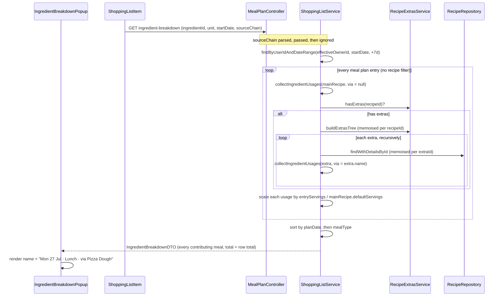

# Plan: Shopping-list ingredient breakdown must list every dish that uses the ingredient

Plan folder: `.claude/contract/2026-07-29-shopping-list-breakdown-all-dishes/`
Execution status: see `tasks.md` in this folder.

---

## Part 1 — Alignment

*(The shared understanding of what this subtask is doing. Restate it in your own words — this is how the developer confirms Claude read the subtask correctly before any design happens. Mismatch here = stop and fix.)*

### Subtask reference

No Jira subtask. Primed verbatim by the developer in this session, with a mobile screenshot of the shopping list:

> "when you click on ingredients in the shopping list it doesn't show if there are more than multiple dishes what they all are (just one). use mcp into database and trace code paths"

The screenshot shows the FR-042 breakdown popup for **Olive oil — 6 tsp**, listing three visually identical rows: `🥪 Chicken Burrito Bowl — 2 tsp` three times.

A diagnostic pass ran earlier in this session (code trace + live Railway MySQL queries via the `mysql` MCP). A prototype fix was written and then reverted at the developer's request, so the working tree is back to original. This plan re-lands that work deliberately, with the developer's confirmed choices baked in. No `spec.md` — this plan folder had no `/brainstorming` upstream.

### Restated goal

When the developer long-presses an ingredient row in the shopping list, the popup must list **every planned meal that contributes to that row** — not just the meals belonging to one recipe — and each row must be distinguishable from the others so that the same dish planned on three different days doesn't read as a rendering bug. Today the endpoint filters meal-plan entries down to the single recipe named in the row's `sourceChain`, so a row aggregated from seven dishes shows one; and because the popup renders only emoji + recipe name + quantity, repeats of one dish look like duplicated rows. The popup's own total is recomputed inside the same filtered loop, so it silently disagrees with the shopping-list row the developer tapped.

### In scope

- `ShoppingListService.getIngredientBreakdown` scans **every** meal-plan entry in the 7-day window instead of filtering to `sourceChain`'s main recipe.
- The same method searches each entry's **main recipe plus its extras tree, recursively**, so ingredients sourced from a linked sub-recipe (Pizza Dough, Pita Bread) are found and attributed.
- The popup total (`IngredientBreakdownDTO.totalQuantity`) consequently matches the shopping-list row's quantity for the default all-homemade case.
- `MealIngredientUsageDTO` gains `viaRecipeName` so a hit inside an extra can be attributed to that extra.
- `IngredientBreakdownPopup.jsx` renders a second line per row — plan date, meal type, and `via <extra>` when present — so repeats of one dish are distinguishable.
- First backend test: `src/test/java/com/foodbytes/service/ShoppingListServiceTest.java` covering the multi-recipe case, the extras case, and the ordering/total invariants.
- Per-request memoisation of the extras tree and loaded extra recipes, so scanning all entries does not multiply repository round-trips.

### Explicitly out of scope

- **Reworking aggregation provenance.** `processRecipeIngredients` keeps storing only the first contributing recipe's `sourceChain` on `IngredientAggregate`. That is the upstream cause of the lost provenance, but once the breakdown stops trusting the chain it no longer matters for this bug. Changing `sourceChain` to `List<List<Long>>` is a larger change to the aggregation path — deliberately deferred (developer-confirmed).
- **Removing `sourceChain` from the API.** The query parameter stays on `GET /api/meal-plan/shopping-list/ingredient-breakdown` and `shoppingService.js` keeps sending it. It becomes an accepted-and-ignored parameter, documented as such. Deleting it end-to-end would change the public API shape and couple the FE and BE deploys.
- **Homemade / store-bought selections on the breakdown endpoint.** It is a GET with no `HomemadeSelectionsDTO` body, so extras are treated as homemade — the same default aggregation uses when no selections are supplied. Threading selections through would mean a new request shape.
- **The popup's silent failure path.** `ShoppingListItem.startLongPress` catches a failed fetch into `console.error` and shows the user nothing. Pre-existing; not this fix.
- **Meal-type string-literal debt.** The `react-frontend` skill lists `IngredientBreakdownPopup` among 8 files carrying ~31 un-extracted meal-type literals, with no `src/constants/` folder yet. This change is designed to add **zero** new literals (see Assumptions) but does not create the shared constant map.
- **The long-press interaction itself.** The popup opens on a 1000 ms hold, not a click, despite the developer's wording. Unchanged.
- **The persisted shopping list** (`shopping_lists` / `shopping_list_items`, `/api/shopping-list/*`). This bug is entirely in the derived meal-plan aggregation path.

### Pattern Reference (from subtask)

**None supplied.** References chosen for this plan, and authoritative for it:

- `ShoppingListService.processRecipeIngredients` and `processExtras` (same file, `foodbytes-api/src/main/java/com/foodbytes/service/ShoppingListService.java`) — the traversal the breakdown must mirror, including the rule that extras scale off the **main** recipe's `defaultServings`.
- `RecipeExtrasService.buildExtrasTree(recipeId, visited)` — the sanctioned recursive extras walk, which already carries cycle detection.
- `RecipeRepository.findWithDetailsById` — the `@EntityGraph` variant that fetches `ingredients`, `ingredients.ingredient`, `ingredients.ingredient.aisle`, `ingredients.unit` in one hit.
- `.claude/skills/java-backend/SKILL.md` and `.claude/skills/react-frontend/SKILL.md` for layer placement, test location, and the frontend hard floor.

### Constraints flagged on the subtask

- **Fix strategy is fixed by the developer:** ignore `sourceChain` inside the breakdown; do not rework aggregation and do not remove the parameter.
- **Tests:** scaffold `src/test/` — it does not exist in `foodbytes-api` today, though `spring-boot-starter-test` is already declared in `pom.xml:93-97`.
- **Skills:** `java-backend` + `react-frontend` only; `requirements` was offered and declined.
- **DB access:** the developer asked for minimal reads ("Read only as much as you need"). The audit below used recipe/ingredient tables plus aggregate meal-plan counts; no email or other `users` column was selected.
- **No local toolchain.** This machine has no `mvn`, no JDK, no `docker`, and no `git` on PATH or in the usual install locations. `npm`/`node` are present and `npm run build` works. Every backend verification step in `tasks.md` is therefore written to be run by whoever has a toolchain — locally after installing one, or on the Railway build — and must not be reported as passing until it actually runs.
- **No schema change**, so no migration under `foodbytes-app/database/migrations/` and no Railway DDL apply. Hibernate stays happy in `validate` mode.

### Assumptions made

- **Ignore `sourceChain` rather than fix aggregation provenance** — *confirmed by the developer.* Smallest change that makes the popup correct.
- **Scaffold the first backend test** — *confirmed by the developer.* `spring-boot-starter-test` is already present, so this needs no `pom.xml` edit.
- **Skills limited to `java-backend` + `react-frontend`** — *confirmed by the developer.* The `/fb-plan` catalogue names `eida-*` plugin skills (`eida-java-development:java-rest-develop`, `eida-development:junit`, …) that do not exist in this repository; these are the local equivalents. Consequence: JUnit/Mockito house patterns come from `java-backend`'s success criteria and Spring Boot defaults, not from a dedicated test skill.
- **Extras are homemade in the breakdown.** Matches aggregation's null-selections default. Where the developer has toggled a component to store-bought, the breakdown may list an extra's ingredient that the row's total excludes — documented in the javadoc rather than fixed, because the GET carries no selections.
- **Attribute each hit to the main recipe, with the extra named separately.** `recipeName` stays the planned dish (what the developer recognises on the meal plan); `viaRecipeName` carries the sub-recipe. Replacing `recipeName` with the extra's name would make rows unrecognisable against the meal plan.
- **Meal label is derived, not mapped** — `mealType.charAt(0).toUpperCase() + slice(1)` rather than a new `{breakfast: 'Breakfast', …}` object. Keeps the promise in Out of scope of adding zero new meal-type literals to a file already on the debt list.
- **Date formatted `en-GB` as `Mon 27 Jul`**, parsed component-wise from the ISO `planDate` string rather than `new Date(planDate)`. A bare `Date` parse treats `2026-07-27` as UTC midnight and renders the prior day for anyone behind UTC — the same class of off-by-one the earlier MCP output showed (`plan_date` came back as `2026-07-26T23:00:00Z` for 27 July, Irish summer time).
- **A row appearing in both the main recipe and one of its extras counts twice**, because aggregation counts both. Consistency with the row total wins over de-duplication.
- **Unit matching stays a case-insensitive compare on `Unit.getValue()`**, as today, even though aggregation keys on `unitId`. Changing the match to `unitId` would be correct-er but the popup only receives the unit string from `ShoppingItemDTO`.
- **Ordering stays date-then-`mealType`** (the existing comparator). `mealType` sorts alphabetically — breakfast, dinner, lunch, snacks — which is not chronological within a day. Pre-existing; left alone so this change stays reviewable, and called out under Risks.

### Cross-code alignment audit (FE ↔ BE ↔ DB)

Performed against the live Railway MySQL over the `mysql` MCP earlier in this session.

- **`meal_plan_entries` exists** with `id, user_id, plan_date (date), meal_id, recipe_id, servings, created_at, updated_at`. No `meal` column — the meal type comes through the `meals` join, matching `MealPlanEntry.getMeal().getKey()`.
- **`meals` exists** with `id, key (varchar 50, UNIQUE), name, display_order`. `key` is a reserved word and must be backticked in raw SQL; the entity reaches it via `getKey()`, so no Java change is needed. `display_order` exists and is the column a future chronological sort would use.
- **`recipe_ingredients` / `ingredients` / `units` / `recipes`** all resolve for the breakdown join, and `recipes.default_servings` exists (entity default `2`, `Recipe.java:27-28`).
- **Name alignment holds along the chain** for the fields this change touches: `meals.key` → `MealPlanEntry.meal.key` → `MealIngredientUsageDTO.mealType` → popup `meal.mealType`; `meal_plan_entries.plan_date` → `planDate` → `meal.planDate`. The new `viaRecipeName` is DTO-only — no DB column, no filter/sort registry key.
- **Representative data exists for a meaningful smoke test.** For `user_id = 1` over 27 Jul – 2 Aug 2026, ingredients feeding one shopping-list row from multiple dishes include: `Chicken breast (g)` — **1810 g from 7 dishes** (Chicken & Vegetable Soup, Drunken Noodles, Hash Browns & Diced Chicken, Irish Chicken Curry, Pad Thai, Pink Sauce Pasta, Pizza); `Garlic (clove)` — 16.5 from 6 dishes; `Olive oil (tbsp)` — 3.5 from 4 dishes. Each of those currently renders a single dish. No seed step needed.
- **The screenshot's specific row is a true negative, and that matters for the acceptance check.** `Olive oil` in **tsp** is used by only two recipes in the whole DB — `Chicken Burrito Bowl` (2 tsp, id 57) and `High-Protein Tuscan Chicken with Rice` (2.5 tsp, id 191) — and `user_id = 1` has no Tuscan Chicken entries, so its three `Chicken Burrito Bowl` rows were genuinely all of it. The under-reporting shows on `Olive oil` in **tbsp** and on `Chicken breast`, not on the exact row photographed. Verify against those rows, not the screenshot's.
- **No duplicate `(user_id, plan_date, meal_id, recipe_id)` rows exist** from 1 Jul onward, so the three identical popup lines were three distinct planned dates — a display gap, not duplicated data. This is what the second line per row fixes.

---

## Part 2 — Technical design

### Approach

The defect is one `continue` statement. `ShoppingListService.java:253-256` reads `if (mainRecipeId != null && !recipe.getId().equals(mainRecipeId)) continue;`, which turns the row's FR-102 provenance hint into a hard filter over the meal-plan entries. That hint is unreliable by construction: `processRecipeIngredients` aggregates on `(ingredientId, unitId)` and, in its `compute` block, only stores `sourceChain` on the **first** contributing recipe — later contributors add quantity through `existing.totalQuantity.add(...)` and their chain is discarded. So the breakdown filters a multi-recipe row down to whichever recipe the aggregation happened to visit first. The fix inverts the relationship: the breakdown stops asking "which recipe does this row belong to" and instead re-walks the same ground aggregation walked, counting every hit.

Concretely, `getIngredientBreakdown` keeps its outer loop over the 7-day entries and drops the filter. For each entry it collects usages from two sources: the main recipe's own `recipe_ingredients`, then — when `recipeExtrasService.hasExtras(recipeId)` — a recursive walk of `buildExtrasTree`, loading each extra with `findWithDetailsById` and matching the same `(ingredientId, unit)` predicate. Both paths funnel into a small private `IngredientUsage` carrier (ingredient name, raw quantity, originating extra name or null), and the caller scales each usage by `entryServings / mainRecipe.defaultServings`. That divisor is the subtle part: `processExtras` passes the **parent's** `defaultServings` down unchanged through every nesting level, so the breakdown must do the same or the totals will diverge from the row for any recipe whose extras have a different default. Cycle safety comes free — `buildExtrasTree` already tracks a `visited` set.

Two alternatives were considered and rejected. **Carrying every contributor's chain in aggregation** (`List<List<Long>>` on `IngredientAggregate`, breakdown iterates them) preserves provenance properly and would let the breakdown skip the extras walk entirely — but it changes the hot aggregation path that builds the whole shopping list, for information the breakdown no longer needs once it scans all entries; the developer explicitly chose the smaller fix. **Grouping client-side** from data already in `ShoppingItemDTO` is impossible: the row carries a single quantity and one chain, not per-meal detail. Also rejected: deleting `sourceChain` end-to-end, which would break any client sending it mid-deploy for zero behavioural gain — it is instead documented as accepted-and-ignored, keeping `MealPlanController:239-264` and `shoppingService.js:111-120` untouched.

Because the loop now visits every entry rather than one recipe's worth, naive repository access would multiply: `hasExtras` plus a tree build plus a `findById` per extra, per entry, on every long-press — roughly 21 entries × (1 + n) queries for a full week. Two request-scoped `HashMap`s fix that, memoising the extras tree by `recipeId` and the loaded extra `Recipe` by id, so each distinct recipe and each distinct extra is fetched at most once per call. Loading extras via `findWithDetailsById` rather than `findById` pulls `ingredients` + `ingredient` + `aisle` + `unit` in one `@EntityGraph` hit instead of letting `@BatchSize(20)` lazy-load them mid-loop. On the frontend the change is presentational and additive: the row gains a `.meal-details` column wrapping the existing `.meal-name` plus a new `.meal-context` line, and the popup grows two pure formatting helpers. No context, service, or state change — the fetch in `ShoppingListItem.startLongPress` already passes the whole DTO through untouched.

### Skills to invoke during execution

- `java-backend` — governs the `ShoppingListService` / `MealIngredientUsageDTO` edits: layer placement (`service/`, `dto/`), `@Transactional(readOnly = true)` for a read touching lazy associations, controllers stay untouched and thin, tests land under `src/test/java/com/foodbytes/`, and the reminder that no schema change means no migration to apply on Railway.
- `react-frontend` — governs `IngredientBreakdownPopup.jsx` / `.css`: read the neighbour first, file order (imports → constants → component → helpers → export), plain per-component CSS with no `*.module.css`, mobile-first, no new `console.log`, no new runtime dependency (hence hand-rolled date formatting — there is no `date-fns`), and the standing 400-line component budget.

Developer override: `requirements` was offered and declined, so no separate spec document is produced — Part 1 of this file is the alignment artefact. The `/fb-plan` catalogue's `eida-*` skills (including its cross-cutting `junit` / `mockito` / `test-patterns` entries) do not exist in this repository; `java-backend` carries the test conventions instead.

### Diagram



### Data shapes

No schema or contract-breaking changes: no DDL, no new column, no migration, no change to any endpoint path, verb, or query parameter. One additive response field and one private carrier class.

#### `MealIngredientUsageDTO` (modified — `dto/MealIngredientUsageDTO.java`)

Lombok `@Data @NoArgsConstructor @AllArgsConstructor`; the all-args constructor goes from 5 to 6 parameters, and `ShoppingListService` is its only caller.

| Field | Type | Nullable | Note |
|---|---|---|---|
| `recipeName` | `String` | no | Planned dish name — unchanged semantics |
| `mealType` | `String` | no | `meals.key` — `breakfast` / `lunch` / `dinner` / `snacks` |
| `planDate` | `LocalDate` | no | Serialises as `YYYY-MM-DD` |
| `quantity` | `BigDecimal` | no | Scaled, `setScale(2, HALF_UP)` |
| `servings` | `Integer` | no | Entry servings |
| `viaRecipeName` | `String` | **yes** | **New.** Extra the hit came from; `null` when the main recipe owns it |

#### `ShoppingListService.IngredientUsage` (new — private static inner class)

`final String ingredientName`, `final BigDecimal quantity` (raw, pre-scaling), `final String viaRecipeName`. Never serialised; exists only to carry one match out of the collector helpers.

#### New private methods on `ShoppingListService`

```java
private void collectIngredientUsages(Recipe recipe, Long ingredientId, String unit,
                                     String viaRecipeName, List<IngredientUsage> usages)

private void collectUsagesFromExtras(List<RecipeExtraNodeDTO> extras, Long ingredientId,
                                     String unit, List<IngredientUsage> usages,
                                     Map<Long, Recipe> recipeCache)
```

#### HTTP response (unchanged shape, one added key per row)

```json
{
  "ingredientId": 12,
  "ingredientName": "Olive oil",
  "unit": "tbsp",
  "totalQuantity": 3.50,
  "mealBreakdown": [
    { "recipeName": "Irish Chicken Curry", "mealType": "dinner", "planDate": "2026-07-28",
      "quantity": 1.00, "servings": 2, "viaRecipeName": null },
    { "recipeName": "Pizza", "mealType": "dinner", "planDate": "2026-07-30",
      "quantity": 0.50, "servings": 2, "viaRecipeName": "Pizza Dough" }
  ]
}
```

### Runtime quality notes

- **Resource cleanup:** No files, sockets, streams, or timers are opened. The method stays `@Transactional(readOnly = true)`, so the single JPA connection and its lazy-load context are owned and released by Spring's transaction boundary — the two new helpers run inside it and open nothing of their own. The frontend adds no listener, no interval, and no `AbortController`; `ShoppingListItem` already clears its long-press `setTimeout` in `cancelLongPress`.
- **Concurrency / thread-safety:** `ShoppingListService` is a stateless singleton and stays one — every mutable value the new code touches (`usages`, `totalQuantity`, `ingredientName`, both memo `HashMap`s) is a method-local allocated per request, so two concurrent long-presses share nothing. Non-thread-safe `HashMap` is correct precisely because it never escapes the call. `BigDecimal` accumulation is immutable-by-reassignment, so no shared accumulator. `RecipeExtrasService.buildExtrasTree` takes a caller-supplied `visited` set, so passing a fresh `new HashSet<>()` per recipe keeps recursion state request-local too. No locks, no async ordering, nothing long-lived enough to risk GC suspension.
- **Allocation behaviour:** Bounded by the week's entry count (≤ ~28 for 4 meals × 7 days) times matched rows per recipe, which is normally 0 or 1 — a few dozen small objects per call, all short-lived and collected in young gen. The real risk was query multiplication, not heap: the memo maps hold at most one `Recipe` per distinct extra and one tree per distinct recipe for the duration of one call, turning O(entries × extras) round-trips into O(distinct recipes + distinct extras). `findWithDetailsById` fetches each extra's ingredient graph in one query instead of relying on `@BatchSize(20)` lazy loads inside a loop. Nothing is streamed or buffered; no pooling needed.
- **Error paths:** A `findWithDetailsById` miss on an extra resolves to `null` and that extra is skipped rather than throwing — a deleted sub-recipe degrades to a slightly low total, not a 500 on a long-press. `recipeIngredient.isLinkedRecipe()` rows are skipped before any `getIngredient()` dereference, and the `ingredient != null` guard is retained, so an FR-103 dual-path row can't NPE. An ingredient matched nowhere returns the existing `"Unknown Ingredient"` sentinel with a zero total rather than an error. Unhandled exceptions still surface through `GlobalExceptionHandler`. On the client, the existing `catch` in `ShoppingListItem.startLongPress` keeps logging via `console.error` and showing nothing — knowingly untouched (see Out of scope), and the new formatters are null-guarded (`if (!planDate) return ''`) so a missing field renders a shorter line instead of throwing inside `map`.

### Risks and judgement calls

- **The acceptance check must not use the screenshot's row.** `Olive oil (tsp)` genuinely comes only from `Chicken Burrito Bowl` for `user_id = 1`, so that popup will still show three Burrito rows after the fix — correctly. Validate on `Chicken breast (g)` (7 dishes) or `Olive oil (tbsp)` (4 dishes) instead. If the developer expected the photographed row to change dish list, that expectation is wrong and worth settling before execution.
- **Totals will visibly change on multi-dish rows.** The popup header currently under-reports (it sums only the filtered subset). After this, the header matches the list row — e.g. Chicken breast jumps from one dish's grams to 1810 g. That is the fix working, but it will look like a quantity change.
- **Store-bought divergence becomes visible.** Assuming homemade means a component toggled to store-bought can contribute a breakdown row that the row's total excludes. Documented in the javadoc, not fixed. If that bothers the developer, the honest fix is a POST that carries `HomemadeSelectionsDTO` — a bigger change than this subtask.
- **`mealType` ordering is alphabetical, not chronological.** The retained comparator sorts breakfast → dinner → lunch → snacks within a day. Now that each row shows its meal name, this becomes *visible* rather than merely wrong. `meals.display_order` exists and would fix it, but it needs a comparator sourced from the entity, so it is left out — flagging it because the developer may prefer it folded in now that the label is on screen.
- **Aggregation's lossy `sourceChain` survives.** Any future consumer that trusts `ShoppingItemDTO.sourceChain` inherits the same "first contributor wins" trap this bug came from. Deliberate per the developer's choice; worth a code comment so the next reader doesn't repeat it.
- **No backend verification is possible on this machine.** No JDK, Maven, Docker, or git. `tasks.md` writes real `mvn` commands, but whoever executes must either install a toolchain or let Railway's build be the first compile. The plan must not be reported as verified until `mvn test` actually runs — and the new test is the first one in the module, so `src/test` resolution itself is unproven.
- **Six-arg Lombok constructor is positional.** Adding `viaRecipeName` shifts nothing today (one caller), but a positional 6-arg constructor of mostly `String`s is easy to mis-order later. Judged acceptable over introducing a builder, to match the DTO's existing style.
