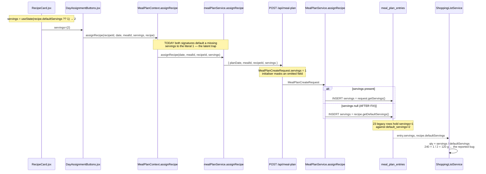

# Plan: Shopping list shows half the required quantity for entries stored with servings = 1

Plan folder: `.claude/contract/2026-07-29-shopping-list-servings-halving/`
Execution status: see `tasks.md` in this folder.

---

## Part 1 — Alignment

### Subtask reference

Verbatim from the developer (no Jira subtask — primed inline via `/fb-plan`):

> "Another one that I think it's exclusive for the 3% fat mince (or I haven't noticed in any other ingredient) is that for some reason it shows half of the amount we need in the shopping list. It says 120g or something like that instead of 240g or whatever. Use database and mcp with my user to confirm bug"

No `/brainstorming` spec was consumed; there is no `spec.md` in this folder.

### Restated goal

The shopping list renders half the expected quantity for every ingredient in a handful of recipes. The cause is not the ingredient — `Beef Mince (3% fat)` (id 125) is clean everywhere. The cause is that 23 of the developer's `meal_plan_entries` rows are stored with `servings = 1` while the recipe's `default_servings = 2`, and `ShoppingListService` faithfully scales by `servings / default_servings`, halving everything in those recipes. The specific number the developer saw — 120 g where 240 g was expected — is `Sirloin steak` (240 g) in recipe 104, the *Light* variant of *Beef & Mushroom Black Bean Stir Fry*. This plan removes the two code paths that can create a `servings = 1` entry against a multi-serving recipe (they silently fall back to the literal `1` instead of the recipe's `default_servings`), and repairs the 23 affected production rows.

### In scope

- `MealPlanService.assignRecipe` falls back to `recipe.getDefaultServings()` — not the literal `1` — when the request omits `servings`.
- `MealPlanCreateRequest.servings` no longer carries a field initialiser of `1`, so an omitted field arrives as `null` and reaches the service fallback instead of being silently rewritten to `1`.
- The mirroring `servings = 1` parameter defaults in `MealPlanContext.assignRecipe` and `mealPlanService.assignRecipe` are removed, so the frontend cannot re-introduce the literal `1` from the other side of the wire.
- A JUnit 5 unit test covering the new backend fallback (omitted servings → recipe default; explicit servings → honoured).
- A data repair against the live Railway MySQL setting `servings = 2` on the 23 identified `meal_plan_entries` rows belonging to `user_id = 1`, pinned to an explicit id list, with the pre-image captured first for rollback.

### Explicitly out of scope

- **Surfacing servings in the UI.** Showing/editing an entry's servings on the meal-plan card, and showing it on shopping-list rows, was offered and declined. The value stays invisible in the app after this change.
- **Guarding `copyWeek`.** `MealPlanService.java:274` copies `servings` verbatim, which is how one bad row replicated into every subsequent week. Offered and declined — left as-is.
- **The `MealPlanEntry.jsx:112-115` variant-swap stub.** `onSelectVariant` is a `console.log` that persists nothing; swapping a variant from the meal-plan view is a no-op. Adjacent, real, and untouched here.
- **`quantity_grams` data defects.** These skew `MacroCalculationService` output (which reads `quantity_grams`), not the shopping list (which reads `quantity`). Offered and declined twice, the second time with the numbers below. Recorded here so the next plan does not have to rediscover them:
  - `Olive oil` (ingredient 22) in the *Breaded Chicken with Mash & Black Beans* family — recipe 103 has both a `2 tbsp` and a `1 tbsp` row mapped to `38 g`; recipe 102 has `22 g` and `8 g` both mapped to `30 g`; recipe 101 has `18 g` and `6 g` both mapped to `24 g`. All 89 olive-oil rows elsewhere are consistent (14 g/tbsp, 1.00 g/g, 0.91–0.92 g/ml for the density conversions), so this is an authoring slip confined to one family, not a systemic conversion fault.
  - Net effect (Atwater 4/4/9, whole recipe): 101 stored 1250 vs 1436 computed; 102 stored 1474 vs 1728; 103 stored 1718 vs 2062. Per serving that is 625→718, 737→864, 859→1031 — 15–20% under-reported, and recipe 103 breaches the >900 Balanced reject threshold in `CLAUDE.md`.
  - `Red Cabbage` in recipes 104/105/106 has `quantity_grams` at exactly 2× `quantity` (60/120, 75/150, 90/180). Immaterial — cabbage is ~25 kcal/100 g, and those three recipes compute within 2–3% of stored.
  - **Not yet audited repo-wide.** The `g` unit alone shows 140 distinct ingredient:ratio combinations where there should be roughly one per ingredient, so other ingredients likely carry similar mismatches. Only olive oil was checked exhaustively. The sweep — flag every row whose `quantity_grams / quantity` deviates from that ingredient's modal ratio — is a separate plan.
- **`meal_plan_template_entries`.** `MealPlanTemplateEntry.servings` defaults to `1` and `MealPlanTemplateService` lines 174/204 fall back to `1`. Same class of defect in the template subsystem; no template rows are implicated in the reported bug, so this plan does not touch it.
- **Row id 306** — the single `servings = 1` entry belonging to `user_id = 6` (Catherine Duffy, 2026-01-26, recipe 3). See Assumptions.

### Pattern Reference (from subtask)

None supplied. References chosen for this plan:

- `foodbytes-app/foodbytes-api/src/test/java/com/foodbytes/service/ShoppingListServiceTest.java` — the only service unit test in the repo; its `@ExtendWith(MockitoExtension.class)` + `@Mock`/`@InjectMocks` + AssertJ shape is the template for the new `MealPlanServiceTest`.
- `foodbytes-app/foodbytes-api/src/main/java/com/foodbytes/service/MealPlanService.java:142-183` — the method being changed; the surrounding toggle/swap logic is the style to match.

### Constraints flagged on the subtask

- "Use database and mcp with my user to confirm bug" — the diagnosis had to be evidenced against the live Railway MySQL, not inferred from code. Done; see Cross-code alignment audit.
- Organisation policy required confirmation before touching customer data / PII. The developer authorised read-only queries for the investigation, then separately authorised an agent-run `UPDATE` against production for the repair.

### Assumptions made

- **The 23 rows are all wrong, and the correct value is 2.** Every affected recipe has `default_servings = 2` and the developer cooks for two (all 539 other entries are `servings = 2`). Setting them to the recipe's `default_servings` restores the intended amount.
- **Row id 306 (`user_id = 6`) is excluded from the repair.** It belongs to a different person, is six months old (2026-01-26), and rewriting another user's meal plan is not implied by "confirm and fix my shopping list". Red-line this if you want it swept in.
- **The `UPDATE` is pinned to an explicit id list rather than a predicate.** A predicate like `WHERE servings = 1 AND default_servings > 1` would also catch any legitimate future single-serving entry created between now and execution. The 23 ids are known and stable.
- **`servings = 1` remains a legal value.** Someone cooking for one is valid; the `@Min(1)` constraint stays. Only the *silent default* changes.
- **The precise origin of the 23 rows is not provable from the data.** No request logs exist, and `git` is unavailable in this environment so the history of `RecipeCard.jsx:10` (`useState(recipe.defaultServings || 1)`) could not be checked. The two `1` fallbacks are the only reachable code paths that produce this state, and 22 of the 23 rows are `copyWeek` descendants of three originals around 2026-05-11. The fix closes the traps; it does not claim to identify which one fired.
- **`recipes.default_servings` is never null.** It is `NOT NULL` in the schema and `@Min(1)` on `RecipeAdminDTO`, but the service fallback still guards with a final `: 1` so a malformed row cannot NPE the assign path.
- **No `@Transactional` or repository changes are needed.** `assignRecipe` is already `@Transactional` and already loads the `Recipe` at line 171, before the servings decision at line 179.

### Cross-code alignment audit (FE ↔ BE ↔ DB)

Performed against the live Railway MySQL (`hopper.proxy.rlwy.net:35402`) via the `mysql` MCP server, read-only.

- **`meal_plan_entries` exists with the expected shape.** `servings int NOT NULL DEFAULT '1'` — the DB-level default matches the Java field initialiser, so an INSERT that omits servings lands on `1` from either direction. Columns `user_id`, `plan_date`, `meal_id`, `recipe_id`, `servings`, `created_at`, `updated_at` all present. Note: the column is `meal_id`, not `meal` — a first query using `mpe.meal` failed and was corrected.
- **`recipes.default_servings` present and populated.** All recipes implicated (104, 139, 37, 23, 142) have `default_servings = 2`.
- **Name alignment holds across the chain** for the field being changed: DB `meal_plan_entries.servings` ↔ `MealPlanEntry.servings` (`@Column(name = "servings")`) ↔ `MealPlanEntryDTO.servings` ↔ `MealPlanCreateRequest.servings` ↔ JSON key `servings` in `mealPlanService.assignRecipe` ↔ `MealPlanContext.assignRecipe` parameter. No mismatch.
- **Representative rows exist for a meaningful smoke test.** `user_id = 1` has entries on 2026-07-30 (recipe 104, `servings = 1`) and 2026-08-01 (recipe 83, `servings = 2`), so the same week exercises both the broken and healthy paths.
- **The reported symptom reproduces arithmetically.** Recipe 104 row `recipe_ingredients.id = 1584`: `Sirloin steak`, `quantity = 240.00`, `unit = g`. `ShoppingListService.java:426-429` computes `240 × 1 / 2 = 120.00`. Matches "120 g instead of 240 g" exactly.
- **The suspected ingredient is clean.** `Beef Mince (3% fat)` (id 125) appears in exactly three rows — recipes 81/82/83 at 250/300/400 g, each with `quantity_grams` equal to `quantity`, each planned at `servings = 2`. Nothing halves it. Three other mince rows exist (`Beef mince (5% fat)` 62, `Beef Mince` 102, `Lean Lamb Mince` 166) and are also clean. The duplicate-casing family flagged in `.claude/rules/homemade-first-and-ingredient-dedup.md` is still present but is not this bug.
- **Blast radius counted.** 24 rows repo-wide have `servings = 1` against `default_servings > 1`: 23 on `user_id = 1` (2026-05-11 → 2026-07-30), 1 on `user_id = 6` (2026-01-26). 23 of the 24 are `Light` variants.

---

## Part 2 — Technical design

### Approach

The shopping list is not doing anything wrong. `ShoppingListService.processRecipeIngredients` scales each ingredient by `quantity × entry.servings / recipe.defaultServings` (`ShoppingListService.java:426-429`), which is the correct model: recipe quantities are authored for `default_servings` people, and `entry.servings` says how many you are actually making. Given `servings = 1` against `default_servings = 2`, halving every ingredient is the right answer to the wrong input. So the fix belongs upstream, at the point where `servings` is decided — not in the shopping list, and not by special-casing an ingredient.

There are exactly two places that can mint a `servings = 1` entry for a two-serving recipe, and both are silent literal fallbacks rather than deliberate choices. `MealPlanCreateRequest.servings` is declared `private Integer servings = 1;` — a Jackson-deserialised DTO with a field initialiser never reports "the client omitted this", because the initialiser has already answered for the client. Downstream, `MealPlanService.java:179` reads `request.getServings() != null ? request.getServings() : 1`, so even if the DTO default were removed, the service would substitute the same literal. Both must change together: dropping the DTO initialiser without fixing the service just moves the `1` one line later. The service is the right owner of the decision because it is the only layer holding the `Recipe` entity — it already loads it at line 171 for the association, eight lines before the servings decision, so `recipe.getDefaultServings()` costs nothing extra.

The frontend carries the same literal in two mirrored parameter defaults (`MealPlanContext.jsx:238`, `mealPlanService.js:27`). Today they are latent — `DayAssignmentButtons` always passes an explicit `servings` sourced from `RecipeCard`'s `useState(recipe.defaultServings || 1)` — but they are the client-side twin of the same mistake, and leaving them means a future caller that omits the argument re-creates the bug with the backend fix in place. Removing the defaults makes an omitted argument arrive as `undefined`, which Axios drops from the JSON body, which now correctly lands on the backend's recipe-derived fallback. This is the whole reason `react-frontend` is in scope on an otherwise backend fix — no UI is being added.

The alternative considered and rejected: clamping in `ShoppingListService` (never scale below `default_servings`, or floor the multiplier at 1). It would have made the symptom disappear without a schema or DTO change, and it is wrong — it would break every legitimate single-serving entry, and it treats the shopping list as the owner of a decision that belongs to the meal plan. A second alternative, deriving servings at read time (ignore the stored column, always use `default_servings`), was rejected for the same reason: it deletes a real user-facing capability to paper over a defaulting bug.

The 23 bad rows are repaired by a direct `UPDATE` against the live Railway MySQL during execution, per the developer's explicit instruction. The statement is pinned to an enumerated id list rather than a predicate, and preceded by a `SELECT` that records the pre-image so the change can be reversed by hand. Because Hibernate runs `ddl-auto: validate`, no schema change is involved and no migration file is required — removing a Java field initialiser and a JS parameter default touches no column. Nothing needs to be applied to Railway beyond the data repair itself, and the backend redeploys on git push as usual.

### Skills to invoke during execution

- `java-backend` — the change lives in `service/` and `dto/` under `foodbytes-api/`; governs the layering (decision stays in the service, not the controller), the `@Transactional` boundary, the `mvn test` runner, and the rule that a schema change would need a migration (it does not here).
- `react-frontend` — governs the two `client/src` edits: no new dependency, no `console.log`, service-layer HTTP only, and the JSDoc conventions on the touched functions.
- `chef` — confirmed by the developer, but no task in `tasks.md` invokes it. The only work it would have governed (the `Red Cabbage` / `Olive oil` `quantity_grams` corrections in recipes 101/102/104/105/106, which need macro re-verification against the `CLAUDE.md` per-variant targets) was excluded from scope in the same answer. Listed here for traceability; widen scope if you want it used.

Developer override: the `/fb-plan` command's skill classifier names `eida-*` skills (`eida-java-development:java-rest-develop`, `eida-development:junit`, etc.) that do not exist in this repository — it is written for a different codebase. The three above are the FoodBytes equivalents and were confirmed interactively.

### Diagram



### Data shapes

No schema change. No new table, column, index, or constraint. No migration file — Hibernate stays in `validate` and the column already exists as `servings int NOT NULL DEFAULT '1'`.

#### `MealPlanCreateRequest` (modified field)

| Field | Before | After | Notes |
|---|---|---|---|
| `planDate` | `LocalDate`, `@NotNull` | unchanged | |
| `mealId` | `Long`, `@NotNull` | unchanged | |
| `recipeId` | `Long`, `@NotNull` | unchanged | |
| `servings` | `Integer` = `1`, `@Min(1)` | `Integer` (no initialiser), `@Min(1)` | Nullable on the wire. `@Min` is not evaluated against `null`, so an omitted field passes validation and reaches the service fallback. |

#### `MealPlanService.assignRecipe` (modified behaviour, unchanged signature)

```java
// MealPlanService.java:179 — before
entry.setServings(request.getServings() != null ? request.getServings() : 1);

// after
entry.setServings(resolveServings(request.getServings(), recipe));

private int resolveServings(Integer requested, Recipe recipe) {
    if (requested != null) {
        return requested;
    }
    Integer recipeDefault = recipe.getDefaultServings();
    return recipeDefault != null && recipeDefault > 0 ? recipeDefault : 1;
}
```

Signature: `private int resolveServings(Integer requested, Recipe recipe)`. Returns the requested value when present; otherwise the recipe's `default_servings`; otherwise `1` as a null/zero guard.

#### JS function signatures (modified defaults)

```js
// client/src/contexts/MealPlanContext.jsx:238
// before: (recipeId, planDate, mealId, servings = 1, recipeData = null)
// after:  (recipeId, planDate, mealId, servings, recipeData = null)

// client/src/services/mealPlanService.js:27
// before: async assignRecipe(planDate, mealId, recipeId, servings = 1)
// after:  async assignRecipe(planDate, mealId, recipeId, servings)
```

An omitted `servings` becomes `undefined`; Axios omits `undefined` values from the serialised JSON body, so the key is absent and the backend fallback applies.

#### Data repair target (23 rows, `user_id = 1`)

`meal_plan_entries.id` ∈ `{956, 961, 964, 1078, 1081, 1084, 1192, 1200, 1203, 1223, 1231, 1234, 1254, 1256, 1259, 1275, 1277, 1299, 1301, 1323, 1353, 1416, 1493}` — all currently `servings = 1`, all against recipes with `default_servings = 2` (recipes 23, 37, 104, 139, 142). Target value: `2`.

### Runtime quality notes

Assessed against `.claude/rules/` and the code-quality dimensions. The change is four small edits plus one test plus one `UPDATE`; several dimensions are genuinely trivial and are marked as such rather than padded.

- **Resource cleanup:** Trivial — no concerns. No files, sockets, or streams are opened. `assignRecipe` is already `@Transactional`; the added `resolveServings` is a pure private method with no I/O and does not extend the transaction's lifetime or open a second one. The repair `UPDATE` is a single autocommit statement over the MCP connection, which the server closes.
- **Concurrency / thread-safety:** No shared mutable state is introduced. `resolveServings` is stateless and takes everything it needs as parameters, so it is safe on the shared singleton service. The `Recipe` it reads is a transaction-scoped managed entity, not cached across requests. No new locks, no async ordering, no GC-suspension risk — allocation is unchanged.
- **Allocation behaviour:** Trivial — no concerns. `resolveServings` allocates nothing (autoboxing on the `Integer` parameter already existed at the call site it replaces). Removing a Java field initialiser and two JS parameter defaults strictly reduces work. `assignRecipe` is a user-driven single-row write, not a hot path.
- **Error paths:** A malformed `Recipe` with a null or zero `default_servings` returns `1` rather than throwing — deliberate, so a data defect degrades to today's behaviour instead of NPE-ing the assign path. `@Min(1)` still rejects an explicit `servings = 0` or negative with a 400 through `GlobalExceptionHandler`; only omission changes meaning. The unchanged `recipeRepository.findById(...).orElseThrow(...)` at line 171 still guards a missing recipe before `resolveServings` is reached. On the frontend, `MealPlanContext`'s existing `.catch` still rolls back the optimistic update and surfaces "Failed to save. Please try again." — untouched. The repair `UPDATE` is preceded by a `SELECT` that records the pre-image, so a wrong outcome is reversible by hand.

### Risks and judgement calls

- **The `UPDATE` writes to live production data containing personal meal-plan records.** The developer explicitly chose agent-run over a reviewed migration file. There is no automated rollback — reversal depends on the pre-image `SELECT` captured in the same task. Flagging once: a migration file you apply yourself would be the lower-risk path, and the plan can be switched to it by editing one task.
- **Excluding `user_id = 6`'s row is a judgement call.** It leaves one known-bad row in the database. The reasoning is that it is another person's data and six months stale; if you would rather have the table clean, say so and the id list grows by one.
- **The origin of the 23 rows is inferred, not proven.** The fix closes both reachable defaulting paths, which is sufficient to stop recurrence regardless of which one fired — but if a third path exists that this analysis missed, new `servings = 1` rows will appear again. The Phase 3 audit query is the detector: re-run it after a week of normal use.
- **`copyWeek` is left unguarded by explicit choice.** If a bad row is created by any means after this change, `MealPlanService.java:274` will still propagate it into every copied week. The repair fixes today's rows; it does not stop tomorrow's from spreading.
- **The bug stays invisible in the UI.** With the servings display declined, a wrong `servings` value remains undetectable from the app — you would only notice it the same way you did this time, via a suspicious shopping-list quantity.
- **Removing the JS parameter defaults is a behaviour change at every call site that omits the argument.** Both current call sites pass it explicitly, so the practical blast radius is zero today — but this is the kind of edit that a future caller silently depends on. The JSDoc on both functions is updated in the same task to say the backend derives the value when omitted.
- **No frontend test can be run.** `client/package.json` has no test runner. The two JS edits are verified by reading the call sites and by the manual smoke test in Phase 3, not by an automated assertion — per the `react-frontend` rule against claiming a test passed.
