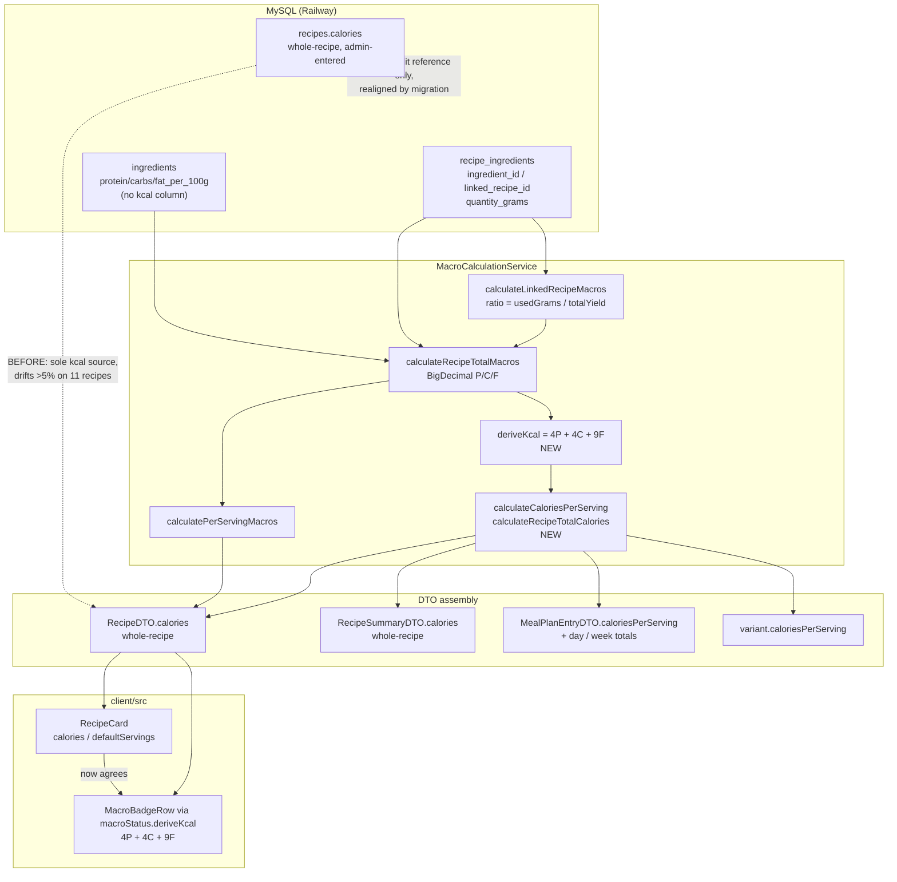

# Plan: Verify and correct macro / calorie calculation for recipes linked to extras

Plan folder: `.claude/contract/2026-07-30-linked-extras-macro-kcal-audit/`
Execution status: see `tasks.md` in this folder.

---

## Part 1 — Alignment

*(The shared understanding of what this task is doing. Restate it in your own words — this is how the developer confirms you read the brief correctly before any design happens. Mismatch here = stop and fix.)*

### Task reference

Verbatim brief as primed by the developer:

> verify that the macrs and cals for recipes linke to extras is caclucatuing correcly

Follow-up decisions confirmed interactively on **2026-07-30**:

1. Skills to load: `java-backend`, `react-frontend`, `chef`, `diet-guidelines` (all four confirmed, none removed).
2. Deliverable scope: **"Audit + fix code + fix data"** — verify the calculation, fix the code defects with regression tests, and produce migration SQL for the data defects.
3. Live Railway MySQL read access approved for planning: read-only, recipe/ingredient/nutrition tables only, no `users` table. The developer was warned that production data carries a security risk even for read-only access and accepted it.
4. **Nutrition basis confirmed by the developer, verbatim:** *"We should never use the store bought calores, if store bough is chosen the cals sill come from homemade."* Homemade is the only nutrition basis, in every case, whether or not the user picked the store-bought option. Store-bought exists for the shopping list alone. This closes what would otherwise have been an open design question and is the acceptance criterion the derivation is built against.

No `/brainstorming` spec exists for this task, so there is no `spec.md` in this folder.

### Restated goal

Establish whether FoodBytes computes per-serving macros **and** calories correctly for the 48 recipes that pull in a sub-recipe as a linked extra (pizza dough, pizza sauce, fresh pasta, milk bread, flatbread, pita, brioche buns, mayonnaise, burger patties, honey ham), then fix what is wrong. The audit has been performed against the live database during planning, and it isolated a single root cause with a precisely measured blast radius.

**The calculation engine is correct. The calorie column bypasses it.** `MacroCalculationService` tests `isLinkedRecipe()` before `isRawIngredient()`, so an FR-103 dual-path row always takes the homemade branch — protein, carbs and fat are computed from ingredients plus prorated extras on the homemade basis in every case, which is exactly the required behaviour (confirmed decision 4 above). The homemade/store-bought toggle in `HomemadeSelectionsContext` is localStorage-only and feeds the shopping list; it has never influenced nutrition. But **calories are never computed at all** — every kcal figure in the app reads the hand-entered `recipes.calories` column, and on **20 of the 48** recipes with extras that column was worked out on the **store-bought** basis. This is not drift or typos: for those 20 recipes the gap between stored and homemade-computed kcal equals the sum of their store-bought-minus-homemade row deltas to within 3 kcal, and on Pizza (14) it matches exactly — stored 1 212 against a store-bought-path total of 1 212 and a homemade total of 1 269. The consequence is that one screen shows two versions of the same dish: `MacroBadgeRow` derives its kcal from the homemade macros while `RecipeCard` renders the store-bought column, so Greek Chicken Gyros (119) shows 650 kcal beside badge percentages computed against 765.

Separately, the traversal carries latent correctness bugs — a cycle guard that also zeroes a legitimately repeated sub-recipe, integer truncation on per-serving kcal — and has **zero unit-test coverage**. This plan routes calories through the same traversal that already produces the macros, which makes "calories always come from homemade" structurally true rather than a convention someone has to remember; repairs the traversal defects; pins the behaviour with the first `MacroCalculationServiceTest`; and ships a migration realigning the stored column onto the homemade basis so the admin UI stops contradicting the display.

### In scope

- Derive calories from the ingredient graph (raw ingredients + prorated linked extras) instead of reading the stored `recipes.calories` column, in `MacroCalculationService`, and wire that derivation into `RecipeService.convertToDTO`, `RecipeService.convertToSummaryDTO`, `RecipeService` variant kcal, `RecipeFamilyService` variant kcal, and `MealPlanService` per-entry / per-day / per-week kcal.
- Enforce **homemade-only nutrition** as a tested invariant: a dual-path row (`ingredient_id` **and** `linked_recipe_id` both set) must contribute the prorated homemade linked-recipe value for kcal *and* for P/C/F, never the store-bought ingredient's per-100g value, and never both. The engine already behaves this way via branch order; this plan pins it with an explicit test so a future edit to that `if/else if` cannot silently flip it.
- Preserve the existing wire contract: `RecipeDTO.calories` and `RecipeSummaryDTO.calories` stay **whole-recipe** kcal (the frontend divides by `defaultServings`); `MealPlanEntryDTO.caloriesPerServing` and `variant.caloriesPerServing` stay per-serving.
- Fix the path-scoped cycle guard in `MacroCalculationService.calculateRecipeTotalMacros` so a sub-recipe that legitimately appears twice in one traversal is counted twice, and only a genuine cycle is cut.
- Fix integer truncation in per-serving calorie derivation (`MealPlanService.calculateCaloriesPerServing`, `RecipeService` and `RecipeFamilyService` variant kcal).
- Fix premature rounding in `MacroCalculationService.calculateTotalMacros`, which sums per-recipe values already rounded to whole grams.
- Fix the malformed SLF4J debug format string in `calculateLinkedRecipeMacros` (`{:.2f}` is not an SLF4J placeholder; the argument list is off by one).
- Collapse the existing N+1 on the recipe list and meal-plan paths so the new derivation does not multiply query count — join-fetch the ingredient graph plus Hibernate batch fetching for linked recipes.
- Create `MacroCalculationServiceTest` — the first unit tests for this service — covering: prorated linked-recipe contribution, the 50 g-of-300 g portion ratio, zero-yield linked recipe, FR-103 dual-path rows taking the homemade branch only (no double count), a repeated sub-recipe counted twice, a genuine cycle cut once, and derived kcal matching 4P+4C+9F.
- Migration SQL under `foodbytes-app/database/migrations/` correcting the audited data defects: recipe 65's over-yield `quantity_grams`; realignment of the **20** store-bought-basis `recipes.calories` values onto the homemade basis; individual review and correction of the **13** recipes whose stored value matches neither basis; correction of the store-bought ingredient rows that name the wrong *product* (a shopping-list defect, see out-of-scope note on their macros); and the two variant-family structure violations (family 4 `Balanced 2`, family 26 NULL `variant_label`).
- A written findings report (`findings.md` in this folder) recording the audit evidence with the real query output, so the verification is reviewable rather than implicit in a diff.
- **Update `CLAUDE.md` (lines 75–77)** so the project's own conventions describe the new behaviour: calories are derived and `recipes.calories` is no longer a display source; nutrition always comes from the homemade linked recipe regardless of the store-bought selection; and — found while editing the same bullet list — the stale claim that the default variant is Balanced, which contradicts `.claude/rules/recipe-variants.md` (Moderate). Without this, the first thing the next session reads still tells it to hand-enter a calorie figure and trust it.
- Frontend verification that no component double-divides an already-per-serving value once the backend derivation lands, and that `RecipeCard`'s stored-column kcal and `MacroBadgeRow`'s derived kcal now agree.

### Explicitly out of scope

- **Redesigning recipes whose macros miss the `CLAUDE.md` per-variant targets.** The audit found several recipes with extras whose *correctly computed* per-serving kcal breaches the reject ceilings — recipe 63 Homemade Big Mac at 1 543 kcal/serving, 22 Black Bean Chicken Wrap at 1 059, 46 Stromboli at 1 056, 120 Greek Chicken Gyros at 967, 29 Salmon Sandwich at 904 — plus many more sitting outside the target bands. Making those dishes hit 450–550 / 550–650 / 700–800 is a recipe redesign (portion and ingredient changes, per the `chef` skill), not a calculation fix. They are listed by id in `findings.md` for a separate effort.
- Removing or renaming the `recipes.calories` column. It stays as the admin-entered value and audit reference; only its role as a *display* source is withdrawn.
- The `macros_audited` sign-off flag and its endpoint (`PATCH /admin/{id}/audit`) — already covered by `RecipeServiceMacroAuditTest` and untouched here.
- Making the FR-103 store-bought toggle change displayed macros or calories. Explicitly rejected by the developer (decision 4): nutrition is always homemade. `HomemadeSelectionsContext` stays localStorage-only and shopping-list-only.
- **Correcting the per-100g macros on store-bought ingredient rows.** 26 of 38 dual-path rows have a store-bought ingredient whose kcal diverges >10 % from the homemade path, which `linked-recipe-extras.md` flags. Now that homemade-only nutrition is confirmed, those macros are **never read for nutrition** — so the divergence has no effect on any number the user sees, and chasing it would be busywork. What *does* matter and stays in scope is the wrong-*product* mappings, because the shopping list buys them: `Milk Bread → Brioche Burger Buns` sends you for burger buns when you need a loaf, and `Fresh Pasta → Spaghetti (dried)` compares dried weight to fresh dough without a hydration factor. Those are fixed as shopping-list defects, not as macro defects.
- Shopping-list quantity aggregation for linked extras.
- Any migration being applied automatically. The developer applies SQL to Railway by hand.
- `Legacy/`, `Recipes_Transfer/`, `mockups/`, `logo-options.html`, `mockup-copy-week.html`, `Claude/agents/` — historical artefacts, not touched and not used as pattern references.

### Pattern Reference

None supplied in the brief. References chosen here:

- `foodbytes-app/foodbytes-api/src/main/java/com/foodbytes/service/MacroCalculationService.java` — the service under audit; its existing `calculateLinkedRecipeMacros` / `calculateRecipeTotalYield` shape is preserved and extended rather than rewritten.
- `foodbytes-app/client/src/utils/macroStatus.js` — `deriveKcal` (4P + 4C + 9F) is the existing, documented in-repo precedent for deriving kcal rather than trusting `recipes.calories`. The backend derivation mirrors it exactly so the two cannot disagree.
- `foodbytes-app/foodbytes-api/src/test/java/com/foodbytes/service/MealPlanServiceTest.java` and `RecipeServiceMacroAuditTest.java` — Mockito + AssertJ style for the new `MacroCalculationServiceTest`.
- `foodbytes-app/foodbytes-api/src/main/java/com/foodbytes/repository/RecipeRepository.java` — existing `@EntityGraph` / `LEFT JOIN FETCH` idiom for the new macro-graph finder.
- `.claude/rules/linked-recipe-extras.md` — authoritative `quantity_grams` semantics and reject conditions.

### Constraints flagged on the brief

Carried from `CLAUDE.md` and the rule files rather than stated in the one-line brief; all treated as hard constraints:

- `recipes.calories` is **whole-recipe** kcal, not per-serving. The frontend renders per-serving as `calories / default_servings`. Any change that alters the meaning of this DTO field silently halves or doubles every displayed calorie figure.
- Nutrition computation must include raw ingredients **plus** the prorated contribution of linked recipes. Stored calorie totals have historically been wrong and must not be trusted.
- `quantity_grams` on a linked row is the **portion consumed**, never the linked recipe's total yield. `portionRatio = usedGrams / linkedTotalYield`.
- A linked `recipe_ingredients` row must be paired with a `recipe_steps` row carrying the same `linked_recipe_id` and a populated `alt_instruction`.
- Recipe families must hold exactly three members labelled `Light` / `Moderate` / `Balanced`, `display_order` 1/2/3, `is_default` on **Moderate** only.
- Hibernate runs `ddl-auto: validate`. This plan introduces **no schema change**, so no migration blocks backend startup — but the data migration must still be applied by hand for the corrected values to take effect.
- FR-103 dual-path rows set both `ingredient_id` and `linked_recipe_id`; the macro path must take the linked branch only and must never count both.
- The `chef` skill forbids applying audit suggestions automatically — every data change is presented for explicit approval before the developer runs it.
- No frontend test runner and no lint script exist in `client/package.json`. Frontend verification is `npm run build`, a `node` smoke check for pure helpers, and explicit manual checks.

### Assumptions made

- **CONFIRMED — nutrition is always the homemade path, never store-bought.** *Rationale:* stated directly by the developer (decision 4). Not an inference; do not re-litigate. It is the reason the derivation is the right fix rather than a data cleanup: routing kcal through the engine makes the invariant structural.
- **Derive calories rather than only realigning the stored column.** *Rationale:* `CLAUDE.md` states outright that stored totals are unreliable and must be re-derived, and the audit shows the column encodes the *store-bought* build on 20 recipes — a basis the developer has ruled out for nutrition entirely. Realigning rows fixes 20 instances while leaving the next recipe insert free to re-enter a store-bought figure.
- **kcal = 4P + 4C + 9F, computed from unrounded `BigDecimal` totals.** *Rationale:* `ingredients` has no calorie column (verified: `protein_per_100g`, `carbs_per_100g`, `fat_per_100g` only), so Atwater factors are the only available basis, and this is exactly what `macroStatus.deriveKcal` already does client-side.
- **`RecipeDTO.calories` keeps whole-recipe semantics.** *Rationale:* `RecipeCard.jsx:59` divides by `defaultServings`; switching the field to per-serving would halve every card. Changing the number's *provenance* is in scope; changing its *unit* is not.
- **`convertToSummaryDTO` also derives, backed by a join-fetch finder.** *Rationale:* leaving the lightweight list path on the stored column would make list and detail views disagree — the exact bug being fixed. Cost is neutralised by removing the pre-existing N+1 rather than adding to it.
- **Data fixes are scoped to calculation integrity, not to macro-target compliance.** *Rationale:* keeps the change reviewable; recipe redesign is a `chef` task with different acceptance criteria. Every excluded recipe is listed by id so nothing is silently dropped.
- **The store-bought mapping corrections are proposed, not chosen unilaterally.** *Rationale:* the `chef` skill requires explicit approval per change; substituting an ingredient is a culinary decision. The migration ships the proposal with the arithmetic shown. Scope is the wrong-product mappings only — their macros are never read for nutrition.
- **The 13 "neither basis" recipes get individual review, not a blanket rewrite.** *Rationale:* their stored value matches neither the homemade nor the store-bought total, so no single mechanism explains them. Recipe 119 is ~83 % explained by the store-bought swap with 40 kcal left over; recipe 28 has no dual-path row at all and is a plain wrong number. Blanket-overwriting all 13 would hide whatever else is going on. Once calories derive, the display is correct regardless — so this is admin-column hygiene, and it is the one part of the data work that could reasonably be deferred.
- **Recipe 65's `quantity_grams = 454` is corrected downward to the linked recipe's yield semantics, not by inflating Fresh Pasta's yield.** *Rationale:* the rule names `quantity_grams > linked_total_yield` as the reject condition, and Fresh Pasta's 282 g yield is consistent across its nine other consumers.
- **The `visitedRecipeIds` fix is latent-bug prevention, not a live defect.** *Rationale:* verified against production — traversal depth is exactly 1, no parent links the same child twice, and no two children share a grandchild, so nothing is being zeroed today. It is fixed because the test that proves the maths correct would otherwise encode the bug as expected behaviour.
- **`findings.md` is the audit deliverable.** *Rationale:* the brief asks to "verify", which needs a reviewable artefact; a code diff alone does not show what was checked and found clean.

### Cross-code alignment audit (FE ↔ BE ↔ DB)

All queries below were run read-only against the live Railway MySQL on 2026-07-30. No `users` table was read.

- **`recipe_ingredients` schema confirmed.** `SHOW COLUMNS` returns: `id bigint NO PRI`, `recipe_id bigint NO MUL`, `ingredient_id bigint YES MUL`, `linked_recipe_id bigint YES MUL`, `quantity decimal(10,2) NO`, `unit_id bigint NO MUL`, `quantity_grams decimal(10,2) NO`, `sort_order int NO default 0`. Both `ingredient_id` and `linked_recipe_id` are nullable, so the FR-103 dual-path is schema-legal, and `RecipeIngredient`'s `@Column(name = "quantity_grams", nullable = false, precision = 10, scale = 2)` matches exactly.
- **`ingredients` has no calorie column.** `SHOW COLUMNS` returns `id`, `key`, `name`, `aisle_id`, `protein_per_100g decimal(5,2) NO default 0.00`, `carbs_per_100g`, `fat_per_100g`, `macros_verified tinyint(1)`. Confirms kcal can only be derived via Atwater factors and that `MacroCalculationService`'s three-macro return is complete with respect to the data available.
- **Extras footprint.** 64 rows have `linked_recipe_id IS NOT NULL`, spanning 48 parent recipes and 10 distinct child recipes; **38 of the 64 are FR-103 dual-path** (`ingredient_id` also set). Dual-path is the majority case, so the branch-order question is material, not theoretical.
- **Traversal depth is exactly 1.** A query for rows whose `recipe_id` is itself some other row's `linked_recipe_id` returns zero rows — no child recipe links a grandchild. Combined with the per-parent check (max 3 linked rows, `distinct_children` equal to `linked_rows` in every case), no parent links the same child twice and no diamond exists. The `visitedRecipeIds` defect is therefore latent, not active.
- **One `quantity_grams` over-yield violation.** Recipe 65 *Pastichio (Lasagna)* consumes 454 g of recipe 36 *Fresh Pasta*, whose total yield is 282 g → `portionRatio = 1.6099`. This trips the rule's reject condition (`quantity_grams` must be ≤ linked total yield) and over-attributes the pasta contribution by 61 %. All other 63 linked rows have ratios between 0.0485 and 0.9220 — legitimate portions.
- **Stored vs computed kcal diverges >5 % on 11 of 48 recipes with extras.** Computing whole-recipe kcal as raw + prorated-linked (dual-path rows taken as linked, matching the service's branch order): id 63 Homemade Big Mac ratio **1.166** (stored 3 599 vs computed 3 087), 99 French Toast **1.160**, 100 French Toast **1.159**, 119 Greek Chicken Gyros **0.845**, 98 French Toast **1.145**, 120 Greek Chicken Gyros **0.872**, 118 Greek Chicken Gyros **0.879**, 83 Spaghetti Bolognese **1.101**, 81 **1.099**, 82 **1.098**, 28 Salmon Sandwich **0.932**.
- **Root cause identified and proved: the stored column was computed on the STORE-BOUGHT basis.** For each recipe, comparing `stored − homemade_computed` against the summed `store_bought − homemade` delta of its dual-path rows leaves a residual of **exactly 0** on 9 of the 11 recipes above — 63 (gap +512, swap +512), 81/82/83 (+124/+138/+173, matched exactly), 98/99/100 (+91/+136/+182, matched exactly), 120 (−249, matched exactly). Recipe 118 residual **3**, recipe 119 residual **−40** (partly explained), recipe 28 residual **−66** with no dual-path row at all — a genuine standalone error. Exact-to-the-kcal agreement across nine independent recipes is mechanism, not coincidence.
- **The 5 % threshold was concealing the true scope — it is 20 recipes, not 11.** Re-running the diagnosis with no divergence cutoff and a ±3 kcal tolerance classifies all 48 recipes with extras: **20 on the store-bought basis** (ids 13, 14, 15, 44, 63, 65, 81, 82, 83, 88, 89, 90, 98, 99, 100, 107, 118, 120, 127, 129), **15 correct on the homemade basis** (29, 37, 38, 39, 50–55, 196, 197, 205–207), and **13 matching neither** (20, 21, 22, 28, 45, 46, 87, 119, 128, 136–138, 189). Pizza (14) is the clearest case and sat *below* the 5 % cutoff at 4.5 %: stored **1 212**, store-bought-path total 650 + 38 + 524 = **1 212** exactly, homemade total **1 269**.
- **Pink Sauce Pasta is the positive control for the proration logic.** Recipes 37/38/39 draw **52–55 % of their kcal from linked sub-recipes** — the highest extras dependency in the database (220 g of a 282 g Fresh Pasta batch, 180 g of a 428 g Pizza Sauce batch) — and match stored-to-computed within 1 kcal (515/515, 651/650, 801/801). Its Fresh Pasta row is linked-only, so no store-bought figure existed to be used by mistake. All three variants also pass the `CLAUDE.md` per-variant targets. This confirms `quantity_grams / linkedTotalYield` proration is arithmetically sound and localises the defect entirely to the stored column.
- **The two-number bug is real and user-visible.** For the same recipe, `RecipeCard` renders `calories / defaultServings` while `MacroBadgeRow` derives `4P + 4C + 9F` from the DTO macros. Recipe 119 *Greek Chicken Gyros*: card shows **650 kcal**, badges compute against **765 kcal** (52 g P / 65 g C / 33 g F per serving). Recipe 100 *French Toast*: card **666**, badges **573**. Recipe 63 *Homemade Big Mac*: card **1 800**, badges **1 540**.
- **FR-103 homemade vs store-bought kcal diverges >10 % on 26 of 38 dual-path rows** — these are the deltas that produced the finding above. Worst: recipe 63 *Burger Patties* → `Beef Burger Patties` ratio **1.713** (652 vs 1 116 kcal); French Toast *Milk Bread* → `Brioche Burger Buns` **1.397**; Spaghetti Bolognese / Pastichio *Fresh Pasta* → `Spaghetti (dried)` / `Lasagna Sheets` **1.246** / **1.232**; Greek Gyros *Pita Bread* → `Pita Bread` **0.680**; Pastichio *Honey Ham* → `Sliced Ham` **0.746**; every *Pizza Sauce* → `Tomato passata` row **0.434**. Given homemade-only nutrition (decision 4), these per-100g macros are never read for any displayed number — so the divergence is diagnostic evidence, not a defect to correct. The wrong-*product* mappings within this set are a separate, real shopping-list defect.
- **Homemade-only nutrition is already how the engine behaves.** `MacroCalculationService.calculateRecipeTotalMacros` tests `ri.isLinkedRecipe()` before `else if (ri.isRawIngredient())`, so on a dual-path row the linked branch wins and the store-bought ingredient is never read — no double-count either. With 38 of 64 linked rows being dual-path, this branch order is load-bearing for the majority of the extras data, yet nothing tests it. `HomemadeSelectionsContext.jsx` confirms the toggle only writes localStorage and invalidates the shopping-list cache; it never reaches a macro or calorie path.
- **Linked prep steps are clean.** The rule's verification query returns zero rows: every linked `recipe_ingredients` row has at least one `recipe_steps` row carrying the same `linked_recipe_id` **and** a populated `alt_instruction`. No violation.
- **Two variant-family structure violations.** Family 4 *Pizza* has **four** members — 13 `Light`, 14 `Moderate` (default), 15 `Balanced`, and 107 **`Balanced 2`** at `display_order` 4. Family 26 *Paella Valenciana* has a single member (recipe 90) with `variant_label` **NULL** and `is_default = 1`. Both breach `recipe-variants.md` (exactly three members, labels exactly Light/Moderate/Balanced).
- **Name alignment holds along the whole chain.** `recipe_ingredients.quantity_grams` ↔ `RecipeIngredient.quantityGrams` ↔ `MacroCalculationService` reads via `ri.getQuantityGrams()`; `recipes.calories` ↔ `Recipe.getCalories()` ↔ `RecipeDTO.calories` ↔ `recipe.calories` in `RecipeCard.jsx`. No mismatch found, so no rename is needed.
- **Query-count baseline.** `getAllRecipes()` uses `findAllLiveRecipes()`, which `LEFT JOIN FETCH`es only `meals`/`meals.meal`. `convertToDTO` then calls `calculatePerServingMacros`, which walks `recipe.getIngredients()` lazily — so the recipe list **already** issues one query per recipe plus one per linked recipe. Deriving kcal on that path adds no queries; the join-fetch work in this plan reduces the existing count rather than paying for a new feature.

---

## Part 2 — Technical design

### Approach

The audit's headline finding shapes the design: **macros are right, calories are not computed at all.** `MacroCalculationService` walks the ingredient graph, prorates each linked recipe by `quantity_grams / linkedTotalYield`, and returns `[protein, carbs, fat]` — that arithmetic is correct, the production data confirms the proration is being applied, and because the traversal tests `isLinkedRecipe()` first it already satisfies the developer's rule that nutrition always comes from the homemade path. Pink Sauce Pasta is the proof: it draws 52–55 % of its calories from linked sub-recipes and matches to within 1 kcal.

Calories never enter that method. Every kcal number the user sees comes from `recipes.calories`, a hand-entered column no code cross-checks — and on 20 of the 48 recipes with extras it was worked out on the **store-bought** basis, the one basis the developer has ruled out for nutrition. That is provable rather than suspected: the stored-minus-homemade gap equals the summed store-bought row deltas to the kcal on nine recipes independently, and Pizza (14) stores 1 212 against a store-bought total of exactly 1 212. So this is not drift to be tidied — it is a second, contradictory nutrition basis living in a column that outranks the engine at display time. The fix is to give calories the same single source as the macros, which converts "calories always come from homemade" from a convention someone must remember when typing a number into an invariant the code cannot express any other way.

Concretely, `MacroCalculationService` gains a fourth output. `calculateRecipeTotalMacros` already returns unrounded `BigDecimal[]{protein, carbs, fat}`; a new `deriveKcal(BigDecimal[])` applies `4P + 4C + 9F` to those same unrounded totals, and two thin public methods expose it: `calculateRecipeTotalCalories(Recipe)` for whole-recipe kcal and `calculateCaloriesPerServing(Recipe)` for per-serving. Deriving from the unrounded totals — not from the rounded ints the DTO carries — is deliberate: rounding three macros to whole grams before applying Atwater factors injects up to ±7 kcal, and the frontend's `deriveKcal` already works off the rounded values, so the backend must be the more precise of the two for them to agree within a kcal or so. The factors mirror `macroStatus.js` exactly, which is the in-repo precedent for distrusting the stored column.

Wiring that in has one hard constraint: **the meaning of each DTO field must not move.** `RecipeDTO.calories` and `RecipeSummaryDTO.calories` stay whole-recipe kcal, because `RecipeCard.jsx:59` divides by `defaultServings`; only the provenance changes from `recipe.getCalories()` to `calculateRecipeTotalCalories(recipe)`. `MealPlanEntryDTO.caloriesPerServing`, the day/week totals, and the variant-dropdown `caloriesPerServing` are already per-serving and switch to `calculateCaloriesPerServing`, which also removes the integer truncation those three sites currently share (`recipe.getCalories() / recipe.getDefaultServings()` on two `Integer`s silently floors 1 025/2 to 512). The result is that the frontend needs no change to display correct numbers — a deliberate outcome, and the reason the frontend work here is verification rather than edits.

The alternative designs were both worse. **Keeping the stored column authoritative and shipping only a data migration** fixes 20 instances but not the class; nothing stops the next recipe insert from entering a store-bought figure again, which is precisely how the current state arose, and the card-versus-badge split returns with it. **Deriving kcal in the frontend from the DTO's macros** looks cheaper but the DTO macros are pre-rounded, so it bakes in the ±7 kcal error, and `RecipeSummaryDTO` carries no macros at all, so list views could not derive anything.

Three smaller correctness fixes ride along in the same service. The cycle guard adds each recipe id to `visitedRecipeIds` and never removes it, with one set threaded through the whole traversal — so a sub-recipe legitimately reached twice (one parent using it on two rows, or two children sharing a grandchild) contributes **zero** the second time. Production data cannot trigger this today (depth 1, no repeats, no diamonds — verified), but the new tests must assert the correct behaviour rather than enshrine the bug, so the guard becomes path-scoped: add on entry, remove in a `finally` on exit, which still cuts genuine cycles. `calculateTotalMacros` sums per-recipe values already rounded to whole grams; it switches to accumulating unrounded `BigDecimal` and rounding once, removing an error that compounds across 21 meals a week. And the `log.debug` in `calculateLinkedRecipeMacros` uses `{:.2f}`, which SLF4J does not understand — it prints literally and leaves the argument list one short, so the fat value is dropped.

Cost is the one place this change could do harm, and the honest position is that the derivation is free where macros are already computed but not on the lightweight list path. `getAllRecipes()` fetches only `meals`, then `convertToDTO` walks `recipe.getIngredients()` lazily — the recipe list is **already** N+1 on ingredients plus one query per linked recipe. Deriving kcal there reuses the totals that traversal produces and adds nothing. `convertToSummaryDTO`, however, does not currently touch the graph, so making it derive would introduce a new N+1. Rather than accept that, the plan adds a `LEFT JOIN FETCH` finder for the ingredient level and sets Hibernate's `default_batch_fetch_size`, which collapses the linked-recipe loads into a handful of `IN` queries. Net query count on the recipe list goes **down**, not up. A single JPQL fetching both collection levels was rejected — recipe ingredients × linked-recipe ingredients is a cartesian product Hibernate warns about on multiple bag fetches.

Finally, the data. Migration SQL under `foodbytes-app/database/migrations/` corrects recipe 65's `quantity_grams = 454` against a 282 g yield, realigns the 11 divergent stored `recipes.calories` values so the admin UI stops contradicting the derived display, proposes corrected FR-103 store-bought mappings for the 26 rows diverging above 10 %, and repairs the two family-structure violations. No schema change, so `ddl-auto: validate` cannot block startup — but the values only take effect once the developer applies it. Per the `chef` skill the store-bought substitutions are presented with their arithmetic for approval rather than chosen unilaterally, and `findings.md` records the whole audit so the "verify" half of the brief has a reviewable artefact.

### Skills to invoke during execution

- `java-backend` — owns every edit under `foodbytes-api/`: the `MacroCalculationService` derivation and traversal fixes, the DTO wiring in `RecipeService` / `RecipeFamilyService` / `MealPlanService`, the new `RecipeRepository` fetch finder, and `MacroCalculationServiceTest`. Also owns the migration-file mechanics (date-prefixed file, developer applies it to Railway by hand).
- `react-frontend` — owns the client-side verification: confirming `RecipeCard.jsx:59` still divides a whole-recipe value, that no component divides an already-per-serving field, and that `MacroBadgeRow`'s derived kcal now agrees with the card. Light-touch by design — the DTO contract is deliberately unchanged, so this is expected to be a no-edit verification.
- `chef` — owns the recipe-data judgement in the migration: the corrected `quantity_grams` for recipe 65, the proposed FR-103 store-bought substitutions, and the variant-family repairs. Enforces "never trust stored `recipes.calories`" and "get explicit approval per data change".
- `diet-guidelines` — owns the target-band verdicts in `findings.md`: which recipes' *correctly computed* per-serving macros breach the `CLAUDE.md` reject ceilings, reported as out-of-scope redesign candidates with sources cited.

Rule files the executor must Read before touching recipe data: `.claude/rules/linked-recipe-extras.md`, `.claude/rules/recipe-variants.md`, `.claude/rules/homemade-first-and-ingredient-dedup.md`.

No developer override was applied — all four proposed skills were confirmed as-is.

### Diagram



### Data shapes

**No schema or contract changes.** No new column, no new table, no new endpoint, and every existing DTO field keeps its name, type, and unit. What changes is the *provenance* of four already-existing fields plus new methods on one service.

#### New public methods on `MacroCalculationService`

```java
/** FR-094: Whole-recipe kcal derived from ingredients + prorated linked extras. */
public int calculateRecipeTotalCalories(Recipe recipe)

/** FR-094: Per-serving kcal = whole-recipe derived kcal / default_servings. */
public int calculateCaloriesPerServing(Recipe recipe)

/** Atwater factors on unrounded totals: 4P + 4C + 9F. */
public BigDecimal deriveKcal(BigDecimal[] macros)   // macros = {protein, carbs, fat}
```

`deriveKcal` constants: protein `4`, carbs `4`, fat `9` — matching `client/src/constants/macroTargets.js` → `KCAL_PER_GRAM`.

#### Changed signature (traversal fix)

```java
// BEFORE — one set for the whole traversal, ids never removed
public BigDecimal[] calculateRecipeTotalMacros(Recipe recipe, Set<Long> visitedRecipeIds)

// AFTER — same signature; the set becomes path-scoped internally:
//   visitedRecipeIds.add(id) on entry, removed in a finally block on exit,
//   so a repeated sub-recipe is counted twice and only a true cycle is cut.
```

#### Field provenance changes (name / type / unit all unchanged)

| DTO field | Type | Unit | Before | After |
|---|---|---|---|---|
| `RecipeDTO.calories` | `Integer` | whole-recipe kcal | `recipe.getCalories()` | `macroCalculationService.calculateRecipeTotalCalories(recipe)` |
| `RecipeSummaryDTO.calories` | `Integer` | whole-recipe kcal | `recipe.getCalories()` | `calculateRecipeTotalCalories(recipe)` |
| `MealPlanEntryDTO.caloriesPerServing` | `Integer` | kcal/serving | `getCalories() / getDefaultServings()` (int division) | `calculateCaloriesPerServing(recipe)` |
| `MealPlanDayDTO.totalCalories` | `int` | kcal/serving summed | sum of truncated ints | sum of derived per-serving values |
| `RecipeVariantDTO.caloriesPerServing` | `Integer` | kcal/serving | `getCalories() / getDefaultServings()` (int division) | `calculateCaloriesPerServing(variantRecipe)` |

#### New repository finder

```java
@Query("SELECT DISTINCT r FROM Recipe r " +
       "LEFT JOIN FETCH r.meals rm LEFT JOIN FETCH rm.meal " +
       "LEFT JOIN FETCH r.ingredients ri LEFT JOIN FETCH ri.ingredient " +
       "WHERE r.isLive = true")
List<Recipe> findAllLiveRecipesWithMacroGraph();
```

Linked recipes and their ingredients are resolved by Hibernate batch fetching, configured in `application.yml`:

```yaml
spring:
  jpa:
    properties:
      hibernate:
        default_batch_fetch_size: 32
```

#### Migration file

`foodbytes-app/database/migrations/2026-07-30-linked-extras-macro-kcal-corrections.sql` — DML only, no DDL. Four sections: (1) recipe 65 `quantity_grams` correction, (2) 11 `recipes.calories` realignments, (3) FR-103 store-bought mapping corrections, (4) family 4 and family 26 variant-structure repairs. Every statement idempotent-guarded per the `chef` skill's rule 7a.

#### Documentation

`CLAUDE.md:75-77` — three bullets in "Recipe modeling — important quirks" rewritten: the linked-extras bullet gains the homemade-only nutrition invariant and the FR-103 both-ids case; the `recipes.calories` bullet records that the column is no longer a display source and names the new service methods; the variants bullet is corrected from Balanced to Moderate. No new file.

#### Report artefacts in this plan folder

- `findings.md` — audit evidence: the query output quoted in Part 1, the per-defect verdict, and the out-of-scope recipe ids with their `diet-guidelines` target-band verdicts.
- `pr-description.md` — written in the final phase.

### Runtime quality notes

- **Resource cleanup:** No new streams, connections, or transactions. `RecipeService.getRecipeById` / `getAllRecipes` and `MealPlanService` read paths stay inside their existing `@Transactional(readOnly = true)` boundaries, which is what makes the lazy ingredient walk legal at all — the derivation adds no new lazy access beyond what `calculatePerServingMacros` already performs on the same entity. The path-scoped `visitedRecipeIds` uses `try { ... } finally { visited.remove(id) }` so an exception mid-traversal cannot leave a stale id poisoning the rest of the walk. Frontend: no new effects, listeners, timers, or `AbortController`s — no component changes are expected.
- **Concurrency / ordering:** `MacroCalculationService` is a stateless `@Service`; the only mutable state is the `visitedRecipeIds` set, which is allocated per `calculatePerServingMacros` call and never escapes it, so making it path-scoped introduces no sharing. Concurrent requests for the same recipe each get their own set. No write paths are touched, so no `@Transactional` boundary moves and there is no new interaction with `users.meal_plan_owner_id` shared meal-plan writes or with optimistic shopping-list updates.
- **Allocation / cost behaviour:** This is the dimension that needed measuring, and the baseline is quantified in Part 1: `getAllRecipes` is already N+1 on `recipe.getIngredients()` plus one query per linked recipe, because `findAllLiveRecipes()` fetches only `meals`. Deriving kcal from the totals that walk already produces costs zero extra queries. The new `findAllLiveRecipesWithMacroGraph()` plus `default_batch_fetch_size: 32` collapses the existing per-recipe ingredient loads into one join and the linked-recipe loads into a few `IN` batches, so the net query count on `GET /api/recipes` **drops**. The deliberate rejection of a single two-collection-level `JOIN FETCH` avoids a recipe-ingredients × linked-ingredients cartesian product (worst case ~225 rows per recipe) and Hibernate's multiple-bag-fetch warning. `BigDecimal` allocation grows by three objects per recipe for the kcal derivation — immaterial next to the entity graph itself. On the frontend, no re-render behaviour changes because no props or component boundaries move.
- **Error paths:** The existing guards are preserved and extended, not replaced. `calculatePerServingMacros` returns `{0,0,0}` for a null recipe or null/zero `defaultServings`; the new `calculateCaloriesPerServing` returns `0` on the same conditions rather than dividing by zero. A linked recipe with zero total yield keeps its `log.warn` and contributes zero, which the rule file classifies as a data bug to fix in data — the new tests assert that behaviour explicitly so it cannot silently become an exception. A genuine cycle keeps its `log.warn` and is cut once. Nothing is swallowed into a success shape: a recipe whose ingredients fail to load throws out of the transaction and surfaces through `GlobalExceptionHandler` as it does today, rather than being reported as a 0-kcal recipe. The malformed `log.debug` format string is corrected so the fat argument stops being dropped. Because the derivation replaces a stored value, a recipe with **no** ingredient rows now reports 0 kcal where it previously reported its stored column — `findings.md` records which recipes those are, if any, so the change is visible rather than surprising.

### Risks and judgement calls

- **Displayed calories will change for real recipes, by design — on at least 33 of the 48 with extras.** Twenty shift because their stored value was the store-bought build, thirteen because it matches no basis. Homemade Big Mac drops 3 599 → 3 087 whole-recipe; all three Greek Chicken Gyros variants rise (119: 650 → 765 kcal/serving); Pizza (14) rises 606 → 634 per serving. Directionally it is noise, not a systematic under-count, so daily meal-plan totals partly self-cancel. This is the fix working, but it is user-visible and worth a conscious sign-off before merge.
- **Some dishes get more expensive on paper, and Gyros is the one that matters.** Homemade pita is more calorific than shop-bought, so all three Gyros variants rise, and variant 120 lands at **967 kcal/serving** — past the 900 reject ceiling. Correcting the calculation is what exposes it; fixing the dish is a `chef` redesign outside this plan.
- **Recipes outside the extras set are affected too.** Switching `convertToDTO` / `convertToSummaryDTO` to derived kcal changes every recipe's displayed calories where the stored column disagrees with its ingredients, not only the 48 with extras. The audit quantified divergence for the extras set; the executor should run the same comparison across all recipes and record the blast radius in `findings.md` before the change is approved.
- **The Atwater basis is an assumption, not a measurement.** 4/4/9 ignores fibre and alcohol and will not match a manufacturer's label exactly. It is the only basis the schema supports (no kcal column on `ingredients`) and it matches what the frontend already does — but it means derived kcal is internally consistent rather than externally authoritative.
- **`default_batch_fetch_size` is a global Hibernate setting.** Adding it to `application.yml` changes collection-loading behaviour for every entity in the app, not just recipes. It is a well-understood, generally beneficial setting, but it is the one change in this plan whose effect reaches beyond the audited code path.
- **The FR-103 store-bought substitutions are culinary judgement calls.** `Milk Bread → Brioche Burger Buns` (1.40×) and `Fresh Pasta → Spaghetti (dried)` (1.25×) are wrong for different reasons: the first is the wrong product, the second compares dried weight to fresh dough weight without a hydration factor. Both need the developer's call, not the executor's. The migration presents them; it does not assume them. Nutrition is unaffected either way — this is a shopping-list correction.
- **Nothing prevents the next hand-typed calorie value from being store-bought again.** Deriving at display time makes the *displayed* number safe, but `RecipeService.createRecipe` / `updateRecipe` still persist whatever `dto.getCalories()` arrives with, and the admin form still asks for it. This plan does not add a write-time guard or a drift warning. Worth deciding whether the column should become read-only in the admin UI, or be validated against the derived value on save — either is a small follow-up, and without one the admin column will drift again even though the user-facing figures stay correct.
- **Recipe 65's 454 g correction changes a recipe's macros.** Pastichio's pasta contribution falls by up to 38 % once `quantity_grams` respects Fresh Pasta's 282 g yield. The right corrected value depends on what the dish actually uses — worth confirming against the recipe's steps rather than mechanically clamping to 282.
- **Family 4's `Balanced 2` (recipe 107) has no clean fix.** Removing the fourth member, relabelling it, or splitting it into its own family are all defensible; the rule says exactly three. This is a data-model decision the developer should make, and it is the one item in the migration that could lose a recipe from the UI if handled carelessly.
- **The migration must be applied by hand.** No schema change means `ddl-auto: validate` will not block startup if it is forgotten — which makes it *easier* to forget. The corrected values simply will not appear, and the derived display will keep disagreeing with the admin column.
- **Scope line between "calculation wrong" and "recipe wrong".** Several recipes with extras breach the `CLAUDE.md` reject ceilings once computed correctly — Homemade Big Mac at 1 543 kcal/serving is 71 % over the Balanced ceiling. This plan proves the number and stops there. If the developer wants those dishes redesigned, that is a separate `chef` engagement and should be planned as one.
