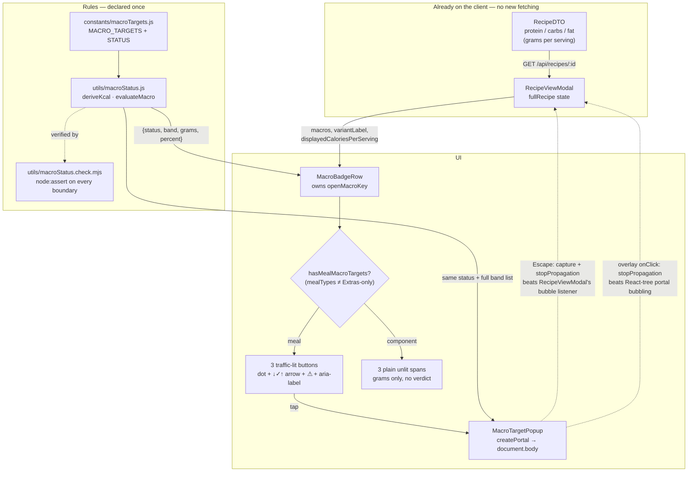

# Plan: Macro traffic light on the P / C / F badges

Plan folder: `.claude/contract/2026-07-30-macro-traffic-light/`
Execution status: see `tasks.md` in this folder.

---

## Part 1 — Alignment

### Subtask reference

No Jira subtask. Primed verbatim by the developer, with a screenshot of the `RecipeViewModal` header:

> I want to create a system for [screenshot] easily identifying the P C and F are within the target range — check the chef skill for the target range. I was thinking a traffic light system on the P C and F of the macros. I also want to be able to click onto the P C or F buttons and see what the traffic light system is, what the actual perfect targets are.

Follow-up decisions in-session:
- **Popup modal** (not an inline panel) for the detail view.
- **No traffic light on kcal** — its band shifts per variant.
- An **HTML mockup first, before any coding** → delivered at `C:\Users\jossd\Downloads\foodbytes-macro-traffic-light-mockup.html`. That file is the visual contract for this plan.
- **A 4th colour, because three could not distinguish over from under.** Developer: *"Red is capturing < 38 % or > 53 % which isn't clear which we are."* Resolved to **colour = direction**: blue is always below the target band, red always above it, green inside it, amber below-but-inside documented slack.
- **⚠ reject marker on the badge**, not popup-only — so severity survives colour becoming directional.
- **No internal file or skill names in user-visible copy; state where the information actually comes from.** Developer: *"just make sure we don't display things like 'CLAUDE.md rejects above 35 % outright and grants no slack'. State where the info comes from."* Resolved with a structured `sources` array per macro, rendered as a "Where this comes from" section.
- **Popups must be mobile-friendly.** Resolved by reusing the app's existing `usePullToDismiss` + `PullToDismissUI` pattern and `DailyMacroPopup`'s bottom-sheet treatment, rather than inventing a new mobile interaction.

### Restated goal

The recipe modal already prints `P 40g  C 61g  F 24g / serving`, but the numbers are inert — you have to remember that protein wants ≥35 g and that fat wants 25–35 % of calories to know whether a dish actually passes. This subtask colours each of those three badges against the documented targets on a **four-state scale where the colour tells you the direction of the miss** — blue below the band, green inside it, red above it, amber for below-but-within-documented-slack — and turns each badge into a button that opens a popup explaining what that colour means, what the exact perfect target is, and why that target exists. Read-only presentation of data the API already returns — no recipe data, macro maths, or API contract changes.

### In scope

- A single canonical band table (the four `under` / `near` / `on` / `over` thresholds per macro) declared once as a constant and imported, not duplicated per component.
- A pure evaluation function mapping a recipe's per-serving macros → a status per macro, with a runnable verification script (no test runner exists in this client).
- The three `P` / `C` / `F` badges in `RecipeViewModal` become traffic-lit `<button>`s: tinted background + coloured dot + a `↓ / ✓ / ↑` **direction arrow**, with an `aria-label` that states the status and direction in words.
- A `MacroTargetPopup` modal, opened by tapping a badge, containing: the current reading with its status, the exact perfect target, a legend of that macro's bands ordered blue → amber → green → red with "you are here" marked, a plain-English "why this target", and a **"Where this comes from"** list attributing every claim.
- Mobile behaviour on that popup matching the rest of the app: bottom sheet under 480 px, pull-to-dismiss via the existing `usePullToDismiss` hook, a legend that stays readable at 320 px, and `prefers-reduced-motion` respected.
- Suppression of the traffic light on **component recipes** (`Extras`-only — pesto, dough, pita, sauce, bread): grams still render, but as plain unlit non-interactive badges, because the per-meal targets do not govern a sub-component.
- An explicit **reject marker**, rendered independently of the traffic light, on any band that crosses a documented `CLAUDE.md` reject line: a `⚠` on the badge itself **and** a dark ⚠ Reject tag in the popup. Necessary because colour now encodes direction rather than severity, so red alone no longer means "must fix". *(Developer-confirmed: badge-level marker, not popup-only.)*
- Extraction of the macro row out of `RecipeViewModal.jsx` into its own component, so the file does not cross the 400-line blocking ceiling (it is at 380 today).
- Mobile-first CSS honouring the ≥44 px touch target, `@media (hover: hover)`, `:focus-visible`, and `touch-action` rules.

### Explicitly out of scope

- **Traffic light on the kcal badge** — developer-declined; its band is variant-dependent (Light 450–550 / Moderate 550–650 / Balanced 700–800).
- **`DailyMacroPopup` / `WeeklyMacroPopup`** — those show *daily and weekly totals*, which the per-meal targets in `CLAUDE.md` do not govern. Applying per-recipe bands to a day's sum would be wrong.
- **`RecipeCard`** — it renders no macro row today; adding one is a separate feature.
- **Any backend, DTO, or SQL change.** The audit below confirms the API already returns everything needed.
- **Storing anything.** This feature persists **nothing** — no new table, column, or migration; no write endpoint; no `localStorage` or `sessionStorage`; no cache. The thresholds, band copy, and source attributions live in a JavaScript constant file, deliberately *not* in a config table. The only state is `openMacroKey` (which popup is showing) in React `useState`, which is discarded when the popup closes. Every displayed number is read from the existing `GET /api/recipes/:id` response and re-derived on each render.
- **Fixing recipes the traffic light flags.** This ships the diagnostic, not the remediation.
- **Editing the target bands themselves.** They come from `CLAUDE.md` / the `chef` skill; this feature displays them.
- Bootstrapping `vite-plugin-pwa`, wiring a test runner, or clearing any of the pre-existing debt listed in the `react-frontend` skill.

### Pattern Reference (from subtask)

None supplied explicitly beyond the screenshot. Selected references, all authoritative for this change:

| Reference | Used for |
|---|---|
| `client/src/components/recipes/RecipeViewModal.jsx:303-310` | The exact markup being replaced. |
| `client/src/components/recipes/RecipeViewModal.css:102-127` | The `.recipe-macros` styles being moved and extended. |
| `client/src/components/mealplan/DailyMacroPopup.jsx` + `.css` | The house popup pattern — overlay, header, content scroller, close button, ESC/click-outside, hint footer, and the mobile bottom-sheet treatment. `MacroTargetPopup` mirrors it. |
| `client/src/hooks/usePullToDismiss.js` + `client/src/components/common/PullToDismissUI.jsx` | The app's existing mobile popup dismiss gesture. Reused as-is — the mobile requirement is met by adopting this, not by inventing a new interaction. |
| `client/src/constants/servings.js` | The existing `src/constants/` convention `macroTargets.js` follows. |
| `.claude/skills/chef/SKILL.md` § step 2 + `CLAUDE.md` § "Recipe creation — non-negotiable targets" | Source of the target bands and the reject lines. |
| `C:\Users\jossd\Downloads\foodbytes-macro-traffic-light-mockup.html` | The visual + copy contract, developer-reviewed. |

### Constraints flagged on the subtask

- **Targets must come from the `chef` skill**, not invented. Stated explicitly by the developer.
- **kcal is excluded** from the traffic light. Stated explicitly.
- **Popup modal**, not an inline panel. Stated explicitly.
- **Mockup before code.** Satisfied; the mockup is the reference for the implementation.
- **User-visible copy must never name an internal artefact** — no `CLAUDE.md`, no "the chef skill", no `.claude/rules/...`, no `FR-` numbers, no table names. Stated explicitly by the developer. Enforced mechanically by a copy-hygiene assertion in `macroStatus.check.mjs`, not left to review.
- **Every factual claim on screen must be attributed**, and an internal calibration must not borrow the authority of a published guideline by sitting next to one unattributed. The carb band in particular is *deliberately below* standard guidance and must say so.
- **Popups must be mobile-friendly** — bottom sheet, pull-to-dismiss, ≥44 px targets, and readable at 320 px. Stated explicitly by the developer.
- From `react-frontend` (hard floor): `RecipeViewModal.jsx` is **380 lines**; >400 is *blocking*. This change must not grow it — it extracts.
- From `react-frontend` (hard floor): **no test runner** is wired into `client/package.json`, so no test may be claimed as passing. Verification is a dependency-free `node:assert` script plus manual browser checks.
- From `react-frontend` (NEVER): no new runtime dependency, no `*.module.css`, no `console.log`, no second state manager.

### Assumptions made

- **Percentages are computed from macro-derived kcal (`4P + 4C + 9F`), not stored `recipes.calories`.** `CLAUDE.md` states stored calorie totals "have historically been wrong" and instructs re-deriving. A derived denominator also keeps the three percentages internally consistent with the grams on screen. The popup prints the displayed card kcal alongside it when the two disagree, so a data bug stays visible rather than being hidden. *Reflected in Approach and Risks.*
- **Colour encodes direction, not severity — so "must fix" needs its own signal.** Developer-chosen: blue = under the band, red = over it. The consequence is that red no longer means "rule breach": protein under 33 g and carbs under 38 % are both `CLAUDE.md` rejects and are **blue**, while carbs over 50 % is **red** but breaches nothing. Every band therefore carries a `reject: true` flag, surfaced as a dark ⚠ Reject tag in the popup and as ", rejected by the recipe rules" in the badge's `aria-label`. Without that tag the four-colour scheme would actively mislead. *Reflected in Approach, Data shapes and Risks.*
- **Bands are asymmetric because the source rules are.** Protein has no red band (more protein is never a fault; `CLAUDE.md` sets no upper limit). Fat has no amber (rejected above 35 % outright, no slack granted). Carbs are the only macro given explicit slack ("Reject if <38, 1–2 % slack OK") and the only one with no documented upper reject line. Filling the gaps for visual symmetry would mean inventing thresholds the docs do not contain. *Reflected in Data shapes and Risks.*
- **Protein's 33–34 g amber is justified by display rounding, not dietary slack.** `MacroCalculationService.java:50-57` divides then rounds HALF_UP to a whole number, so a badge reading 34 g can be up to 34.49 g of real protein. *Reflected in Risks.*
- **Bands are variant-independent, so the variant label is never consulted for status.** Light / Moderate / Balanced share identical protein / fat % / carb % targets and differ only on kcal — which is out of scope. This removes all variant plumbing from the feature. The variant label is passed to the popup for *display context only* ("per serving · Moderate"). *Reflected in Approach.*
- **The popup renders through `createPortal` into `document.body`.** `.recipe-view-modal` animates with `transform` (`RecipeViewModal.css:38`), which creates a containing block for `position: fixed` descendants; a nested popup would be positioned and clipped against the modal instead of the viewport. *Reflected in Runtime quality and Risks.*
- **`MacroTargetPopup` does not call `useBodyScrollLock`.** `RecipeViewModal` already holds the lock for as long as it is open (`RecipeViewModal.jsx:171`), and the hook is reference-counted; a second lock would be redundant. *Reflected in Runtime quality.*
- **Status is derived at render, not stored in state.** It is a pure function of props; caching it would risk staleness on variant switch for no measurable gain, and `react-frontend` forbids unprofiled memoisation. It follows that the badges appear when the recipe fetch resolves — *not* when the modal opens, since the header renders from summary props while macros arrive only with `fullRecipe`. *Reflected in Approach.*
- **The traffic light is suppressed on `Extras`-only recipes** (developer-confirmed). `fullRecipe` is swapped when navigating into a linked sub-recipe, so without this a component would be judged against per-meal targets — Pesto would show three rejections for being pesto. Missing/empty `mealTypes` deliberately keeps the light **on**, so a serialisation change fails visibly instead of silently disabling the feature everywhere. *Reflected in Approach and Risks.*
- **Confirmed by the developer:** popup modal; kcal excluded; four-state scale with blue = under and red = over; skills `react-frontend`, `chef`, `diet-guidelines`, `java-backend`; mockup-first.

### Cross-code alignment audit (FE ↔ BE ↔ DB)

No schema or API change is proposed, so no live-DB query was run. The audit instead traced the three fields the UI consumes, end to end, and found the chain already sound:

- **`RecipeDTO.protein` / `.carbs` / `.fat` are grams *per serving*** — declared and commented as such at `dto/RecipeDTO.java:16-18`. The `/ serving` suffix already rendered at `RecipeViewModal.jsx:308` is therefore correct, and the badges need no division.
- **Populated from the authoritative macro service**, not from stored columns: `RecipeService.java:142-145` calls `macroCalculationService.calculatePerServingMacros(recipe)` and assigns the returned triple.
- **Linked-recipe extras are included.** `MacroCalculationService.java:238` recurses into linked recipes, satisfying `.claude/rules/linked-recipe-extras.md` — the traffic light will not mis-flag a recipe that gets its carbs from a linked bread or dough.
- **Values are whole numbers.** `MacroCalculationService.java:50-57` divides by servings then `setScale(0, HALF_UP)`. This is the sole justification for protein's 33–34 g amber band, and it means percentages are computed from already-rounded grams — a ±1 % artefact, noted in Risks.
- **`recipes.calories` is whole-recipe kcal, not per-serving** (`CLAUDE.md`), which is precisely why it is not used as the percentage denominator. The value shown in the header badge is the already-divided `caloriesPerServing` prop, and that is what the popup displays for comparison.
- **Naming aligns across the chain** — `protein` / `carbs` / `fat` are the field names in the JPA-backed DTO, in the JSON, and in `fullRecipe.*` on the client. No renaming or mapping layer is introduced.
- **`RecipeDTO.mealTypes` is a reliable component-vs-meal signal** (queried live 2026-07-30). Of 160 recipes, **13 are extras-only and 147 are meals**; **0 recipes have no meal type at all**, and **0 are tagged both extras and a meal**. So "extras-only ⇒ component" is unambiguous with no overlap to disambiguate. `mealTypes` is already on the DTO (`RecipeDTO.java:21`) and is populated in the same mapping method as the macros (`RecipeService.java:150-152`), so this needs no backend change.
- **Case mismatch caught and corrected — `mealTypes` carries `meals.key`, not the display name.** `RecipeService.convertToDTO` maps `m.getMeal().getKey()` (`RecipeService.java:151`), and the `meals` table's keys are lowercase (`breakfast`, `lunch`, `dinner`, `snacks`, `extras`) while the `name` column holds the capitalised form. An initial `COMPONENT_MEAL_TYPE = 'Extras'` would therefore have matched nothing and left every component recipe traffic-lit — the exact failure the gate exists to prevent. The constant is `'extras'` and the comparison lower-cases its input; `macroStatus.check.mjs` asserts both casings so this cannot regress.
- **Component recipes would genuinely mis-flag if judged as meals** — measured from `recipe_ingredients` × `ingredients.*_per_100g`: Pesto is 1 g protein / 0 % carbs / 95 % fat (three rejections), Pita Bread 6 g / 68 % / 21 %, Pizza Dough 14 g / 61 % / 28 %. This is what motivates `hasMealMacroTargets`, not a hypothetical.

---

## Part 2 — Technical design

### Approach

The whole feature is a presentation layer over data the client already holds. `RecipeViewModal` fetches the full recipe at mount (`recipeService.getRecipeById`) and `fullRecipe.protein / .carbs / .fat` are already grams-per-serving. So there is no fetching, no context, and no service work — the design question is purely *where the rules live* and *how the UI is decomposed*.

Rules live in exactly one place: `client/src/constants/macroTargets.js`. It exports a `MACRO_TARGETS` map keyed `protein | carbs | fat`, each entry carrying its display code (`P`/`C`/`F`), label, whether it is judged on **grams** or on **% of kcal**, a human-readable `perfect` string, an *ordered* list of bands (each with a `status`, a `range` label, a `meaning`, an optional `reject: true`, and a predicate), and a sourced `why` string. Evaluation is a first-match walk down that ordered list, terminating in a catch-all, so adding or moving a threshold is a one-line edit in one file. Because macros have different numbers of bands — protein has three, carbs four, fat three — the list is ordered for *correct evaluation*, and the popup re-sorts it into blue → amber → green → red for *display*; those two orderings are deliberately decoupled so a future threshold change cannot silently reorder the legend. The `why` strings cite the source body (USDA AMDR, Moore/Morton MPS, the deliberate sub-AMDR carb decision) per the `diet-guidelines` skill's requirement that macro claims name their source.

The evaluation itself is a pure function in `client/src/utils/macroStatus.js` — `deriveKcal(macros)` and `evaluateMacro(macros, key)` returning `{ status, band, grams, percent, derivedKcal }`. Keeping it pure and React-free is what makes it verifiable: `macroStatus.check.mjs` imports it directly under `node` and asserts every threshold and boundary with `node:assert`. That matters because this client has **no test runner**, and adding Vitest for one module would breach the "justify any new dependency" rule; `package.json` already declares `"type": "module"`, so a plain `node` script needs nothing installed. The alternative — shipping the thresholds unverified and eyeballing them in the browser — is how an off-by-one on a reject line reaches production.

The UI splits into two new components rather than growing `RecipeViewModal.jsx`, which sits at 380 lines against a **400-line blocking ceiling**. `MacroBadgeRow` takes over the eight lines at `RecipeViewModal.jsx:303-310`, renders the three traffic-lit buttons, and owns the single piece of state this feature needs — `openMacroKey`. `MacroTargetPopup` is the detail modal, mirroring `DailyMacroPopup`'s markup and class vocabulary so it inherits the app's established popup look. The net effect on `RecipeViewModal.jsx` is roughly flat: eight lines of markup out, one import and a five-line element in. Rejected alternative: keeping the row inline and adding the status logic there, which is the smallest diff but pushes the file over the ceiling and puts rule-evaluation logic in a component — both explicit `react-frontend` violations.

**When it computes** falls out of that placement, and is worth stating because it is not "on modal open". `RecipeViewModal` renders its header immediately from summary props but fetches the full recipe on mount, and macros live only on `fullRecipe` — so `MacroBadgeRow` returns `null` until that request resolves, then the badges appear. After that it recomputes on each render of the row: variant switch (refetch swaps `fullRecipe`), linked-recipe navigation (same), and popup open/close (a state change that re-derives the same answer). Grams are never computed on the client — they arrive per-serving and already rounded to integers; only the percentages are derived, synchronously, from those grams. One consequence: on a variant switch the kcal badge updates instantly from variant summary data while the badges lag until the fetch resolves, so there is a brief window where they disagree.

Because `fullRecipe` is swapped on linked-recipe navigation, the row also has to know when the targets *don't* apply. Tapping into a linked sub-component makes that component the rendered recipe, and per-meal targets are meaningless for pesto or pizza dough — measured against them, Pesto (1 g protein, 95 % fat) shows three rejections for being correct pesto. `hasMealMacroTargets` gates on `RecipeDTO.mealTypes`: `Extras`-only recipes render plain unlit badges, the pre-FR-104 presentation. The live data makes this clean — 13 Extras-only, 147 meals, none tagged both, none untagged — so there is no ambiguous middle case to arbitrate.

The one non-obvious mechanical decision is that `MacroTargetPopup` renders through `createPortal` into `document.body`. Two independent problems force it. First, `.recipe-view-modal` animates with `transform`, which establishes a containing block for `position: fixed` descendants — a nested popup would size and clip against the modal, not the viewport. Second, `.recipe-view-overlay` has `onClick={onClose}`, and because React portals propagate events along the *component* tree rather than the DOM tree, a click inside the popup would still reach that handler and close the recipe. The portal fixes the first; an explicit `stopPropagation()` on the popup's overlay `onClick` fixes the second. Escape needs the same care: `RecipeViewModal` already listens for Escape on `document` in the bubble phase, so the popup registers its own listener with `{ capture: true }` and calls `stopPropagation()`, guaranteeing Escape closes the popup first and the recipe second — matching the precedence `RecipeViewModal` already implements for its own calorie dropdown at lines 155-167.

### Skills to invoke during execution

- `react-frontend` — governs everything here: the 400-line ceiling that forces the extraction, the ≥44 px touch target and `@media (hover: hover)` / `:focus-visible` / `touch-action` rules for the new buttons, the `src/constants/` convention, the plain-CSS-not-modules rule, and the "never claim a test passed" constraint that shapes verification.
- `chef` — the authoritative source of the target bands (§ step 2 table) and of the reject lines that decide where red begins rather than amber.
- `diet-guidelines` — supplies the sourced provenance for each `why` string and requires that every macro claim name its source body (USDA / NIH-NHLBI / Cochrane).
- `java-backend` — ticked by the developer. The alignment audit above found **no backend change is required**; carry it only to confirm during execution that `RecipeDTO` still returns per-serving grams before relying on that, and touch nothing under `foodbytes-api/`.

*Developer override: all four skills were confirmed ticked, including `java-backend`, which the classifier had flagged as probably unnecessary. Retained as a read-only verification step per the note above.*

### Diagram



### Data shapes

No schema, DTO, or HTTP contract changes. All shapes below are new **client-side** constants and function signatures.

#### `client/src/constants/macroTargets.js`

```js
export const MACRO_STATUS = { UNDER: 'under', NEAR: 'near', ON: 'on', OVER: 'over' }

// Display order for the popup legend — independent of evaluation order.
export const STATUS_DISPLAY_ORDER = ['under', 'near', 'on', 'over']

export const STATUS_WORD  = { under: 'Under target', near: 'Under target', on: 'On target', over: 'Over target' }
export const STATUS_ARROW = { under: '↓',            near: '↓',            on: '✓',         over: '↑' }

export const MACRO_KEYS = ['protein', 'carbs', 'fat']

// mode: 'grams'   → the predicate receives grams per serving
// mode: 'percent' → the predicate receives % of derived kcal (integer)
// bands: ORDERED FOR EVALUATION — first matching predicate wins, so the
//        last band MUST be a catch-all. Not the display order.
// reject: true    → crosses a documented CLAUDE.md reject line.
export const MACRO_TARGETS = {
  protein: {
    key: 'protein', code: 'P', label: 'Protein', mode: 'grams',
    perfect: '≥ 35 g per serving',
    bands: [
      { status: 'on',    range: '≥ 35 g',    meaning: '...',                test: v => v >= 35 },
      { status: 'near',  range: '33 – 34 g', meaning: '...',                test: v => v >= 33 },
      { status: 'under', range: '< 33 g',    meaning: '...', reject: true,  test: () => true }
    ],
    why: '...'   // cites USDA 2025–2030 + Moore/Morton
  },
  carbs: {
    key: 'carbs', code: 'C', label: 'Carbohydrate', mode: 'percent',
    perfect: '40 – 50 % of kcal',
    bands: [
      { status: 'on',    range: '40 – 50 %', meaning: '...',                test: p => p >= 40 && p <= 50 },
      { status: 'over',  range: '> 50 %',    meaning: '...',                test: p => p > 50 },
      { status: 'near',  range: '38 – 39 %', meaning: '...',                test: p => p >= 38 },
      { status: 'under', range: '< 38 %',    meaning: '...', reject: true,  test: () => true }
    ],
    why: '...'   // cites the deliberate sub-AMDR carb decision
  },
  fat: {
    key: 'fat', code: 'F', label: 'Fat', mode: 'percent',
    perfect: '25 – 35 % of kcal',
    bands: [
      { status: 'on',    range: '25 – 35 %', meaning: '...',                test: p => p >= 25 && p <= 35 },
      { status: 'under', range: '< 25 %',    meaning: '...',                test: p => p < 25 },
      { status: 'over',  range: '> 35 %',    meaning: '...', reject: true,  test: () => true }
    ],
    why: '...'   // cites USDA AMDR 20–35 % + the chef skill's dry-dish warning
  }
}
```

The `meaning` and `why` strings are elided as `'...'` above only to keep this shape readable. They are **not** open questions: every one is specified verbatim in the reviewed mockup (`MACRO_TARGETS` in `foodbytes-macro-traffic-light-mockup.html`) and is reproduced literally in `tasks.md`.

**The band table (the substance of this change):**

| Macro | Judged on | 🔵 Blue ↓ *under* | 🟡 Amber ↓ *under, in slack* | 🟢 Green ✓ *on target* | 🔴 Red ↑ *over* |
|---|---|---|---|---|---|
| Protein | grams/serving | `< 33 g` **⚠ reject** | `33 – 34 g` | `≥ 35 g` | *n/a* |
| Carbs | % of derived kcal | `< 38 %` **⚠ reject** | `38 – 39 %` | `40 – 50 %` | `> 50 %` |
| Fat | % of derived kcal | `< 25 %` | *n/a* | `25 – 35 %` | `> 35 %` **⚠ reject** |

Green is the `CLAUDE.md` target band verbatim. Colour indicates **direction**; the **⚠ reject** tag — not the colour — indicates a documented rule breach. The `n/a` gaps and the reject placement are both consequences of the source rules, not oversights; see Assumptions.

Verified by `macroStatus.check.mjs`: 20 boundary assertions across all thresholds (both sides of each), plus `deriveKcal`, the zero/null-macro guards, and five end-to-end recipe cases.

`MacroBadgeRow` takes the whole `recipe` DTO and narrows it to `{protein, carbs, fat}` once, rather than having the call site build that object — this keeps the `RecipeViewModal` edit to four lines, which matters against the 400-line budget.

#### `client/src/utils/macroStatus.js`

```js
/** @param {{protein:number, carbs:number, fat:number}} macros */
export function deriveKcal(macros)            // → number  (4P + 4C + 9F)

/**
 * @param {{protein:number, carbs:number, fat:number}} macros
 * @param {'protein'|'carbs'|'fat'} key
 * @returns {{
 *   status: 'on'|'near'|'off',
 *   band:   { status: string, range: string, meaning: string },
 *   grams:  number,
 *   percent: number,      // integer % of derived kcal
 *   derivedKcal: number
 * }}
 */
export function evaluateMacro(macros, key)

/**
 * Whether the per-meal targets apply at all. False for Extras-only component
 * recipes, which render plain unlit badges. Missing/empty mealTypes returns true
 * so the feature fails visibly rather than silently switching off.
 *
 * @param {{mealTypes?: string[]} | null} recipe
 * @returns {boolean}
 */
export function hasMealMacroTargets(recipe)
```

Guard: when `derivedKcal === 0` (all three macros null/zero), `percent` is `0` and evaluation still returns a band — never `NaN`, never a thrown error.

#### Attribution — the `sources` array

Each macro carries a `sources` array alongside `why`, so no claim reaches the screen unattributed and an internal calibration cannot pass as published guidance:

```js
sources: [
  { claim: '1.2–1.6 g protein per kg of bodyweight per day',
    source: 'USDA Dietary Guidelines for Americans 2025–2030' },
  { claim: '20–40 g per meal maximises muscle-protein synthesis',
    source: 'Moore & Morton, muscle-protein-synthesis literature' },
  { claim: 'A 35 g per-serving floor, and rejection below it',
    source: 'FoodBytes recipe standard — internal calibration, no external source' }
]
```

Rendered as a "Where this comes from" list in the popup. `macroStatus.check.mjs` asserts that every user-visible string is free of banned internal tokens (`CLAUDE.md`, `.claude`, `SKILL.md`, "chef skill", `FR-`, table names), that every source entry has both halves, and that each macro names its FoodBytes-internal portion.

#### Component props

```jsx
<MacroBadgeRow
  recipe={fullRecipe}                   // the DTO; narrowed to {protein,carbs,fat} internally
  variantLabel={'Moderate'}             // display context only, never used for status
  displayedCaloriesPerServing={611}     // the header badge value, for the mismatch line
/>

<MacroTargetPopup
  macroKey={'protein'}                  // 'protein' | 'carbs' | 'fat'
  macros={{ protein, carbs, fat }}
  variantLabel={'Moderate'}
  displayedCaloriesPerServing={611}
  onClose={fn}
/>
```

#### New CSS custom properties (appended to `:root` in `client/src/styles/global.css`)

```css
--macro-under-target: #4aa3f0;   /* blue  — NEW, no existing equivalent */
--macro-near-target:  #ffc107;   /* amber — = existing --warning */
--macro-on-target:    #28a745;   /* green — = existing --success */
--macro-over-target:  #dc3545;   /* red   — = existing --error   */
```

Aliases rather than raw reuse of `--success` / `--warning` / `--error`, so the traffic light can be retuned for contrast on the purple header without changing every success/warning affordance in the app. The blue has no existing equivalent — `--aisle-dairy: #2196f3` is the nearest, but it is semantically an aisle colour and reads muddy against the `#4a3f80` brand purple. `#4aa3f0` is the starting value; the verification phase checks it for both AA contrast and separation from the brand purple, with `#56ccf2` as the documented fallback.

### Runtime quality notes

No `${CLAUDE_PLUGIN_ROOT}/rules/code-quality.md` exists in this installation — that path belongs to the EIDA plugin, which is not installed here. The four dimensions are addressed against this client's actual runtime instead.

- **Resource cleanup:** `MacroTargetPopup` adds one `document` listener of its own (`keydown`, capture phase), removed in cleanup with the *same* `capture` flag it was registered with — a `removeEventListener` that omits `{ capture: true }` does not match and would silently leak a listener on every open/close cycle. Click-outside is handled by the overlay's own `onClick` rather than a second document listener, so there is one fewer thing to leak. `usePullToDismiss` attaches a non-passive native `touchmove` to the panel and owns its own teardown (`usePullToDismiss.js:131-140`), keyed on the gesture element — reusing the hook means not re-implementing that cleanup. The component unmounts when `openMacroKey` goes null, so nothing survives close. No timers, no intervals, no subscriptions, no in-flight requests. `useBodyScrollLock` is deliberately not called here: `RecipeViewModal` already holds the reference-counted lock for its whole lifetime, so a second acquire/release pair would be redundant bookkeeping.
- **Concurrency / thread-safety:** Single-threaded browser JS, no shared mutable state, no async in this feature at all — status is derived synchronously from props during render, so there is no window in which a variant switch could interleave with an evaluation and render a stale colour. `MACRO_TARGETS` is module-level and **read-only by contract**; nothing mutates it, so no two components can observe divergent bands. The one ordering hazard is the Escape-key race against `RecipeViewModal`'s existing bubble-phase handler, resolved deterministically by capture-phase registration plus `stopPropagation()` rather than by listener-registration luck.
- **Allocation behaviour:** Not a hot path — the badge row renders three buttons, once per modal open and once per variant switch. `evaluateMacro` is called three times per render and allocates one small result object each; the band predicates are declared once at module scope, not per call. `MACRO_TARGETS` is a single frozen-by-convention literal shared across all consumers. No arrays are rebuilt per keystroke, no large strings are concatenated, and per `react-frontend` no `useMemo` is added without profiling evidence — memoising three integer comparisons would cost more in retained closures than it saves.
- **Error paths:** The row renders only when at least one macro is non-null, preserving the existing guard at `RecipeViewModal.jsx:303`; missing macros coerce to `0` exactly as the current `?? 0` does. A zero `derivedKcal` yields `0 %` and a red band, not a division-by-zero or `NaN` in the DOM. Because every macro's ordered band list ends in a catch-all predicate, `evaluateMacro` cannot return `undefined` for `band` and the UI cannot render a colourless badge — this is the specific failure the boundary assertions in `macroStatus.check.mjs` exist to catch, since a mistyped predicate could otherwise leave a gap between bands that only shows up on one unlucky recipe. There is no network call here, so there is no loading, error, or empty state to add: the four-async-states rule is satisfied by `RecipeViewModal`, which already handles all four for the recipe fetch. Nothing is logged — no `console.*` is added, keeping the repo's 6-call baseline intact.

### Risks and judgement calls

- **Red no longer means "must fix", and that is the single most important consequence of the four-colour choice.** Because colour now encodes direction, a `CLAUDE.md` reject shows as **blue** for protein and carbs (both are under-target failures) but as **red** for fat (an over-target failure). Meanwhile carbs over 50 % is red yet breaches no documented rule. *Resolved, developer-confirmed:* a `⚠` renders on the badge itself for any reject band, plus a ⚠ Reject tag in the popup — so severity is legible without reading colour. The residual risk is glyph crowding: a rejecting badge now shows dot + letter + grams + arrow + ⚠ in one pill, which the verification phase checks at 320 px width.
- **Amber appears on only one macro, and blue means two different things.** Carbs is the only macro with an amber band (it is the only one granted slack), and blue means "reject" on protein/carbs but "will taste dry" on fat. Both asymmetries are faithful to the source rules, but a user scanning three badges may reasonably read blue as one consistent severity. The popup's per-macro legend is where that gets disambiguated.
- **Protein's 33–34 g amber is a rounding allowance, not dietary slack.** It exists only because `MacroCalculationService` rounds grams to integers. If you would rather the badge mirror the rule exactly — green at ≥35, blue below — delete that band and the predicate list collapses to two entries.
- **Protein has no red band at all**, so a 90 g-protein recipe reads identically to a 35 g one. That is intentional (no upper limit is documented) but means the badge cannot flag a wildly protein-skewed dish.
- **Percentages use derived kcal, so they may not reconcile with the kcal badge above them.** A recipe whose stored `calories` is wrong will show `4P+4C+9F` percentages that disagree with the displayed `611 cal`. The popup surfaces both values explicitly, which turns this into a data-bug detector — but it does mean two different calorie numbers can appear in the same modal. The alternative (using stored calories) would make the percentages agree while being derived from a value `CLAUDE.md` says not to trust.
- **Percentages are computed from already-rounded grams**, so they can be off by ~1 point versus the true ratio. At a boundary — 39 % vs 40 % carbs — that can flip amber/green. Fixing it properly means the API returning unrounded macros, which is a backend change this subtask excludes.
- **Two contrast checks are needed, not one, and blue is the riskier of them.** `rgba(74,163,240,.32)` over the `#4a3f80` brand purple is the new problem: blue-on-purple is a hue neighbour, so the badge may read as "no state set" rather than "under target" even where white text passes AA. Amber (`rgba(255,193,7,.26)`) is the other borderline tint. The verification phase measures both; fallbacks are `#56ccf2` for the blue, and dropping the tint in favour of border + dot + arrow only. The `↓ / ✓ / ↑` arrow and the `aria-label` mean the signal never depends on colour alone regardless — which is also what protects red/green colour-blind users, for whom the two most important states are otherwise indistinguishable.
- **`createPortal` is new to this codebase.** `DailyMacroPopup` renders inline and gets away with it because no transformed ancestor sits above it; `RecipeViewModal` does animate with `transform`, so the same inline approach would misbehave here. Worth confirming you are happy introducing the pattern rather than, say, hoisting popup state up into `RecipeViewModal` — which would work but would grow a file already 20 lines from a blocking ceiling.
- **Escape precedence depends on capture-phase ordering.** It is deterministic and standard, but it is a subtle coupling to a listener in a different file. If `RecipeViewModal`'s Escape handling is ever refactored to capture phase too, this breaks. The verification phase tests Escape explicitly for that reason.
- **Component suppression trusts `mealTypes`, so a mis-tagged recipe is mis-rendered.** A real meal tagged only `Extras` silently loses its traffic light; a component tagged `Dinner` gets false rejections. Today's data is clean (verified above), but this couples a UI behaviour to a data-entry field with no admin validation behind it. The alternative — a dedicated `is_component` column — is a schema change this subtask excludes.
- **Pull-to-dismiss inside a portal is the one reuse worth watching.** `usePullToDismiss` was written for `DailyMacroPopup`, which renders inline; here it runs inside a `createPortal` subtree. The gesture logic itself is DOM-position-agnostic (it reads `window.innerWidth` and the scroller's `scrollTop`), so it should transfer cleanly, and `PullToDismissUI` is `position: fixed` at `z-index: 1100`, which sits correctly above the popup panel. Task 9 Step 6 verifies it rather than assuming — the plausible failure is the gesture arming but the popup scrolling at the same time, which means `setGestureRef` landed on the wrong element.
- **The popup is now the longest component in the feature.** Adding the sources list pushes `MacroTargetPopup.jsx` toward ~200 lines. Still well inside the 400-line ceiling, but if it crosses 250 the legend and sources lists should split into a sibling presentational component — flagged in Task 4 Step 3 rather than discovered later.
- **The copy-hygiene assertion catches banned tokens, not bad writing.** It will stop `CLAUDE.md` reappearing in a `why` string; it cannot tell whether a sentence reads clearly or whether an attribution is honest. Task 9 Step 13 exists because that part still needs a human read.
- **The verification script is not a test suite.** `macroStatus.check.mjs` asserts the pure band logic and nothing else; component rendering, the portal, and the popup interactions are verified manually in a browser. No claim will be made that "tests pass" — this client has no test runner, and the summary will state exactly what was and was not exercised.
