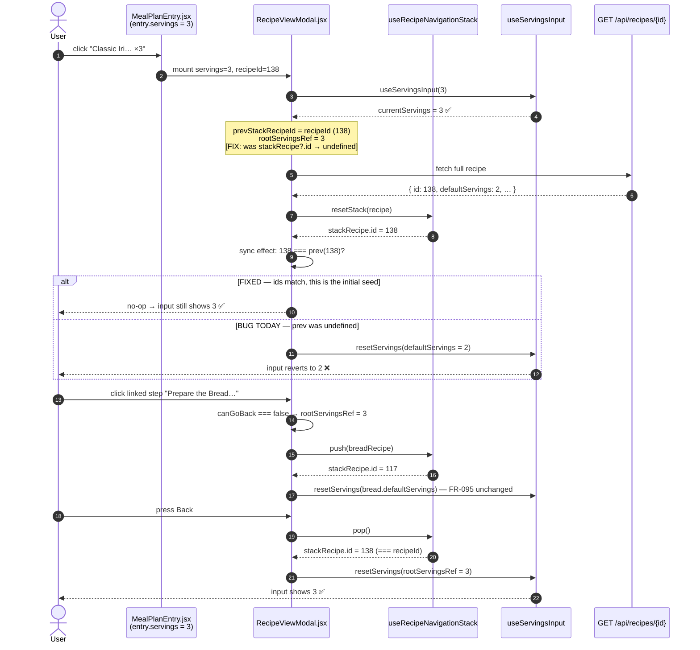

# Plan: Recipe view modal resets planned servings to the recipe default

Plan folder: `.claude/contract/2026-07-30-modal-servings-revert/`
Execution status: see `tasks.md` in this folder.

---

## Part 1 — Alignment

### Subtask reference

No Jira key supplied. Verbatim from the developer, with two screenshots:

> "So I selected Beef stew with 3 portions. but when I clikc on teh recipe to view from the meal plan it shows 3, but the serving reverts back to 2"

Screenshot 1 — the meal plan calendar, Sat Jul 4 lunch: `Classic Iri… 686 cal × 3`.
Screenshot 2 — the recipe view modal opened from that entry: `Classic Irish Beef Stew`, `686 cal ▾`, servings input reads **`2`**. `2` is the recipe's own `default_servings`, not the planned `3`.

No `/brainstorming` spec was consumed — this folder has no `spec.md`.

### Restated goal

Opening `RecipeViewModal` from a meal-plan entry must show — and keep showing — the servings that entry was planned with, so the ingredient quantities the cook reads are scaled for the portions actually planned. Today the modal seeds the servings input correctly from `entry.servings`, then a navigation-sync effect fires once the recipe fetch resolves and overwrites it with the recipe's `defaultServings`. The user sees `3` flash and settle on `2`, and every ingredient quantity below is then scaled for 2 servings instead of 3. The fix is to stop treating the initial seeding of the recipe-navigation stack as a navigation event, and to remember the root recipe's servings so back-navigation from a linked sub-recipe restores it instead of resetting to the default.

### In scope

- `RecipeViewModal.jsx` no longer resets servings when the navigation stack is seeded with the root recipe after the on-mount fetch — the caller-supplied `servings` prop survives.
- Back-navigation from a linked sub-recipe to the root restores the root's servings (developer-confirmed) rather than resetting to `defaultServings`.
- Navigating *into* a linked sub-recipe still resets to that sub-recipe's own `defaultServings` — FR-095 "independent servings per recipe" is preserved unchanged.
- `resetServings` in `useServingsInput.js` becomes referentially stable (`useCallback`) and normalises its argument through `parseServings`, so it can be an honest effect dependency and cannot seed a non-numeric value into scaling arithmetic.
- `DEFAULT_SERVINGS = 1` added to `client/src/constants/servings.js`, replacing the two `|| 1` literals that the fallback is spread across.
- Verification by production build + a scripted manual smoke run (there is no frontend test runner — see Constraints).

### Explicitly out of scope

- **Any backend or database change.** The audit below confirms the API already serves `entry.servings` correctly as `BigDecimal`; the defect is entirely client-side.
- **Per-recipe servings memory for sub-recipes.** Navigate into Bread, set it to 4, go back, go into Bread again — it re-seeds from `defaultServings`. Only the *root* recipe's servings is remembered. Persisting a servings value per stack frame is a larger FR-095 change.
- **Editing servings on an already-planned entry.** The modal's servings input stays display-only; it does not write back to `meal_plan_entries`. Confirmed still-open from the `2026-07-29-decimal-serving-size` plan, which excluded `PATCH /api/meal-plan/{id}` for the same reason.
- **Restoring the selected variant across back-navigation.** Switch variant, enter a linked recipe, press Back → the root reverts to the stack's stored variant. Pre-existing, orthogonal to servings, and untouched here. Flagged in Risks.
- **Surfacing linked-recipe fetch failures in the UI.** `handleLinkedStepClick` only `console.error`s on failure, leaving a dead click. Pre-existing; this change edits that function but deliberately does not widen into error-UX work. Called out so it is a decision, not an oversight.
- **Day / week calorie totals honouring the servings multiplier.** Still per-serving by design (FR-017 / FR-036), as recorded in the `2026-07-29-decimal-serving-size` plan.

### Pattern Reference (from subtask)

None supplied — the subtask is a prose bug report with screenshots. References selected for this plan:

- `foodbytes-app/client/src/components/recipes/RecipeViewModal.jsx:105-114` — the defective effect. This is the change site.
- `foodbytes-app/client/src/hooks/useRecipeNavigationStack.js:45-47` — `reset` is already a `useCallback` with `[]` deps, and `RecipeViewModal.jsx:100` already lists it as an effect dependency. `resetServings` gets the same treatment for the same reason.
- `.claude/contract/2026-07-29-decimal-serving-size/plan.md` — the plan that introduced `constants/servings.js`, `servingsUtils.js`, and `useServingsInput.js`. Its conventions (decimal-aware parsing, clamped at 2 dp, bounds declared once) govern this change.

### Constraints flagged on the subtask

The developer flagged none explicitly. Binding constraints carried in from `CLAUDE.md` and the loaded skills:

- **No frontend test runner.** `client/package.json` wires only `dev`, `build`, `preview` — no `test` script, no Vitest, no Playwright. Per the `react-frontend` skill's hard floor, no task in this plan may claim a test passed. Verification is `npm run build` plus a scripted manual smoke run.
- **400-line component budget, measured not estimated.** `RecipeViewModal.jsx` is at **380 lines** and named in the skill's known-debt table as "at the ceiling". This change adds roughly 10 lines; the count must be measured after the edit and stay under 400.
- **No unjustified `useCallback`.** The skill forbids memoisation without profiling evidence. The `useCallback` here is for *referential stability in an effect dependency array*, not performance — that rationale must be stated in the code comment, matching how `useRecipeNavigationStack` already justifies its own.
- **No new runtime dependency, no TypeScript, no second state manager.** None are needed.

### Assumptions made

- **Back-navigation restores the root's servings** — *developer-confirmed* via `AskUserQuestion`. Rationale: it is the same defect class as the reported symptom, and closing it costs ~5 lines.
- **"Restore" means the value on screen when the root was left, not strictly the value the modal opened with.** Rationale: the developer's confirmed preview showed `open ×3 → into Bread → Back → 3`, which both readings satisfy. Capturing at push time is the same line count and behaves more intuitively if the user edited servings before navigating away. Red-line this bullet if you want the literal opened-value semantics instead — it is a one-line change (seed the ref and never update it).
- **The `servings` prop is authoritative and needs no null guard at the call site.** Rationale: both call sites always pass a value — `MealPlanEntry.jsx:111` passes `entry.servings` (`BigDecimal`, `NOT NULL` in the DB) and `RecipeCard.jsx:253` passes its own picker state. `resetServings` still normalises defensively through `parseServings`, so a `null` degrades to `DEFAULT_SERVINGS` rather than poisoning `scaleQuantity`.
- **The fix belongs in `RecipeViewModal`, not in `MealPlanEntry`.** Rationale: `MealPlanEntry` already passes the correct value; the modal discards it. Fixing the consumer also repairs the `RecipeCard` path, which has the same defect (see Approach).
- **`java-backend` was loaded to audit, not to change.** Rationale: the developer added it to the skill list. It was used to verify the DTO and service path; the audit found nothing to fix, so no backend task exists. Red-line if you expected a backend change — the audit findings are below.
- **No live-database query was run.** Rationale: no schema, query, or persisted value changes, so a read of the production `meal_plan_entries` table would have added no signal — and it holds real user data. The alignment audit was performed against the entity, DTO, service, and component source instead.

### Cross-code alignment audit (FE ↔ BE ↔ DB)

Performed at source level across the full `servings` chain. No live-DB query was run (see Assumptions).

- **DB → entity:** `meal_plan_entries.servings` is `DECIMAL(4,2) NOT NULL DEFAULT 1.00` per the applied `2026-07-29-decimal-serving-size` migration; `MealPlanEntry.servings` is `BigDecimal`. Aligned.
- **Entity → DTO:** `MealPlanService:389` — `dto.setServings(entry.getServings())`, and `MealPlanEntryDTO.servings` is `BigDecimal` (`MealPlanEntryDTO.java:23`). The planned value is populated on every read and reaches the wire. **No backend defect.**
- **Write path sanity:** `MealPlanService:182` — `entry.setServings(resolveServings(request.getServings(), recipe))`. An explicit `3` from the client is stored as `3`; only an omitted/non-positive value falls back to the recipe's `default_servings`. Consistent with the screenshot showing `× 3` persisted.
- **DTO → calendar UI:** `MealPlanEntry.jsx:73-75` renders the `× 3` chip from `entry.servings`. The screenshot proves the value survives to the browser — which localises the defect strictly downstream of this point.
- **Calendar → modal prop:** `MealPlanEntry.jsx:111` passes `servings={entry.servings}`; `RecipeViewModal` accepts it and seeds `useServingsInput(servings)` at `RecipeViewModal.jsx:76`. Correct on mount.
- **Break point:** `RecipeViewModal.jsx:105-114`. `prevStackRecipeId` is seeded from `stackRecipe?.id`, which is `undefined` on first render because `fullRecipe` is still `null`. When the fetch resolves and `resetStack(data)` seeds the stack, `stackRecipe.id !== undefined` reads as *navigation*, and `resetServings(stackRecipe.defaultServings || 1)` overwrites the caller's `3` with the recipe's `2`. **This is the whole defect.**
- **Naming consistency:** `servings` is the identical key at every hop — column, entity field, DTO field, JSON key, prop, hook state. No rename or aliasing anywhere in the chain.

---

## Part 2 — Technical design

### Approach

The defect is a single ambiguity: the effect at `RecipeViewModal.jsx:105-114` cannot tell "the navigation stack was seeded with the root recipe for the first time" from "the user navigated to a different recipe". Both present as *`stackRecipe.id` differs from what I last saw*, because the ref that holds "what I last saw" is initialised during the first render, when `fullRecipe` is `null` and there is no id to record. The fix removes the ambiguity at the source: seed `prevStackRecipeId` with the `recipeId` **prop**, which is known at first render and is by definition the id the stack will be seeded with. The initial seed then compares equal, the effect no-ops, and the caller's `servings` survives untouched. Nothing about how navigation behaves changes — a push to a linked recipe still compares unequal and still resets to that recipe's `defaultServings`, preserving FR-095.

That leaves back-navigation, which the developer confirmed should restore the root's servings rather than reset to `defaultServings`. A second ref, `rootServingsRef`, holds it. It is seeded once from the `servings` prop via `useRef(servings)` — deliberately *not* synced from the prop by an effect, which would clobber a user edit — and refreshed inside `handleLinkedStepClick` at the moment the user leaves the root, guarded by `!canGoBack` so a push from depth 2 to depth 3 cannot overwrite it. The sync effect then branches on `stackRecipe.id === recipeId`: root gets `rootServingsRef.current`, anything else gets its own default.

The alternative considered and rejected was making the effect depth-driven instead of id-driven — compare `depth` from `useRecipeNavigationStack` and only reset on an increase. It reads cleanly but is wrong for this component: `recipeId` is not constant on the `RecipeCard` path (`RecipeCard.jsx:251` passes `recipeId={selectedVariantId}`, and `handleModalVariantSelect` mutates it), so a variant switch re-runs the fetch effect and re-seeds the stack at *unchanged* depth with a *different* recipe. An id-driven check handles that correctly — and as a free consequence this fix also cures the same servings reset when switching variants from a recipe card, which is the identical bug on a second surface. A depth-driven check would silently miss it.

Two supporting edits keep the change honest rather than merely working. `resetServings` is wrapped in `useCallback` with `[]` deps — `useState` setters are stable, so this is safe — purely so it can be listed in the effect's dependency array without re-firing on every render; this mirrors `useRecipeNavigationStack.reset`, which `RecipeViewModal.jsx:100` already depends on for the same reason. And `resetServings` now routes its argument through `parseServings`, so the value that reaches `scaleQuantity`'s arithmetic is always a clamped 2-dp number rather than whatever the caller happened to hold — the `|| 1` fallback that was duplicated at two call sites becomes the `DEFAULT_SERVINGS` constant, per the constants rule in the `react-frontend` skill.

### Skills to invoke during execution

- `react-frontend` — governs all three client edits: the ≤400-line measured budget on `RecipeViewModal.jsx` (currently 380), the constants rule that motivates `DEFAULT_SERVINGS`, the "no memoisation without justification" rule that the `useCallback` must answer to in a comment, the "logic belongs in a `use*` hook" rule, and the standing prohibition on claiming a frontend test passed.
- `java-backend` — added by the developer. Used in planning to audit the `servings` chain from `MealPlanEntry` entity → `MealPlanEntryDTO` → `MealPlanService.buildEntryDTO`. Audit found no defect, so it governs **no task**; the execution session should invoke it only if the smoke run contradicts the audit and the API turns out to be serving a wrong `servings` value.

Developer override: `java-backend` was ticked in addition to the proposed `react-frontend`; `requirements` was offered and declined.

### Diagram



### Data shapes

No schema change, no API contract change, no DTO change. The shapes below are the client-side surfaces this change introduces or modifies.

#### `client/src/constants/servings.js` — one added export

```js
export const DEFAULT_SERVINGS = 1   // fallback when a servings value is absent or unparseable
```

Existing `MIN_SERVINGS = 0.25`, `MAX_SERVINGS = 20`, `SERVINGS_STEP = 0.5` are unchanged.

#### `useServingsInput` — return shape unchanged, `resetServings` contract tightened

```js
useServingsInput(initialServings: number) => {
  servings: number,                                  // unchanged
  servingsDisplay: string,                           // unchanged
  handleServingsChange: (event: Event) => void,      // unchanged
  handleServingsBlur: () => void,                    // unchanged
  resetServings: (value: number|string|null) => void // now useCallback([]) — stable identity;
                                                     // normalises via parseServings;
                                                     // falls back to DEFAULT_SERVINGS when null
}
```

#### `RecipeViewModal` — two refs, no new props

| Identifier | Type | Initial value | Written when | Read when |
|---|---|---|---|---|
| `prevStackRecipeId` | `useRef<number\|null>` | `recipeId` prop | sync effect fires on a genuine recipe change | every run of the sync effect |
| `rootServingsRef` | `useRef<number>` | `servings` prop | in `handleLinkedStepClick`, only while `!canGoBack` | sync effect, when `stackRecipe.id === recipeId` |

Props (`recipeId`, `recipeName`, `servings`, `caloriesPerServing`, `isCheat`, `hasExtras`, `onClose`, `variants`, `onSelectVariant`, `parentRecipeId`) are unchanged in name, type, and count. Neither call site — `MealPlanEntry.jsx:108-122`, `RecipeCard.jsx:250-260` — needs an edit.

### Runtime quality notes

- **Resource cleanup:** No new subscription, timer, socket, or listener. The two additions are `useRef` holders, which React discards with the component. The existing `AbortController`-less fetch on mount is unchanged — this plan neither adds to nor repairs it. The `useBodyScrollLock` reference count and the wake lock are untouched, so no lock can be stranded by this change.
- **Concurrency / thread-safety:** Single-threaded UI; no shared mutable state crosses a component boundary. The one ordering hazard is React 18 StrictMode double-invoking effects in dev: both refs are idempotent under a repeat run (`prevStackRecipeId` is re-assigned the same id; `rootServingsRef` is re-assigned the same servings), so a double-mount produces the same final state as a single mount. Ref writes deliberately happen outside render, so no torn read under concurrent rendering.
- **Allocation behaviour:** Two refs per open modal, released on close. `useCallback` on `resetServings` strictly *reduces* allocation — one closure for the hook's lifetime instead of one per render. No new arrays, no new per-render object literals, nothing added to the `scaleQuantity` path that runs once per ingredient row.
- **Error paths:** `parseServings` returns `null` rather than throwing on unparseable input, and `resetServings` maps that to `DEFAULT_SERVINGS`, so a missing or malformed `servings` prop degrades to a visible `1` instead of rendering `NaN` in every ingredient quantity. The pre-existing `console.error` in `handleLinkedStepClick`'s catch is retained as-is — a failed linked-recipe fetch still leaves the stack untouched, and with this change `rootServingsRef` has already been refreshed to a value that is still correct for the root the user never left. No new `catch` is introduced and no error is newly swallowed.

### Risks and judgement calls

- **Capturing root servings at push time rather than at open time.** Chosen because it restores what was on screen; the developer's confirmed option only specified the unedited case, where both behave identically. Sanity-check this if you meant "always restore the meal plan's planned value even if I edited it".
- **The `useCallback` on `resetServings` runs against the skill's no-memoisation-without-profiling rule.** It is justified by dependency-array correctness, not performance, and mirrors `useRecipeNavigationStack.reset`. If you would rather leave `resetServings` unstable and simply omit it from the deps array — the current code's approach, and unenforced since no ESLint is wired into the client — that is a smaller diff with a less honest effect.
- **This also changes `RecipeCard` behaviour.** Opening the modal from a search-result card with a non-default servings, or switching variants inside it, currently resets the input the same way; both stop resetting after this fix. Intended and consistent, but it is a second surface changing from a meal-plan bug report — worth a look during smoke.
- **Variant selection is still lost on back-navigation.** Switch to Light, open a linked recipe, press Back → the effect calls `setFullRecipe(stackRecipe)`, which is the variant stored in the stack, not the one being viewed. Pre-existing and untouched; it becomes marginally more visible now that servings correctly survives the same round trip.
- **`RecipeViewModal.jsx` sits at 380 of a 400-line budget.** The edit adds roughly 10 lines and is planned to land near 390. If the measured count exceeds 400, the `react-frontend` skill makes it blocking — extract the sync effect into a `useRecipeStackServings` hook in the same change rather than shipping over budget. The measurement is an explicit task step, not an assumption.
- **No automated regression protection exists for this fix.** There is no frontend test runner, so the guard against reintroducing this bug is the manual smoke script in Phase 2 and the comments explaining *why* `prevStackRecipeId` is seeded from the prop. Wiring Vitest is deliberately not folded into a defect fix.
