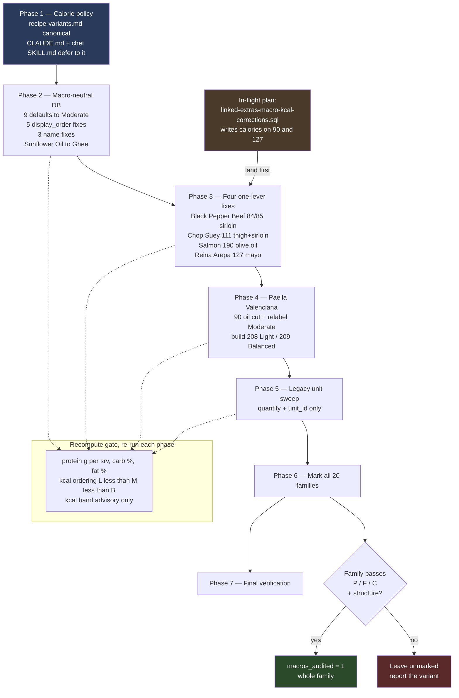

# Plan: Recipe audit remediation — calorie policy, 5 real failures, and the variant-picker fixes

Plan folder: `.claude/contract/2026-07-30-recipe-audit-remediation/`
Execution status: see `tasks.md` in this folder.

---

## Part 1 — Alignment

*(The shared understanding of what this task is doing. Restate it in your own words — this is how the developer confirms you read the brief correctly before any design happens. Mismatch here = stop and fix.)*

### Task reference

Developer prose across the planning conversation, verbatim:

> to fix the failed recipes and mark the 8 correct ones are audited

> why did you fail them they all come back green?

> that's just an example, the 11 or so you failed all are green acroding the the UI

> if the carbs are over that's fine they user can pick a different variant to match their needs so if we don't cont the cals how many fail?

> rewrite the plan and make sure we mark the ones we left as audited. Add that about the cals ( whereever you got the varatin rules that for audits we're ok with haveing extra calories )

Upstream context: an audit of 20 named recipe families was run earlier in this session via the `chef` skill, recomputing macros for all 58 recipe rows from `recipe_ingredients` plus prorated linked recipes. It reported 8 passes and 12 failures. The developer then observed that the failing recipes render **all-green macro badges** in the UI. That was verified during planning and is true: all 12 default variants show three green badges, because `client/src/constants/macroTargets.js:19` states the kcal band is *"deliberately not traffic-lit"*.

Decisions taken from that exchange, 2026-07-30:

1. **Per-serving kcal is no longer an audit failure.** The developer's reasoning: a user picks the variant that matches their calorie needs, so a family offering a higher-calorie Balanced is doing its job, not failing. Carbs above the band are likewise fine.
2. **That policy is to be written into the rules** — into the same file the variant rules came from, so the audit standard stops diverging from what the app displays.
3. **The families that only ever failed on kcal are to be marked audited**, not redesigned.
4. Earlier confirmed and still standing: skills `chef` + `diet-guidelines`; Paella Valenciana keeps `default_servings = 4` and gains Light/Balanced siblings; the legacy display-unit sweep covers **all** affected recipes in ids 4–135.

### Restated goal

Re-scoring the 20 audited families against protein, fat and carbs alone — with per-serving kcal excluded — takes the failure count from 12 down to **5 families, 6 variants**. Three are substantive: Black Pepper Beef Stir Fry is 10.4 g and 3.1 g short of the protein floor on Light and Moderate, and Chop Suey Light is 4.4 g short. Three are sub-1 % rounding misses: Salmon Light at 35.8 % fat, Paella Valenciana at 35.2 % fat, Reina Arepa Light at 37.9 % carbs. Seven families that "failed" the first audit turn out to be clean under the agreed standard and get marked audited rather than rebuilt — which removes four of the six phases the previous draft of this plan carried.

The calorie policy itself is the first deliverable, because everything else depends on it. It goes into `.claude/rules/recipe-variants.md` as the canonical statement, with `CLAUDE.md` and the `chef` skill amended to point at it rather than restate the reject thresholds — the four-copy drift the rules README explicitly warns about is what let the audit standard and the UI diverge in the first place. The policy demotes the per-serving kcal *bands* and the ≥80 kcal inter-variant *gap* to advisory targets, while keeping as hard requirements everything that makes the variant picker trustworthy: three members per family, Moderate as default, correct labels, and `Light < Moderate < Balanced` kcal ordering.

That last point is why the structural work stays in scope at full weight. The developer's remedy — "the user can pick a different variant" — only works if the picker is right, and today it is wrong in 14 places: nine families default to **Balanced** instead of Moderate, so users are handed the highest-calorie option and must step down; five list Moderate before Light; and Paella Valenciana has no variants at all, so for that dish the remedy is simply unavailable.

Two findings from planning that the original audit missed are also fixed: **`Sunflower Oil` (ingredient 84) is a seed oil** in six recipes, which `CLAUDE.md` prohibits absolutely and which the calorie relaxation does not touch; and the legacy recipes carry cook-hostile display units (`10 g garlic`, `3 g black pepper`, `150 g egg`).

Delivery is one docs change plus **data-only DML migrations** under `foodbytes-app/database/migrations/`, applied by hand to the Railway MySQL. No entity, DTO or column changes, so `ddl-auto: validate` is unaffected and no backend redeploy is needed. At the end, all 20 families carry `macros_audited = 1`.

### In scope

- **Calorie policy, documented.** Amend `.claude/rules/recipe-variants.md` with the canonical statement that per-serving kcal bands and the inter-variant kcal gap are advisory for audit purposes, and that protein/fat/carbs plus family structure are what reject. Update `CLAUDE.md` and `.claude/skills/chef/SKILL.md` to defer to it instead of restating kcal reject thresholds.
- **Fix the 3 substantive macro failures:** Black Pepper Beef Stir Fry Light + Moderate protein (84, 85); Chicken & Beef Chop Suey Light protein (111).
- **Fix the 3 marginal macro failures:** Slow-Roasted Salmon Light fat 35.8 % → ≤35 % (190); Reina Arepa Light carbs 37.9 % → ≥38 % (127); Paella Valenciana fat 35.2 % → ≤35 % (90).
- **Seed-oil removal:** add a `Ghee` ingredient row and replace `Sunflower Oil` (84) on recipes 84/85/86 and 111/112/113.
- **Variant-picker integrity:** move `is_default` to Moderate on families 6, 23, 24, 25, 31, 33, 38, 39, 40; correct `display_order` to Light=1/Moderate=2/Balanced=3 on families 24, 33, 39, 25, 40.
- **Paella Valenciana build-out:** relabel recipe 90 as `Moderate`, create sibling recipes 208 (`Light`) and 209 (`Balanced`) at `default_servings = 4`, with their `recipe_meals`, `recipe_ingredients`, `recipe_steps` (preserving the Pizza Sauce linked step with its `alt_instruction`) and `recipe_family_members` rows.
- **Name corrections:** strip ` - Diet` from `recipes.name` on 187/192/193 and 190/198/199; rename 130/131/132 to `Peanut Butter Banana Overnight Oats` to match the family.
- **Legacy unit sweep:** convert grams → cook-friendly display units on **every affected row, selected by ingredient id with no recipe-id restriction** (~217 rows), changing `quantity` and `unit_id` only, never `quantity_grams`. *(Widened during task authoring: an earlier draft of this bullet scoped the sweep to recipe ids 4–135, but querying the real blast radius found 39 affected rows above id 135 — Garlic, Olive oil, Black pepper and Salt each have 12, including recipes 190/198/199, and Honey has 3 on 187/192/193. The developer's instruction was "All affected legacy recipes", so the id range was dropped. Also flagged at the top of `tasks.md`.)*
- **`recipes.calories` on rows whose grams change:** recompute and write the whole-recipe value for 84, 85, 111, 127, 190, 90, 208, 209.
- **Mark all 20 families audited:** `macros_audited = 1`, `macros_audited_at = NOW()`, `macros_audited_by` left NULL. Comprises the **7 kcal-only families marked as-is** after their structural fixes, the **5 remediated families** after their fixes verify, and re-verification of the **8 already marked**.

### Explicitly out of scope

- **Redesigning the 7 families that only failed on kcal** — Black Bean Chicken Wrap, Spaghetti Bolognese, Beef & Mushroom Black Bean Stir Fry, Overnight Oats, Paella de pollo, Tamarind Tossed Noodles, Protein Porridge with Berries. Under the agreed standard they pass; they are marked, not rebuilt. This is the single biggest change from the previous draft.
- **Adding a kcal badge to the UI.** Raised during planning as the change that would have surfaced 8 of the original 12 immediately. It is frontend work needing the `react-frontend` skill, and the calorie policy makes it optional rather than corrective. Worth its own plan.
- **Realigning stored `recipes.calories` onto the homemade basis generally**, the FR-103 fresh-vs-dried pasta divergence, and routing calorie computation through `MacroCalculationService`. All owned by the in-flight plan `.claude/contract/2026-07-30-linked-extras-macro-kcal-audit/` (`Status: IN PROGRESS`).
- **Protein Porridge's 60 kcal Moderate→Balanced gap.** Advisory under the new policy, so not a defect. Noted in Risks because it does make two of its variants nearly interchangeable.
- **Black Bean Chicken Wrap's absent low end** (its Light is 650 kcal/serving, so the family offers nothing genuinely light). Not a failure under the agreed standard; flagged in Risks as a product observation.
- Dish-quality (Lens 4) findings beyond what a fixed ingredient forces into the steps.
- `macros_verified` on `ingredients` rows — a different flag with different meaning.

### Pattern Reference

None supplied in the brief. References chosen:

- **Migration style** — `foodbytes-app/database/migrations/2026-07-30_pb_banana_smoothie_protein_fix.sql`. Closest precedent: same class of problem (a family missing per-variant targets plus an `is_default` violation), and it encodes three mechanics this plan reuses verbatim — a header comment stating before/after per-serving macros, guarded `INSERT … SELECT … WHERE NOT EXISTS` reading a **derived table** (MySQL forbids `INSERT … SELECT` reading its own target), and avoidance of `<=>` because the MySQL MCP client's parser rejects it.
- **Rule-file structure** — `.claude/rules/recipe-variants.md` itself; the amendment follows its existing what/why/when/verify/reject shape, and `.claude/rules/README.md` for the one-canonical-statement convention.
- **Traffic-light precedent for excluding kcal** — `client/src/constants/macroTargets.js:8-19`, which already documents kcal as deliberately not traffic-lit. The rule amendment cites it, since the frontend reached this decision first.
- **Variant/family SQL and the audit-marking contract** — `.claude/skills/chef/SKILL.md`, sections "Generate INSERT SQL", "7a. Idempotency", "Recording the audit".

### Constraints flagged on the brief

- **Per-serving kcal is not a reject** (this plan's own first deliverable). Protein ≥35 g, fat ≤35 % of kcal, carbs ≥38 % of kcal remain hard.
- **Structural rules stay hard:** exactly 3 members, labels `Light`/`Moderate`/`Balanced`, `display_order` 1/2/3, `is_default` on **Moderate**, kcal ordering `Light < Moderate < Balanced`.
- **`recipes.calories` is whole-recipe kcal** — store `kcal_per_serving × default_servings`.
- **No seed oils, margarine, or "vegetable oil"** — butter, olive oil, ghee only. Unaffected by the calorie relaxation.
- **Gout constraints** (`diet-guidelines`): moderate red meat and oyster sauce; prefer chicken/turkey over beef.
- **`macros_audited_by` stays NULL** for an agent-run audit; never invent a `users.id`.
- **Every `recipe_ingredients` / `recipe_meals` / `recipe_family_members` insert must be guarded** — no unique index on those tables, and the Railway console may commit per-statement regardless of `START TRANSACTION`.
- **Mark the whole family or none of it** — a partially-audited family is worse than an unaudited one.
- **Structural fixes precede marking.** The `chef` skill forbids setting `macros_audited = 1` while a family still violates `recipe-variants.md` structurally, so the 7 kcal-only families cannot be marked until their defaults and ordering are corrected.

### Assumptions made

- **The calorie policy is a genuine standard change, not a per-recipe exception.** *(confirmed)* The developer asked for it in the rules "wherever you got the variation rules", so it is written once in `.claude/rules/recipe-variants.md` and referenced from `CLAUDE.md` and the `chef` skill. Rationale: three copies of the reject thresholds already exist and they drifted from the UI; adding a fourth divergent statement would repeat the bug.
- **kcal *ordering* stays a hard requirement even though kcal *bands* do not.** Not explicitly stated by the developer, but their whole rationale is that users pick a variant by calorie level — which is meaningless if Light is not the lightest. Verified: all 12 previously-failing families already order correctly, so this costs nothing today and protects the mechanism.
- **The ≥80 kcal inter-variant gap becomes advisory too.** It exists to make variants meaningfully different, which is a band-style quality target rather than a safety rule. Consequence: Protein Porridge's 60 kcal gap stops being a defect and it gets marked audited.
- **The 8 already-marked families stay marked.** *(confirmed by query)* All 24 rows carry `macros_audited = 1`, `macros_audited_at = 2026-07-30T14:32:17Z`, `macros_audited_by = NULL`. They passed on the stricter standard, so they pass on the looser one. The unit sweep touches some of them, so Phase 6 re-verifies rather than assuming.
- **Salmon Light's fat is fixed by cutting olive oil 6 g → 2 g, not by adding butterbeans.** The previous draft added 180 g butterbeans because fat had to come down *and* kcal had to stay under 550, and cutting salmon broke the protein floor. With kcal free, the 4 g oil cut alone takes fat from 35.8 % to 33.5 % and lifts carbs from 38.1 % to 39.3 %. Materially simpler, and it leaves the dish as designed.
- **Chop Suey Light's protein is fixed by raising chicken thigh and sirloin only.** The earlier draft also trimmed noodles and oil purely to hold kcal down; those trims are dropped.
- **Black Pepper Beef Balanced needs no change.** Its protein is 42.1 g. Only Light and Moderate breach.
- **`Ghee` is the replacement fat, new ingredient id 177, aisle 9 (`Oils & Fats`).** No ghee row exists — verified by a `LIKE` sweep over `oil|butter|ghee|lard|dripping`, which returned only Butter (103/53/44), Olive oil (22), Sesame oil (129), Sunflower Oil (84) and non-fat matches. `CLAUDE.md` names ghee explicitly and it is the only listed option with a stir-fry-appropriate smoke point; butter burns, olive oil is wrong for the cuisine. `P 0.00 / C 0.00 / F 99.80` makes the swap near kcal-neutral.
- **Recipe ids 208 and 209 are free.** `MAX(recipes.id) = 207` at planning time; the tasks re-read `MAX(id)` rather than hard-coding blind.
- **Paella Valenciana's sibling grams are resolved during execution** from a stated scaling rule against the corrected Moderate, verified per-variant on protein/fat/carbs. Its full 13-row ingredient list was not enumerated at plan time. With kcal bands advisory this is lower-risk than in the previous draft: the siblings need only be meaningfully lighter/heavier and individually pass P/F/C.
- **This plan still runs after `2026-07-30-linked-extras-macro-kcal-audit`**, but the collision is now much smaller. Dropping the Bolognese and Paella de pollo redesigns means the only rows both plans write are **90** (Paella Valenciana) and **127** (Reina Arepa), down from nine.
- **No `git commit` steps are planned** — committing is the executor's call.

### Cross-code alignment audit (FE ↔ BE ↔ DB)

Performed against the live Railway MySQL via `mcp__mysql__mysql_query`, read-only.

- **Re-scored all 20 families on protein/fat/carbs with kcal excluded.** Exactly 6 variants across 5 families breach: Black Pepper Beef Light `protein 24.6 g` and Moderate `31.9 g`; Chop Suey Light `30.6 g`; Salmon Light `fat 35.8 %`; Paella Valenciana `fat 35.2 %`; Reina Arepa Light `carbs 37.9 %`. Nothing else in the 58 rows breaches any of the three.
- **Confirmed every default variant renders all-green.** Replicating `macroTargets.js` band logic in SQL across the 12 previously-failing families returns `green/green/green` for all 12 defaults. The only non-green badges in the whole set are on **non-default** variants: Black Pepper Beef Light + Moderate (protein, blue/reject), Chop Suey Light (protein, blue/reject), Salmon Light (fat red/reject + carbs amber), Reina Arepa Light (carbs amber). This is the evidence for the developer's observation and the basis for the re-scope.
- **kcal ordering holds on all 7 families being marked as-is:** 460/602/823, 650/842/1059, 526/633/779, 562/706/844, 627/703/851, 546/645/806, 556/642/702. All `Light < Moderate < Balanced`, so none is blocked from marking by the ordering requirement.
- **`recipes` columns confirmed.** `default_servings int NOT NULL DEFAULT 2`, `calories int NOT NULL` (so written values must be rounded integers), `macros_audited tinyint(1) NOT NULL DEFAULT 0`, `macros_audited_at timestamp NULL`, `macros_audited_by bigint NULL` (FK, `Key: MUL`).
- **No kcal column on `ingredients`** — only `protein_per_100g`, `carbs_per_100g`, `fat_per_100g` (`decimal`) and `macros_verified tinyint`. Every kcal figure here is derived `4P + 4C + 9F`.
- **`recipe_ingredients` has no unique index** on `(recipe_id, ingredient_id)` or `(recipe_id, linked_recipe_id)`; both id columns are `bigint NULL`. Confirms the guarded-insert requirement.
- **`recipe_family_members`**: `variant_label varchar(100) NULL`, `display_order int NULL DEFAULT 0`, `is_default tinyint(1) NULL DEFAULT 0`. Nothing in the schema enforces one default per family or three members — both are rule-level only, which is how nine families drifted to a Balanced default without erroring.
- **Nine families confirmed defaulting to Balanced:** 6, 23, 24, 25, 31, 33, 38, 39, 40. Five of those also have `display_order` giving `Moderate,Light,Balanced`: 24, 33, 39, 25, 40.
- **Paella Valenciana (90) confirmed a family of one** — `recipe_families.id = 26` has a single member, `variant_label` NULL, `display_order` 1, `is_default` 1, `default_servings` 4.
- **Linked-extras step coverage is clean.** Every `recipe_ingredients` row carrying a `linked_recipe_id` across the audited set has ≥1 matching `recipe_steps` row with the same `linked_recipe_id` **and** a populated `alt_instruction`. No breach of `linked-recipe-extras.md` reject condition 4. Recipe 90 links Pizza Sauce (12) at 60 g with a compliant step — the new siblings must preserve that.
- **No migration is outstanding.** `meal_plan_entries.servings` is already `decimal(4,2) NOT NULL` and `recipes.macros_audited*` exist, so `2026-07-29_decimal_servings.sql` and `2026-07-29_recipe_macros_audit.sql` are both applied. Hibernate `validate` will not block startup.
- **Id ceilings:** `MAX(recipes.id) = 207`, `recipe_families 92`, `ingredients 176`, `recipe_steps 1834`, `recipe_family_members 200`.
- **`units` enumerated** — sweep targets exist: `1 g`, `2 ml`, `3 tsp`, `4 tbsp`, `5 piece`, `9 handful`, `10 clove`, `17 pinch`.
- **`meals`** — recipe 90 is `meal_id 3` (`Dinner`); the new siblings match.
- **No FE/BE contract change.** No column, entity, DTO or JSON key is touched, so no name-alignment risk across the chain. `client/src` reads `calories` and `default_servings` exactly as today.

---

## Part 2 — Technical design

### Approach

The plan opens with a **documentation change, not a data change**, and that ordering is deliberate. Every subsequent decision — which families get marked as-is, which get fixed, what "pass" even means — follows from the calorie policy, so writing it down first makes the rest auditable rather than arbitrary. It lands in `.claude/rules/recipe-variants.md` because that is where the variant rules already live and what the developer pointed at, and `CLAUDE.md` plus `.claude/skills/chef/SKILL.md` are amended to **defer** to it rather than restate the thresholds. The alternative — editing all three to say the same new thing — is what produced the current mess: three prose copies of the reject list that drifted from `macroTargets.js`, which is why an audit could fail twelve families that the UI showed as green.

The remaining work is pure data repair delivered as **date-prefixed DML migrations** applied by hand to Railway. Nothing touches a JPA entity or a column, so `ddl-auto: validate` stays satisfied and no redeploy is required. Phases are ordered by blast radius so the developer can stop after any one with the database consistent: Phase 2 is macro-neutral (defaults, `display_order`, names, and the ghee swap, where ghee at 99.8 % fat against sunflower at 100 % moves whole-recipe kcal by under 3 kcal), Phase 3 carries the four in-place macro fixes, Phase 4 builds out Paella Valenciana, Phase 5 sweeps display units, Phase 6 marks, Phase 7 verifies. Separating the macro-neutral changes out first means an arithmetic error in Phase 3 cannot leave a half-renamed family or a family with two defaults.

Because kcal is no longer a constraint, **each of the four macro fixes collapses to a single lever** — which is the main engineering benefit of the re-scope. Salmon Light needs only olive oil 6 g → 2 g (fat 35.8 % → 33.5 %) rather than the 180 g butterbean addition the previous draft required to hold fat down *and* kcal under 550 without breaching protein. Chop Suey Light needs only more thigh and sirloin, with the compensating noodle and oil trims dropped. Reina Arepa Light needs 3 g less mayonnaise. Black Pepper Beef needs more sirloin on two variants. Every one is an absolute `UPDATE … SET quantity_grams = <n>` rather than a multi-row rebalance.

Every statement is written to be **idempotent**: absolute gram assignments rather than deltas, and guarded `INSERT … SELECT … WHERE NOT EXISTS (SELECT 1 FROM (SELECT …) AS ex …)` for the additive rows (ghee, the Paella siblings), using a derived table because MySQL will not let `INSERT … SELECT` read its own target, and avoiding `<=>` because the MCP client's parser rejects it. Verification is a **single recompute query re-run after every phase**, deriving per-serving protein grams, carb % and fat % from `recipe_ingredients` joined to `ingredients` plus prorated linked contributions — the same query used to produce the numbers below, so the executor's output is directly comparable. `macros_audited` is set **last, per family, only after that family's recompute passes**, keeping the flag an attestation rather than an intention.

### Skills to invoke during execution

- **`chef`** — owns the substance: per-serving macro arithmetic and the whole-recipe-vs-per-serving discipline (step 5), guarded-SQL idempotency (step 7a), insert ordering for the new Paella siblings (step 7), the five audit lenses used to re-verify, and the `macros_audited` contract in "Recording the audit". Its own step-2 target table is amended by Phase 1, so read the amended version.
- **`diet-guidelines`** — owns whether each fix is nutritionally defensible rather than merely inside a band: the ≥35 g protein floor's provenance (USDA 2025–2030 plus the Moore/Morton MPS window), the gout constraints that make raising sirloin on Black Pepper Beef a judgement call, and the fat-floor rationale that stops the Salmon oil cut going too far.

Rule files the executor must Read before touching data: `.claude/rules/recipe-variants.md` (as amended by Phase 1), `.claude/rules/linked-recipe-extras.md`, `.claude/rules/homemade-first-and-ingredient-dedup.md`.

No developer override was applied — both skills were confirmed as proposed.

### Diagram



### Data shapes

No schema or contract changes; all DDL-free. Docs changes plus new/updated rows.

#### Phase 1 — the calorie policy text

Appended to `.claude/rules/recipe-variants.md` as a new `##` section, following that file's existing what/why/when/verify/reject shape:

```markdown
## Calories are a target, not a reject condition (audit policy, 2026-07-30)

For **audit purposes**, per-serving kcal does not fail a recipe. The bands
(Light 450–550, Moderate 550–650, Balanced 700–800) remain design targets and
should guide new recipes, but a variant outside its band is **not** a reject and
must not block `macros_audited`.

### What still rejects

| Check | Reject when |
|---|---|
| Protein | < 35 g per serving |
| Fat | > 35 % of kcal |
| Carbs | < 38 % of kcal |
| Family size | ≠ 3 members |
| Variant labels | not exactly Light / Moderate / Balanced |
| Default | `is_default` not on Moderate, or zero/multiple defaults |
| kcal ordering | not `Light < Moderate < Balanced` |

Carbs **above** 50 % is over-target but not a reject. The ≥80 kcal gap between
siblings is advisory.

### Why

The variant family *is* the calorie-matching mechanism: a user picks Light,
Moderate or Balanced to fit their own budget. A family whose Balanced runs to
850 kcal is serving that purpose, not failing — so long as the picker is honest,
which is why family size, labels, default and kcal ordering stay hard rejects.

This also aligns the audit with what the app already shows. The P/C/F traffic
light in `client/src/constants/macroTargets.js` deliberately excludes kcal
("those variants differ on kcal only, which is deliberately not traffic-lit",
line 19). Before this policy the audit failed 12 of 20 families that the UI
rendered all-green — the standard and the display disagreed, and the display was
right.

### Verify

Score per-serving protein grams, carb % and fat % from `recipe_ingredients`
plus prorated linked recipes. Report kcal for information; do not fail on it.
```

`CLAUDE.md` — in the "Recipe creation — non-negotiable targets" table, the `Reject if` column's kcal rows (`>600` / `>750` / `>900`) are replaced by a pointer: *"kcal is a target, not a reject — see `.claude/rules/recipe-variants.md`, 'Calories are a target, not a reject condition'."* Protein/fat/carb reject values stay.

`.claude/skills/chef/SKILL.md` — the step-2 target table and the "Recording the audit" preconditions get the same pointer, replacing their kcal reject language.

#### Phase 2 — macro-neutral row changes

New ingredient:

```sql
-- id 177 (MAX(ingredients.id) was 176).
-- aisle_id 9 = 'Oils & Fats', confirmed as the aisle of Olive oil (22),
-- Sesame oil (129) and the Sunflower Oil (84) being replaced.
INSERT INTO ingredients (id, `key`, name, aisle_id, protein_per_100g, carbs_per_100g, fat_per_100g, macros_verified)
VALUES (177, 'ghee', 'Ghee', 9, 0.00, 0.00, 99.80, 1);
```

Seed-oil swap — `quantity`, `unit_id`, `quantity_grams` all unchanged:

```sql
UPDATE recipe_ingredients SET ingredient_id = 177
WHERE ingredient_id = 84 AND recipe_id IN (84, 85, 86, 111, 112, 113);
```

Variant-picker corrections:

| Family | Recipes (L/M/B) | `is_default` → | `display_order` |
|---|---|---|---|
| 6 Black Bean Chicken Wrap | 20/21/22 | 21 | already 1/2/3 |
| 23 Spaghetti Bolognese | 81/82/83 | 82 | already 1/2/3 |
| 24 Black Pepper Beef Stir Fry | 84/85/86 | 85 | 84→1, 85→2, 86→3 |
| 25 Paella de pollo | 87/88/89 | 88 | 87→1, 88→2, 89→3 |
| 31 Beef & Mushroom Black Bean Stir Fry | 104/105/106 | 105 | already 1/2/3 |
| 33 Chicken & Beef Chop Suey | 111/112/113 | 112 | 111→1, 112→2, 113→3 |
| 38 Reina Arepa | 127/128/129 | 128 | already 1/2/3 |
| 39 PB Banana Overnight Oats | 130/131/132 | 131 | 130→1, 131→2, 132→3 |
| 40 Tamarind Tossed Noodles | 133/134/135 | 134 | 133→1, 134→2, 135→3 |

Name corrections on `recipes.name`: `187/192/193` → `Protein Porridge with Berries`; `190/198/199` → `Slow-Roasted Salmon with Citrus & Veg`; `130/131/132` → `Peanut Butter Banana Overnight Oats`.

#### Phase 3 — the four one-lever macro fixes

Per-gram values used (derived `4P+4C+9F`): chicken thigh 1.940 kcal/g (P 0.26), sirloin 1.290 (P 0.21), olive oil 9.000 (F 1.00), Mayonnaise linked (309 g yield) 6.703 kcal/g (P 0.0223 / C 0.0100 / F 0.7304).

| Recipe | Lever | Before | After |
|---|---|---|---|
| **84** Black Pepper Beef, Light | Sirloin steak 180 → **290 g** | P 24.6 g, F 28.9 %, C 49.6 % | **P 36.2 g**, F 29.8 %, C 42.9 % |
| **85** Black Pepper Beef, Moderate | Sirloin steak 240 → **330 g** | P 31.9 g, F 31.0 %, C 46.7 % | **P 41.4 g**, F 31.4 %, C 42.4 % |
| **111** Chop Suey, Light | Chicken thigh 100 → **140 g**; Sirloin 100 → **125 g** | P 30.6 g, F 30.3 %, C 46.5 % | **P 38.4 g**, F 31.6 %, C 42.1 % |
| **190** Salmon, Light | Olive oil 6 → **2 g** | P 36.2 g, **F 35.8 %**, C 38.1 % | P 36.2 g, **F 33.5 %**, C 39.3 % |
| **127** Reina Arepa, Light | Mayonnaise link 15 → **12 g** | P 36.3 g, F 32.0 %, **C 37.9 %** | P 36.3 g, F 30.7 %, **C 38.7 %** |

`recipes.calories` (whole-recipe) → **84**: 1055, **85**: 1263, **111**: 1165, **190**: 1068, **127**: 945. Recipe 86 (Balanced, P 42.1 g) and recipes 112/113 are unchanged apart from the ghee swap.

kcal ordering after the fixes — all still `Light < Moderate < Balanced`: Black Pepper Beef 528/632/744; Chop Suey 582/630/787; Salmon 534/672/781; Reina Arepa 473/583/751.

#### Phase 4 — Paella Valenciana (family 26)

Fat fix on the existing recipe, which also becomes Moderate:

```
Olive oil 46 → 32 g   →  fat 35.2 % → 32.7 %, protein 37.4 g/srv, carbs 48.9 %
recipes.calories 3359 → 3249     (default_servings stays 4)
```

Two new siblings, cloned from the corrected recipe 90:

```
recipes:                id 208 (Light), id 209 (Balanced)
                        name 'Paella Valenciana', default_servings 4, is_live 1,
                        calories = round(recomputed whole-recipe kcal)
recipe_meals:           (208, 3), (209, 3)          -- 3 = Dinner, matching 90
recipe_ingredients:     clone of 90's 13 rows, scaled per the rule below,
                        including the Pizza Sauce (12) linked row
recipe_steps:           clone of 90's steps, preserving the Pizza Sauce step's
                        linked_recipe_id AND alt_instruction
recipe_family_members:  (26, 208, 'Light',    display_order 1, is_default 0)
                        (26,  90, 'Moderate', display_order 2, is_default 1)
                        (26, 209, 'Balanced', display_order 3, is_default 0)
```

Scaling rule: multiply the **chicken, rabbit, rice, butterbean and olive-oil** rows by **0.75** for Light and **1.25** for Balanced; hold aromatics, spices, saffron, tomato, stock and the Pizza Sauce link fixed. Then verify each sibling independently on protein ≥35 g/srv, fat ≤35 %, carbs ≥38 %, and that ordering `208 < 90 < 209` holds on kcal. Adjust the rice row in ±20 g steps if a variant misses on carbs.

Recipe 90's `variant_label` is currently NULL and `display_order` 1 — both corrected above.

#### Phase 5 — legacy unit sweep

`quantity_grams` never changes; only `quantity` and `unit_id`. Rounded to the nearest 0.25 unit; sub-1 g dry spices become `1 pinch`.

| Ingredient | From | To | Basis |
|---|---|---|---|
| Garlic (13) | g | `clove` (10) | 3 g / clove |
| Salt (5) | g | `tsp` (3) | 6 g / tsp |
| Black pepper (50), White pepper (151) | g | `tsp` (3) | 2 g / tsp |
| Cinnamon, Cumin, Paprika, Oregano, Chilli Flakes, Italian herbs | g | `tsp` (3) | 2 g / tsp |
| Ginger (14) | g | `tsp` (3) | 5 g / tsp grated |
| Olive oil (22), Sesame oil (129), Ghee (177), Butter (103) | g ≥5 | `tsp` (3) / `tbsp` (4) | 5 g / 14 g |
| Egg | g | `piece` (5) | 50 g / egg |
| Honey (4) | g | `tbsp` (4) | 20 g / tbsp |
| Peanut butter (6) | g | `tbsp` (4) | 16 g / tbsp |
| Soy sauce (25), Dark Soy Sauce, Lime juice (40) | g | `tbsp` (4) | 15 g / tbsp |
| Sugar (36) | g | `tsp` (3) | 4 g / tsp |

#### Phase 6 — audit marking

One statement per family, listing every member — e.g. for family 6:

```sql
UPDATE recipes SET macros_audited = 1, macros_audited_at = NOW()
WHERE id IN (20, 21, 22);
```

**Marked as-is after their Phase 2 structural fix (7 families, kcal-only "failures"):**
`6` (20,21,22) · `23` (81,82,83) · `25` (87,88,89) · `31` (104,105,106) · `39` (130,131,132) · `40` (133,134,135) · `86` (187,192,193)

**Marked after their Phase 3/4 fix verifies (5 families):**
`24` (84,85,86) · `33` (111,112,113) · `38` (127,128,129) · `89` (190,198,199) · `26` (90,208,209)

**Re-verified, already marked (8 families):**
`2` (4,5,6) · `3` (7,8,9) · `17` (57,58,59) · `27` (91,92,93) · `88` (189,196,197) · `90` (191,200,201) · `91` (202,203,204) · `92` (205,206,207)

`macros_audited_by` is deliberately absent from every `SET` list — it stays NULL for an agent-run audit. End state: all 20 families, **60 recipe rows** (the 58 audited rows plus the two new Paella siblings 208 and 209), carry `macros_audited = 1`.

### Runtime quality notes

The dimensions below are Java-shaped; this plan ships one docs change and DML only, so they are mapped onto the MySQL session and the migration scripts.

- **Resource cleanup:** No connections, streams or transactions are opened by this work — each migration is a flat DML sequence run through the developer's MySQL client or the Railway console, which owns the connection lifecycle. No temporary tables. The derived tables inside the guarded inserts are per-statement and released with the statement.
- **Concurrency / ordering:** Three ordering hazards. **Across plans:** the in-flight `linked-extras-macro-kcal-corrections.sql` writes `recipes.calories` on 90 and 127 — both rows this plan also writes — so it must land first or its values are overwritten; mitigated by making it a Phase 3 precondition and re-running the recompute gate at the end. **Within Phase 2:** the ghee `INSERT` must precede the `UPDATE … SET ingredient_id = 177` or the FK fails. **Phase 4:** `recipe_steps` has a unique key on `(recipe_id, step_number)`, so step insertion must target the fresh ids 208/209 where no collision is possible — never renumber existing steps with a cascading `UPDATE step_number ± 1`, which collides mid-statement. No user-facing concurrency: `meal_plan_entries` and `shopping_list_items` are untouched, so a user browsing during the migration sees recipe content change but hits no write conflict.
- **Allocation / cost behaviour:** The recompute verification query is the only non-trivial cost — it aggregates `recipe_ingredients ⋈ ingredients` across ~61 recipes with a correlated linked-recipe subquery. Measured at 170–190 ms against the live DB repeatedly during planning, so re-running it once per phase is negligible. The migrations are single- to double-digit statement counts touching tens of rows. Nothing runs in an application hot path and `MacroCalculationService` is not invoked, so there is no N+1 exposure.
- **Error paths:** Every statement is idempotent by construction — absolute `SET` assignments and `WHERE NOT EXISTS`-guarded inserts — so a migration failing partway can be re-run whole without duplicating `recipe_ingredients` rows, the exact failure recorded against recipes 7/8/9 on 2026-05-15. A duplicate-`key` failure on the ghee row surfaces client-side and blocks the dependent swap, which is the correct order. The one unrecoverable sequencing error — applying Phase 2's swap without its ghee insert — fails loudly on the FK rather than silently leaving sunflower oil in place. Nothing is caught and swallowed; there is no application code here to swallow it. Phase 6's marking is guarded behind the recompute gate, so a family that silently regressed cannot be attested.

### Risks and judgement calls

- **The calorie policy is a real loosening of the standard, and it is the developer's call, not mine.** It means a Balanced variant at 1059 kcal/serving (Black Bean Chicken Wrap) is now audit-clean. My read of the rationale is sound — the variant picker is the calorie-matching mechanism, and the UI already declined to traffic-light kcal — but if the intent was narrower (say, tolerate 50–100 kcal of overshoot rather than removing the ceiling entirely), the rule text in Phase 1 should say so with a numeric tolerance instead of dropping the check. Worth settling before Phase 1 is written, because Phases 3–6 all follow from it.
- **Black Bean Chicken Wrap has no genuinely light option.** Its range is 650–1059 kcal/serving; the *Light* is 650. Under the agreed standard it passes and gets marked, but a user wanting a light meal is not served by that family. Not a defect as defined — flagged because it is the case where "pick a different variant" has the least to offer.
- **Raising sirloin on Black Pepper Beef cuts against the gout guidance.** `diet-guidelines` says moderate red meat and prefer chicken/turkey; the fix takes Light from 180 → 290 g (145 g/serving) and Moderate to 330 g. The alternative — adding a non-beef protein — makes it not the dish the name promises. Flagged rather than silently chosen: if the gout constraint binds, the honest move is renaming the family and swapping the protein, which is larger than this plan.
- **Three of the six failures are sub-1 % misses**, and fixing them is arguably noise: Paella Valenciana at 35.2 % fat (0.2 over), Reina Arepa Light at 37.9 % carbs (0.1 under), Salmon Light at 35.8 % fat (0.8 over). Reina Arepa already *displays* as 38 % amber. All three fixes are one-line and low-risk, so the plan does them — but if you would rather treat sub-1 % as within tolerance and simply mark those families, say so and Phase 3 shrinks to two recipes.
- **Chop Suey Moderate and Balanced sit at 32 % and 34 % fat**, near the ceiling, and keep their grams because they pass. The ghee swap nudges them down a hair. There is no headroom for a future portion increase on those two.
- **Paella Valenciana's sibling grams are resolved during execution**, not reviewed here — the one place in this plan where exact SQL is written at apply time. Lower-risk than in the previous draft now that kcal bands are advisory (the siblings need only pass P/F/C and order correctly), but if you want those rows pinned before approving, that is a reason to send this back.
- **`Ghee` at 99.80 % fat is my figure**, not a sourced one. Real ghee is 99.5–100 % fat by product. It keeps the swap near-neutral and errs toward fewer kcal. If you would rather use a verified product value, the row should carry that and `macros_verified` should reflect it.
- **Nine families change which variant users land on.** Moving the default from Balanced to Moderate is a visible behaviour change across a large slice of the app, not just a data correction — expect the UI to look different, with lower default calories everywhere.
- **The unit sweep touches recipes in the 8 already-audited families.** It changes only `quantity`/`unit_id` so macros cannot move, but the `chef` skill treats any edit to an audited recipe as invalidating unless re-verified in the same pass. Phase 6 therefore re-runs the recompute across all 20 families and re-asserts the 8, rather than trusting the existing timestamps.
- **Protein Porridge keeps a 60 kcal Moderate→Balanced gap.** Advisory now, so not a defect, but 642 vs 702 kcal makes those two variants nearly interchangeable — the family effectively offers two choices, not three.
