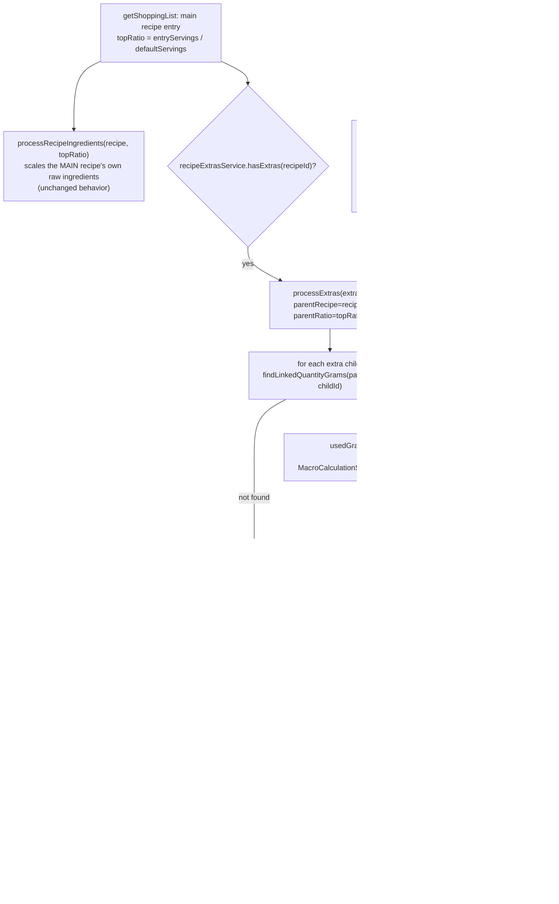

# Plan: Shopping list overstates linked-recipe extra quantities (MPP-1)

Plan folder: `.claude/contract/MPP-1-shopping-list-linked-extra-proration/`
Execution status: see `tasks.md` in this folder.

---

## Part 1 — Alignment

*(The shared understanding of what this task is doing. Restate it in your own words — this is how the developer confirms you read the brief correctly before any design happens. Mismatch here = stop and fix.)*

### Task reference

**Jira: MPP-1** — "Shopping list overstates linked-recipe extra quantities (e.g. Pastichio/Honey Ham: 5000g shown instead of 800g)"

> **Problem Statement:** The aggregated shopping list overstates raw-ingredient quantities for any linked-recipe extra where the parent recipe consumes less than the extra's full batch yield. The error scales with the meal's servings multiplier, so it gets worse the more servings are planned.
>
> **Affected Product:** FoodBytes backend — `ShoppingListService.processRecipeIngredients` / `processExtras` (`foodbytes-api/src/main/java/com/foodbytes/service/ShoppingListService.java`).
>
> **Steps to Reproduce:** Plan Pastichio (Lasagna) (recipe id 65, `default_servings=8`) at 16 servings for a date within the shopping list's 7-day window. Pastichio links to the Honey Ham recipe (id 64) via a `recipe_ingredients` row with `quantity_grams=400` (i.e. 400g of finished Honey Ham used per 8-serving batch). Generate the aggregated shopping list covering that date. Look at the Ham Fillet quantity in the resulting list.
>
> **Expected Behaviour:** 400g x (16/8 servings) = 800g of Honey Ham should be needed. Prorating Honey Ham's own raw ingredients by (grams of Honey Ham actually used / Honey Ham's total yield) should show roughly 685g of raw Ham Fillet (2500g Ham Fillet x 800/2916 total yield).
>
> **Actual Behaviour:** The shopping list shows 5000g of Ham Fillet — exactly Honey Ham's raw Ham Fillet quantity (2500g) x the parent's servings ratio (16/8=2), with no proration at all. `processExtras` calls `processRecipeIngredients(extraRecipe, entryServings, defaultServings, ...)` using the **parent's** `entryServings / defaultServings` ratio directly against the extra recipe's own raw ingredients, completely ignoring how much of the extra is actually consumed by the parent.
>
> **Dependencies & Risks:** Calories/macros are NOT affected — `MacroCalculationService.calculateLinkedRecipeMacros` already implements the correct proration (`portionRatio = usedGrams / totalYield`) for the recipe card, traffic lights, and weekly summary. This bug is isolated to `ShoppingListService`, which has no equivalent proration logic. The fix should mirror `MacroCalculationService`'s approach: read the parent's `quantity_grams` for the linked-recipe row, compute the extra recipe's total yield, and prorate the extra's raw ingredients by that ratio before scaling by servings.

No follow-up decisions were confirmed interactively beyond the Step 1.5 skill-confirmation question (developer confirmed `java-backend` as the only applicable skill).

### Restated goal

Fix the shopping list's raw-ingredient aggregation so that any ingredient contributed through a **linked-recipe extra** (bread, sauce, Honey Ham, etc.) is scaled by how much of that extra's own batch the parent recipe actually consumes — `(parent's quantity_grams for the link × how much of the parent's own batch is needed) / extra's own total yield` — instead of being scaled directly by the parent recipe's servings ratio as if the whole extra batch were always used. The fix must mirror the proration formula `MacroCalculationService` already uses correctly for macros, and it must be applied consistently wherever this aggregation happens in `ShoppingListService`, including nested extras (an extra that itself links to a further extra).

### In scope

- Fix `ShoppingListService.processRecipeIngredients` / `processExtras` (the `getShoppingList` aggregation path — the ticket's literal target) to prorate a linked extra's raw ingredients by `usedGrams / totalYield` before scaling further by servings, recursively through nested extras.
- Fix the parallel `ShoppingListService.getIngredientBreakdown` path (`collectIngredientUsages` / `collectUsagesFromExtras`) with the same proration logic. This method's own javadoc states it "must mirror `getShoppingList`" and an existing test (`breakdownTotalMatchesShoppingListRowForTheSameIngredient`) asserts the breakdown popup's total equals the shopping-list row's total for the same ingredient — fixing only one path would silently break that already-documented invariant.
- Reuse `MacroCalculationService.calculateRecipeTotalYield(Recipe)` (already `public`) rather than duplicating the yield-sum loop, so the two services can never define "total yield" differently.
- Add/update unit tests in `ShoppingListServiceTest` covering: the ticket's own reproduction numbers (simplified to round figures for a hand-verifiable expected value), a defensive case where an extras-tree entry has no matching `recipe_ingredients` link row, and updated fixtures/expectations for the three existing `getIngredientBreakdown` tests that exercise extras (their current fixtures have no `linked_recipe_id` row on the parent at all, so they currently pass by accident of the bug's absence of proration logic).

### Explicitly out of scope

- The **store-bought** side of an FR-103 dual-path row (`addStoreBoughtIngredient` / the `!isHomemade` branch of `processExtras`). That path already adds a flat "1 unit" of the store-bought ingredient regardless of quantity — a separate, pre-existing simplification unrelated to gram proration. The ticket's Dependencies & Risks section does not mention it, and changing it would be a different feature (scaling store-bought quantities), not a bug fix.
- `MacroCalculationService` itself — it already implements the correct proration and is not touched, only its public `calculateRecipeTotalYield` method is reused.
- Any change to `recipe_extras` or `recipe_ingredients` schema/data. The DB audit (below) found the two tables are already consistently paired in production; this is a pure service-layer logic fix, no migration.
- Frontend changes. The shopping list DTOs (`ShoppingItemDTO`, `IngredientBreakdownDTO`) are unchanged in shape; only the numeric values they carry become correct.
- Cycle detection for the extras tree — already handled upstream by `RecipeExtrasService.buildExtrasTree`'s `visited` set before `ShoppingListService` ever sees the tree.

### Pattern Reference

`MacroCalculationService.calculateLinkedRecipeMacros` / `calculateRecipeTotalYield` (`foodbytes-app/foodbytes-api/src/main/java/com/foodbytes/service/MacroCalculationService.java:206-280`) — the ticket explicitly names this as the pattern to mirror: `portionRatio = usedGrams.divide(totalYield, 10, RoundingMode.HALF_UP)`, computed recursively so a chain of nested linked recipes composes correctly.

### Constraints flagged on the brief

- The fix must not touch calorie/macro calculation — confirmed unaffected and out of scope.
- The proration formula must match `MacroCalculationService`'s existing formula exactly (`usedGrams / totalYield`, scale 10, `HALF_UP`) so the two services never disagree on what "using 400g of an 8-serving batch" means.
- Must handle nested/recursive extras (an extra of an extra), not just one level deep — `processExtras` and `collectUsagesFromExtras` are both already recursive for the tree-walk itself.

### Assumptions made

- **The `getIngredientBreakdown` path is in scope, not just `getShoppingList`.** The brief's "Affected Product" line names only `processRecipeIngredients` / `processExtras`, but the same file's own javadoc (line ~206) states the breakdown "must mirror `getShoppingList`," and `ShoppingListServiceTest.breakdownTotalMatchesShoppingListRowForTheSameIngredient` is an existing, currently-passing regression test asserting exactly that parity. Leaving the breakdown path unfixed would make that test's invariant false in production (the popup total would silently diverge from the row it's opened from) even though the test itself might still pass if its fixtures don't already have a `linked_recipe_id` row (see below) — a false-green is worse than an honest failure. *Rationale: the file's own documented contract outranks the brief's narrower phrasing; the brief is describing symptom + entry point, not drawing an intentional boundary.*
- **Reuse `MacroCalculationService.calculateRecipeTotalYield` rather than reimplementing the sum.** *Rationale: it's already public, already correct, and duplicating the loop would let the two services drift on a future edit — exactly the class of bug this ticket is fixing.*
- **`ShoppingListService` gets a new `MacroCalculationService` constructor dependency** (via `@RequiredArgsConstructor`, matching existing style) rather than a static/duplicated helper. *Rationale: both are already Spring `@Service` beans in the same package with no existing dependency in either direction — no circular-bean risk (confirmed by reading `MacroCalculationService`'s imports).*
- **When an extras-tree entry has no matching `linked_recipe_id` row on its parent (or the extra's total yield is zero), the ratio resolves to `ZERO` and that extra's contribution — and any of ITS children — is skipped, with a `log.warn`.** *Rationale: this mirrors `MacroCalculationService.calculateLinkedRecipeMacros`'s existing "0 total yield → warn and return zero" fallback exactly. The DB audit (below) shows this situation does not currently occur in production, so it is a defensive branch, not an expected runtime path — silently treating a missing link as "use the whole batch" would just reintroduce a variant of this same bug.*
- **Three existing `getIngredientBreakdown` tests need their fixtures updated, not just new tests added.** `breakdownFindsIngredientInsideAnExtraAndAttributesIt`, `breakdownWalksNestedExtrasAndScalesOffTheMainRecipeServings`, and `breakdownTotalMatchesShoppingListRowForTheSameIngredient` currently build parent recipes (e.g. `Pizza`) with **no** `linked_recipe_id` row to their extras at all — the extras tree comes purely from a mocked `buildExtrasTree` stub, decoupled from `recipe.getIngredients()`. Under the fix, a missing link row resolves to a zero ratio (previous bullet), which would silently empty these tests' results rather than fail loudly. *Rationale: these fixtures must be given a real linked-recipe row (with `quantityGrams`) to stay meaningful under the fix; the middle test's name and numbers describe the OLD (buggy) "scales off the main recipe's servings only" behavior as if it were correct, so it is renamed and recomputed, not just re-numbered.*
- **Test quantities for the new MPP-1 regression test use simplified, round numbers (not the real 2500g/2916g Honey Ham figures) while keeping the same recipe IDs (65, 64) and structure.** *Rationale: `BigDecimal.divide(scale=10, HALF_UP)` on 800/2916 does not terminate cleanly, making a hand-verified expected value in this plan (and the test's assertion) error-prone; round figures (e.g. total yield 2000g, used 200g/batch) isolate the same "less than the full batch is used" scenario with an assertion any reviewer can verify by hand, while comments trace it back to the real MPP-1 numbers for context.*

### Cross-code alignment audit (FE ↔ BE ↔ DB)

- **`recipe_ingredients.quantity_grams`** — `SHOW COLUMNS FROM recipe_ingredients` confirms `quantity_grams decimal(10,2) NOT NULL`, matching `RecipeIngredient.quantityGrams` (`@Column(name = "quantity_grams", nullable = false, precision = 10, scale = 2)` in `RecipeIngredient.java:55`). No mismatch.
- **Ticket reproduction data confirmed live:** `recipe_ingredients` row `id=662` on `recipe_id=65` (Pastichio) has `ingredient_id=108, linked_recipe_id=64, quantity_grams=400.00` — an FR-103 dual-path row (both raw-ingredient fallback and homemade link set), consistent with `linked-recipe-extras.md`'s edge case. `RecipeIngredient.isLinkedRecipe()` returns true whenever `linkedRecipe != null`, checked before `isRawIngredient()` everywhere in the codebase (including the code this plan touches), so the fix correctly ignores `ingredient_id=108` and only prorates via the link.
- **Honey Ham (recipe 64) total yield confirmed:** `SELECT ... FROM recipe_ingredients WHERE recipe_id=64` returns 9 rows summing `quantity_grams` = 2500+110+160+40+3+6+2+70+25 = **2916**, matching the ticket's stated total yield exactly. Ham Fillet's own row has `quantity=2500.00, quantity_grams=2500.00` (unit is already grams, so display quantity and gram weight coincide for this specific row).
- **`recipe_extras` ↔ `recipe_ingredients` pairing audited project-wide, not just for this ticket:** `SELECT ... FROM recipe_extras re LEFT JOIN recipe_ingredients ri ON ri.recipe_id = re.parent_recipe_id AND ri.linked_recipe_id = re.child_recipe_id WHERE ri.id IS NULL` returns **zero rows** — every `recipe_extras` entry across the whole database currently has a matching `recipe_ingredients.linked_recipe_id` row on its parent. This confirms the "missing link row" fallback (Assumptions, above) is a genuine defensive branch, not a live production scenario the fix needs to solve for today.
- **No duplicate links:** `SELECT recipe_id, linked_recipe_id, COUNT(*) FROM recipe_ingredients WHERE linked_recipe_id IS NOT NULL GROUP BY recipe_id, linked_recipe_id HAVING COUNT(*) > 1` returns zero rows — a `(recipe_id, linked_recipe_id)` lookup is safe to treat as unique, no need to handle multiple matching rows.
- **No entity/DTO/migration changes** — this is a pure service-layer logic fix; `ShoppingItemDTO`, `IngredientBreakdownDTO`, and `MealIngredientUsageDTO` shapes are unchanged, only the numeric values computed for them change. No migration required.

---

## Part 2 — Technical design

### Approach

The bug is that `ShoppingListService` scales a linked extra's own raw ingredients by the **parent's** `entryServings / defaultServings` ratio, treating "how much of the parent recipe is being made" as if it were the same fraction as "how much of the extra's batch is consumed" — but those are two different fractions. `MacroCalculationService` already computes the correct one (`usedGrams / totalYield`, where `usedGrams` is the linked row's own `quantity_grams` scaled to however much of the *linking* recipe's batch is needed) and applies it recursively for nested links. This plan ports the same formula into `ShoppingListService`, factored as two small private helpers shared by both of the service's two ingredient-collecting code paths (`getShoppingList` and `getIngredientBreakdown`), rather than duplicating the math twice.

The core design decision is replacing the `(BigDecimal entryServings, Integer defaultServings)` parameter pair — threaded unchanged through every recursive call today — with a single pre-computed `BigDecimal ratio` parameter representing "what fraction of *this* recipe's own batch is actually needed." At the top level (the main planned recipe), that ratio is exactly today's `entryServings / defaultServings`, so the main recipe's own raw ingredients scale identically to before (no behavior change there — verified against the 6 existing `getShoppingList` tests, none of which touch extras). When recursing into a linked extra, the new ratio for *that* recipe is derived by a new helper, `resolveExtraPortionRatio(parentRecipe, childRecipeId, parentRatio, childRecipe)`: it looks up the parent's own `recipe_ingredients` row where `linked_recipe_id = childRecipeId` to get that link's `quantity_grams` (via a second helper, `findLinkedQuantityGrams`), multiplies by `parentRatio` to get `usedGrams` at the current scale, divides by `childRecipe`'s own total yield (via `MacroCalculationService.calculateRecipeTotalYield`, reused rather than reimplemented), and returns that quotient. Because the *result* of this helper is itself just "the ratio to apply to this recipe's own ingredients," it composes recursively for free: a grandchild extra's ratio is derived from its immediate parent's resolved ratio, not from the top-level main recipe, exactly mirroring how `calculateLinkedRecipeMacros` calls `calculateRecipeTotalMacros` and multiplies by `portionRatio` only once per hop.

The alternative considered — and rejected — was scaling *only* `getShoppingList`'s `processExtras`/`processRecipeIngredients` and leaving `getIngredientBreakdown`'s parallel walk (`collectIngredientUsages`/`collectUsagesFromExtras`) untouched, since the ticket's "Affected Product" line names only the former. That was rejected because the file's own javadoc and an existing passing test (`breakdownTotalMatchesShoppingListRowForTheSameIngredient`) already assert the two paths must agree on the same ingredient's total; fixing one and not the other turns an already-tested invariant into a live bug the moment any linked extra doesn't consume its full batch — which is precisely the scenario this ticket is about. Sharing the two new helpers between both paths is what keeps that invariant true by construction instead of by coincidence.

`IngredientUsage` (the private record `getIngredientBreakdown` accumulates matches into) gains a fourth field, `ratio`, so each occurrence carries its own fully-resolved scale factor at collection time. This removes the single post-hoc `entryServings/defaultServings` multiply that today's `getIngredientBreakdown` applies uniformly to every usage regardless of whether it came from the main recipe or a nested extra — that uniform multiply is the same root bug, just in the breakdown-popup's code path.

### Skills to invoke during execution

- `java-backend` — owns Spring Boot service-layer conventions (constructor injection via `@RequiredArgsConstructor`, `@Transactional(readOnly = true)` on read paths, `@Slf4j` logging style, test structure under `src/test/java/com/foodbytes/service/`) for the only code this ticket touches. Developer-confirmed as the sole applicable skill via the Step 1.5 `AskUserQuestion` gate (no override).

Rule file the executor must Read before starting: `.claude/rules/linked-recipe-extras.md` (authoritative on `quantity_grams` semantics, the "50g vs 300g" proration example, and the reject condition "Stored `recipes.calories` on the parent disagrees with the recomputed... total by >5%" — not itself in scope, but the section on `quantity_grams` proration is the exact rule this ticket enforces for the shopping list rather than just macros).

### Diagram



### Data shapes

No schema, entity, or public DTO changes. All changes are to `foodbytes-app/foodbytes-api/src/main/java/com/foodbytes/service/ShoppingListService.java` private method signatures and internal records.

#### `ShoppingListService` — new private helpers

```java
/**
 * MPP-1: How much of a linked-recipe extra is needed at the current scale, expressed as a
 * fraction of the CHILD recipe's own total yield. Mirrors
 * MacroCalculationService#calculateLinkedRecipeMacros so the shopping list and the macro
 * traffic light agree on what "using 400g of an 8-serving batch" means.
 *
 * @return the ratio to apply to childRecipe's own ingredient quantities, or ZERO if
 *         parentRecipe has no matching linked_recipe_id row for childRecipeId, or
 *         childRecipe's total yield is zero (both are data-integrity states, not
 *         recoverable runtime states — see linked-recipe-extras.md).
 */
private BigDecimal resolveExtraPortionRatio(Recipe parentRecipe, Long childRecipeId,
                                             BigDecimal parentRatio, Recipe childRecipe)

/** Finds parentRecipe's own recipe_ingredients row with linked_recipe_id = childRecipeId
 *  and returns its quantity_grams, or null if no such row exists. */
private BigDecimal findLinkedQuantityGrams(Recipe parentRecipe, Long childRecipeId)
```

#### `ShoppingListService` — changed private method signatures

```java
// BEFORE: private void processRecipeIngredients(Recipe recipe, BigDecimal entryServings,
//                 Integer defaultServings, Map<...> aggregatedIngredients, List<Long> sourceChain)
// AFTER — entryServings/defaultServings collapsed to one pre-resolved ratio:
private void processRecipeIngredients(Recipe recipe, BigDecimal ratio,
        Map<IngredientUnitKey, IngredientAggregate> aggregatedIngredients, List<Long> sourceChain)

// BEFORE: private void processExtras(List<RecipeExtraNodeDTO> extras, Map<Long, Boolean> selections,
//                 BigDecimal entryServings, Integer defaultServings, Map<...> aggregatedIngredients,
//                 List<StoreBoughtItem> storeBoughtItems, List<Long> parentSourceChain)
// AFTER — adds parentRecipe (to look up link quantity_grams) and parentRatio (replaces the pair):
private void processExtras(List<RecipeExtraNodeDTO> extras, Map<Long, Boolean> selections,
        Recipe parentRecipe, BigDecimal parentRatio,
        Map<IngredientUnitKey, IngredientAggregate> aggregatedIngredients,
        List<StoreBoughtItem> storeBoughtItems, List<Long> parentSourceChain)

// BEFORE: private void collectIngredientUsages(Recipe recipe, Long ingredientId, String unit,
//                 String viaRecipeName, List<IngredientUsage> usages)
// AFTER — adds ratio, stored on the produced IngredientUsage:
private void collectIngredientUsages(Recipe recipe, Long ingredientId, String unit,
        String viaRecipeName, BigDecimal ratio, List<IngredientUsage> usages)

// BEFORE: private void collectUsagesFromExtras(List<RecipeExtraNodeDTO> extras, Long ingredientId,
//                 String unit, List<IngredientUsage> usages, Map<Long, Recipe> extraRecipeCache)
// AFTER — adds parentRecipe + parentRatio, same shape as processExtras:
private void collectUsagesFromExtras(List<RecipeExtraNodeDTO> extras, Long ingredientId,
        String unit, List<IngredientUsage> usages, Map<Long, Recipe> extraRecipeCache,
        Recipe parentRecipe, BigDecimal parentRatio)

// BEFORE: private record IngredientUsage(String ingredientName, BigDecimal quantity, String viaRecipeName) {}
// AFTER — carries its own fully-resolved scale factor:
private record IngredientUsage(String ingredientName, BigDecimal quantity, String viaRecipeName, BigDecimal ratio) {}
```

#### `ShoppingListService` — new constructor dependency

```java
private final MacroCalculationService macroCalculationService; // reuse calculateRecipeTotalYield
```

Added to the existing `@RequiredArgsConstructor` field list alongside `mealPlanEntryRepository`, `recipeRepository`, `recipeExtrasService`, `ingredientRepository`, `userRepository`. Class also gains `@Slf4j` (matching `MacroCalculationService`'s existing pattern) for the new `log.warn` fallback branch.

### Runtime quality notes

- **Resource cleanup:** Trivial — no new DB connections, streams, or transactions introduced. Both public entry points remain `@Transactional(readOnly = true)`; the new helper calls (`calculateRecipeTotalYield`, `findLinkedQuantityGrams`) only iterate already-loaded, request-scoped `recipe.getIngredients()` collections — no new queries.
- **Concurrency / ordering:** Trivial — no shared mutable state beyond the existing per-request `aggregatedIngredients` map and `usages` list, both already request-local. `meal_plan_owner_id` sharing is unaffected (this fix only changes how a per-entry amount is *computed*, not which entries are fetched).
- **Allocation / cost behaviour:** No new N+1 risk. `findLinkedQuantityGrams` and `calculateRecipeTotalYield` both iterate a `Recipe`'s already-loaded `ingredients` collection (batch-fetched via the existing `@BatchSize(20)` on `Recipe.ingredients`, per the class's own javadoc on why `findById` — not `findWithDetailsById` — is used for extras). No additional repository calls are introduced; `extraRecipe`/`extraRecipeCache` lookups already exist today and are reused, not duplicated. `calculateRecipeTotalYield` is an O(ingredients) in-memory sum, called once per extra per meal-plan entry — negligible for recipes with single-digit ingredient counts.
- **Error paths:** A missing linked-recipe row or a zero-yield extra is not thrown as an exception (it is a documented, tested data-integrity edge case per `linked-recipe-extras.md`'s "Linked recipe with 0 yield" note) — it is logged via `log.warn` with the parent and child recipe IDs, and that extra's contribution (plus its children) is skipped rather than silently defaulting to "use the whole batch," which was the essence of the original bug. Nothing is swallowed into a false-success shape: the shopping list simply omits that ingredient row rather than showing a wrong number.

### Risks and judgement calls

- **Threading `parentRecipe` through `processExtras`/`collectUsagesFromExtras` recursion is the main structural change** — it's a new parameter on every recursive call, not just the top-level entry. Reviewed against all four call sites (two top-level, two recursive) to confirm each passes the correct recipe (the recipe that OWNS the extras being processed, not the recipe being processed itself) — see Data shapes for the exact before/after signatures.
- **The `IngredientUsage` record change (adding `ratio`) touches every construction site of that record** — there is exactly one (`collectIngredientUsages`), so this is low-risk, but the executor should grep for `new IngredientUsage(` to confirm no other creation site was missed.
- **Three existing tests need rewritten fixtures, not just this ticket's own new test.** This is the single riskiest part of the change to get wrong quietly: if `findLinkedQuantityGrams` can't find a matching row in a test fixture, the ratio silently resolves to `ZERO` and the test's assertions would need to expect an *empty* result rather than fail loudly with a clear "no such method" style error — the developer should specifically eyeball the diffs to `ShoppingListServiceTest` during review, not just trust green.
- **Precision choice (scale 10, `HALF_UP`) is copied verbatim from `MacroCalculationService`** rather than re-derived, specifically so shopping-list quantities and macro percentages round consistently for the same recipe — worth a sanity check that the executor didn't accidentally use a different scale for one of the two new helper call sites (`resolveExtraPortionRatio`'s internal divide vs. the final `originalQuantity.multiply(ratio).setScale(2, HALF_UP)` per-ingredient-row rounding, which is unchanged from today's `processRecipeIngredients` behavior).
