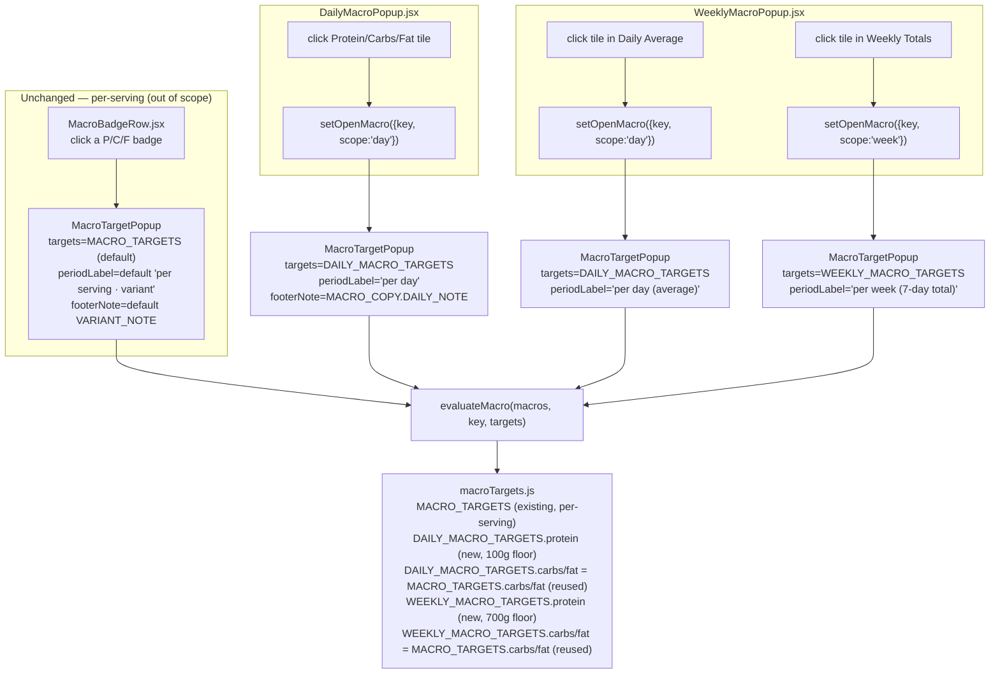

# Plan: Add traffic-light macro targets to daily/weekly meal plan summary popups

Plan folder: `.claude/contract/MPP-2-macro-traffic-light-daily-weekly-popups/`
Execution status: see `tasks.md` in this folder.

---

## Part 1 — Alignment

### Task reference

**Jira issue:** [MPP-2](https://amazerbeam.atlassian.net/browse/MPP-2) — "Add traffic-light macro targets to daily/weekly meal plan summary popups"

**Problem Statement** (verbatim): The daily and weekly meal-plan summary popups (`DailyMacroPopup.jsx`, `WeeklyMacroPopup.jsx`) show Protein/Carbs/Fat cards as plain, non-interactive elements with fixed brand colors and no target thresholds. This is inconsistent with the recipe-level traffic light (`MacroBadgeRow.jsx` + `MacroTargetPopup.jsx`, driven by `constants/macroTargets.js`), which lets a user click a macro badge to see whether it's on target against a colored band with a sourced explanation. Users currently have no way to tell whether their daily or weekly macro split is actually on target.

**User Story:** As a user tracking my meal plan, I want to click on the Protein/Carbs/Fat cards in the daily and weekly summary popups and see a traffic-light explanation like the recipe-level one, so that I understand whether my daily/weekly macro split is on target and why.

**Acceptance Criteria** (verbatim):
1. The Protein/Carbs/Fat cards in both `DailyMacroPopup` and `WeeklyMacroPopup` become clickable and open an explainer modal styled consistently with the existing recipe-level `MacroTargetPopup` (value, status, threshold band, "why this target" copy with sourcing).
2. Fat traffic light for the daily/weekly aggregate uses 25–35% of daily kcal as the on-target band, reused directly from the existing per-serving fat % target already defined in `macroTargets.js`.
3. Carbs traffic light for the daily/weekly aggregate uses 40–50% of daily kcal as the on-target band, reused directly from the existing per-serving carbs % target already defined in `macroTargets.js`.
4. Protein traffic light for the daily/weekly aggregate uses a new fixed floor of ≥100g/day, derived from the USDA 1.2–1.6 g/kg/day range already cited in CLAUDE.md (≈96–129g/day for an 80kg reference adult) since the existing gram-based per-serving target doesn't scale directly to a daily total.
5. Weekly popup applies the same daily-level bands to both the "Weekly Totals" and "Daily Average" sections, scaled appropriately (weekly totals compared against a 7x daily target; daily average compared directly).

**Scope Boundaries** (verbatim): In scope — making the daily/weekly P/C/F cards clickable; defining new daily-level target constants; building or extending an explainer modal reusable across recipe-level and day/week-level views; writing sourced "why this target" copy for the new protein floor. Out of scope — per-user personalization of targets (no onboarding/weight-intake flow or weight/goal fields exist on the `User` entity today); changes to the existing per-serving recipe-level traffic light behavior; any new backend endpoints, fields, or entities.

**Dependencies & Risks** (verbatim): No user weight/goal data exists anywhere in the app, so the daily protein floor must ship as a fixed generic default (≥100g/day) rather than a personalized target — this is a known, accepted limitation, not a blocker. The fat/carbs bands are safe to reuse as-is since both are expressed as % of kcal, which is scale-invariant between a single meal and a daily/weekly aggregate.

**Design Assets** (verbatim): N/A — this follows the existing visual/interaction pattern already shipped in `MacroTargetPopup.jsx` (recipe-level traffic light).

### Restated goal

Make the Protein/Carbs/Fat summary tiles in the daily meal-plan popup and both sections of the weekly meal-plan popup clickable, so tapping one opens the same style of explainer popup the recipe card already uses — showing the current reading, its traffic-light status, the target band, the reasoning, and the source — but evaluated against daily-scale (and weekly-scale) targets instead of per-serving ones. Carbs and fat reuse the existing percentage-of-kcal bands unchanged (scale-invariant); protein gets a new fixed floor (100 g/day, 700 g/week) since the existing 35 g/serving floor has no daily meaning.

### In scope

- Clickable Protein/Carbs/Fat tiles in `DailyMacroPopup.jsx` (one section).
- Clickable Protein/Carbs/Fat tiles in `WeeklyMacroPopup.jsx`, in **both** the "Weekly Totals" section (`.macro-summary-item`) and the "Daily Average" section (`.macro-item`).
- New daily-scale and weekly-scale target constants in `constants/macroTargets.js`: a new protein floor (100 g/day, 700 g/week) with sourced "why"/"sources" copy, and direct reuse of the existing carbs/fat band tables for both scopes.
- Generalizing `macroStatus.js` (`bandFor`, `evaluateMacro`) to evaluate against a passed-in target table instead of the hardcoded per-serving `MACRO_TARGETS`, with the per-serving table as the default so existing callers are unaffected.
- Extending `MacroTargetPopup.jsx` with optional props so it can render a day/week reading (different target table, different subtitle, different footer disclaimer) without changing its default (per-serving) behavior.
- Fixing a portal/outside-click interaction bug this reuse would otherwise introduce (see Risks) in `DailyMacroPopup.jsx` and `WeeklyMacroPopup.jsx`.
- Necessary CSS additions in `DailyMacroPopup.css` / `WeeklyMacroPopup.css` to turn the presentational tiles into accessible, ≥44px interactive buttons per the PWA touch rules.
- Extending `macroStatus.check.mjs` (the project's substitute for a test runner) to assert the new band boundaries and copy hygiene for the new protein targets.

### Explicitly out of scope

- Any change to `MacroBadgeRow.jsx` or to the per-serving recipe-level traffic-light computation/rendering. `MacroTargetPopup.jsx` changes are additive-only (new optional props with defaults that reproduce today's output) specifically so this file needs no edit and no behavior change.
- Personalizing the protein floor to a user's weight/goals — no such data exists on `User` today; the floor ships as a fixed generic default.
- Any backend endpoint, entity, or DTO change — the daily/weekly totals are already computed and delivered to these two components today; this task is presentation-only.
- Visually recoloring the closed (unclicked) Protein/Carbs/Fat tiles to reflect their traffic-light status (e.g. colored border matching `evaluateMacro().status`). The brief's AC1 only requires the tiles to be clickable and to open a popup carrying the status; it does not ask for the tiles themselves to be re-skinned. Treated as a separate, later enhancement — see Assumptions.
- Adding a background-sync / offline queue, or any new PWA caching rule — this feature reads data already on the page, no new network call.

### Pattern Reference

Named directly in the brief (verbatim): `DailyMacroPopup.jsx`, `WeeklyMacroPopup.jsx`, `MacroBadgeRow.jsx`, `MacroTargetPopup.jsx`, `constants/macroTargets.js`. All five were read in full during planning, along with `utils/macroStatus.js`, `utils/macroStatus.check.mjs`, `MacroTargetPopup.css`, `DailyMacroPopup.css`, `WeeklyMacroPopup.css`, `hooks/usePullToDismiss.js`, and `hooks/useBodyScrollLock.js` (module-level, reference-counted lock — confirmed safe to reuse without changes). `RecipeViewModal.jsx` was also read to confirm how it safely nests a portal-rendered `MacroTargetPopup` (its overlay-click-to-close uses a React synthetic `onClick`, not a native `document` listener — see Risks for why `DailyMacroPopup`/`WeeklyMacroPopup` need a small fix to nest the same popup safely).

### Constraints flagged on the brief

- Fat band (25–35% of kcal) and carbs band (40–50% of kcal) must be **reused directly** from `macroTargets.js`, not redefined — both AC2 and AC3 use the word "reused directly".
- Protein floor is a **new, fixed, non-personalized** value: ≥100 g/day, explicitly derived from the USDA 1.2–1.6 g/kg/day range already cited in `CLAUDE.md`, using an 80 kg reference adult (≈96–129 g/day) — the same reference adult the per-serving 35 g floor already uses (`macroTargets.js` protein `why[1]`).
- Weekly Totals section must compare against a **7× daily target** (i.e. ≥700 g/week protein); Daily Average section compares directly against the daily target (≥100 g/day, plus the unchanged carbs/fat percent bands).
- No backend, entity, or endpoint changes — confirmed against `CLAUDE.md`/`java-backend` boundary; this is a `client/src/` only change.
- `CLAUDE.md`'s macro provenance table and the `diet-guidelines` skill both require every macro claim shown to a user to cite its source body — the existing `macroStatus.check.mjs` copy-hygiene assertion (`BANNED_IN_COPY`, FoodBytes-attribution check) enforces this mechanically today for `MACRO_TARGETS`; the new protein target tables must pass the same class of check.

### Assumptions made

- **Card-level visual traffic-light coloring is NOT added to the closed tiles** — only clickability + a popup. *Rationale:* AC1's wording ("become clickable and open an explainer modal") only requires the popup to carry status/threshold information; it doesn't ask for the tile itself to be recolored, and recoloring risks visually conflating the day/week aggregate view with the per-meal `MacroBadgeRow` traffic light the brief explicitly protects ("changes to the existing per-serving recipe-level traffic light behavior" is out of scope). Developer can red-line this if a colored border is wanted on the tiles too — it's a small additive follow-up either way.
- **`MacroTargetPopup.jsx` gets new optional props (`targets`, `periodLabel`, `footerNote`) rather than a `scope` enum it resolves internally**, and **`MacroBadgeRow.jsx` is not touched at all** — it keeps calling `MacroTargetPopup` exactly as today, so every new prop's default reproduces current output byte-for-byte. *Rationale:* the brief explicitly protects the per-serving component from behavior change; the safest way to guarantee that is to not edit the file that calls it. The alternative (push subtitle composition into `MacroBadgeRow` via a `periodLabel` it computes) was considered and rejected as an unnecessary touch to an out-of-scope file for no functional gain.
- **Protein "near" (rounding-slack) band widths for day/week are derived by the same ratio the per-serving band already uses**, not independently chosen. Per-serving: floor 35 g, near band is the 2 g immediately below it (33–34 g). Day: floor 100 g, near band 98–99 g (same 2 g). Week: floor 700 g, near band 686–699 g (2 g × 7 = 14 g, since a week is seven independently-rounded days). *Rationale:* the per-serving near band's own copy explains it exists only because "macros are rounded to whole grams for display" — the same rounding-accumulation logic applies, scaled, to a week of independently-rounded daily totals. This is a judgement call, not stated in the brief — flagged for red-line.
- **Carbs/fat "why"/"sources" copy is reused completely verbatim** (literally the same object reference, `MACRO_TARGETS.carbs` / `MACRO_TARGETS.fat`), including phrasing like "the dish will read dry" in the fat copy that reads slightly odd at a whole-week aggregation level. *Rationale:* AC2/AC3 explicitly say "reused directly", and the phrasing, while meal-flavored, is not factually wrong at a daily/weekly level (a week eaten too low-fat will still taste austere). Lighter-touch than authoring parallel copy, and avoids the copy-hygiene check needing to diverge for near-identical content. Flagged as the more debatable of the two verbatim-reuse decisions — happy to fork day/week-specific fat copy if the developer prefers.
- **Weekly popup uses a single `openMacro` state object (`{ key, scope }`) shared across both sections**, not two independent states. *Rationale:* only one macro popup should ever be open at a time (matches `MacroBadgeRow`'s single `openMacroKey` pattern) and avoids two `MacroTargetPopup` instances mounting simultaneously with the same `id="macro-target-title"`, which would be an accessibility bug (duplicate ID referenced by `aria-labelledby`).
- **The Weekly Totals section's closed-tile display is left unchanged** (still shows grams + calories only, no percent) — only the popup, opened on click, surfaces percent/status. *Rationale:* AC1 requires the information to live in the popup, not necessarily on every closed tile; `.macro-summary-item` today has no percent slot and adding one is a bigger visual change than this ticket asks for.
- **`macroStatus.check.mjs` is extended, not left as-is**, to assert the new protein band boundaries and to run the existing copy-hygiene loop over the new target tables. *Rationale:* this file is the project's substitute for a test runner (`react-frontend` skill: no test runner exists in `client/package.json`); shipping a new band table with no boundary assertion would leave exactly the kind of band-table typo this file exists to catch.

### Cross-code alignment audit (FE ↔ BE ↔ DB)

Skipped — this task touches no persistence. `DailyMacroPopup`/`WeeklyMacroPopup` already receive fully-computed `day`/`weekData` props (totals and averages) from whatever already feeds them today; no DB schema, JPA entity, DTO, or `/api/...` endpoint is read, added, or modified. Confirmed against the brief's own "Out of scope: any new backend endpoints, fields, or entities."

---

## Part 2 — Technical design

### Approach

The existing per-serving traffic light is already split cleanly into a pure evaluation layer (`macroStatus.js` + `macroTargets.js`, no React) and a presentation layer (`MacroBadgeRow.jsx` → `MacroTargetPopup.jsx`). That separation is exactly what this task needs to extend, so the shape of the change is: **generalize the evaluation layer to take a target table as a parameter instead of assuming the per-serving one, add two new target tables, and thread an optional "which target table / what caption" pair through the existing popup rather than building a second one.**

`macroStatus.js`'s `bandFor(key, subject)` and `evaluateMacro(macros, key)` currently close over the module-level `MACRO_TARGETS` import. Both get a third parameter, `targets = MACRO_TARGETS`, defaulted so every existing call site (`MacroBadgeRow.jsx`, `MacroTargetPopup.jsx`, `macroStatus.check.mjs`'s existing assertions) needs no change. `deriveKcal` needs no change at all — 4P + 4C + 9F is scale-invariant by construction, which is also *why* AC2/AC3 can say the percent-based carbs/fat bands are safe to reuse directly at any scale.

Two new target tables live in `macroTargets.js`: `DAILY_MACRO_TARGETS` and `WEEKLY_MACRO_TARGETS`. Each is `{ protein, carbs, fat }` shaped identically to `MACRO_TARGETS` so `evaluateMacro`/`bandFor` don't need to know the difference. `carbs` and `fat` on both new tables are literally the same object reference as `MACRO_TARGETS.carbs` / `MACRO_TARGETS.fat` (not a copy) — per AC2/AC3's "reused directly" wording, and because keeping one object means a future edit to the percent bands can't silently drift between three copies. Only `protein` is a new object per table, with its own bands (100 g / 700 g floors, near-bands per the ratio in Assumptions) and its own sourced `why`/`sources` copy, since the per-meal 35 g floor doesn't scale to a day or week and needs its own justification (still built from the same USDA 1.2–1.6 g/kg/day citation `CLAUDE.md` and the per-serving target already use, so this is restating an already-approved source at a new scale, not introducing a new one).

`MacroTargetPopup.jsx` gets three new optional props — `targets` (defaults to `MACRO_TARGETS`), `periodLabel` (a plain string subtitle; when absent falls back to today's `per serving${variantLabel ? ' · '+variantLabel : ''}` composition), and `footerNote` (defaults to `MACRO_COPY.VARIANT_NOTE`, today's footer). Because every new prop's default reconstructs current behavior exactly, `MacroBadgeRow.jsx` — which is explicitly out of scope — needs zero edits; it keeps calling `MacroTargetPopup` with the same four props it uses today. `DailyMacroPopup`/`WeeklyMacroPopup` are the only new callers, and they pass `targets={DAILY_MACRO_TARGETS}` / `targets={WEEKLY_MACRO_TARGETS}`, an explicit `periodLabel` ("per day", "per day (average)", "per week (7-day total)"), and a new `footerNote` (`MACRO_COPY.DAILY_NOTE`, a short "this is a fixed default, not personalized" disclaimer — the honest UI-level restatement of the brief's own "Dependencies & Risks" paragraph).

The remaining work is presentational: `DailyMacroPopup.jsx`'s three `.macro-item` `<div>`s and `WeeklyMacroPopup.jsx`'s three `.macro-summary-item` `<div>`s (Weekly Totals) plus three more `.macro-item` `<div>`s (Daily Average) become `<button type="button">`s carrying the same touch/ARIA affordances `MacroBadgeRow`'s badges already use (`aria-haspopup="dialog"`, `aria-expanded`, `min 44px` hit target, `:focus-visible`, hover wrapped in `@media (hover:hover)` paired with `:active`). Each button's `onClick` sets a local `openMacro` state (`{ key, scope }` in the weekly case, since two sections share one popup instance) and the component conditionally renders one `MacroTargetPopup` beneath the existing markup, exactly where `MacroBadgeRow` does it today.

One correctness issue surfaces from this reuse and must be fixed as part of the same change, not left as a latent bug: `DailyMacroPopup`/`WeeklyMacroPopup` close themselves on outside click via a **native** `document.addEventListener('mousedown', ...)` listener that checks `popupRef.current.contains(e.target)`. `MacroTargetPopup` renders through `createPortal(..., document.body)`, so its DOM nodes are real DOM siblings of the popup panel, not descendants — `contains()` returns `false` for a mousedown inside the nested popup, and today's code would incorrectly close the parent Daily/Weekly popup out from under it. `RecipeViewModal` (which already nests `MacroTargetPopup` via `MacroBadgeRow` without this bug) avoids the problem structurally: it closes on outside click via a React **synthetic** `onClick={onClose}` on its overlay `<div>`, which `MacroTargetPopup`'s own overlay `onClick` already calls `stopPropagation()` against — synthetic stopPropagation only shields other *synthetic* listeners, and a native `document` `mousedown` listener never sees a synthetic-only stop. `DailyMacroPopup`/`WeeklyMacroPopup` use the native-listener pattern instead, so the fix is a one-line guard in each: skip the outside-click close when `e.target.closest('.macro-target-overlay')` is truthy. Escape-key handling needs no equivalent fix — `MacroTargetPopup` already registers its Escape listener in the **capture** phase and calls `stopPropagation()` there, which does pre-empt `DailyMacroPopup`/`WeeklyMacroPopup`'s bubble-phase Escape listeners; this was verified by reading the existing code and comments, not assumed.

Alternative considered and rejected: building a second, day/week-specific popup component instead of extending `MacroTargetPopup`. Rejected because the brief explicitly asks for a modal "styled consistently with the existing recipe-level `MacroTargetPopup`" and "reusable across recipe-level and day/week-level views" — a fork would immediately drift in styling and band-legend behavior, and the extension surface needed (three optional props) is small enough that a fork buys nothing.

### Skills to invoke during execution

- `react-frontend` — owns every file this task touches (`client/src/components/mealplan/*`, `client/src/components/recipes/MacroTargetPopup.jsx`, `client/src/constants/macroTargets.js`, `client/src/utils/macroStatus.js`); its touch-target, ARIA, and hover/active pairing rules govern the new interactive tiles, and its "no test runner — verify what you actually ran" rule governs how `macroStatus.check.mjs` is extended and reported.
- `diet-guidelines` — governs the sourcing/attribution convention for the new protein-floor "why"/"sources" copy (must cite USDA 2025–2030, and must not borrow a published guideline's authority for the FoodBytes-internal 100 g/700 g calibration without saying so — mirrors how the existing per-serving protein target already separates the USDA citation from the internal 35 g floor).
- `chef` — loaded per developer request at the skill-confirmation step; its macro-target material duplicates what `diet-guidelines`/`CLAUDE.md` already state and its recipe-authoring workflow (ingredients, SQL, variant families) does not apply to this UI-only task. No `.claude/rules/` file it points to (variants, linked extras, ingredient dedup) is implicated — this task creates no recipe, ingredient, or migration. Included in the audit trail so the execution session knows it was considered and correctly found not to change the design.

No `.claude/rules/` file applies — `recipe-variants.md`, `linked-recipe-extras.md`, and `homemade-first-and-ingredient-dedup.md` all govern recipe/ingredient/migration data, none of which this task touches.

### Diagram



### Data shapes

No backend/DB shapes change. All shapes below are frontend-only, in `foodbytes-app/client/src/`.

#### `constants/macroTargets.js` — additions

```js
/** Daily protein floor. 700 = 7 × 100, used for the weekly-totals band. */
export const DAILY_PROTEIN_FLOOR_G = 100
export const WEEKLY_PROTEIN_FLOOR_G = DAILY_PROTEIN_FLOOR_G * 7 // 700

// New footer disclaimer, added to the existing MACRO_COPY object (so it is
// automatically covered by macroStatus.check.mjs's copy-hygiene loop).
// MACRO_COPY.DAILY_NOTE = 'This target is a fixed general default and is not
//   personalized to your weight or goals.'

/** protein-only target table for the day scope; carbs/fat are the SAME
 *  object reference as MACRO_TARGETS.carbs / MACRO_TARGETS.fat — not a copy. */
export const DAILY_MACRO_TARGETS = {
  protein: {
    key: 'protein', code: 'P', label: 'Protein', mode: MACRO_MODE.GRAMS,
    perfect: `≥ ${DAILY_PROTEIN_FLOOR_G} g per day`,
    bands: [
      { status: MACRO_STATUS.ON,    range: '≥ 100 g',    meaning: 'Meets the daily protein floor', test: (g) => g >= 100 },
      { status: MACRO_STATUS.NEAR,  range: '98 – 99 g',  meaning: 'Under the floor, within display rounding', test: (g) => g >= 98 },
      { status: MACRO_STATUS.UNDER, range: '< 98 g',     meaning: 'Well under the daily floor', reject: true, test: () => true }
    ],
    why: [
      'Daily protein is the same lean-mass and satiety lever as the per-meal floor, checked across the whole day instead of one sitting — hitting it is what stops a calorie deficit becoming muscle loss.',
      'The 100 g/day floor sits inside the 96–129 g/day range implied by 1.2–1.6 g of protein per kg of bodyweight per day for an 80 kg reference adult — the same reference adult and the same USDA range the per-serving 35 g floor is derived from.',
      'This is a fixed generic default, not personalized to your weight or goals — FoodBytes does not yet collect bodyweight or goal data. 100 g was chosen as a round number that sits inside the reference range rather than at either edge of it.'
    ],
    sources: [
      { claim: '1.2–1.6 g protein per kg of bodyweight per day', source: 'USDA Dietary Guidelines for Americans 2025–2030' },
      { claim: '≈96–129 g/day for an 80 kg reference adult', source: 'FoodBytes calculation from the USDA range — internal, not personalized' },
      { claim: 'A 100 g/day floor, and rejection below it', source: 'FoodBytes recipe standard — internal calibration, no external source' }
    ]
  },
  carbs: MACRO_TARGETS.carbs, // reused directly — % of kcal is scale-invariant
  fat: MACRO_TARGETS.fat      // reused directly — % of kcal is scale-invariant
}

/** Same shape, protein floor scaled ×7 (700g, near-band 686–699g — 2g of
 *  per-day rounding slack accumulated over 7 independently-rounded days). */
export const WEEKLY_MACRO_TARGETS = {
  protein: {
    key: 'protein', code: 'P', label: 'Protein', mode: MACRO_MODE.GRAMS,
    perfect: `≥ ${WEEKLY_PROTEIN_FLOOR_G} g per week (7 × ${DAILY_PROTEIN_FLOOR_G} g/day)`,
    bands: [
      { status: MACRO_STATUS.ON,    range: '≥ 700 g',    meaning: 'Meets the weekly protein floor', test: (g) => g >= 700 },
      { status: MACRO_STATUS.NEAR,  range: '686 – 699 g', meaning: 'Under the floor, within display rounding', test: (g) => g >= 686 },
      { status: MACRO_STATUS.UNDER, range: '< 686 g',    meaning: 'Well under the weekly floor', reject: true, test: () => true }
    ],
    why: [
      'Weekly protein is the same 100 g/day floor summed across seven days — 700 g/week — so a strong day cannot be masked by a weak one when you check the week as a whole.',
      'The 100 g/day floor sits inside the 96–129 g/day range implied by 1.2–1.6 g of protein per kg of bodyweight per day for an 80 kg reference adult — the same reference adult and the same USDA range the per-serving 35 g floor is derived from.',
      'This is a fixed generic default, not personalized to your weight or goals — FoodBytes does not yet collect bodyweight or goal data. 700 g is exactly 7 × the daily floor, not an independently chosen weekly number.'
    ],
    sources: [
      { claim: '1.2–1.6 g protein per kg of bodyweight per day', source: 'USDA Dietary Guidelines for Americans 2025–2030' },
      { claim: '≈96–129 g/day for an 80 kg reference adult', source: 'FoodBytes calculation from the USDA range — internal, not personalized' },
      { claim: 'A 700 g/week floor (7 × the 100 g/day floor), and rejection below it', source: 'FoodBytes recipe standard — internal calibration, no external source' }
    ]
  },
  carbs: MACRO_TARGETS.carbs,
  fat: MACRO_TARGETS.fat
}
```

#### `utils/macroStatus.js` — signature changes (both backward-compatible)

```js
// before: export function bandFor(key, subject)
// after:
export function bandFor(key, subject, targets = MACRO_TARGETS) {
  const target = targets[key]
  if (!target) throw new Error(`Unknown macro key: ${key}`)
  return target.bands.find((band) => band.test(subject))
}

// before: export function evaluateMacro(macros, key)
// after:
export function evaluateMacro(macros, key, targets = MACRO_TARGETS) {
  const target = targets[key]
  if (!target) throw new Error(`Unknown macro key: ${key}`)
  const grams = macros?.[key] ?? 0
  const derivedKcal = deriveKcal(macros)
  const percent = derivedKcal > 0 ? Math.round(((grams * KCAL_PER_GRAM[key]) / derivedKcal) * 100) : 0
  const subject = target.mode === MACRO_MODE.GRAMS ? grams : percent
  const band = bandFor(key, subject, targets)
  return { status: band.status, band, grams, percent, derivedKcal }
}
```

`deriveKcal` is unchanged (no `targets` parameter needed — it never reads `MACRO_TARGETS`).

#### `components/recipes/MacroTargetPopup.jsx` — new props (all optional, backward-compatible)

```js
function MacroTargetPopup({
  macroKey,
  macros,
  variantLabel,
  displayedCaloriesPerServing,
  targets = MACRO_TARGETS,          // NEW
  periodLabel,                      // NEW — string | undefined
  footerNote = MACRO_COPY.VARIANT_NOTE, // NEW
  onClose
}) {
  const target = targets[macroKey]                       // was MACRO_TARGETS[macroKey]
  const result = evaluateMacro(macros, macroKey, targets) // was evaluateMacro(macros, macroKey)
  const subtitle = periodLabel ?? `per serving${variantLabel ? ` · ${variantLabel}` : ''}`
  // ...header renders {subtitle} instead of the inline template literal
  // ...footer renders {footerNote} instead of {MACRO_COPY.VARIANT_NOTE}
}
```

#### `components/mealplan/DailyMacroPopup.jsx` — new local state + import

```js
const [openMacroKey, setOpenMacroKey] = useState(null)
// macro-item divs → <button type="button" onClick={() => setOpenMacroKey(key)} aria-haspopup="dialog" aria-expanded={openMacroKey === key} ...>
// after the existing macro-grid:
{openMacroKey && (
  <MacroTargetPopup
    macroKey={openMacroKey}
    macros={{ protein: totalProtein, carbs: totalCarbs, fat: totalFat }}
    targets={DAILY_MACRO_TARGETS}
    periodLabel="per day"
    footerNote={MACRO_COPY.DAILY_NOTE}
    onClose={() => setOpenMacroKey(null)}
  />
)}
```

`handleClickOutside` gains a one-line guard: `if (e.target.closest('.macro-target-overlay')) return` before the existing `contains` check.

#### `components/mealplan/WeeklyMacroPopup.jsx` — new local state + import

```js
const [openMacro, setOpenMacro] = useState(null) // { key: 'protein'|'carbs'|'fat', scope: 'day'|'week' } | null
// Weekly Totals tiles: onClick={() => setOpenMacro({ key, scope: 'week' })}
// Daily Average tiles:  onClick={() => setOpenMacro({ key, scope: 'day' })}
{openMacro && (
  <MacroTargetPopup
    macroKey={openMacro.key}
    macros={
      openMacro.scope === 'week'
        ? { protein: weekTotalProtein, carbs: weekTotalCarbs, fat: weekTotalFat }
        : { protein: avgProtein, carbs: avgCarbs, fat: avgFat }
    }
    targets={openMacro.scope === 'week' ? WEEKLY_MACRO_TARGETS : DAILY_MACRO_TARGETS}
    periodLabel={openMacro.scope === 'week' ? 'per week (7-day total)' : 'per day (average)'}
    footerNote={MACRO_COPY.DAILY_NOTE}
    onClose={() => setOpenMacro(null)}
  />
)}
```

Same `handleClickOutside` guard as `DailyMacroPopup.jsx`.

### Runtime quality notes

- **Resource cleanup:** No new timers, listeners, or `AbortController`s beyond what `MacroTargetPopup` already owns (its Escape listener and focus-restore effect are cleaned up on unmount today, unchanged by this task). The one new `mousedown` guard is a conditional inside an existing listener — no new listener registration.
- **Concurrency / ordering:** Single-threaded browser event loop; no shared mutable state beyond the local `openMacroKey`/`openMacro` component state (not lifted to a Context — this is feature-local UI state, consistent with the `react-frontend` rule against putting feature-specific state in a global store). No race is possible between the click that opens the popup and the values it reads — `totalProtein`/`weekTotalProtein`/`avgProtein` etc. are already-resolved props/derived values at render time, not fetched fresh on click.
- **Allocation / cost behaviour:** No new network requests, no new re-render source beyond the existing `openMacroKey`/`openMacro` state (identical pattern to `MacroBadgeRow`'s proven `openMacroKey`). `DAILY_MACRO_TARGETS`/`WEEKLY_MACRO_TARGETS` are module-level constants built once at import time, not recomputed per render or per click. Reusing `MACRO_TARGETS.carbs`/`.fat` by reference (not cloning) avoids duplicating the band-table objects in memory or in the bundle.
- **Error paths:** No new failure surface — `evaluateMacro`/`bandFor` already throw synchronously on an unknown key (unchanged behavior, and every call site here passes a literal `'protein'|'carbs'|'fat'` key, never a dynamic/unknown one, so this can't fire in practice). No `catch` is introduced anywhere in this change, so nothing new can swallow an error into a success shape.

### Risks and judgement calls

- **The mousedown/portal outside-click bug is the single highest-risk item in this plan.** It is a genuine, previously-latent defect that this task's reuse of `MacroTargetPopup` would trigger for the first time in these two components (it doesn't manifest today because neither popup nests another portal-rendered popup). The fix (a one-line `closest('.macro-target-overlay')` guard) is small and low-risk, but must land in the **same task** that adds the nested popup, or a mousedown anywhere inside the new `MacroTargetPopup` (e.g. tapping the close button, scrolling the band legend) will silently dismiss the whole Daily/Weekly popup underneath it. Verified by reading the exact listener code and event-phase semantics in `DailyMacroPopup.jsx`, `WeeklyMacroPopup.jsx`, `MacroTargetPopup.jsx`, and `RecipeViewModal.jsx` — not inferred.
- **Verbatim reuse of fat's "the dish will read dry" copy at week-aggregate scale** (see Assumptions) is the most likely candidate for a developer red-line — it's correct per AC2/AC3's literal wording but may read oddly in a "Weekly Totals" popup. Cheap to fork into scope-specific copy later if it reads badly in practice.
- **No visual traffic-light coloring on the closed tiles** is a scope-narrowing judgement call (see Assumptions) — flagged in case the developer expected the tiles themselves to look "lit up" the way `MacroBadgeRow`'s badges do, not just be clickable.
- **The `chef` skill was confirmed but doesn't change the design** — flagged so the execution session doesn't go looking for a chef-skill-driven task that doesn't exist; it was evaluated and correctly found inapplicable (no recipe/ingredient/migration work here).
- **`macroStatus.check.mjs` extension is manual verification, not a real test runner** — per the `react-frontend` hard floor, no test framework exists in this client. The extended assertions catch band-table gaps and copy-hygiene regressions the same way the existing ones do today, but running `node src/utils/macroStatus.check.mjs` is the full extent of "testing" available for this change; anything requiring a rendered DOM (click behavior, ARIA wiring, the portal outside-click fix) can only be verified by manual/visual check, which `tasks.md` must call out explicitly rather than imply was automated.
