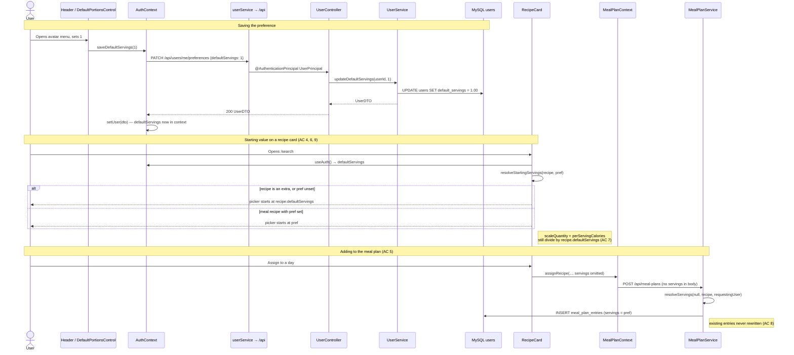

# Plan: User-configurable default portions from the account menu

Plan folder: `.claude/contract/MPP-3-user-default-portions/`
Execution status: see `tasks.md` in this folder.

---

## Part 1 — Alignment

### Task reference

Jira: **MPP-3 — "User-configurable default portions from the account menu"** (Story, Medium, project `MPP`).
<https://amazerbeam.atlassian.net/browse/MPP-3>

**Acceptance criteria, verbatim from the ticket:**

1. Clicking the avatar in the header opens the account menu with a new "Default portions" control positioned above Sign Out, alongside the existing name/email block.
2. The control accepts the same range and precision as every other servings input — min 0.25, max 20, 2 decimal places — reusing `MIN_SERVINGS` / `MAX_SERVINGS` from `client/src/constants/servings.js` rather than introducing a second set of bounds.
3. The chosen value persists per user across sessions and devices (server-side on the `users` record, delivered with the authenticated user payload), not in localStorage.
4. With the preference set to 1, opening the search/recipe list shows every non-extra recipe card with its servings picker at 1, and the recipe view modal opens at 1.
5. Adding a recipe to the meal plan with no explicit servings creates the entry at the user's default rather than at `recipe.defaultServings`.
6. Recipes flagged `is_extra = 1` are unaffected — extras keep starting from their own `defaultServings`, both on the card and in the extras selection popup.
7. Ingredient quantities and per-serving macros scale off the preference exactly as they do today when a user changes servings by hand: the recipe's stored `defaultServings` remains the scaling basis, and the preference only changes the starting value of the control.
8. Meal-plan entries that already exist are left untouched — their saved servings, the day totals, and the week total do not change when the preference is updated.
9. A user who has never set the preference behaves exactly as today: the starting value falls back to `recipe.defaultServings`.
10. The per-recipe and per-entry servings controls remain editable after the preference is applied — the default is a starting point, not a lock.

**Follow-up decisions confirmed interactively with the developer, 2026-08-09:**

- **Production PII risk accepted.** The developer was warned that this story requires DDL plus a one-shot `UPDATE` against the live Railway `users` table (real accounts: emails, names, password hashes) and chose *"Proceed — I accept the risk"*. Planning stayed read-only (`SHOW COLUMNS` and aggregates only; no row data selected).
- **Guest mode: hide the control.** Guests never see the account menu — the header renders a Sign In button instead — so no guest-side persistence path is built. Guests keep today's `recipe.defaultServings` behaviour.
- **Linked sub-recipes (FR-095): keep current behaviour.** Navigating Pizza → Pizza Sauce still opens the sub-recipe at its own `defaultServings`. `useRecipeStackServings.js:123` is not touched.
- **Skills confirmed:** `java-backend` + `react-frontend`. `requirements` was offered and declined — the ticket already carries ten testable criteria.

### Restated goal

A user who always cooks for the same number of people can set that number once, from the account menu behind their avatar, and have it become the *starting* value of every servings control in the app instead of the recipe author's `defaultServings`. The preference lives on the `users` row so it follows the account across devices, arrives with the `/api/auth/me` payload, and is saved through a dedicated endpoint. It changes only where a servings control *starts*: the scaling maths — ingredient quantities, per-serving kcal, macro badges — keeps dividing by the recipe's own `defaultServings`, untouched. Component recipes tagged as extras are exempt and keep starting at their own default. A user who has never set the preference gets exactly today's behaviour, and every control stays freely editable afterwards.

### In scope

- Widen `users.default_servings` from `INT` to `DECIMAL(4,2)` and make "never set" representable as `NULL`, via a date-prefixed migration the developer applies manually to the Railway MySQL.
- Change the `User` entity field to `BigDecimal` with no default initialiser.
- Carry `defaultServings` through `UserPrincipal` → `UserDTO` so it arrives on `GET /api/auth/me` and on the `POST /api/auth/login` response.
- Route both `AuthController` `UserDTO` constructions through the existing `UserService.convertToDTO` so the new field cannot be populated at one call site and forgotten at the other.
- New `PATCH /api/users/me/preferences` endpoint (`UserController` + `UserService` method + `UserPreferencesUpdateRequest` DTO) validating 0.25–20.00 at 2dp, with `null` meaning "clear the preference".
- Teach `MealPlanService.resolveServings` a new fallback tier: requested → **requesting user's preference** → recipe default → 1 (AC 5), with extras exempt.
- New pure helper `resolveStartingServings(recipe, userDefaultServings)` in `client/src/utils/servingsUtils.js` holding the AC 4 / 6 / 9 decision in one place, plus a `node`-runnable `.check.mjs` alongside it.
- New `DefaultPortionsControl.jsx` rendered inside the account-menu dropdown above Sign Out, reusing `MIN_SERVINGS` / `MAX_SERVINGS` / `SERVINGS_STEP`.
- `AuthContext` exposes `defaultServings` and a `saveDefaultServings` action; new `userService.js` wraps the HTTP call.
- `RecipeCard.jsx` seeds its servings state from the helper; `MealPlanContext.jsx`'s optimistic display fallback mirrors the backend's new resolution order.

### Explicitly out of scope

- Changing any recipe's stored `defaultServings`, or the admin recipe form (`RecipeInfoForm.jsx`) that edits it.
- Retro-applying the preference to meal-plan entries that already exist (AC 8 — they must not move).
- Any change to extras behaviour, including `ExtrasSelectionPopup` (it has no servings control of its own — it receives `servings` as a prop).
- Applying the preference when navigating into a linked sub-recipe (`useRecipeStackServings.js:123`) — explicitly declined above.
- Per-meal-type defaults (a different default for breakfast vs dinner).
- A wider account settings or preferences screen. This is one control in the existing dropdown.
- Guest-mode persistence of any kind.
- Shopping-list quantity logic beyond what already follows from meal-plan entry servings.
- Bootstrapping `vite-plugin-pwa`. The `react-frontend` skill flags it as not yet installed; this story does not depend on it and installing it here would be unrelated scope.

### Pattern Reference

Supplied by the brief:

- `client/src/constants/servings.js` — `MIN_SERVINGS` / `MAX_SERVINGS` must be reused, not redeclared (AC 2).
- `client/src/components/recipes/RecipeCard.jsx:37`, `:59` and `RecipeViewModal.jsx:222` — named as the scaling sites the preference must **not** touch.
- `client/src/hooks/useRecipeStackServings.js:123` — named as the linked-recipe decision point.
- `client/src/contexts/MealPlanContext.jsx` — named as the meal-plan add site.

Chosen during planning, where the brief supplied none:

- **Migration shape** — `foodbytes-app/database/migrations/2026-07-29_decimal_servings.sql` is the direct precedent: same `INT → DECIMAL(4,2)` widen, same "MUST be applied before the backend redeploys" header, same lossless-because-row-counts justification.
- **Validation annotations** — `dto/MealPlanCreateRequest.java:39-42` (`@DecimalMin("0.25")` / `@DecimalMax("20.00")` / `@Digits(integer=2, fraction=2)`, all passing on null).
- **Extras detection** — `client/src/utils/macroStatus.js:78` `hasMealMacroTargets()` and `constants/macroTargets.js` `COMPONENT_MEAL_TYPE`. This is the established house test for "is this a component recipe rather than a meal", and it is already case-insensitive across the two shapes the API returns.
- **Pure-helper verification** — `client/src/utils/macroStatus.check.mjs` is the precedent for a `node`-runnable assertion file standing in for the absent frontend test runner.
- **Controller shape** — `controller/AuthController.java` for `@AuthenticationPrincipal UserPrincipal` + `ResponseEntity<DTO>`.

### Constraints flagged on the brief

- **The double-duty trap.** `defaultServings` is both the picker's starting value *and* the divisor scaling ingredient quantities and per-serving kcal. The brief calls overriding the divisor "the main correctness risk in the story" — it would silently misreport macros on every recipe. The preference must reach the `useState` seed and nothing else.
- **Hibernate runs `ddl-auto: validate`.** The migration must be applied to the Railway MySQL *before* the backend redeploys, or startup fails validation.
- **Existing meal-plan entries must not move** (AC 8) — no backfill of `meal_plan_entries.servings`.
- **Extras are exempt** (AC 6).
- **Never-set must behave exactly as today** (AC 9).
- **Controls stay editable** (AC 10) — the preference seeds state, it does not lock or control it.

### Assumptions made

- **`recipes.is_extra` does not exist; extras are detected by meal type.** *(verified against the live schema — see the audit below)* AC 6 names a column that is not in the database. Extras are recipes tagged with the `Extras` meal (`meals.id = 5`, key `extras`), surfaced on both `RecipeDTO.mealTypes` and `RecipeSummaryDTO.mealTypes` as `meals.key`. The plan reads AC 6 as "component recipes tagged Extras are exempt" and reuses the existing `COMPONENT_MEAL_TYPE` test rather than adding a column. **This is the assumption most worth red-lining** — if you meant a genuine new `is_extra` column, the plan grows a second migration.
- **`users.default_servings` already exists and is dead.** *(verified)* It is `INT NULL DEFAULT 1`, and nothing in the backend or frontend reads it — grep found only the `2026-05-18_password_auth.sql` seed INSERT. So the story is a widen-and-wire-up, not an add-column.
- **The migration must NULL out the existing values.** All 11 rows hold `1`. If left as `1`, every existing user would silently acquire a preference of one serving the moment the feature ships, breaking AC 9 for the entire user base. Since no code path can ever have set the column, `1` is provably the untouched default, so nulling it is a correction rather than data loss. `NULL` becomes the canonical "never set".
- **AC 5 is enforced on the backend, not the frontend.** `MealPlanService.resolveServings` is the single point where an omitted servings value is resolved, and it already owns the recipe-default fallback. Putting the preference tier there means every caller — the recipe card, day assignment buttons, any future one — inherits it, and the persisted value is right even if a client sends nothing. The frontend's optimistic fallback (`MealPlanContext.jsx:197`) is display-only and mirrors it.
- **The *requesting* user's preference applies, not the meal-plan owner's.** With `users.meal_plan_owner_id` set, entries are written against the owner but the person clicking is the one who set a portion preference and the one who will cook. Requires fetching the requesting user alongside the effective owner — folded into the existing `getEffectiveMealPlanOwnerId` lookup so it costs no extra query.
- **The preference endpoint lives at `/api/users/me/preferences`, not under `/api/auth`.** `AuthController` is about authenticating; a portion preference is profile state. A new thin `UserController` keeps that boundary and gives future preferences an obvious home without becoming the "wider settings screen" the ticket excludes.
- **`PATCH` with a nullable body field, not `PUT`.** The request carries one optional field and an explicit `null` clears the preference back to "never set", restoring AC 9 behaviour. That is a partial update, not a replacement.
- **`RecipeViewModal` needs no change.** *(verified)* It takes `servings` as a prop from `RecipeCard`, so AC 4's "the recipe view modal opens at 1" follows from the card change alone. Touching the modal would duplicate the decision in a second place.
- **`Header.jsx` gets the control extracted into its own component.** Header is 89 lines today; inlining a numeric stepper with async save, error, and pending states would push it past the point where the `react-frontend` skill wants a split. `DefaultPortionsControl.jsx` keeps both files small.
- **No `.claude/rules/` file applies.** This story touches no recipe data, ingredients, macros, variants, or recipe SQL — it changes only the *starting value* of a control and one column on `users`. `linked-recipe-extras.md`, `recipe-variants.md`, and `homemade-first-and-ingredient-dedup.md` were all scanned and none of their reject conditions is reachable from this change.

### Cross-code alignment audit (FE ↔ BE ↔ DB)

Performed 2026-08-09 against the live Railway MySQL via the `mysql` MCP, read-only. No rows were selected from `users` — only `SHOW COLUMNS` and non-identifying aggregates, per the standing rule on production personal data.

- **`users.default_servings` exists, and its type is the whole story.** `SHOW COLUMNS FROM users` returns:
  `{ "Field": "default_servings", "Type": "int", "Null": "YES", "Key": "", "Default": "1", "Extra": "" }`
  The entity already maps it (`User.java:37-38`, `private Integer defaultServings = 1;`), so the DB and the entity agree today. The widen to `DECIMAL(4,2)` and the entity change to `BigDecimal` must land together, in migration-first order.
- **The widen is lossless.** `SELECT COUNT(*) AS total_users, COUNT(default_servings) AS non_null, MIN(default_servings), MAX(default_servings) FROM users` → `total_users: 11, non_null: 11, min: 1, max: 1`. Every row holds the integer `1`, well inside `DECIMAL(4,2)`'s `0.01..99.99`. No truncation, no backfill needed for the type change — only the deliberate reset to `NULL`.
- **`recipes.is_extra` does not exist.** `SHOW COLUMNS FROM recipes` returns exactly: `id, name, default_servings, calories, is_cheat, is_live, macros_audited, macros_audited_at, macros_audited_by, created_at, updated_at`. There is no `is_extra`. AC 6's premise is wrong about the mechanism, not about the intent.
- **Extras are a meal type.** `SELECT id, name FROM meals` → `1 Breakfast, 2 Lunch, 3 Dinner, 4 Snacks, 5 Extras`. `RecipeService.java:153-155` and `:191-193` both populate `mealTypes` from `m.getMeal().getKey()`, and `RecipeService.java:673-674` already tests linked recipes with `"extras".equalsIgnoreCase(m.getMeal().getKey())`. The frontend equivalent is `COMPONENT_MEAL_TYPE` in `macroStatus.js`. Extras genuinely reach the card list — `RecipeList.jsx:10` declares `MEAL_TYPES = ['breakfast', 'lunch', 'dinner', 'snacks', 'extras']` — so AC 6 is live, not theoretical.
- **`meal_plan_entries.servings` is the precedent and needs no change.** `SHOW COLUMNS FROM meal_plan_entries` → `{ "Field": "servings", "Type": "decimal(4,2)", "Null": "NO", "Default": "1.00" }`. Widened by `2026-07-29_decimal_servings.sql`. AC 8 is satisfied by simply not writing to this table.
- **No unapplied migration is outstanding.** The newest files under `foodbytes-app/database/migrations/` are the 2026-07-30 set; the columns they introduce (`macros_audited`, `macros_audited_at`, `macros_audited_by`) are all present in the live `recipes` table, so the schema is current and nothing blocks a redeploy ahead of this story's own migration.
- **Name alignment across the chain, post-change:** `users.default_servings` (DB, `DECIMAL(4,2)`) ↔ `User.defaultServings` (`BigDecimal`, `@Column(name = "default_servings")`) ↔ `UserPrincipal.defaultServings` ↔ `UserDTO.defaultServings` ↔ JSON `defaultServings` ↔ `user.defaultServings` in `AuthContext`. Jackson maps the Java camelCase field to the same JSON key with no annotation, matching how `avatarUrl` and `isAdmin` already travel.
- **One pre-existing mismatch this change must not trip over:** `RecipeDTO.defaultServings` and `RecipeSummaryDTO.defaultServings` are `Integer` and stay `Integer` — `recipes.default_servings` remains `INT NOT NULL DEFAULT 2` and is out of scope. Only the *user* field becomes decimal, so `resolveStartingServings` receives a decimal preference and an integer recipe default and must return a number usable by `parseServings` either way.

---

## Part 2 — Technical design

### Approach

The whole change hangs on one distinction the brief itself flags as the main correctness risk: `defaultServings` is used both as *where the picker starts* and as *what the scaling maths divides by*, and only the first may move. The design keeps that honest by never letting the preference near a divisor. On the frontend it reaches exactly one expression — the `useState` seed in `RecipeCard.jsx:12-14` — while `RecipeCard.jsx:37` (`originalQty / recipe.defaultServings * servings`) and `:59` (`recipe.calories / recipe.defaultServings`) keep reading `recipe.defaultServings` verbatim. `RecipeViewModal.jsx:222` is untouched for the same reason, and the modal needs no change at all because it receives `servings` as a prop from the card and therefore inherits the new starting value for free.

Rather than scatter the "which starting value?" decision across the card, the context, and any future caller, it goes into one pure function — `resolveStartingServings(recipe, userDefaultServings)` in `utils/servingsUtils.js`. It encodes AC 4, 6 and 9 together: return the recipe's own default when the recipe is an extra, when the preference is unset, or when the preference is unusable; otherwise return the preference. Because it is pure and React-free it is verifiable under plain `node`, which matters here — there is no frontend test runner, and `macroStatus.check.mjs` is the established precedent for exactly this. The extras test reuses `COMPONENT_MEAL_TYPE` from `constants/macroTargets.js` rather than inventing a second one; that constant already handles the case-mismatch between the detail endpoint (`"extras"`) and other shapes (`"Extras"`), a trap a fresh implementation would fall into. The alternative considered and rejected was adding a real `is_extra` column to `recipes` to match AC 6's literal wording: it would mean a second migration, a backfill derived from `recipe_meals` anyway, and a new field on two DTOs — all to duplicate a signal the API already carries.

On the backend the same single-point discipline applies. `MealPlanService.resolveServings` is already the one place an omitted servings value is resolved, so it simply gains a tier: requested → requesting user's preference → recipe default → 1. Putting AC 5 here rather than in `MealPlanContext` means the persisted value is correct no matter which client calls, and `MealPlanContext.jsx:197`'s fallback stays what its comment already says it is — display-only, mirroring the backend so an optimistic row never renders `undefined`. Whose preference applies is a real decision: entries are written against the *effective owner* when `meal_plan_owner_id` is set, but the preference belongs to the person clicking, so `resolveServings` takes the requesting user. To avoid a third `findById` on the assign path, `assignRecipe` loads the requesting `User` once and derives `effectiveOwnerId` from it inline, rather than calling the shared `getEffectiveMealPlanOwnerId` helper — which would otherwise have to change signature across all six of its call sites to hand the entity back.

Delivery of the value reuses the existing authenticated-user payload rather than adding a fetch. `UserPrincipal` is rebuilt from a fresh `userRepository.findById` on every request (`JwtAuthenticationFilter.java:35-38`), so a preference carried on the principal is never stale and no JWT re-issue is needed after a save. `UserDTO` gains the field, and — because `AuthController` currently hand-builds `UserDTO` twice via the all-args constructor while `UserService.convertToDTO` sits unused — both call sites are routed through that method. That is a small deliberate cleanup: with a new field, two hand-rolled constructions are two chances to populate one and forget the other, and adding a sixth constructor argument would break both call sites at compile time anyway. Saving goes through a new thin `UserController` at `PATCH /api/users/me/preferences`, keeping profile state out of `AuthController`; the request DTO copies `MealPlanCreateRequest`'s exact annotation trio so the bounds are stated identically on both sides of the wire, with `null` meaning "clear it".

The schema step is ordered to survive `ddl-auto: validate`: migration written, developer applies it to Railway, and only then does the `User` field become `BigDecimal`. The migration does two things — widen `INT → DECIMAL(4,2)`, and reset every existing row to `NULL` so "never set" is representable and AC 9 holds for the current 11 users, none of whom can have set the value because no code path writes it. The reset is destructive if re-run after go-live, so it is guarded on `information_schema` still reporting the column as `int`, which is true only on the first execution. That makes the whole file genuinely idempotent rather than merely documented as one-shot.

### Skills to invoke during execution

- **`java-backend`** — owns everything under `foodbytes-app/foodbytes-api/`: the `User` entity change, `UserPrincipal`, `UserDTO`, the new `UserController` / `UserPreferencesUpdateRequest` / `UserService.updateDefaultServings`, the `MealPlanService.resolveServings` tier, and the "entity change ⇒ date-prefixed migration ⇒ developer applies it to Railway manually" contract that orders Phases 1–3.
- **`react-frontend`** — owns everything under `foodbytes-app/client/src/`: `DefaultPortionsControl.jsx` and its CSS (≥44px touch targets, `@media (hover: hover)`, `:focus-visible`), the `AuthContext` extension, the new `userService.js` going through `services/api.js`, the four async states on the save path, the `servingsUtils.js` helper, and the ≤400-line file budget on `Header.jsx` and `MealPlanContext.jsx`.

Rules files the executor must Read: **none.** `.claude/rules/README.md` was scanned and all three rule files (`linked-recipe-extras.md`, `recipe-variants.md`, `homemade-first-and-ingredient-dedup.md`) govern recipe data, ingredients, and macro composition. This story changes no recipe row, no ingredient row, and no macro calculation — only the starting value of a UI control and one column on `users`. No reject condition in any of them is reachable.

Developer override: `requirements` was offered during the Step 1.5 confirmation and declined — MPP-3 already carries ten testable acceptance criteria and explicit scope boundaries, so a separate spec document would restate the ticket.

### Diagram



### Data shapes

#### DDL — `foodbytes-app/database/migrations/2026-08-09_user_default_servings_preference.sql`

```sql
-- Reset runs only while the column is still INT, i.e. only on the first execution.
SET @is_int := (
  SELECT COUNT(*) FROM information_schema.COLUMNS
  WHERE TABLE_SCHEMA = DATABASE()
    AND TABLE_NAME   = 'users'
    AND COLUMN_NAME  = 'default_servings'
    AND DATA_TYPE    = 'int'
);
SET @reset_sql := IF(@is_int = 1, 'UPDATE users SET default_servings = NULL', 'DO 0');
PREPARE reset_stmt FROM @reset_sql;
EXECUTE reset_stmt;
DEALLOCATE PREPARE reset_stmt;

ALTER TABLE users
  MODIFY COLUMN default_servings DECIMAL(4,2) NULL DEFAULT NULL;
```

| Column | Before | After |
|---|---|---|
| `users.default_servings` | `INT NULL DEFAULT 1`, all 11 rows = `1` | `DECIMAL(4,2) NULL DEFAULT NULL`, all 11 rows `NULL` |

No index. `NULL` is the canonical "never set" and is what AC 9 keys off.

#### Entity — `model/User.java`

```java
@Column(name = "default_servings")
private BigDecimal defaultServings;   // null = never set; falls back to recipe.defaultServings
```

The `= 1` initialiser is removed — a field default would recreate the exact bug the migration's reset exists to fix, silently giving every newly created user a one-serving preference.

#### `security/UserPrincipal.java`

Add `private BigDecimal defaultServings;` as the sixth field, positioned after `isAdmin` and before `authorities`. `create(User)` passes `user.getDefaultServings()`. Both `@AllArgsConstructor` call sites inside the class are updated.

#### `dto/UserDTO.java`

```java
public class UserDTO {
    private Long id;
    private String email;
    private String name;
    private String avatarUrl;
    private Boolean isAdmin;
    private BigDecimal defaultServings;   // nullable — absent means never set
}
```

#### `dto/UserPreferencesUpdateRequest.java` (new)

```java
public class UserPreferencesUpdateRequest {
    /**
     * Nullable. An explicit null clears the preference, restoring the
     * recipe-default behaviour. All three constraints pass on null, so the
     * "null means clear" contract survives validation — same trick as
     * MealPlanCreateRequest.servings.
     */
    @DecimalMin(value = "0.25", message = "Default portions must be at least 0.25")
    @DecimalMax(value = "20.00", message = "Default portions must be at most 20")
    @Digits(integer = 2, fraction = 2, message = "Default portions allows at most 2 decimal places")
    private BigDecimal defaultServings;
}
```

#### HTTP contract

| | |
|---|---|
| Method / path | `PATCH /api/users/me/preferences` |
| Auth | Required — `@AuthenticationPrincipal UserPrincipal`; `401` when absent |
| Request | `{ "defaultServings": 1.00 }` or `{ "defaultServings": null }` |
| `200` | Full `UserDTO` including the saved `defaultServings` |
| `400` | `{ "error": "Default portions must be at least 0.25" }` — from bean validation, shaped by a local `@ExceptionHandler(MethodArgumentNotValidException.class)` on `UserController` |
| `401` | `{ "error": "Not authenticated" }` — matching `AuthController.getCurrentUser`'s shape |

There is no `@ControllerAdvice` in this codebase (`exception/` does not exist) — `AuthController` shapes its own errors with a local `@ExceptionHandler`. `UserController` follows that pattern; without it Spring Boot's default `{"timestamp", "status", "error", "path"}` body would reach the client and the frontend's "read the error body before throwing" path would surface nothing useful.

`GET /api/auth/me` and `POST /api/auth/login` response bodies both gain the `defaultServings` key. No other endpoint's shape changes.

#### Frontend — `utils/servingsUtils.js` (new export)

```js
/**
 * Where a servings control starts.
 *
 * The user preference moves the STARTING value only. Every scaling site
 * (RecipeCard.jsx:37, :59, RecipeViewModal.jsx:222) keeps dividing by
 * recipe.defaultServings — overriding that divisor would misreport macros
 * on every recipe.
 *
 * @param {{defaultServings?: number, mealTypes?: string[]} | null} recipe
 * @param {number|string|null|undefined} userDefaultServings
 * @returns {number}
 */
export function resolveStartingServings(recipe, userDefaultServings)
```

Resolution order: recipe is an extra (every entry in `mealTypes` equals `COMPONENT_MEAL_TYPE`) → `recipe.defaultServings`; preference absent or unparseable → `recipe.defaultServings`; otherwise the parsed preference. Falls through to `DEFAULT_SERVINGS` when `recipe.defaultServings` is itself missing.

#### Frontend — `services/userService.js` (new)

```js
export const userService = {
  updatePreferences: async (defaultServings) => { /* api.patch('/users/me/preferences', { defaultServings }) */ }
}
```

#### Frontend — `AuthContext` value additions

| Key | Type | Meaning |
|---|---|---|
| `defaultServings` | `number \| null` | `user?.defaultServings ?? null` |
| `saveDefaultServings` | `(value: number \| null) => Promise<void>` | PATCHes, then `setUser` with the returned DTO |

### Runtime quality notes

The backend dimensions are Java-shaped; the frontend ones are mapped onto the browser runtime — single-threaded event loop, effect cleanup, re-render cost — as the template allows.

- **Resource cleanup:** Backend — `UserService.updateDefaultServings` is a single `@Transactional` save through Spring Data; no manual connections, streams, or `EntityManager` handling, matching `findOrCreateUser` next to it. Frontend — the save is a `PATCH`, and the `react-frontend` skill forbids auto-aborting a write, so `DefaultPortionsControl` deliberately gets **no** `AbortController`; cancelling a half-sent preference save would leave the server state ambiguous against a UI that had already moved on. Instead the component tracks an in-flight flag, disables the control while saving, and guards `setState` after unmount with a `mounted` ref cleared in effect cleanup. No timers, no listeners, no subscriptions are added — the dropdown's existing open/close state is untouched.

- **Concurrency / ordering:** The preference is a single scalar on one row with one writer (the account holder), so there is no cross-user contention. Two devices editing it race last-write-wins, which is the correct semantic for a personal preference — there is nothing to merge. The genuinely interesting ordering case is `meal_plan_owner_id` sharing: with A syncing to B's plan, an assign writes the entry against B but resolves servings from A's preference. That is deliberate (A is clicking and cooking) and documented in Risks; it means two people sharing a plan can create entries at different servings, which is the same thing that already happens when they type different values by hand. `resolveServings` reads the preference inside the existing `@Transactional` assign method, so it sees a consistent snapshot. Optimistic-update ordering is unchanged: `MealPlanContext` still sends an omitted `servings` as omitted and lets the backend decide, with the local value used only for display until `fetchWeekPlan()` returns.

- **Allocation / cost behaviour:** No new query is added to the meal-plan assign path — `getEffectiveMealPlanOwnerId` is refactored to return the `User` it already loads, so the preference read is free rather than a third `findById`. No N+1 risk: the preference is a scalar column on an already-loaded entity, not an association, and nothing walks recipe → ingredients → linked recipes. `UserPrincipal` gains one `BigDecimal` per authenticated request, which is noise against the existing per-request `userRepository.findById`. On the frontend, `resolveStartingServings` runs once per `RecipeCard` mount as a `useState` initialiser — not on every render — and is a couple of comparisons over a short `mealTypes` array; with the whole catalogue on screen that is a few hundred comparisons once, so no `useMemo` is warranted and the skill forbids adding one without profiling evidence. Bundle impact is one small pure function plus one component; no new dependency.

- **Error paths:** Backend — bean validation on `UserPreferencesUpdateRequest` produces a `400` through the existing `GlobalExceptionHandler` before any service code runs; a missing principal returns `401` in the same `{"error": ...}` shape `AuthController.getCurrentUser` already uses. Nothing is caught and swallowed in the service. Frontend — `saveDefaultServings` reads the server's error body before throwing and surfaces that message inline in the dropdown, falling back to a status-based message only when there is no body; on failure the control reverts to the last persisted value so the UI never shows a preference the server did not accept. Critically, the `catch` does **not** return a success shape — a failed save is rendered as an error, not as a silently unchanged control. The read path needs no new handling: `defaultServings` arrives on the existing `/auth/me` payload, and if that request fails the user is already unauthenticated and the account menu does not render at all. An absent or malformed `defaultServings` degrades to `null`, which `resolveStartingServings` treats as "never set" — the AC 9 path — so a partial payload fails safe into today's behaviour rather than into `NaN` servings.

### Risks and judgement calls

- **AC 6 names a column that does not exist.** The plan interprets `is_extra = 1` as "tagged with the Extras meal type" and reuses `COMPONENT_MEAL_TYPE`. If you actually want a real `recipes.is_extra` column, say so now — it adds a migration, a backfill from `recipe_meals`, and a field on two DTOs, and it should probably be its own ticket.
- **The migration nulls 11 rows of production user data.** This is a write against the live `users` table, not just DDL. The justification is that no code path can ever have set the column, so `1` is provably an untouched default rather than anyone's choice — but it is still a destructive `UPDATE` on real accounts, and you accepted that risk explicitly. The `information_schema` guard makes it one-shot; re-running the file after go-live is a no-op rather than a preference wipe. **Sanity-check the guard before applying.**
- **Whose preference wins under `meal_plan_owner_id` sharing.** The plan uses the *requesting* user's, not the plan owner's. Defensible — the clicker is the cook — but it means two people on a shared plan can produce entries at different servings from the same recipe. The alternative (owner's preference) would make a shared plan internally consistent at the cost of ignoring what the person actually clicking set.
- **Routing `AuthController` through `UserService.convertToDTO` is a small unrequested refactor.** It touches two existing methods the ticket does not mention. Justification: adding a sixth field to `UserDTO`'s all-args constructor breaks both hand-rolled call sites at compile time anyway, so they must be edited regardless — routing them through the existing unused helper is strictly less code than fixing both in place, and removes the future two-places-to-forget hazard. Say the word if you would rather keep the diff literal.
- **`assignRecipe` inlines the owner derivation instead of calling `getEffectiveMealPlanOwnerId`.** That helper has **six** call sites in `MealPlanService`; changing its signature to hand back the loaded `User` would touch all six for the benefit of one. Instead only `assignRecipe` (line 146) is changed, loading the requesting `User` once and deriving `effectiveOwnerId` from it inline. The other five call sites are untouched, and the query count on the assign path is unchanged from today — two `findById` calls before, two after.
- **`RecipeCard` seeds state and never resyncs.** Cards already mounted when the preference changes keep their current picker value — React `useState` initialisers run once. In practice the account menu is in the header and changing the preference does not remount the list, so a user could set 1 and see cards still showing 2 until navigation. Accepted rather than fixed: forcing a resync means either keying cards on the preference (remounting the whole list and discarding any hand-set servings) or an effect that overwrites user edits, and AC 10 says the control must stay editable. Worth a look on your play-test — if it feels wrong, the cheap fix is keying `RecipeList` on `defaultServings`.
- **No frontend test runner exists.** `resolveStartingServings` gets a `node`-runnable `.check.mjs`, but the component, context, and CSS work is verified only by `npm run build` plus your manual play-test. AC 1, 4, 6 and 10 are inherently visual and land on you at the app.
- **Migration ordering is unforgiving.** Applying the `BigDecimal` entity change before the migration lands on Railway means Hibernate `validate` refuses to start the backend. Phases 1–3 are ordered migration → your manual apply → entity, and the apply step is yours alone.
