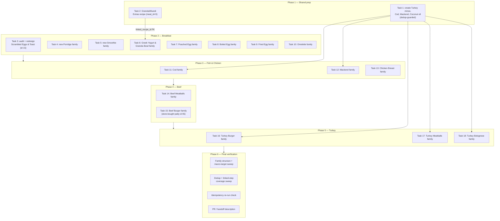

# Plan: Design new recipes — breakfast staples + protein mains (chicken, fish, mince, yogurt)

Plan folder: `.claude/contract/MPP-4-recipe-variety-expansion/`
Execution status: see `tasks.md` in this folder.

---

## Part 1 — Alignment

### Task reference

**Jira: MPP-4** (Epic, priority Medium, transitioned `To Do → Planning` at the start of this session).

> **Objective:** Design and ship a new set of FoodBytes recipes covering the user's everyday breakfast rotation and simple protein mains, closing a variety gap in the current recipe library. Each meal-slot dish becomes a full Light/Moderate/Balanced recipe family per `.claude/rules/recipe-variants.md`, designed with the `/chef` skill and inserted into the live Railway MySQL DB once approved.
>
> **Background:** the user supplied a reference recipe (a baked coconut-oil granola/muesli — "Goodness Granola": rolled oats, mixed nuts/seeds, coconut oil, maple syrup/honey, cinnamon, served with Greek yogurt/kefir and fruit) as the brief for the muesli/granola dish, plus: "Porridge, my muesli, smoothies, eggs (scrambled/poached/boiled/fried/omelette). Fish (no prawns or shellfish). Chicken (breast, fried or roasted). Mince — burger, meatballs, spaghetti bolognese. Turkey mince. Yogurts." Follow-up: granola/muesli is **not** a standalone breakfast family — it goes in `Extras` (`meal_id = 5`), a single recipe with no L/M/B family, linked into other recipes via `linked_recipe_id`.
>
> **Acceptance criteria (Definition of Done, verbatim):**
> 1. Every meal-slot category in Scope has at least one recipe family designed, approved by the user, and inserted into the live DB.
> 2. Every family has exactly three variants labelled Light/Moderate/Balanced, Moderate as the sole default, and satisfies `Light.kcal < Moderate.kcal < Balanced.kcal`.
> 3. Every variant independently passes: protein ≥35g/serving, fat 25–35% of kcal, carbs 40–50% of kcal.
> 4. Fish recipes contain no prawns or shellfish. Chicken breast recipes use only fried or roasted technique.
> 5. Mince categories (burger, meatballs, spaghetti bolognese) exist as separate families for both beef mince and turkey mince.
> 6. Granola/muesli exists as a single Extras recipe (`meal_id = 5`, no variant family) and is linked into at least one yogurt or smoothie-bowl recipe.
> 7. No raw ingredient row inlines a sub-component that already exists as its own recipe; no duplicate ingredients introduced.

**Follow-up decisions confirmed interactively (2026-08-09), after the DB audit below surfaced that several brief categories already have live recipes:**
- Porridge, Smoothies, Fish: the developer wants **new, additional** recipes in these categories (not a no-op) — existing families do not close the DoD line, variety is the point.
- Scrambled Eggs: the developer wants the **existing** family (id 15 / recipes 50-52) **audited and redesigned in place** — not a new sibling family.
- Beef Burger: the developer wants a **store-bought patty** (existing ingredient id 95, "Beef Burger Patties") rather than linking the existing `Burger Patties` sub-recipe (id 43) or designing a fresh homemade patty.

### Restated goal

Close FoodBytes' recipe variety gap across breakfast staples and simple protein mains by designing 15 new Light/Moderate/Balanced recipe families, one new Extras recipe (granola/muesli), redesigning one existing family (Scrambled Eggs & Toast) that the brief re-scoped in place, and inserting all of it into the live Railway MySQL DB via the `/chef` workflow — each design presented for the developer's approval before any SQL is generated, each family passing the CLAUDE.md macro targets independently, and no reject condition from `.claude/rules/recipe-variants.md`, `linked-recipe-extras.md`, or `homemade-first-and-ingredient-dedup.md` tripped in the process.

### In scope

- New Extras recipe: **Granola/Muesli** (`meal_id = 5`, single recipe, no family), built from the user's reference recipe (rolled oats, mixed nuts/seeds, coconut oil, maple syrup/honey, cinnamon).
- New family: **Greek Yogurt & Granola Bowl** — links the Granola Extras recipe via `linked_recipe_id` + a paired `recipe_steps` alt-instruction row.
- Redesign in place: **Scrambled Eggs & Toast** (existing family id 15, recipes 50/51/52) — full 5-lens `/chef` audit, fixes, re-verification, `macros_audited` re-recorded on all three members.
- New family: **Porridge** (distinct flavour from the two existing porridge families).
- New family: **Smoothie** (distinct flavour from the existing Peanut Butter Banana Smoothie).
- New families: **Poached Egg**, **Boiled Egg**, **Fried Egg** (standalone), **Omelette** — four separate egg-style families (Scrambled is out of this list, it's the redesign item above).
- New families: two new **Fish** dishes (no prawns/shellfish), distinct from the eight existing salmon families.
- New family: **Chicken Breast** — fried-or-roasted, plain preparation (existing chicken dishes are all elaborate composed dishes, none is a plain breast).
- New family: **Beef Meatballs**.
- New family: **Beef Burger** — using the existing store-bought ingredient `Beef Burger Patties` (id 95), per developer decision.
- New families: **Turkey Burger**, **Turkey Meatballs**, **Turkey Bolognese** — turkey mince has zero DB presence today; a new `Turkey mince` ingredient is required.
- New ingredients (dedup-checked before insert): `Turkey mince`, `Cod`, `Mackerel`, `Coconut oil` — none exist in the live DB today.
- INSERT SQL for every recipe/family/ingredient above, guarded per `/chef` step 7a (idempotent, `WHERE NOT EXISTS`), applied to the live Railway MySQL.
- Verification per `/chef` step 8 and the relevant `.claude/rules/` files for every new/redesigned family.

### Explicitly out of scope

- Any shellfish/prawn dish (explicit exclusion in the brief).
- Chicken breast preparations other than fried or roasted (no curries, no breading, no composed bowls for this specific family — those already exist elsewhere in the DB).
- Re-touching the eight existing salmon families, the two existing porridge families, or the existing Peanut Butter Banana Smoothie family — they stay as-is; the new work sits alongside them.
- A homemade "Turkey Burger Patty" or "Beef Burger" Extras sub-recipe reused elsewhere — this plan does not create new linkable sub-components beyond Granola, per the developer's explicit "store-bought" call on the beef patty (see Assumptions).
- Child Jira Story tickets per dish — the epic explicitly tracks this as design work under MPP-4, not broken into per-dish tickets.
- Any code change (frontend, backend, migrations under `foodbytes-app/database/migrations/`) — this is pure recipe-content work against the live DB, no entity/DTO/schema shape changes.
- Meal-plan or shopping-list feature work — out of scope; this epic only adds recipes to the catalogue.

### Pattern Reference

- `.claude/skills/chef/SKILL.md` — the end-to-end design → ingredient-resolution → macro-math → SQL → verify workflow every task follows.
- `.claude/skills/chef/references/sql-examples.md` and `references/database-schema.md` — INSERT ordering and FR-103 dual-path SQL shape.
- Canonical linked-extras pattern: `Pink Sauce Pasta` (recipes 37/38/39) and `Pizza` (13/14/15) — paired `recipe_ingredients.linked_recipe_id` + `recipe_steps.linked_recipe_id` + `alt_instruction` rows, referenced by `.claude/rules/linked-recipe-extras.md`.
- Existing family shape to mirror structurally (not flavour): `Spaghetti Bolognese` (family 23, recipes 81/82/83) — the Turkey Bolognese family follows the same aromatics/tomato-base structure with turkey mince swapped in and its own macro profile.
- Existing bread/toast sub-recipes to link (not inline) wherever an egg-style dish needs toast: `Milk Bread` (id 26), `Pita Bread` (id 117), `Flatbread` (id 19) — per `.claude/rules/homemade-first-and-ingredient-dedup.md`.

### Constraints flagged on the brief

- Every new/redesigned variant: protein ≥35 g/serving, fat 25–35% of kcal, carbs 40–50% of kcal (CLAUDE.md non-negotiable targets — reject conditions, not the kcal band).
- Every family: exactly Light/Moderate/Balanced, Moderate `is_default = 1`, `Light.kcal < Moderate.kcal < Balanced.kcal` with the usual ≥80 kcal advisory gap.
- Fish: no prawns, no shellfish, at all.
- Chicken breast: fried or roasted technique only — no curry/breading/bowl composition for this specific family.
- Granola/muesli: `meal_id = 5` (Extras), no variant family, must be linkable by `quantity_grams` proration.
- Every `linked_recipe_id` row needs a paired `recipe_steps` row with `linked_recipe_id` set and a populated `alt_instruction` (store-bought fallback) — hard reject condition per `.claude/rules/linked-recipe-extras.md`.
- All generated `recipe_ingredients` (and `recipe_meals` / `recipe_extras` / `recipe_family_members`) INSERTs must be idempotent (`WHERE NOT EXISTS` guards) — a re-run after a partial failure must be a no-op on already-applied rows.
- Ingredient dedup is mandatory before any `INSERT INTO ingredients` — case-insensitive name/singular-plural/synonym search first, singular sentence-case naming.
- Every design is presented to the developer and explicitly approved **before** SQL generation (chef skill step 6) — this is a hard process constraint the brief inherits from `/chef`, not optional for content-design work.

### Assumptions made

- **Scope-narrowing on 4 overlap categories, confirmed interactively:** Porridge/Smoothie/Fish get new additional families (developer confirmed: "create a new smoothie recipe, create a new porridge recipe... new fish recipes"); Scrambled Eggs gets audited and redesigned in place, not duplicated (developer confirmed: "redesign the Scrambled Eggs we have now"). **Confirmed.**
- **Beef Burger uses the store-bought `Beef Burger Patties` ingredient (id 95),** not the homemade `Burger Patties` sub-recipe (id 43) and not a fresh from-scratch patty. This is a deliberate developer override of the `homemade-first` default in `.claude/rules/homemade-first-and-ingredient-dedup.md` — acceptable because that rule's own scope is sub-components that are *themselves recipes*; the developer is choosing the FR-103-style store-bought leg outright rather than the homemade leg, which the rule permits when explicitly decided by the user. **Confirmed.**
- **Turkey Burger's patty is inlined as raw ingredients** (turkey mince + breadcrumbs + egg + seasoning) directly on each of the three Turkey Burger variants, rather than spun out into its own linked Extras sub-recipe (mirroring the pre-existing `Burger Patties` id 43 pattern for beef). Rationale: the developer's "store-bought" call was specific to the beef patty question; there is no existing turkey-patty component to link or dedupe against, and creating a new linkable Extras entry for a component used by exactly one dish adds structure with no reuse payoff yet. If a second turkey-mince dish later wants the same patty, it should be extracted into its own Extras recipe at that point. **Assumption — flag for red-line if a from-scratch linked patty is preferred instead.**
- **Working dish names/directions** chosen for the 12 net-new families (final ingredient lists and exact names are `/chef` step-2/3 design work, confirmed with the developer at presentation time before SQL, not fixed here):
  - Porridge → *Apple, Cinnamon & Walnut Porridge* (distinct from the existing berries-and-nuts and protein-porridge families).
  - Smoothie → *Mixed Berry & Greek Yogurt Smoothie* (distinct from the existing peanut-butter-banana family).
  - Fish #1 → *Baked Cod with Lemon, Herbs & New Potatoes* (new `Cod` ingredient).
  - Fish #2 → *Pan-Seared Mackerel with Greens & Quinoa* (new `Mackerel` ingredient; oily fish, no shellfish).
  - Chicken Breast → *Herb-Roasted Chicken Breast with Sweet Potato & Greens* (roasted technique; existing `Chicken breast` ingredient id 11).
  - Poached Egg → *Poached Eggs, Smoked Salmon & Avocado on Toast* (links `Milk Bread` id 26 for toast; smoked salmon supplies the protein eggs alone can't reach).
  - Boiled Egg → *Soft-Boiled Eggs, Cottage Cheese & Toast* (cottage cheese id 169 for the protein top-up).
  - Fried Egg → *Fried Eggs with Halloumi & Toast* (protein top-up via a high-protein cheese; exact ingredient confirmed against the live DB at design time).
  - Omelette → *Cheese & Ham Omelette with Toast*.
  - Beef Meatballs → *Beef Meatballs in Tomato Sauce with Spaghetti*.
  - Turkey Burger → *Turkey Burger with Bun & Slaw*.
  - Turkey Meatballs → *Turkey Meatballs in Tomato Sauce*.
  - Turkey Bolognese → *Turkey Bolognese with Spaghetti*.
  - **Rationale:** every egg-style family needs a protein-dense companion because 2 eggs alone (~13 g protein) can't clear the 35 g/serving floor — matching how the existing `Scrambled Eggs & Toast` and `Protein Porridge` families already solve this. Naming and exact companion ingredient are confirmed with the developer during the `/chef` presentation step, not locked here.
- **Meal-slot assignment:** Granola-linked Yogurt Bowl, Porridge, Smoothie, and all four new egg families → `meal_id = 1` (Breakfast), matching the existing porridge/smoothie/scrambled-egg precedent. Fish, Chicken Breast, Beef Meatballs, Beef Burger, and all three Turkey dishes → `meal_id = 3` (Dinner), matching the existing Bolognese/Salmon precedent. **Assumption — brief doesn't state meal slots explicitly.**
- **New-ingredient creation is front-loaded into a single dedup-guarded task** (Phase 1, Task 1) rather than repeated inline in each dish's task, because `Turkey mince` is shared across three dishes (Burger, Meatballs, Bolognese) and creating it three times with three separate `WHERE NOT EXISTS` guards is redundant — one guarded insert, reused by id lookup in every later task. **Assumption — matches the dedup rule's intent, not a brief requirement.**
- **Recipe-content work has no code/migration footprint.** Unlike schema changes, seeding recipe data directly against the live Railway MySQL doesn't go through `foodbytes-app/database/migrations/` (that directory is for DDL, per CLAUDE.md) — so this plan produces no entity/DTO changes and needs no Hibernate-`validate` ordering concern. Each task instead writes its executed SQL to a per-dish file under this plan folder for auditability. **Confirmed by CLAUDE.md's own description of that directory's scope.**

### Cross-code alignment audit (FE ↔ BE ↔ DB)

Read-only queries run against the live Railway MySQL during planning (2026-08-09):

- **`meals` table:** `id=5, key='extras', name='Extras'` confirmed live — matches the brief's `meal_id = 5` requirement verbatim.
- **Overlap check — existing recipes matching every brief category** (`LIKE` sweep across `recipes.name`): found **two** live Porridge families (`Porridge with Berries & Nuts` id 1, `Protein Porridge with Berries` id 86, `macros_audited=1`), **one** live Smoothie family (`Peanut Butter Banana Smoothie` id 2, audited), **one** live Scrambled Eggs family (`Scrambled Eggs & Toast` id 15, not audited), **eight** live salmon/fish families, and a live but bare `Spaghetti Bolognese` family (id 23, beef, not audited). Zero matches for poached/boiled/fried(standalone)/omelette, chicken breast (plain fried-or-roasted), beef meatballs, any turkey dish, yogurt-named recipe, or granola/muesli. This audit is what triggered the interactive scope-narrowing confirmed above.
- **`recipe_family_members` verified against `.claude/rules/recipe-variants.md`** for the categories that already exist: all five checked families (Porridge×2, Smoothie, Scrambled Eggs, Bolognese) carry exactly 3 members labelled Light/Moderate/Balanced with `display_order` 1/2/3 and `is_default=1` on Moderate only — no structural violation on the pre-existing rows this plan leaves untouched.
- **`Burger Patties` (id 43) confirmed as a bare Extras component**, not a family: single recipe row, `default_servings=4`, `meal_id=5`, ingredients are beef mince + breadcrumbs + egg + seasoning (no bun, no sides). Confirms the Beef Burger family is genuinely new work, and confirms the developer's "store-bought" instruction is choosing a different ingredient path (id 95 `Beef Burger Patties`, a raw store-bought ingredient with `protein=17g/carbs=0g/fat=20g per 100g`) rather than linking id 43.
- **Ingredient dedup sweep** (`ingredients` table, case-insensitive `LIKE`) for every ingredient this epic is expected to touch: `Rolled oats` (id 1), `Cinnamon` (id 19), `Honey` (id 4), `Maple syrup` (id 144), `Walnuts` (id 8), `Almonds` (id 7), `Chia seeds` (id 162), `Sesame seeds` (id 81), `Greek yogurt` (id 49), `Cottage cheese` (id 169), `Chicken breast` (id 11), `Beef Burger Patties` (id 95) — all already exist, reuse required, no re-insert. **`Coconut oil`, `Turkey mince`, `Cod`, `Mackerel` — zero matches, confirmed genuinely new** (checked `%coconut%` broadly too: only `Coconut milk` id 38 exists, a different item). `Prawns (raw, peeled)` (id 143) exists but is out of scope by the brief's own exclusion — flagging so no task accidentally reaches for it.
- **Bread/toast linkable sub-recipes confirmed live:** `Milk Bread` (id 26), `Pita Bread` (id 117), `Flatbread` (id 19), plus existing `Avocado Toast` and `French Toast` families — any new egg-on-toast dish must link one of these per `.claude/rules/homemade-first-and-ingredient-dedup.md`, never inline raw bread/flour.
- **Schema shapes confirmed live** (`SHOW COLUMNS`): `recipes` carries `macros_audited` / `macros_audited_at` / `macros_audited_by` (nullable FK to `users.id`) exactly as `.claude/skills/chef/SKILL.md` describes; `recipe_ingredients` has no unique index on `(recipe_id, ingredient_id)` or `(recipe_id, linked_recipe_id)` — confirms the mandatory `WHERE NOT EXISTS` guard requirement is live, not theoretical; `recipe_family_members` carries `family_id` (MUL), `recipe_id` (**UNI** — a recipe can only belong to one family, confirming no accidental double-family membership is even possible at the DB level), `is_default`, `variant_label`, `display_order`; `recipe_steps` carries `linked_recipe_id` + `alt_instruction` exactly as the linked-extras rule requires.
- **Current max IDs** (for the ID-fetch query every task must re-run live, per `/chef` step 7, rather than hardcoding — these will have moved by the time later tasks execute): `recipes.id` = 212, `recipe_families.id` = 93, `ingredients.id` = 179, `recipe_ingredients.id` = 2650, `recipe_steps.id` = 1885.
- **Units table confirmed** — cook-friendly units available for display: `g, ml, tsp, tbsp, piece, small, medium, large, handful, clove, head, stalk, slice, leaf, tin, cup, pinch, oz` (ids 1–18). No gap requiring a new unit for any dish in scope.

---

## Part 2 — Technical design

### Approach

This is a content-design epic, not a code epic: every deliverable is a `/chef`-produced recipe (or family of three) inserted directly into the live Railway MySQL via guarded SQL, with zero changes to `foodbytes-api`, `client`, or the schema. The technical shape is therefore the **procedure**, not an architecture — the plan's job is to sequence 17 dish-design tasks (1 Extras recipe + 1 linked family + 1 in-place audit/redesign + 14 net-new families) so that shared dependencies resolve in the right order, every task follows the identical `/chef` workflow (resolve ingredients → design Moderate → derive Light/Balanced → self-review macros → present for approval → guarded INSERT → verify), and nothing gets re-litigated per-task that a single shared step already settled.

Two structural decisions shape the phase order. First, **new shared ingredients are front-loaded** into a single Phase 1 task rather than re-derived per dish — `Turkey mince` is consumed by three separate families (Burger, Meatballs, Bolognese), so creating it once with one `WHERE NOT EXISTS` guard and having every later task `SELECT` its id by name is simpler than three redundant dedup-and-maybe-insert blocks that could race each other if run out of order. Second, **the Granola Extras recipe is sequenced before the Yogurt & Granola Bowl family** that links it, because the bowl's `recipe_ingredients.linked_recipe_id` is a hard FK dependency — inserting the bowl first would either fail the FK or force a two-pass update, and the `/chef` skill's own step-7 insert ordering (sub-recipes before parents) says the same thing.

The alternative considered and rejected: running all 17 dishes as fully independent, unordered tasks (matching the epic's own "no sequencing fixed" prioritisation note). That works for the 14 families with no cross-dependency, but breaks for Granola→Yogurt-Bowl and creates ingredient-insert races for the three turkey dishes if two ran concurrently — so the plan keeps those two structural orderings as hard phase boundaries and leaves everything else in whatever order the developer picks up the phases.

The most important process note, surfaced again under Risks below: `/chef` step 6 requires the design to be **presented to the developer and explicitly approved before SQL generation**. This is not a build-verifiable gate the way a compile step is — it's a live human judgement call on taste, technique, and whether the macro-target-driven ingredient list actually reads as a dish someone wants to eat. Every task's steps are written so that step "present and pause" produces a written design artifact and stops there; SQL generation is a distinct, later step in the same task that must not run until the developer's approval is recorded in the conversation. This shapes the "Skills to invoke" and "Risks" sections below.

### Skills to invoke during execution

- `chef` — governs every dish task: ingredient resolution against the live DB, Moderate-first macro design, Light/Balanced derivation, the mandatory self-review before presentation, guarded/idempotent SQL generation, and the 5-lens audit (used specifically for the Scrambled Eggs redesign task). Already loaded during planning per the developer's explicit request.
- `diet-guidelines` — governs the evidence basis behind the macro targets every family must hit (protein/satiety mechanism, Mediterranean/high-protein pattern framing where relevant, gout/quality-fat constraints already baked into `CLAUDE.md`). Already loaded and confirmed during planning.

Rule files every task must Read on demand per the `chef` skill's own "Shared rules" pointer:
- `.claude/rules/recipe-variants.md` — variant labels, Moderate default, kcal ordering, the "calories are a target not a reject" audit policy.
- `.claude/rules/linked-recipe-extras.md` — `quantity_grams` = portion used (not linked recipe's total yield), and the mandatory paired `recipe_steps` row for every `linked_recipe_id`.
- `.claude/rules/homemade-first-and-ingredient-dedup.md` — link vs inline for bread/toast components, ingredient dedup search before any insert, singular sentence-case naming.

No developer override on the skill list — both proposed skills were confirmed as-is.

### Diagram

### Data shapes

No entity, DTO, or endpoint changes. Every "data shape" here is a row shape inserted into existing tables — restated so `tasks.md` steps can cite exact columns without re-deriving them.

#### New `ingredients` rows (Task 1)

| name | protein_per_100g | carbs_per_100g | fat_per_100g | Notes |
|---|---|---|---|---|
| `Turkey mince` | resolved at design time from USDA/Tesco label data | — | — | Reused by Turkey Burger, Turkey Meatballs, Turkey Bolognese |
| `Cod` | resolved at design time | — | — | Reused only by the Cod family |
| `Mackerel` | resolved at design time | — | — | Reused only by the Mackerel family |
| `Coconut oil` | 0 | 0 | ~100 | Reused only by the Granola Extras recipe |

Each row: guarded insert per the dedup rule — `INSERT INTO ingredients (name, protein_per_100g, carbs_per_100g, fat_per_100g, ...) SELECT ... WHERE NOT EXISTS (SELECT 1 FROM ingredients WHERE LOWER(name) = LOWER(:proposed))`. Singular, sentence-case naming per convention.

#### `recipes` (per variant, ×3 per family, ×1 for the Extras recipe)

| Column | Type (live) | Value pattern |
|---|---|---|
| `name` | varchar(255) | Same across all 3 variants in a family — no `(Light)`/`(Balanced)` suffix |
| `default_servings` | int, default 2 | 2 unless a dish's realistic serving size differs (e.g. burger patty batch) |
| `calories` | int | `kcal_per_serving × default_servings` — **whole-recipe**, homemade basis |
| `macros_audited` | tinyint(1), default 0 | `0` on insert; set to `1` only after Phase 6 verification |
| `macros_audited_at` / `macros_audited_by` | timestamp / bigint FK, nullable | NULL until Phase 6; `macros_audited_by` stays NULL (agent-run) |

#### `recipe_families` / `recipe_family_members`

- `recipe_families.family_name` — one row per family (not per variant).
- `recipe_family_members`: 3 rows per family, `variant_label` ∈ {Light, Moderate, Balanced}, `display_order` 1/2/3, `is_default = TRUE` on Moderate only. `recipe_id` is `UNIQUE` on this table — confirmed live, so no accidental double-family membership is possible.

#### `recipe_ingredients` (per variant)

Standard shape per `references/database-schema.md`: `ingredient_id` XOR `linked_recipe_id` set for a normal row; **both** set only for an FR-103 dual-path row (not used in this plan except optionally on the Granola link, decided at design time). `quantity_grams` on the Yogurt Bowl's granola row = grams of granola actually served in the bowl, **not** the granola recipe's total batch yield (the 50g-vs-300g rule).

#### `recipe_steps` (per variant)

Standard numbered steps; the Yogurt Bowl's granola-serving step carries `linked_recipe_id` = the Granola recipe's id and a populated `alt_instruction` describing a store-bought granola fallback.

#### Per-task SQL audit file (new, this plan only)

`.claude/contract/MPP-4-recipe-variety-expansion/sql/<dish-slug>.sql` — one file per task, containing the exact guarded SQL executed against the live DB (ingredient dedup queries, the ID-fetch query, the full guarded INSERT block, the verification queries and their output). Written by the task itself as the audit trail; not a schema migration, not read by Hibernate.

### Runtime quality notes

- **Resource cleanup:** N/A in the traditional sense — no connections/streams/timers are opened by this plan's own artifacts. The one applicable concern is **live DB session hygiene during execution**: every `mcp__mysql__mysql_query` call in this plan is a single autocommitting statement (per `/chef` skill's own warning that Railway's console and some clients commit per-statement regardless of `START TRANSACTION`), so no task should assume rollback-on-error; the idempotency guards are what make retries safe, not transactions.
- **Concurrency / ordering:** the only real ordering hazards are the two called out in Approach — Granola before the Yogurt Bowl (FK), and the shared `Turkey mince` ingredient created once before any of the three turkey dishes reference it (a race on parallel `WHERE NOT EXISTS` inserts of the same ingredient name is possible if two turkey tasks ran concurrently and both missed each other's uncommitted insert — front-loading into Phase 1 as a single task removes this hazard entirely rather than relying on the guard to save it). No other cross-task shared mutable state exists — every other family is independent.
- **Allocation / cost behaviour:** each dish task issues on the order of 5–10 `mysql_query` calls (dedup searches, ID-fetch, inserts, verification) — trivial load against a single-tenant Railway instance; no N+1 concern since these are one-shot design-time queries, not a hot request path. 17 dish tasks × ~8 queries ≈ 136 total statements across the whole epic — not a performance concern, flagged only for completeness.
- **Error paths:** a partially-applied INSERT (e.g. the script errors after `recipes` rows land but before `recipe_family_members`) must be safely re-runnable — this is exactly what the mandatory `WHERE NOT EXISTS` guards on `recipe_ingredients`/`recipe_meals`/`recipe_extras`/`recipe_family_members` exist for. `recipe_steps` uses wipe-and-re-insert (`DELETE ... WHERE recipe_id IN (...)` then re-insert) rather than a guard, per the chef skill's own guidance, because the `(recipe_id, step_number)` unique key makes incremental re-numbering collide. Every task's steps must show the guard/wipe pattern explicitly, not just "insert the rows."

### Risks and judgement calls

- **Structural mismatch between `/chef`'s human-approval gate and `/fb-apply`'s autonomous single-pass execution model.** `/chef` step 6 is explicit: wait for the developer's approval before generating SQL. `/fb-apply`'s Implementer walks every phase end-to-end without pausing for review until all phases finish. For 17 independent, taste-and-preference-driven recipe designs, that means either (a) the developer runs these tasks as live `/chef` conversation turns rather than through unattended `/fb-apply`, approving each design in-line before the task's SQL step runs, or (b) the developer accepts that an unattended `/fb-apply` run will design-and-insert all 17 dishes against the stated macro targets without a live taste/technique check, deferring human review to the Phase 6 verification pass and the end-of-run Code-Evaluator/Defender/QA review (which check macro/structural correctness, not "does this sound like a good dish"). **Recommend (a)** given the volume and subjectivity of content here — flagging explicitly rather than deciding silently, since it changes how the developer should invoke execution.
- **12 "working titles" in Assumptions are placeholders for developer taste, not locked names.** If the developer has stronger preferences for any of the 12 net-new dish concepts (e.g. a different protein pairing for the egg families, a different fish, a different flavour profile for Porridge/Smoothie), that's cheaper to redirect now than after a task has already run its ingredient-resolution query against a name nobody wants.
- **Turkey mince, Cod, Mackerel, and Coconut oil per-100g macro values aren't sourced yet.** Task 1 must pull real values (USDA/Tesco label data, matching the project's existing sourcing convention for `ingredients` rows) rather than guessing — an approximate value here would silently corrupt every downstream macro calculation for 6 of the 17 dishes (3 turkey dishes + fish ×2 + granola).
- **The Turkey Burger patty is inlined rather than extracted into its own Extras recipe** (see Assumptions) — cheap to reverse later (create the Extras recipe, repoint the `recipe_ingredients` row to `linked_recipe_id`) if a second turkey-mince-patty dish shows up, but flagging so the developer can override now if a linked component is preferred on principle for consistency with the beef pattern.
- **Phase ordering beyond the two hard FK/shared-ingredient dependencies is arbitrary** (Fish/Chicken before Beef before Turkey) — the epic itself states no sequencing is fixed. The developer can freely reorder Phases 2–5 without any structural risk; only Phase 1 must run first and Task 2 (Granola) must precede Task 6 (Yogurt Bowl).
- **17 dish-design tasks is a large single epic to execute in one sitting.** Each phase is a safe stopping point (see `tasks.md` framing per phase) — the developer can execute Phase 1 today and the rest across several sessions without any family being left half-inserted, since every task's own SQL is self-contained and guarded.
