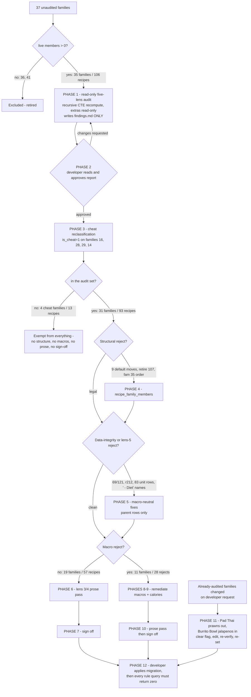

# Plan: Audit and fix all unaudited recipe families (35 families / 106 recipes)

Plan folder: `.claude/contract/MPP-5-audit-unaudited-recipe-families/`
Execution status: see `tasks.md` in this folder.

---

## Part 1 — Alignment

*(The shared understanding of what this task is doing. Restate it in your own words — this is how the developer confirms you read the brief correctly before any design happens. Mismatch here = stop and fix.)*

### Task reference

**Jira:** [MPP-5](https://amazerbeam.atlassian.net/browse/MPP-5) — *Audit and fix all unaudited recipe families (35 families / 106 recipes)*, Task, Priority High. Moved `To Do → Planning` at the start of this run.

Acceptance criteria, verbatim from the ticket:

1. All 35 unaudited families are run through the full five-lens `/chef` audit — macros/family structure, units and measurement realism, technique and instructions, dish quality, and naming/metadata. A macro recompute alone does not satisfy this.
2. Every family that passes has `macros_audited = 1` and `macros_audited_at = NOW()` set on **all** its members in a single statement. `macros_audited_by` stays NULL (agent-run audit). No family is left partially flagged.
3. The 13 families whose `is_default` sits on `Balanced` are corrected to `Moderate`: families 16, 5, 12, 22, 29, 35, 37, 9, 10, 1, 8, 14, 28.
4. The three structurally illegal families are resolved: **Pizza (4)** has 4 members including a `Balanced 2` label; **Tortilla Española (28)** has 4 members including `Extra Light`; **Salmon Sandwich (8)** has only 2 members (`Moderate` 452 kcal, `Balanced` 904 kcal) and no `Light`.
5. `display_order` is corrected to 1=Light / 2=Moderate / 3=Balanced on French Toast (29), Greek Chicken Gyros (35) and Tortilla Española (28), where `Moderate` currently sits at order 1.
6. Every per-serving macro reject is cleared on all variants — protein ≥35 g, fat ≤35 % of kcal, carbs ≥38 % of kcal — and stored `recipes.calories` agrees with the recomputed whole-recipe total within 5 %. Per-serving kcal is reported but does **not** gate the sign-off, per the 2026-07-30 policy in `.claude/rules/recipe-variants.md`.
7. Recipes that cannot be brought to target without ceasing to be the dish are **marked for deletion rather than mangled**. Each one is listed back for a decision instead of being silently changed or silently deleted.
8. Every change is captured in a dated migration under `foodbytes-app/database/migrations/` and applied to the live Railway MySQL.

The ticket also carries a **mark-for-deletion policy** ("A dishonest recipe that passes the numbers is a worse outcome than an honest one that fails them"), explicit out-of-scope exceptions already actioned on 2026-08-18, and a dependencies/risks section reproduced under *Constraints flagged on the brief* below.

**Follow-up decisions confirmed interactively (2026-08-18), in the order they were given:**

- *"also remove prawns from Pad Thai, because my gout"*. Pad Thai is family 27 (recipes 91/92/93) and is **already audited**, so it sits outside MPP-5's stated scope. Folded in as a separate phase; see A9.
- *"don't audit extras"*. Confirms and widens the ticket's existing exclusion of the 16 family-less sub-recipes: linked sub-components (Milk Bread, Pizza Dough, Pizza Sauce, Fresh Pasta, Pita Bread, Goodness Granola, Honey Ham) are **not** audit subjects, are not signed off, and are not edited. See A15.
- Lens 3 / lens 4 get a **full prose pass** across every in-scope recipe, overriding the planner's narrower proposal. See A7.
- *"Mark them as cheat meals"* — **all four mark-for-deletion nominees** (16 Avocado Toast, 28 Tortilla Española, 29 French Toast, 14 Steak & Chips) get `is_cheat = 1`. See A16.
- Cheat families are **exempt from structural fixes too**, not only from the macro audit. See A16.
- *"add jalapenos to burrito bowl"* — Chicken Burrito Bowl is family 17 (recipes 57/58/59) and is **already audited**, so this is a second out-of-scope addition. No jalapeño ingredient exists yet. See A17.
- *"I want a report before any changes are done"* — the five-lens audit report is produced **first**, as a standalone deliverable, and no migration file is written until the developer has read and approved it. See A19.
- Skills to load: `chef` + `diet-guidelines`. `java-backend` and `requirements` were offered and declined.
- Migration apply method: **developer applies manually** against Railway. The agent does not write to production.

**Planning-scope correction (2026-08-18):** the planner asked the developer to choose *which* of the four nominees should become cheat meals. The developer declined the question — *"let the fb-apply handle this, you are just a planner not for you to decide"* — and the instruction is recorded here as given: all four. Selecting a subset was never the developer's ask and is not a planning decision.

### Restated goal

**Produce the five-lens audit report first and change nothing until it is approved.** Then take the recipe families in the live Railway MySQL that have never been signed off — 35 as the ticket counts them, 31 once the four families the developer reclassified as cheat meals drop out — put each through the full five-lens `/chef` audit rather than a bare macro recompute, and fix what the audit finds: the structural violations that make the variant picker lie to the user (default sitting on `Balanced`, families with four or two members, non-standard `Extra Light` / `Balanced 2` labels, `display_order` that puts Moderate first), the per-serving macro rejects (protein under 35 g, fat over 35 % of kcal, carbs under 38 % of kcal), the stored `recipes.calories` values that disagree with the recomputed homemade-basis total, and the unit and data-integrity defects the macro pass alone would miss. Sub-recipes and extras are treated as read-only inputs throughout — their macros feed the parents, but they are never themselves audited or altered. Where a family cannot reach target without ceasing to be the dish it claims to be, nominate it for deletion and hand the decision back rather than shipping a mangled recipe. Capture everything in one dated DML migration the developer applies to Railway themselves, then record the sign-off by setting `macros_audited = 1` and `macros_audited_at = NOW()` on every member of each passing family in a single statement per family.

### In scope

- **A standalone five-lens audit report, delivered and approved before any change is written.** This is the first deliverable, not a by-product. See A19.
- **31 audit families / 93 live recipes.** Derived: 37 unaudited families, less families 36 *Korean Fried Chicken* and 41 *Homemade Doner Kebab* (zero live members) = the ticket's 35; less the 4 reclassified as cheat = **31 families / 93 live recipes**.
- **Cheat reclassification** of families 16, 28, 29 and 14 — `is_cheat = 1` on all 13 of their member recipes. They leave the audit entirely: no structural fix, no macro remediation, no prose pass, no sign-off. See A16.
- **Structural fixes on non-cheat families only:** move `is_default` from `Balanced` to `Moderate` on **9** families (1, 5, 8, 9, 10, 12, 22, 35, 37 — down from 13, since 14, 16, 28 and 29 are now cheat); collapse Pizza (4) from 4 members to 3 by retiring the `Balanced 2` member (recipe 107); create a missing `Light` variant for Salmon Sandwich (8); renumber `display_order` to 1/2/3 on **family 35 only** (28 and 29 are cheat).
- **Macro remediation** on every non-cheat variant that trips a reject condition — **28 rejects across 11 families**.
- **A full lens-3 / lens-4 prose pass over all 93 in-scope recipes' `recipe_steps`**, plus the 6 recipes in the two out-of-scope families being edited (Pad Thai, Chicken Burrito Bowl) — 99 recipes total. Developer-confirmed override, see A7.
- **Lens-5 name fix:** recipes 188/194/195 are named `Greek Chicken Gyros Bowl - Diet`; the ` - Diet` suffix is a variant suffix on `recipes.name`, which lens 5 rejects. Rename to `Greek Chicken Gyros Bowl`. See A18.
- **Stored-`calories` corrections** on the non-cheat families whose column drifts >5 % from the recomputed whole-recipe total (23, 35, and recipe 28 in family 8).
- **Chicken Burrito Bowl (family 17) jalapeño addition** — a new `ingredients` row plus `recipe_ingredients` and `recipe_steps` rows on recipes 57/58/59, with the attestation cleared and re-set. See A17.
- **Data-integrity fixes surfaced by the audit but not named on the ticket:** the `Potatoes` (69) / `Potato` (121) duplicate ingredient pair, and recipe 212's `quantity_grams = 300` against a Fresh Pasta yield of 282 g — fixed on the **parent** row only.
- **Unit realism fixes** (lens 2) across ~83 in-scope `recipe_ingredients` rows, changing only `quantity` and `unit_id` and leaving `quantity_grams` untouched so macros do not move.
- **Recording the sign-off** — `macros_audited = 1`, `macros_audited_at = NOW()`, `macros_audited_by` left NULL — one statement per family, all members together.
- **Raising mark-for-deletion candidates** as a written report for developer decision.
- **Pad Thai (family 27) prawn removal** for gout, plus the protein compensation it forces — an explicitly flagged addition to the ticket's scope.

### Explicitly out of scope

- **Auditing, signing off, or editing any sub-recipe / extra** — developer instruction, 2026-08-18. The 16 family-less sub-recipes are excluded, and so are the linked sub-components consumed by in-scope parents (Milk Bread, Pizza Dough, Pizza Sauce, Fresh Pasta, Pita Bread, Goodness Granola, Honey Ham). Their macros are *read* to prorate into parent totals; nothing about them is changed or flagged. See A15.
- **Homemade Big Mac (63)** and **Pastichio (Lasagna) (65)** — already set `is_cheat = 1` on 2026-08-18; cheat meals are not audited. Confirmed live: `is_cheat = 1` on exactly 2 recipes.
- **Homemade Doner Kebab (136/137/138)** and **Korean Fried Chicken (121/122/123)** — retired via `is_live = 0`. Confirmed live: 6 retired recipes. Their families (41, 36) are excluded from the 35.
- **Peanut Butter Banana Smoothie → Frozen Banana Smoothie** (family 2) — renamed, already audited, attestation stands.
- **Hard-deleting any recipe.** Retirement is `is_live = 0`, never `DELETE`, because `meal_plan_entries` holds history. Even the mark-for-deletion candidates are *nominated*, not removed.
- **Flatbread (19)** — stays live; three other parents reference it in `recipe_extras`. Also an extra, so doubly out of scope.
- **Any Java, React, or schema (DDL) change.** This is a DML-only data migration.
- **The four cheat-reclassified families — 16 (Avocado Toast), 28 (Tortilla Española), 29 (French Toast), 14 (Steak & Chips).** Once `is_cheat = 1` is set they are exempt from *everything*: the macro audit, the structural fixes AC-3/4/5 would otherwise require of families 14, 16, 28 and 29, the prose pass, and the sign-off. Developer-confirmed on both counts. The knock-on effects are listed in A16 — this is the single largest reduction in scope and the one most likely to surprise on review.
- **Re-auditing the 24 already-signed-off families**, except Pad Thai (27) and Chicken Burrito Bowl (17), both re-opened only because the developer asked for a specific ingredient change.
- **`recipe_steps` on any sub-recipe / extra.** The prose pass covers in-scope parent recipes only; the steps of Milk Bread, Pizza Dough, Fresh Pasta, Pita Bread and the rest are not read, rewritten, or renumbered (A15).
- **Renaming beyond the ` - Diet` suffix fix.** Where lens 4 finds a cuisine mismatch the remedy is to the dish, not the name — a broader rename would break `recipe_families.family_name` alignment. Only the three suffixed rows in A18 are renamed.

### Pattern Reference

The brief supplies these verbatim: `.claude/skills/chef/SKILL.md` ("Auditing an existing recipe"), `.claude/rules/recipe-variants.md`, `.claude/rules/linked-recipe-extras.md`, `.claude/rules/homemade-first-and-ingredient-dedup.md`.

Additional references chosen for this plan:

- **Migration file style:** `foodbytes-app/database/migrations/2026-07-30_audit_macro_fixes.sql` and `2026-07-30_mark_recipes_audited.sql` — the closest prior art, same shape of work (audit remediation + sign-off).
- **Prior contract for the same workflow:** `.claude/contract/2026-07-30-recipe-audit-remediation/` and `.claude/contract/2026-07-30-linked-extras-macro-kcal-audit/findings.md` (cited in `CLAUDE.md` as the evidence base for the store-bought-basis kcal bug).
- **Family 94 (Apple, Cinnamon & Walnut Porridge)** as the worked model for fixing family 1 (Porridge with Berries & Nuts): same dish class, already passes at P 35.7–45.3 g/serving, proving the protein target is reachable for a porridge without mangling it.

### Constraints flagged on the brief

- **Stored `recipes.calories` is not trustworthy.** Two known failure modes: store-bought basis instead of homemade (20 of 48 recipes with extras, 2026-07-30) and per-serving instead of whole-recipe (recipes 187–201, 2026-05-08). Recompute from `recipe_ingredients` + prorated linked recipes every time.
- **Greek Chicken Gyros (35) is the named store-bought-basis case** — expect stored vs recomputed to disagree. Confirmed: −12.1 %, −15.5 %, −12.9 % on recipes 118/119/120.
- **Retired recipes hold meal-plan history.** 4 of the 6 retired recipes appear in `meal_plan_entries` (1 user, Jan–Apr 2026). Soft-delete only; a hard delete would drop days from that user's history.
- **Flatbread (19) must stay live** — referenced by 3 other parents in `recipe_extras`.
- **Hibernate runs `ddl-auto: validate`** — a migration not applied to Railway breaks backend startup. See A8: this constraint binds on DDL, and this migration is DML-only.
- **Macro reject conditions** (`CLAUDE.md` + `.claude/rules/recipe-variants.md`): protein ≥35 g/serving, fat ≤35 % of kcal, carbs ≥38 % of kcal. Per-serving kcal is a **target, not a reject**, per the 2026-07-30 policy — it must never be the reason a family is withheld from `macros_audited`.
- **Structural reject conditions** that still hard-fail: family size ≠ 3, labels not exactly Light/Moderate/Balanced, `is_default` not on Moderate or not exactly one, kcal ordering not `Light < Moderate < Balanced`.
- **Gout constraint** (`CLAUDE.md` + `diet-guidelines`): avoid organ meats, anchovies, fish sauce, sardines; moderate shellfish. Drives the Pad Thai change and the fish-sauce finding.
- **`macros_audited_by` stays NULL.** It is an FK to `users.id`; an agent-run audit has no user row. Never invent an id, never query `users` looking for one.

### Assumptions made

- **A1 — The 35 in-scope families are the 37 unaudited families minus the 2 fully-retired ones (36, 41).** *Rationale:* the live count of unaudited families is 37, but families 36 and 41 have `SUM(is_live) = 0`; excluding them yields exactly 35 families and exactly 106 live recipes, matching the ticket's own headline numbers.
- **A2 — Pizza (4) is collapsed to 3 members by retiring recipe 107 (`Balanced 2`), not by merging it into `Balanced`.** *Rationale:* recipe 15 (`Balanced`, 750 kcal/srv) and recipe 107 (`Balanced 2`, 776 kcal/srv) are near-duplicates; 15 is the lower-kcal, macro-clean one and is already the labelled `Balanced`. Retiring 107 via `is_live = 0` preserves meal-plan history, which a `DELETE` would not.
- **A3 — Tortilla Española (28) is collapsed to 3 members by retiring recipe 94 (`Extra Light`).** *Rationale:* `Extra Light` is not a legal label; recipes 95/96/97 already map cleanly onto Light/Moderate/Balanced once `Extra Light` is dropped. Same soft-delete reasoning as A2.
- **A4 — Salmon Sandwich (8) gets a newly created `Light` variant rather than relabelling an existing member.** *Rationale:* the family has only 2 members (28 at 485 kcal/srv, 29 at 904 kcal/srv). Relabelling would leave 2 members, still a reject. `recipe_family_members.recipe_id` is UNIQUE, so a new `recipes` row is the only way to reach 3 members with correct kcal ordering.
- **A5 — Mark-for-deletion candidates are *nominated in a report*, never actioned in the migration.** *Rationale:* AC-7 says "listed back for a decision instead of being silently changed or silently deleted". The migration must not contain their remediation or their retirement.
- **A6 — RESOLVED by developer instruction, 2026-08-18. The four families the planner nominated are reclassified as cheat meals rather than deleted or remediated.** *Original nomination:* Avocado Toast (16) runs 12.1–26.7 g protein at 48.7–54.9 % fat and Tortilla Española (28) runs 13.2–25.3 g protein at 52.3–56.9 % fat — dishes whose identity *is* the fat (avocado; potato confited in olive oil), so reaching target means burying the defining ingredient; French Toast (29) and Steak & Chips (14) were salvageable but only with large portion surgery. *Outcome:* see A16. The nominations still belong in the report as the evidence for the reclassification, but no deletion decision remains open.
- **A7 — Lens 3 (technique & instructions) and lens 4 (dish quality) get a full prose pass across all 106 in-scope recipes. CONFIRMED by the developer, 2026-08-18** — the planner proposed the narrower "report only, fix what macros force" reading and the developer overrode it in favour of the full pass. *Consequence:* every in-scope recipe's `recipe_steps` are read start to finish and rewritten where they trip a lens-3 finding (vague endpoints with no visual/temporal cue, cold-pan aromatics, untempered dairy above ~80 °C, watery pan sauces with no thickener or reduction target, discarded resting juices, missing taste-and-adjust, wrong order of operations, cook times that do not match the cut implied by the gram weight) or a lens-4 finding (missing acid, no texture contrast, beige plate, cuisine claim the dish does not honour). *This also reorders the phases:* AC-2 gates `macros_audited` on all five lenses, so the 19 macro-clean families can no longer be signed off ahead of their prose pass — the pass runs first, sign-off follows.
- **A8 — The migration is DML-only, so it carries no Hibernate `validate` startup risk and no strict apply-before-code ordering.** *Rationale:* every change is `UPDATE` / `INSERT` / `DELETE` on rows; no `ALTER`, no new column. The ticket's "backend will fail to start" warning binds on DDL. The developer still applies it manually, but the ordering constraint that normally forces *apply-then-change-Java* does not exist here because there are no Java changes.
- **A9 — Pad Thai (27) is folded into this plan as its own phase, and its `macros_audited` flag is cleared and re-set rather than left standing.** *Rationale:* the developer asked for it mid-planning; it is the same class of work against the same migration file. Per `chef` SKILL.md, changing `recipe_ingredients` invalidates the attestation, so the flag must be cleared, the family re-verified, and the flag re-set in the same pass.
- **A10 — Removing prawns from Pad Thai is compensated with chicken breast, not by leaving the protein short.** *Rationale:* computed post-removal per-serving protein is 31.9 g on Light (a reject) and 35.9 g on Moderate (passing but with no headroom). Raising chicken breast 130 → 170 g on Light and 150 → 165 g on Moderate clears both. Balanced passes untouched at 45.1 g.
- **A11 — Fish sauce is *flagged*, not silently removed.** *Rationale:* fish sauce (anchovy-based) is on the same gout avoid-list as prawns and is still present at 18 g on all three Pad Thai variants despite soy sauce having been added alongside it — an unfinished swap. But the developer asked only about prawns, and the `chef` skill forbids applying audit suggestions without explicit approval. Recommended, gated on a yes.
- **A12 — `Potato` (121) is the canonical ingredient row and `Potatoes` (69) is merged into it.** *Rationale:* `homemade-first-and-ingredient-dedup.md` mandates singular sentence case; 121 has 19 uses against 69's 5; both rows carry identical per-100g macros (P 2.00 / C 17.00 / F 0.10), so the merge is macro-neutral.
- **A13 — Recipe 212's Fresh Pasta portion is reduced 300 g → 280 g rather than scaling the Fresh Pasta recipe's yield.** *Rationale:* 300 g exceeds the linked recipe's 282 g total yield, which `linked-recipe-extras.md` lists as a reject. Changing the parent's portion touches one row; changing the child's yield would edit an extra (forbidden by A15) and would silently re-prorate every other parent that links to Fresh Pasta (recipes 37/38/39, 81/82/83, 210/211).
- **A14 — Families are remediated in risk-ordered groups, and each group is a phase boundary.** *Rationale:* 19 families need only a sign-off statement while 15 need recipe surgery. Landing the zero-risk sign-offs first means a mid-way stop still leaves the board measurably better, and keeps the high-judgement work isolated.
- **A16 — All four nominated families become cheat meals (`is_cheat = 1` on their 13 member recipes), and cheat exempts them from structural fixes as well as from the audit. CONFIRMED by the developer, 2026-08-18, on both points.** *Rationale:* this resolves AC-7 without deleting anything — meal-plan history is preserved, the recipes stay available, and no dish gets mangled to hit a number. It follows the precedent already set for Homemade Big Mac (63) and Pastichio (65). *Knock-on effects, all of which reduce scope:* the audit set falls from 35 families / 106 recipes to **31 / 93**; the AC-3 default-move list falls from 13 families to **9** (14, 16, 28, 29 drop out); AC-4's Tortilla Española work (retire the `Extra Light` member 94, collapse 4 members to 3) is **not done**; AC-5's `display_order` work shrinks from three families to **family 35 alone**; and macro rejects fall from 41 to **28 across 11 families**. *Known consequence the developer accepted:* family 28 is left as a 4-member family carrying an `Extra Light` label, and family 29 keeps `Moderate` at `display_order` 1 — both are hard rejects under `.claude/rules/recipe-variants.md` that will now persist in the data. See Risks.
- **A17 — Jalapeño is a new `ingredients` row, and Chicken Burrito Bowl's attestation is cleared and re-set around the change.** *Rationale:* a case-insensitive search of `jalap` / `chilli` / `chili` returns only `Chilli Flakes` (165), a genuinely different item — so the dedup rule is satisfied and an insert is correct rather than a reuse. Named singular sentence case (`Jalapeno`) per the naming convention, aisle `veg` (3). Family 17 (recipes 57/58/59) is already `macros_audited = 1`, so per `chef` SKILL.md the flag is cleared before the edit and re-set after re-verification, exactly as for Pad Thai.
- **A18 — The ` - Diet` suffix on recipes 188/194/195 is removed, renaming them to `Greek Chicken Gyros Bowl`.** *Rationale:* lens 5 rejects variant suffixes on `recipes.name` — the dish name is the family name and the variant lives in `recipe_family_members.variant_label`. Family 87 is in scope and its `recipe_families.family_name` is already `Greek Chicken Gyros Bowl`, so the rename brings the two into alignment rather than breaking it. This corrects an error in an earlier draft of this plan, which asserted the live data had no suffix violations; it has three.
- **A19 — The audit report is produced and approved before any migration file exists. CONFIRMED by the developer, 2026-08-18** (*"I want a report before any changes are done"*). *Rationale:* this matches the `chef` skill's standing rule that audit findings are never applied without explicit approval, and it front-loads the judgement calls — the cheat reclassifications, the mark-for-deletion evidence, the proposed macro levers, the lens-4 taste calls — into a document the developer can red-line cheaply. *Consequence:* Phase 1 is read-only and writes only `findings.md`; Phase 2 is a developer gate; nothing touches `foodbytes-app/database/migrations/` until that gate passes.
- **A15 — "Don't audit extras" means sub-recipes are read-only inputs: their macros prorate into parent totals, but no extra is audited, signed off, retired, or edited.** *Rationale:* developer instruction, 2026-08-18. This forecloses one otherwise-tempting fix (raising Fresh Pasta's yield to accommodate recipe 212) and means every remediation must be achievable by changing parent rows alone. It also means `macros_audited` is never written to a sub-recipe, so the "which recipes still need review" query will continue to show the 16 family-less extras as unaudited by design.

### Cross-code alignment audit (FE ↔ BE ↔ DB)

All checks run read-only against the live Railway MySQL via `mcp__mysql__mysql_query`. No rows from `users` or `meal_plan_entries` were selected — the ticket's claims about meal-plan history are taken as given rather than re-verified against personal data.

- **`recipes` columns exist with expected type/nullability.** `SHOW COLUMNS FROM recipes` returns: `macros_audited tinyint(1) NO MUL 0`, `macros_audited_at timestamp YES (null)`, `macros_audited_by bigint YES MUL (null)`, `calories int NO`, `default_servings int NO default 2`, `is_cheat tinyint(1) YES default 0`, `is_live tinyint(1) YES MUL default 1`. All three audit columns are present and nullable exactly as the `chef` skill documents. `calories` is `int NOT NULL`, so a corrected value must be a rounded integer — no NULLing it out.
- **`recipe_family_members` columns confirmed.** `family_id bigint NO MUL`, `recipe_id bigint NO UNI`, `is_default tinyint(1) YES default 0`, `variant_label varchar(100) YES`, `display_order int YES default 0`. Note `recipe_id` is **UNIQUE** — a recipe can belong to at most one family, confirming A4.
- **`ingredients` has no kcal column.** Columns are `id, key, name, aisle_id, protein_per_100g, carbs_per_100g, fat_per_100g, macros_verified`. All kcal must be derived by Atwater (4P + 4C + 9F), matching `CLAUDE.md` and `client/src/constants/macroTargets.js`.
- **Headline counts match the ticket exactly.** `total_recipes = 200`, `live_recipes = 194`, `audited_recipes = 72`, `total_families = 61`, `cheat_recipes = 2`, `retired_recipes = 6`, `recipes_without_family = 16`.
- **Family audit state is clean — no partial families.** `families_unaudited = 37`, `families_fully_audited = 24`, `families_partial = 0`, `live_recipes_in_unaudited = 106`. Confirms the ticket's "no family is in the partially-audited state".
- **The 13 default-on-Balanced families confirmed.** Live query returns 15 families with `default_label = 'Balanced'`; families 36 and 41 have zero live members, leaving exactly the 13 the ticket names (1, 5, 8, 9, 10, 12, 14, 16, 22, 28, 29, 35, 37).
- **The 3 structural violations confirmed.** Family 4 = 4 members, labels `Light | Moderate | Balanced | Balanced 2` (recipe 107 extra). Family 28 = 4 members, labels `Moderate | Light | Extra Light | Balanced` (recipes 96, 95, 94, 97). Family 8 = 2 members, `Moderate | Balanced` (recipes 28, 29), no Light.
- **`display_order` violations confirmed on families 28, 29, 35** — each has `Moderate` at `display_order = 1`.
- **Macro recompute run across all 106 in-scope recipes** via a recursive CTE expanding linked recipes by `quantity_grams / linked_total_yield`, depth-capped at 6. Result: **41 recipes across 15 families trip at least one macro reject** (40 needing remediation, since recipe 94 is retired rather than fixed); **65 recipes across 20 families are macro-clean**. The 106 total decomposes as 32 three-member families plus family 4 (4 members), family 28 (4 members) and family 8 (2 members). Full per-variant table in Part 2 → Data shapes.
- **Greek Chicken Gyros store-bought-basis bug confirmed as predicted by `CLAUDE.md`.** Recipe 119: stored `calories = 1300` vs recomputed 1539 (−15.5 %). Recipes 118 and 120 drift −12.1 % and −12.9 %.
- **A second stored-`calories` drift found that the ticket does not name:** Spaghetti Bolognese (23) is +9.9 / +9.8 / +10.1 % *over* the recomputed total on recipes 81/82/83, and French Toast (29) is +14.5 / +16.0 / +15.9 % over. Both exceed the 5 % tolerance in AC-6.
- **Linked-step coverage is clean.** All 49 linked `recipe_ingredients` rows in scope have ≥1 matching `recipe_steps` row carrying the same `linked_recipe_id` **and** a populated `alt_instruction`. Zero violations of the `linked-recipe-extras.md` prep-step reject.
- **One `quantity_grams` > linked-yield violation in scope:** recipe 212 (Chicken Carbonara, Balanced) links Fresh Pasta at `quantity_grams = 300` against a total yield of 282 g. Recipe 65 (Pastichio, 454/282) also trips it but is out of scope as a cheat meal.
- **No raw sub-component ingredients.** Zero `recipe_ingredients` rows use a raw `Pita Bread` / `Bread` / `Pizza Dough` / `Milk Bread` / `Fresh Pasta` / `Pesto` / `Pizza Sauce` ingredient without a `linked_recipe_id`. The homemade-first rule is satisfied across the whole table.
- **No zero-yield linked recipes.** Zero linked recipes sum to 0 g.
- **One duplicate ingredient pair table-wide:** `Potatoes` (69, 5 uses — recipes 47, 48, 49, 56, 63) and `Potato` (121, 19 uses). Identical macros. Recipes 47–49 are in scope (family 14).
- **FR-103 dual-path variant consistency:** the only two hits are family 4's `Pizza Dough` and `Pizza Sauce`, reported as spanning 4 variant labels — an artefact of the illegal `Balanced 2` member, which resolves itself once recipe 107 is retired. No genuine mismatch.
- **Unit realism (lens 2) — 83 in-scope rows across 13 ingredients stored in grams that should carry cook-friendly units.** Largest groups: `Onion` (16 rows, 60–150 g), `Fresh Dill` (15 rows, 1.5–6 g), `Lemon` (12 rows, 24–40 g), `Fresh basil` (9 rows, 2–4 g), `Fresh Parsley` (6 rows, 5 g), `Red Onion` (6 rows, 40–80 g), plus `Avocado`, `Fresh rosemary`, `Garlic Powder`, `Paprika`, `Red bell pepper`, `Spring onions`, `Pepperoni` at 1–3 rows each.
- **No outstanding migration.** All three untracked files in `foodbytes-app/database/migrations/` are already applied to Railway: `2026-08-12-add-singapore-noodles.sql` (recipes 266–268 present, family 111), `2026-08-12-add-stir-fry-and-thai-red-curry.sql` (families 24, 31 present), `2026-08-18-recipe-cleanup-cheat-rename-retire.sql` (`is_cheat` count = 2, retired count = 6). Nothing blocks backend startup.
- **Lens-5 naming violation found — three rows.** `SELECT ... WHERE r.name LIKE '%- Diet%'` returns recipes **188, 194, 195**, all named `Greek Chicken Gyros Bowl - Diet`, all `is_live = 1`, all in family 87 which is **in scope** (`macros_audited = 0`). A variant suffix on `recipes.name` is a lens-5 reject. No other suffix pattern (`(Light)`, `(Moderate)`, `(Balanced)`, ` v2`, `Healthy`) matches anywhere in the live data. This corrects an earlier draft of this plan that asserted there were none.
- **No jalapeño ingredient exists.** A case-insensitive search of `jalap`, `chilli` and `chili` across `ingredients.name` returns exactly one row — `Chilli Flakes` (165, P 12.00 / C 30.00 / F 17.00), a dried spice and a genuinely different item from a fresh jalapeño. The dedup rule is therefore satisfied by inserting a new row.
- **`aisles` enumerated for the new ingredient:** 17 rows; `veg` is id **3**, `herbs_spices` is id 8. Fresh jalapeño belongs in `veg`.
- **Chicken Burrito Bowl verified for the folded-in change.** Family 17, recipes 57/58/59 (`Light` / `Moderate` / `Balanced`, `display_order` 1/2/3), all `is_live = 1`, all `macros_audited = 1`, `default_servings = 2`, stored `calories` 1093 / 1286 / 1595.
- **Pad Thai (27) verified for the folded-in change.** Recipes 91/92/93, all `is_live = 1`, all `macros_audited = 1`. `Prawns (raw, peeled)` (ingredient 143) at 90 / 110 / 130 g. `Fish Sauce` (ingredient 142) still present at 18 g on all three alongside `Soy sauce` (ingredient 25) at 18 g. No linked recipes on this family, so its macros compute from raw rows alone.

---

## Part 2 — Technical design

### Approach

The work is one DML migration file plus one findings report, but the design problem is not the SQL — it is *sequencing 35 families of wildly uneven risk so that a stop anywhere leaves the database in a legal state*. The live recompute splits the 35 into two populations that want different treatment: **20 families (65 recipes) trip zero macro reject conditions**, while **15 families (41 recipes) need real macro surgery**. Collapsing those into one undifferentiated "audit everything" pass would put the highest-judgement work (deciding whether Avocado Toast can survive as a dish) in the same breath as the lowest-risk work (writing `macros_audited = 1` on twenty already-passing families). So the plan front-loads the safe, mechanical, wholly-reversible changes and isolates the judgement calls behind them.

Two developer instructions given after the first draft reshape that sequencing before it even begins. **The report comes first** (A19): Phase 1 is entirely read-only and produces `findings.md`, Phase 2 is a developer approval gate, and no migration file exists until that gate passes — which means every judgement call in this contract is reviewable on paper before a single row changes. And **four families leave the audit as cheat meals** (A16), which must happen at the very top of the change phases, because remediating or restructuring a family that is about to be exempted is wasted work: it removes 4 families / 13 recipes, 4 of the 13 default moves, all of the Tortilla Española structural work, two of the three `display_order` fixes, and 13 of the 41 macro rejects.

After that gate, the phase order is: **cheat reclassification**, then **structural fixes** (defaults, member counts, labels, `display_order`) because they are pure `recipe_family_members` writes that clear hard rejects without touching a single macro, and because leaving them until last means every intermediate state still has users landing on `Balanced`; then **data-integrity fixes** (the `Potatoes`/`Potato` merge, recipe 212's over-yield pasta portion, the 83 unit-realism rows) which are macro-neutral by construction — the ingredient merge is between two rows with identical per-100g values, and the unit fixes change only `quantity` and `unit_id` while `quantity_grams` is held constant; then the **lens-3 / lens-4 prose pass on the 19 macro-clean families** followed immediately by **their sign-off**; then **macro remediation family by family**, ordered easiest-first so the hard ones are approached with the pattern already established, each family getting its prose pass and sign-off in the same phase; then **Pad Thai**; and finally the **mark-for-deletion report** and verification.

The developer's A7 override — a full prose pass rather than only the text a macro fix invalidates — is what forces the prose pass *ahead of* every sign-off. AC-2 gates `macros_audited` on all five lenses having run, so a family whose macros were clean from the first query still cannot be flagged until its `recipe_steps` have been read and remediated. That removes the option of banking 19 quick sign-offs on day one, and makes the prose pass the critical path for the whole ticket rather than a trailing polish item. It also means `recipe_steps` writes are now the highest-volume change in the migration, which is why they use wipe-and-re-insert per recipe rather than targeted `UPDATE`s: the `(recipe_id, step_number)` unique key makes any insertion or reordering mid-sequence collide, and a full rewrite of one recipe's steps is naturally idempotent on retry.

The developer's "don't audit extras" instruction constrains the whole design rather than just trimming scope: every remediation must be reachable by editing parent rows only. That is why recipe 212's over-yield pasta is fixed by lowering the parent's portion rather than raising Fresh Pasta's yield, and why a family whose macros are dominated by a linked sub-component can only be moved by changing how much of it the parent uses — not by reformulating the component. Sub-recipe macros are read, prorated, and otherwise left alone.

The alternative shapes considered and rejected: (a) *one family per phase* — 35 phases, each trivially safe but the plan becomes unreadable and the 20 zero-work families get 20 phases of ceremony; (b) *macro-first, structure-last* — attractive because macro work is the ticket's centre of gravity, but it means the illegal families (4, 8, 28) get their macros balanced against a member set that is about to change, so Salmon Sandwich's new Light would be designed after rather than alongside its siblings, and Pizza's Light carb fix would be computed while a fourth member still exists; (c) *fix everything then sign off once at the end* — a single terminal sign-off statement is tidier, but it means an abandoned run leaves 35 families unflagged even though 20 of them were provably clean from the first query.

Macro recomputation everywhere uses the same recursive CTE the audit ran: expand each recipe through its `linked_recipe_id` chain, multiplying by `quantity_grams / linked_total_yield` at each hop, take raw-ingredient contributions only from rows where `linked_recipe_id IS NULL`, and derive kcal by Atwater because `ingredients` carries no kcal column. This is the homemade basis, matching `MacroCalculationService.isLinkedRecipe()` being tested before `isRawIngredient()`, and it is why Greek Chicken Gyros recomputes 15 % above its stored column. Every `recipes.calories` written back is `ROUND(per_serving_kcal × default_servings)` — whole-recipe, because the frontend divides by `default_servings` to render the card.

Every write is guarded. `recipe_ingredients` has no unique index on `(recipe_id, ingredient_id)`, so per `chef` SKILL.md §7a every `INSERT` uses `INSERT ... SELECT ... WHERE NOT EXISTS` with `<=>` NULL-safe equality, and `recipe_steps` renumbering uses wipe-and-re-insert rather than cascading `UPDATE step_number ± 1` against the `(recipe_id, step_number)` unique key. The migration must be safely re-runnable because the Railway console commits per statement regardless of `START TRANSACTION`.

### Skills to invoke during execution

- **`chef`** — owns the five-lens audit itself (macros/family structure, units, technique, dish quality, naming/metadata), the whole-recipe-vs-per-serving macro discipline, the `macros_audited` recording protocol including `macros_audited_by` staying NULL, the guarded-INSERT idempotency rules, and the audit output format (dish-breakers ranked before macro misses).
- **`diet-guidelines`** — owns whether a proposed rebalance is nutritionally honest rather than merely arithmetically compliant: the ≥35 g protein floor (USDA 2025–2030, 1.2–1.6 g/kg/day), the 25–35 % fat band, the deliberately sub-AMDR 40–50 % carb band, the gout avoid-list driving the Pad Thai change and the fish-sauce finding, and the judgement on whether a mark-for-deletion nominee is genuinely unsalvageable.

Rule files the executor must Read before touching data: `.claude/rules/recipe-variants.md` (variant labels, Moderate default, kcal-is-a-target audit policy, FR-103 cross-variant consistency), `.claude/rules/linked-recipe-extras.md` (`quantity_grams` = portion used not total yield, linked prep-step requirement), `.claude/rules/homemade-first-and-ingredient-dedup.md` (ingredient merge procedure, singular sentence-case naming).

Developer override: `java-backend` and `requirements` were offered by the classifier and declined — no Java changes are expected and the Jira ticket already carries acceptance criteria, so a separate spec document would be redundant.

### Diagram



### Data shapes

No schema or contract changes — this is DML only. The shapes below are the row-level changes and the audit's computed output.

#### Recompute formula (authoritative for every kcal/macro figure in this plan)

```
linked_yield(r)      = SUM(quantity_grams) FROM recipe_ingredients WHERE recipe_id = r
mult(root -> child)  = mult(root -> parent) * (parent_row.quantity_grams / linked_yield(child))
whole_P              = SUM over expanded nodes of  mult * qty_grams * protein_per_100g / 100
                       (only rows where linked_recipe_id IS NULL AND ingredient_id IS NOT NULL)
whole_C, whole_F     = same with carbs_per_100g / fat_per_100g
whole_kcal           = 4*whole_P + 4*whole_C + 9*whole_F      -- ingredients has no kcal column
per_serving_X        = whole_X / recipes.default_servings
fat_pct              = 100 * 9 * whole_F / whole_kcal
carb_pct             = 100 * 4 * whole_C / whole_kcal
recipes.calories     = ROUND(whole_kcal)                       -- whole-recipe, NOT per-serving
```

#### Group A — 19 families / 57 recipes, zero macro rejects: prose pass then sign-off

Families 11, 12, 37, 87, 94, 95, 96, 97, 98, 99, 100, 101, 102, 103, 104, 105, 106, 107, 108. All variants pass protein ≥35 g, fat ≤35 %, carbs ≥38 %, and `calories` drift ≤5 %. No macro or `calories` writes needed. They still require the lens-3 / lens-4 prose pass before sign-off (A7 override), and families 12 and 37 additionally need the Phase 1 default move from Balanced to Moderate.

#### Group B — family 93 (Chicken Carbonara): macro-clean, one linked-extras reject

| Recipe | Issue | Fix |
|---|---|---|
| 212 (Balanced) | `quantity_grams = 300` for `linked_recipe_id` → Fresh Pasta, whose `linked_yield = 282` | `UPDATE ... SET quantity = 280, quantity_grams = 280` on the **parent** row |

Recomputed after fix: whole_kcal drops from 1481 to ≈1459; `calories` updated to match. Fresh Pasta itself is untouched (A15).

#### Group D — cheat reclassification (4 families / 13 recipes)

```sql
-- Families 16 (Avocado Toast), 28 (Tortilla Espanola), 29 (French Toast), 14 (Steak & Chips).
-- is_cheat = 1 removes them from the audit entirely -- no structural fix, no macro
-- remediation, no prose pass, no sign-off. Developer instruction 2026-08-18.
UPDATE recipes SET is_cheat = 1 WHERE id IN (53,54,55,        -- fam 16 Avocado Toast
                                             94,95,96,97,      -- fam 28 Tortilla Espanola
                                             98,99,100,        -- fam 29 French Toast
                                             47,48,49);        -- fam 14 Steak & Chips
```

`macros_audited` stays 0 on all 13 — a cheat meal is not audited, so it must not read as signed off. `is_live` stays 1: these recipes remain available, they are simply not held to the macro targets.

#### Group C — families with macro rejects

Live recompute, per serving. `P` = protein g/serving; `fat%` / `carb%` = % of kcal; `drift` = `(stored − computed) / computed`. **Rows for families 16, 28, 29 and 14 are retained below as the evidence behind the cheat reclassification (Group D) — they are reported, not remediated.** The remediation set is the other 11 families: **28 rejects across 1, 4, 5, 8, 9, 10, 22, 23, 35, 42, 43.**

| Fam | Family | Variant (recipe) | kcal/srv | P | fat% | carb% | drift | Rejects |
|---|---|---|---|---|---|---|---|---|
| 1 | Porridge with Berries & Nuts | Light (1) | 329 | 12.7 | 38.7 | 45.8 | 0.0 % | P, FAT |
| 1 | | Moderate (2) | 446 | 17.2 | 39.1 | 45.5 | 0.0 % | P, FAT |
| 1 | | Balanced (3) | 570 | 22.0 | 39.9 | 44.7 | 0.0 % | P, FAT |
| 4 | Pizza | Light (13) | 510 | 48.3 | 26.3 | 35.8 | 0.0 % | CARB |
| 4 | | Moderate (14) | 603 | 50.0 | 27.4 | 39.4 | 0.0 % | — |
| 4 | | Balanced (15) | 750 | 56.6 | 28.4 | 41.4 | 0.0 % | — |
| 4 | | *Balanced 2 (107)* | 776 | 52.6 | 32.9 | 40.0 | 0.0 % | *illegal label — retire* |
| 5 | Chicken Satay | Light (16) | 625 | 37.6 | 48.2 | 27.8 | 0.0 % | FAT, CARB |
| 5 | | Moderate (17) | 753 | 46.2 | 47.8 | 27.6 | −3.1 % | FAT, CARB |
| 5 | | Balanced (18) | 980 | 59.3 | 48.5 | 27.3 | 0.0 % | FAT, CARB |
| 8 | Salmon Sandwich | *Light — missing* | — | — | — | — | — | *create* |
| 8 | | Moderate (28) | 485 | 30.2 | 40.5 | 34.5 | −6.8 % | P, FAT, CARB, KCALCOL |
| 8 | | Balanced (29) | 904 | 60.4 | 36.2 | 37.1 | 0.0 % | FAT, CARB |
| 9 | Lentil Stew | Light (30) | 481 | 24.3 | 23.7 | 56.0 | 0.0 % | P |
| 9 | | Moderate (31) | 531 | 30.1 | 26.2 | 51.1 | 0.2 % | P |
| 9 | | Balanced (32) | 587 | 32.9 | 31.2 | 46.4 | 0.3 % | P |
| 10 | Lentil Stuffed Peppers | Light (33) | 391 | 18.5 | 19.8 | 61.3 | 0.0 % | P |
| 10 | | Moderate (34) | 484 | 24.2 | 16.8 | 63.1 | 0.0 % | P |
| 10 | | Balanced (35) | 608 | 29.8 | 19.2 | 61.2 | 0.0 % | P |
| 14 | Steak & Chips | Light (47) | 383 | 25.6 | 45.7 | 27.6 | 0.0 % | P, FAT, CARB |
| 14 | | Moderate (48) | 552 | 37.5 | 47.4 | 25.4 | −0.1 % | FAT, CARB |
| 14 | | Balanced (49) | 722 | 49.6 | 48.2 | 24.3 | −0.5 % | FAT, CARB |
| 16 | Avocado Toast | Light (53) | 357 | 12.1 | 54.9 | 31.6 | 0.0 % | P, FAT, CARB |
| 16 | | Moderate (54) | 504 | 13.7 | 48.7 | 40.4 | 0.0 % | P, FAT |
| 16 | | Balanced (55) | 677 | 26.7 | 53.5 | 30.7 | 0.0 % | P, FAT, CARB |
| 22 | Classic Irish Beef Stew | Light (78) | 482 | 31.7 | 34.3 | 39.4 | −4.2 % | P |
| 22 | | Moderate (79) | 571 | 38.6 | 33.8 | 39.1 | −3.7 % | — |
| 22 | | Balanced (80) | 709 | 49.9 | 33.7 | 38.2 | −3.2 % | — |
| 23 | Spaghetti Bolognese | Light (81) | 627 | 46.6 | 25.8 | 44.4 | **+9.9 %** | KCALCOL |
| 23 | | Moderate (82) | 703 | 55.0 | 26.2 | 42.5 | **+9.8 %** | KCALCOL |
| 23 | | Balanced (83) | 851 | 70.6 | 25.8 | 41.0 | **+10.1 %** | KCALCOL |
| 28 | Tortilla Española | *Extra Light (94)* | 360 | 13.2 | 52.3 | 33.1 | 0.0 % | *illegal label — retire* |
| 28 | | Light (95) | 467 | 17.0 | 55.4 | 30.0 | −0.5 % | P, FAT, CARB |
| 28 | | Moderate (96) | 560 | 20.9 | 56.2 | 28.9 | 0.1 % | P, FAT, CARB |
| 28 | | Balanced (97) | 709 | 25.3 | 56.9 | 28.8 | 0.3 % | P, FAT, CARB |
| 29 | French Toast | Light (98) | 315 | 14.4 | 46.6 | 35.2 | **+14.5 %** | P, FAT, CARB, KCALCOL |
| 29 | | Moderate (99) | 425 | 16.7 | 45.1 | 39.2 | **+16.0 %** | P, FAT, KCALCOL |
| 29 | | Balanced (100) | 575 | 22.2 | 45.6 | 39.0 | **+15.9 %** | P, FAT, KCALCOL |
| 35 | Greek Chicken Gyros | Light (118) | 604 | 41.1 | 38.6 | 34.2 | **−12.1 %** | FAT, CARB, KCALCOL |
| 35 | | Moderate (119) | 770 | 51.6 | 39.2 | 34.0 | **−15.5 %** | FAT, CARB, KCALCOL |
| 35 | | Balanced (120) | 967 | 65.4 | 40.1 | 32.8 | **−12.9 %** | FAT, CARB, KCALCOL |
| 42 | Salmon w/ Air-Fried Potatoes | Light (139) | 530 | 33.0 | 39.6 | 35.4 | 0.0 % | P, FAT, CARB |
| 42 | | Moderate (140) | 645 | 40.1 | 40.9 | 34.2 | −1.8 % | FAT, CARB |
| 42 | | Balanced (141) | 799 | 49.8 | 41.3 | 33.8 | −1.4 % | FAT, CARB |
| 43 | Mediterranean Salmon | Light (142) | 536 | 33.3 | 39.8 | 35.3 | −0.6 % | P, FAT, CARB |
| 43 | | Moderate (143) | 669 | 40.8 | 40.1 | 35.6 | −0.8 % | FAT, CARB |
| 43 | | Balanced (144) | 831 | 50.4 | 40.2 | 35.5 | −0.8 % | FAT, CARB |

#### Structural writes — `recipe_family_members`

```sql
-- 13 families: move default Balanced -> Moderate (families 1,5,8,9,10,12,14,16,22,28,29,35,37)
UPDATE recipe_family_members SET is_default = 0 WHERE family_id = :f;
UPDATE recipe_family_members SET is_default = 1 WHERE family_id = :f AND variant_label = 'Moderate';

-- display_order 1/2/3 on families 28, 29, 35
UPDATE recipe_family_members SET display_order =
  CASE variant_label WHEN 'Light' THEN 1 WHEN 'Moderate' THEN 2 WHEN 'Balanced' THEN 3 END
WHERE family_id IN (28, 29, 35) AND variant_label IN ('Light','Moderate','Balanced');

-- retire illegal members (soft-delete preserves meal_plan_entries history)
UPDATE recipes SET is_live = 0 WHERE id IN (107, 94);
DELETE FROM recipe_family_members WHERE recipe_id IN (107, 94);
```

#### New row — Salmon Sandwich `Light`

`recipes`: `name = 'Salmon Sandwich'` (no variant suffix), `default_servings = 2`, `calories = ROUND(whole_kcal)`, `is_cheat = 0`, `is_live = 1`, `macros_audited = 0`.
`recipe_family_members`: `family_id = 8`, `recipe_id = <new>`, `variant_label = 'Light'`, `display_order = 1`, `is_default = 0`.
Plus `recipe_meals`, `recipe_ingredients` (including the `Milk Bread` linked row — linking to the existing extra, not modifying it), and `recipe_steps` (including the linked prep step with `alt_instruction`). Target: per-serving kcal below recipe 28's corrected value, protein ≥35 g, fat ≤35 %, carbs ≥38 %.

#### Pad Thai (27) — prawn removal, computed

Whole-recipe totals; `default_servings = 2` on all three. Prawns = ingredient 143 (P 21.0 / C 0.0 / F 1.0 per 100 g); chicken breast = ingredient 11 (P 31.0 / C 0.0 / F 3.6). No linked recipes on this family.

| Variant (recipe) | Change | kcal/srv | P/srv | fat% | carb% | Verdict |
|---|---|---|---|---|---|---|
| Light (91) | drop 90 g prawns only | 499 | **31.9** | 27.5 | 46.9 | **P reject** |
| Light (91) | drop prawns **+ chicken 130 → 170 g** | 530 | 38.1 | 27.1 | 44.1 | pass |
| Moderate (92) | drop 110 g prawns only | 581 | 35.9 | 27.0 | 48.3 | pass, no headroom |
| Moderate (92) | drop prawns **+ chicken 150 → 165 g** | 590 | 38.2 | 26.6 | 47.6 | pass |
| Balanced (93) | drop 130 g prawns only | 730 | 45.1 | 29.6 | 45.7 | pass |

Rows deleted: `recipe_ingredients` ids 1004 (r91), 1018 (r92), 1032 (r93). `recipes.calories` rewritten to `ROUND(whole_kcal)` on all three. `macros_audited` cleared to 0 before the edit and re-set to 1 after re-verification, per `chef` SKILL.md invalidation rules.

#### Lens-5 name fix — family 87

```sql
-- Variant suffix on recipes.name is a lens-5 reject; the variant lives in
-- recipe_family_members.variant_label. recipe_families.family_name is already
-- 'Greek Chicken Gyros Bowl', so this aligns the two.
UPDATE recipes SET name = 'Greek Chicken Gyros Bowl' WHERE id IN (188, 194, 195);
```

#### New ingredient — Jalapeno

| Column | Value |
|---|---|
| `key` | `jalapeno` |
| `name` | `Jalapeno` (singular, sentence case per the dedup rule) |
| `aisle_id` | `3` (`veg`) |
| `protein_per_100g` | `0.90` |
| `carbs_per_100g` | `6.50` |
| `fat_per_100g` | `0.40` |
| `macros_verified` | `0` |

Guarded insert, since a re-run must not create a duplicate:

```sql
INSERT INTO ingredients (`key`, name, aisle_id, protein_per_100g, carbs_per_100g, fat_per_100g, macros_verified)
SELECT 'jalapeno', 'Jalapeno', 3, 0.90, 6.50, 0.40, 0
WHERE NOT EXISTS (SELECT 1 FROM ingredients WHERE LOWER(name) = 'jalapeno');
```

#### Chicken Burrito Bowl (17) — jalapeño addition

Recipes 57 / 58 / 59, `default_servings = 2`, stored `calories` 1093 / 1286 / 1595. Jalapeño at ~30 g per serving adds ≈ 9 kcal whole-recipe per variant — negligible against the macro bands, but it still changes `recipe_ingredients`, which per `chef` SKILL.md invalidates the attestation. Flag cleared before the edit, re-set after re-verification. Portions scale with the variant (Light smallest, Balanced largest), a `recipe_steps` row is added so the cook is told when to add them, and `calories` is rewritten from the recompute.

#### Sign-off statement (one per family, all members together)

```sql
UPDATE recipes
SET macros_audited = 1, macros_audited_at = NOW()
WHERE id IN (<every member of the family from recipe_family_members>);
-- macros_audited_by intentionally not written: FK to users.id, agent-run audit has no user row
```

### Runtime quality notes

These dimensions are Java-shaped; this task ships no Java and no frontend code, so they are mapped onto the **migration-execution runtime** (the MySQL session applying the DML) and onto the **read path the changed data feeds** (`MacroCalculationService` → `RecipeDTO` → the recipe card and macro traffic-light).

- **Resource cleanup:** No connections, streams, or transactions are held by this work — the developer runs the migration in a Railway console session that closes with the session. The relevant hazard is the opposite of a leak: the Railway console and several MySQL clients **commit per statement regardless of `START TRANSACTION`**, so a mid-file failure leaves a partially applied migration with no rollback. Mitigated by making every statement individually idempotent (guarded `INSERT ... SELECT ... WHERE NOT EXISTS` with `<=>` NULL-safe equality, `UPDATE`s that are no-ops on re-run, wipe-and-re-insert for `recipe_steps`) so re-running the whole file from the top is safe.
- **Concurrency / ordering:** The migration is a single-writer operation against production, but the app is live while it runs. A user loading a recipe mid-migration can see an inconsistent family — e.g. `is_default` cleared on all members before it is set on Moderate, which makes `RecipeFamilyService` briefly find zero defaults. Ordering the two `UPDATE`s adjacently keeps that window to microseconds, and the read path degrades to "no variant preselected" rather than erroring. The `recipe_id` UNIQUE constraint on `recipe_family_members` means the Salmon Sandwich Light insert cannot race into a duplicate membership. `users.meal_plan_owner_id` shared writes are untouched — no meal-plan rows are modified.
- **Allocation / cost behaviour:** The verification recompute is a recursive CTE that expands every in-scope recipe through its linked chain — depth-capped at 6 to bound it against a cycle that `visitedRecipeIds` would catch in Java but SQL would not. Across 106 recipes with at most 2 linked children each, that is a few hundred expanded rows; it returns in under 200 ms against Railway. Running it per-family during remediation rather than once over all 200 recipes keeps each query small. No N+1 concern: the CTE is one round trip, not one query per recipe. On the read side, corrected `recipes.calories` values change no query shape — the column is already selected.
- **Error paths:** The dominant failure is a *silent* one, not an exception: an `UPDATE` that matches zero rows because a recipe id moved, leaving a family half-fixed and still signed off. Guarded against by making the final verification phase re-run every reject query from `.claude/rules/recipe-variants.md`, `.claude/rules/linked-recipe-extras.md` and `.claude/rules/homemade-first-and-ingredient-dedup.md` and requiring zero rows, plus a partial-audit query (`SUM(macros_audited) > 0 AND < COUNT(*)`) that must return zero. FK violations on the Salmon Sandwich insert surface as hard errors the developer sees in the console. A migration that errors part-way is re-run from the top rather than patched forward. Nothing here is caught and swallowed — there is no application code in the path.

### Risks and judgement calls

- **The A7 full prose pass is now the largest and least predictable part of the ticket, and the developer accepted that trade knowingly.** Rewriting `recipe_steps` on 106 recipes is roughly triple the work of the macro remediation alone, it is the one part of the job with no query that can prove it complete (there is no SQL for "this instruction has a visual endpoint"), and it is the most likely reason the ticket runs long. Two consequences worth watching: sign-off can no longer be banked early, so an abandoned run leaves *zero* families flagged rather than 19; and `recipe_steps` becomes the highest-volume write in the migration, so a botched renumber is the most probable way to damage production data. If the ticket needs to be cut short, the honest cut is to finish whole families rather than to leave the prose pass half-done across many.
- **Judging lens-4 dish quality is subjective in a way the rest of the ticket is not.** "Would I order this again?" has no verification query, so the executor's taste becomes the standard. Where a call is genuinely arguable (is Chicken Satay without rice still satay?) the finding belongs in the report for the developer rather than silently applied — but the boundary between "obvious technique bug" and "matter of taste" will be drawn by the executor, and reasonable people would draw it differently.
- **The cheat reclassification leaves two documented hard rejects permanently in the data, and this is the item most worth a second look.** Exempting cheat families from structural fixes means family 28 keeps **4 members including an `Extra Light` label** and family 29 keeps **`Moderate` at `display_order` 1`** — both listed as hard rejects in `.claude/rules/recipe-variants.md`, and both named explicitly in AC-4 and AC-5. The developer confirmed this deliberately. The practical effect is that the variant picker on Tortilla Española still shows four options with a non-standard label, and French Toast still opens on the wrong variant. Structural fixes are cheap (`recipe_family_members` writes, no macro impact), so if that user-facing oddity matters more than the exemption's tidiness, this is a one-line reversal. The verification queries in the final phase will report both as outstanding rather than passing silently.
- **`is_cheat` carries a semantic claim the data does not support for two of the four families.** Avocado Toast runs 357–677 kcal/serving and Tortilla Española 360–709 — neither is an indulgence in the sense Homemade Big Mac (1800 kcal/serving) is. They fail the *protein floor*, not a calorie ceiling. A user browsing cheat meals will find two modest breakfasts sitting beside a Big Mac. This does not block anything and the developer chose it knowingly; it is worth recording so a future audit does not read `is_cheat` as evidence of indulgence.
- **"Don't audit extras" removes a lever the macro work would otherwise want.** Several failing families are dominated by a linked sub-component — Avocado Toast and French Toast are largely Milk Bread, Greek Chicken Gyros is largely Pita Bread. With extras off-limits, the only way to move those macros is to change how much of the component the parent uses, or to change the parent's other ingredients. If a family turns out to be unfixable *only* because its extra is off-limits, that is worth surfacing rather than forcing.
- **Retiring recipes 107 and 94 changes what existing meal-plan entries point at.** Both are soft-deleted (`is_live = 0`), never hard-deleted, so history is preserved — but a user whose plan references Pizza `Balanced 2` will see a recipe that no longer appears in search. This mirrors how the 2026-08-18 cleanup handled Doner Kebab and Korean Fried Chicken, so it is consistent with precedent, but it is a user-visible change worth confirming.
- **Family 5 (Chicken Satay) at 48 % fat / 27 % carbs is a borderline deletion nominee that this plan proposes to fix rather than nominate.** The fix is adding rice — defensible because satay is conventionally served with rice, but it is a real change to what the recipe is. If the developer disagrees, it moves to the Phase 8 report.
- **Salmon Sandwich's new Light variant is net-new recipe design, not remediation.** It needs ingredients, gram weights, steps including a linked `Milk Bread` prep step with an `alt_instruction`, and macros that land below the corrected Moderate. This is the single largest piece of creative work in the ticket and the most likely place for the executor to produce something that passes numerically but reads oddly as a sandwich.
- **The stored-`calories` drift on Spaghetti Bolognese (23) and French Toast (29) is *positive* — the column is 10–16 % above the recomputed total** — which is the opposite direction from the Gyros store-bought-basis bug and is not either failure mode `CLAUDE.md` documents. It is not the per-serving bug (that shows ≈0.5 ratio; these are ≈1.10 and ≈1.16). Worth a moment's thought on provenance before overwriting, in case it points at a third drift mechanism.
- **The report gate is only as good as what the report contains.** A19 makes Phase 1 read-only and Phase 2 an approval gate, which is the right shape — but it means the report must carry the *proposed* macro levers (which ingredient moves, by how many grams, to what resulting per-serving figures) for all 11 remediation families, not just the current failures. A report that says "family 5 fails fat and carbs" without saying "add 60 g rice to each variant and trim the peanut sauce by 8 g, landing at 33 % fat / 41 % carbs" gives the developer nothing to approve. This roughly doubles the size of Phase 1 relative to a bare findings dump.
- **Applying the migration is the developer's task, against production, with the app live.** The plan writes it and verifies it read-only; nothing in `/fb-apply` should execute a write against Railway. The mysql MCP is read-write, so this is a discipline constraint rather than a technical one.
- **Fish sauce on Pad Thai (A11) is a live gout exposure this plan deliberately does not fix.** Removing prawns while leaving anchovy-based fish sauce in is arguably incoherent, and soy sauce is already present alongside it, suggesting a swap someone started and never finished. It is left as a flagged recommendation because the developer asked only about prawns — but it is the finding most likely to matter to them personally.
