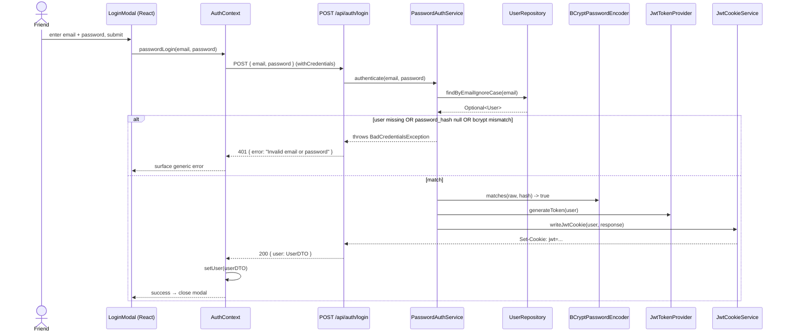

# Design: Email + password login (second auth path alongside Google OAuth)

## Approach

The new login path is a thin slice grafted onto the existing JWT-cookie infrastructure. `OAuth2AuthenticationSuccessHandler` already does the hard work — mint a JWT via `JwtTokenProvider`, write it to an httpOnly+Secure cookie named `jwt`, redirect the browser. A password login is the same flow with a different "did this user prove who they are" check: instead of trusting Google's OAuth callback, we look up the user by email and run `BCryptPasswordEncoder.matches(rawPassword, user.passwordHash)`. On success, we issue the identical cookie and return 200; the frontend then calls `checkAuthStatus()` and the rest of the app cannot tell which path was taken.

The cookie-writing code currently lives inline inside `OAuth2AuthenticationSuccessHandler`. We pull it out into a new `JwtCookieService` that exposes `void writeJwtCookie(User, HttpServletResponse)`. Both the OAuth success handler and the new login endpoint call into it. This is the only structural refactor — it prevents the well-known failure mode of "the two endpoints set slightly different cookies and one of them stops working in Safari/Strict-SameSite/etc."

The friend's row is seeded out-of-band. A throwaway `main()` class (`PasswordHashGenerator`) reads a password from argv, prints the BCrypt hash. That hash plus name/email goes into a one-off `INSERT INTO users (...) VALUES (...)` we run on the Railway MySQL console. There is no HTTP-reachable seed path — a public endpoint that "creates a user with a password" is the registration feature, which is explicitly out of scope.

Alternative considered and rejected: **inline the cookie write in `PasswordAuthService` instead of extracting a shared helper**. Cheaper to write but immediately creates the drift risk — and the next time we add a third auth path (magic link, SAML, whatever) we'd be writing the same cookie code a third time. Extracting now is the right call. Alternative also considered: **a `/login` page on the frontend instead of extending `LoginModal`**. Rejected because the existing auth surface is the modal; a separate route would split the OAuth and password choices across two screens.

## Skills to invoke during execution
- `java-backend` — Spring Boot 3.2 / Java 17 conventions for controller/service split, Spring Security config, JPA entity changes, BCrypt usage.
- `react-frontend` — React 18 modal extension, AuthContext method addition, Axios call with `withCredentials`.

(Classifier proposed `java-backend` + `react-frontend`; no developer override.)

## Diagram



## Data shapes

**DTOs (new):**

```java
public record PasswordLoginRequest(
    @NotBlank @Email String email,
    @NotBlank @Size(min = 1, max = 200) String password
) {}
```

`UserDTO` (existing) is reused for the 200 response body. Error responses use the existing `Map.of("error", "Invalid email or password")` shape from `AuthController.getCurrentUser`.

**JPA entity change (User.java):**

```java
@Column(name = "google_id", unique = true)        // was: nullable = false
private String googleId;

@Column(name = "password_hash")                    // new field, nullable
private String passwordHash;
```

**DDL (migration `2026-05-18_password_auth.sql`):**

```sql
-- Relax google_id to nullable so password-only users can exist.
-- UNIQUE index is kept (MySQL allows multiple NULLs in a UNIQUE index).
ALTER TABLE users
    MODIFY COLUMN google_id VARCHAR(255) NULL;

-- Add nullable password_hash column for BCrypt-hashed passwords.
ALTER TABLE users
    ADD COLUMN password_hash VARCHAR(255) NULL AFTER google_id;
```

**Seed (run-once, not part of the migration file):**

```sql
INSERT INTO users (email, name, google_id, password_hash, is_admin, default_servings, created_at)
VALUES ('<friend-email>', '<friend-name>', NULL, '<bcrypt-hash-from-PasswordHashGenerator>', 0, 1, NOW());
```

## Runtime quality notes

- **Resource cleanup:** No file handles, sockets, or transactions opened in the login path beyond the implicit `@Transactional(readOnly = true)` Spring manages on the repository call. The cookie write goes through `HttpServletResponse` which the container owns. Nothing to close manually.
- **Concurrency / thread-safety:** `PasswordAuthService` is stateless (final dependencies only). `BCryptPasswordEncoder` is documented thread-safe. `JwtTokenProvider` reads immutable fields. `JwtCookieService` writes per-request to the per-request `HttpServletResponse` — no shared mutable state. No risk of GC suspension; BCrypt cost 10 is ~50–80ms CPU, intentional, single-threaded per request.
- **Allocation behaviour:** Per-request allocations are bounded — one DTO, one JWT string, one Cookie. No streaming, no buffering, no caches. BCrypt verify allocates a small scratch buffer; not a hot path (one call per login attempt for one user).
- **Error paths:** `PasswordAuthService.authenticate` throws Spring Security's `BadCredentialsException` for every failure (unknown email, null hash, mismatched hash) — same exception, same message, same 401 response. A `@ExceptionHandler(BadCredentialsException.class)` on `AuthController` maps it to `ResponseEntity.status(401).body(Map.of("error", "Invalid email or password"))`. Validation failures (`@Valid` on the request body) yield 400 via Spring's default `MethodArgumentNotValidException` handling. No stack traces leak to the client. Nothing is logged at WARN/ERROR for an ordinary bad-password attempt (would create log noise without value); a single INFO line on success is acceptable.

## Risks and judgement calls

- **Relaxing `google_id` to nullable changes a NOT NULL constraint on an existing table.** Reversible only if no password-only users exist yet — once the friend's row has `google_id = NULL`, re-tightening would fail. Acceptable: the whole point of this work is to allow that state.
- **`PasswordAuthService` as a separate class vs a method on `UserService`** — chose separate. Trade-off: one more file. Upside: when reset/signup arrive, they extend `PasswordAuthService` rather than bloating `UserService`. If the executor disagrees they can inline it into `UserService`; the public shape (one method called from `AuthController`) is the same either way.
- **Extracting `JwtCookieService` touches the OAuth success path.** The change is mechanical (move the cookie-write block into a helper, call the helper from both places) but it is a touch on the only working auth path. Mitigation: smoke-test Google login on the local stack after the change before deploying.
- **No rate limiting** — conscious trade. The site is unadvertised, single-user. A motivated attacker could brute-force BCrypt cost 10 at maybe 10 attempts/second per core if they had the endpoint. Risk accepted for the trusted-friend horizon; flagged here so a future me doesn't go to production-public without revisiting.
- **`@Email` validation on the request DTO** — Bean Validation's `@Email` accepts more strings than ideal (e.g. `a@b`). Acceptable: the actual check that matters is the DB lookup, which either finds a row or doesn't.
- **Cookie maxAge stays at 7 days for password auth** — matches OAuth. The friend will have to log in once a week. If that's annoying we can bump to 30 days in a one-line change later; not worth diverging from the OAuth value in this PR.
- **Seed flow lives in a throwaway `main()`** — judgement call vs a Maven `exec` profile or a one-off Spring `CommandLineRunner` guarded by a profile flag. The `main()` is the least invasive; it doesn't risk being accidentally enabled on Railway. Drawback: needs Maven on the dev's machine to compile (already true for backend work).
