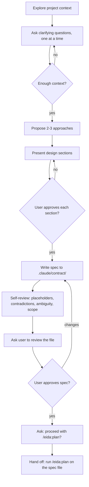

# Brainstorming Ideas Into Approved Specs

Drive a focused dialogue that turns a half-formed idea into a written, user-approved spec under `.claude/contract/`. The spec is the upstream artefact for `/eida:plan` — this skill never invokes `/eida:plan` itself.

## When to Use This Skill

- The user describes a new feature, refactor, or behaviour change without a written design.
- A request exists but is too vague for `/eida:plan` to produce a useful contract.
- The user says "let's brainstorm", "before we plan", "help me think through", "I want to add", or any phrase that opens a design conversation.
- Skip when the user provides a fully-specified request and explicitly asks to go straight to `/eida:plan`.

## Relationship to `/eida:plan`

```
idea ──► /brainstorming ──► .claude/contract/<date>-<topic>-spec.md ──► /eida:plan
```

This skill produces the **spec**. `/eida:plan` consumes the spec file and produces the **contract** (`proposal.md` + `design.md` + `tasks.md`). The two skills do not call each other; the user is the integrator.

<HARD-GATE>
Do not invoke any implementation skill, write any production code, scaffold any module, or invoke `/eida:plan` until the spec has been written to `.claude/contract/` and the user has explicitly approved it. This applies to every change regardless of perceived simplicity.
</HARD-GATE>

## Anti-Pattern: "This Is Too Simple To Need A Design"

Every change goes through this. A one-line refactor, a new toggle, a config tweak — all of them. "Simple" changes are where unexamined assumptions cost the most rework. The spec can be short (a few sentences for genuinely small changes), but it must be written and approved before anything downstream runs.

## Checklist

Create a task per item via TaskCreate and complete in order:

1. **Explore project context** — read relevant files, recent commits, and any background the user pasted.
2. **Ask clarifying questions** — one at a time, prefer multiple-choice, focus on purpose / constraints / success criteria.
3. **Propose 2–3 approaches** with trade-offs and a recommendation.
4. **Present design sections** — get explicit approval after each.
5. **Write the spec** to `.claude/contract/YYYY-MM-DD-<topic>-spec.md`.
6. **Self-review** the written spec for placeholders, contradictions, ambiguity, and scope.
7. **Ask the user to review** the file before any further action.
8. **Ask whether to proceed with `/eida:plan`** once the user approves the spec.
9. **Stop.** Hand off to the user to run `/eida:plan <spec-file>`.

## Process Flow



## The Process

### Understanding the idea

- Read the current project state first — relevant files under `src/`, `WebContent/`, `srcTests/`, and recent commits on the active branch.
- Honour `eida-browser/CLAUDE.md` and `apps/.claude/rules/*.md` — those are the conventions any spec must comply with.
- If the request describes multiple independent subsystems (e.g. "build a module for X with auth, audit, and reporting"), flag this immediately and help the user decompose into separate brainstorming cycles. Don't refine details on a request that needs splitting first.
- For appropriately-scoped requests, ask **one** question per message. Prefer multiple-choice via `AskUserQuestion`. Focus on purpose, constraints, and success criteria — not implementation detail.

### Exploring approaches

- Once you understand the goal, propose 2–3 distinct approaches with trade-offs.
- Lead with your recommendation and explain why.
- Cover the relevant axes: where the code lives (Action / Business / Service / Repository / DTO), JPA vs native SQL, sync vs async, modern React 18 vs legacy React 16 surface, and any architectural boundary the change crosses.

### Presenting the design

- Walk through the design in sections, scaled to complexity. A few sentences for routine work; up to ~300 words for nuanced sections.
- Ask for approval after each section before moving on.
- Cover: architecture & layer placement, components, data flow, error handling, runtime quality (memory, threading, GC, performance — see `eida-browser/CLAUDE.md`), and test approach.
- If the design depends on or contradicts an existing pattern, name the pattern and the file.

### Working in existing code

- Follow existing patterns. Don't propose unrelated refactors.
- If a touched file has degraded (oversized, tangled boundaries) and the work makes that worse, include a *targeted* improvement scoped to the change. Stay focused on what serves the goal.

## Spec Template

Write to `.claude/contract/YYYY-MM-DD-<topic>-spec.md`. The structure is what `/eida:plan` consumes downstream.

````markdown
# Spec: <topic>

## Goal
One paragraph in plain prose: what this change delivers and why. Written so a developer who has never seen the conversation can understand the intent.

## In scope
- Specific, concrete deliverable
- Specific, concrete deliverable

## Explicitly out of scope
- Adjacent things this change is not doing
- Anything that could otherwise creep in

## Pattern reference
File paths and class names that this change should follow. Cite the existing class. If none exists, say so and explain the new pattern.

## Constraints
DB structure notes, auth/role requirements, validation rules, anything the user called out as load-bearing. Verbatim where possible.

## Approach (chosen)
The approach selected during brainstorming, with one short paragraph on why this over the alternatives.

## Approaches considered (rejected)
Brief — one line per rejected approach with the reason.

## Diagram
```mermaid
flowchart TD
    %% only if the work warrants it; skip for routine changes
```

## Success criteria
How the user (or `/eida:plan`) will know the change is done correctly. Observable, not subjective.

## Open questions
Anything still unresolved at the end of brainstorming. The user red-lines this section before invoking `/eida:plan`. Empty section is fine — better than fake-resolved questions.
````

## Self-Review

After writing the spec, read it cold and fix inline:

1. **Placeholder scan** — any `TBD`, `TODO`, ellipses, or vague phrasing? Replace or remove.
2. **Internal consistency** — does the chosen approach match in-scope? Do constraints contradict the approach?
3. **Scope check** — is this still single-spec sized, or did it grow during the conversation? If it grew, decompose now.
4. **Ambiguity check** — could a sentence be interpreted two ways? Pick one and make it explicit.

No re-review pass — fix and move on.

## User Review Gate

After self-review, post one short message:

> Spec written to `.claude/contract/<file>`. Please review it and tell me if anything needs changing.

Wait. If the user requests changes, edit the file and re-run self-review. Only proceed on explicit approval.

## Proceed-To-Plan Prompt

Once the user approves the spec, ask via `AskUserQuestion` whether to proceed with `/eida:plan`. Two options:

- **Yes, proceed** — hand off so the user can run `/eida:plan` in a fresh session.
- **Not yet** — stop here; the user will pick it up later.

Do not invoke `/eida:plan` yourself in either case — the hand-off is always the user's action.

## Hand-Off

After the user answers the proceed prompt, tell them — verbatim:

> Spec written at `.claude/contract/<file>`. Run `/eida:plan .claude/contract/<file>` when ready.
>
> I will stop here.

Then stop. Do not invoke `/eida:plan`. Do not call other skills. The user drives the next step.

## Key Principles

- **One question at a time** — never bundle two questions into one message.
- **Multiple choice preferred** — easier to answer; use `AskUserQuestion`.
- **YAGNI ruthlessly** — strip speculative features from the design as they appear.
- **Always 2–3 approaches** — no design is presented without alternatives considered.
- **Incremental approval** — section by section, not the whole design at once.
- **Spec writes are reversible** — if the user pushes back on the spec, edit it; don't argue from chat history.

## Success Criteria

- A file exists at `.claude/contract/YYYY-MM-DD-<topic>-spec.md` matching the template.
- Every section in the template is filled or explicitly marked empty (no placeholders, no TBDs).
- The user has explicitly approved the spec.
- The user has been asked whether to proceed with `/eida:plan` and answered.
- The skill ended by handing off to the user — not by invoking `/eida:plan` or any implementation skill.

## NEVER SAY THESE PHRASES

- "What features would you like?" (too open — break into specific multiple-choice questions)
- "Should I write the spec?" (just write it after design approval; don't re-confirm)
- "Should I commit the spec?" (no commits from this skill — proceed straight to the `/eida:plan` prompt)
- "Let me also start planning…" (the skill stops at the spec; `/eida:plan` is the user's call)
- "I'll go ahead and run `/eida:plan`." (forbidden — see Hand-Off)
- "This is simple enough to skip the spec." (the hard gate applies to every change)

## FORBIDDEN BEHAVIORS

- Bundling multiple clarifying questions into one message.
- Presenting a design without 2–3 alternatives considered.
- Writing the spec before the user approves the design sections.
- Committing the spec from this skill (commits are out of scope here).
- Invoking `/eida:plan`, implementation skills, or writing production code from this skill.
- Inferring intent the user did not state — capture as an open question instead.
